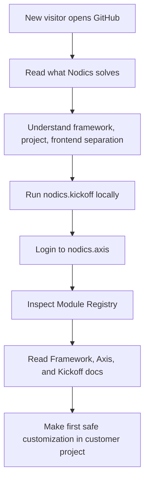
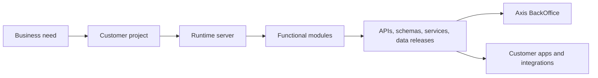
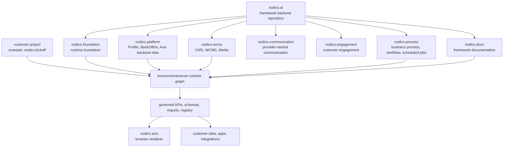
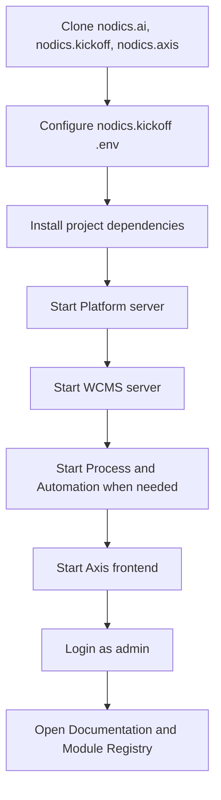

# Nodics Framework

Nodics is a modular enterprise application framework for building business
platforms that must survive real customers, real operations, real
customization, and real growth.

In simple terms, Nodics is an application factory. It does not decide what your
company sells, which workflow your customer needs, or which brand your portal
uses. Instead, it gives you the reusable machinery: module boundaries, runtime
composition, APIs, schemas, configuration layers, imports, content management,
media governance, scheduled jobs, security expectations, documentation
delivery, testing contracts, and a BackOffice experience through Axis.

`nodics.ai` is the backend/framework repository. It contains the standard
Nodics functional module groups used by customer projects and runtime servers.
It is not itself a runtime functional module.

## Why Nodics exists

Most enterprise software does not fail because the first screen was difficult
to build. It fails later, when the product needs a second customer, a new
tenant, a production release, a custom rule, a security review, a different
deployment topology, or an upgrade without breaking everything.

Common project pain looks like this:

- business rules are scattered across routes, services, scripts, and UI code;
- customer-specific behavior is edited directly into shared framework code;
- configuration is hardcoded or hidden in environment-specific files;
- APIs exist, but no one can confidently say which module owns them;
- import data, sample data, and production data are mixed;
- frontend screens assume modules exist instead of discovering authorized
  capabilities;
- documentation explains files, but not the business journey, beginner setup,
  customization path, or operational model.

Nodics solves that by making ownership explicit. A feature belongs to an
owning functional module. Technical modules live under that owner. Runtime
servers declare what they extend. Customer projects add behavior later in the
load order instead of rewriting framework source. Axis renders what the backend
declares as registered, active, and authorized.

## From AI-built MVP to scalable product

AI-assisted development and vibe coding are changing how quickly teams can
prove an idea. A startup can now assemble screens, flows, and a convincing MVP
in days. That speed is valuable, but the MVP often carries hidden structural
risk: unclear module ownership, mixed business rules, direct data access,
missing tenant boundaries, weak API contracts, limited tests, no BackOffice
model, and no reliable path from prototype to production operations.

Nodics is designed for the next step after the MVP works. It lets teams keep
the validated customer journey while moving the implementation onto governed
framework contracts:

- reusable backend capabilities instead of one-off application code;
- schemas, APIs, imports, documentation, and module ownership in known places;
- Axis administration for operational control instead of hidden scripts;
- project-owned customization that does not fork the framework;
- security, audit, runtime composition, and release evidence from the start;
- AI assistance that accelerates coding and administration without removing
  human authority.

The goal is not to slow down experimentation. The goal is to make fast
experimentation survivable when the product gains real customers, integrations,
tenants, partners, support expectations, and production reviews.

## What a business gains

For a business evaluator, the important question is not “How many folders are
in the repository?” The important question is “Can this platform keep evolving
without every new customer becoming a fork?”

Nodics is designed to help with:

| Business concern | Nodics answer |
| --- | --- |
| Faster adoption | A runnable reference project shows Platform, WCMS, Cron, Axis, imports, documentation, and module lifecycle locally. |
| Lower customization cost | Customer projects extend framework behavior through later-loaded modules and configuration instead of editing reusable framework code. |
| Multi-enterprise and multi-tenant direction | Runtime, profile, content, authorization, and data contracts keep enterprise and tenant context visible from the start. |
| Safer growth | Functional modules publish explicit APIs, schemas, imports, and documentation ownership instead of spreading behavior across unrelated code. |
| Better operations | Runtime servers, module registration, data releases, checksums, public/private properties, logs, and restart behavior are treated as contracts. |
| Partner friendliness | A partner can start from Kickoff, see the product running, then replace or extend only the parts they own. |

## What to understand in the first 30 minutes

If this is your first visit to the repository, do not start by reading every
module folder. Start with the product story and then prove the system locally.
Nodics is easiest to understand when you see the runtime compose itself.

The first 30-minute learning path is:

1. Understand that `nodics.ai` is the framework backend repository.
2. Understand that `nodics.kickoff` is a reference customer project.
3. Understand that `nodics.axis` is the BackOffice frontend.
4. Start Platform and WCMS from Kickoff.
5. Start Axis and log in.
6. Open Documentation, Module Registry, and Imports and Exports.
7. Notice that Axis renders backend-owned capabilities instead of hardcoding
   what the project owns.



This order is intentional. It keeps the learning curve friendly: first why,
then what runs, then where customization belongs.

## How Nodics is different from an ordinary project

An ordinary application project often starts with one codebase and grows until
every concern knows too much about every other concern. Nodics starts with
separation of responsibility.



Read this from left to right. A customer project expresses the business need.
The runtime server loads the required module graph. Functional modules publish
governed contracts. Axis and other applications consume those contracts instead
of guessing what is installed.

The separation matters because different people care about different parts:

| Reader | Start here |
| --- | --- |
| Business evaluator | Read this README through “What a business gains”, then open Axis documentation at `http://localhost:3100/docs` after local startup. |
| Developer | Follow “Run Nodics locally in the reference workspace”, then read the customization guide before changing framework code. |
| Enterprise architect | Read repository ownership, modular architecture, functional module lifecycle, and runtime composition. |
| Business administrator | Start Axis, log in, review Dashboard, Module Registry, Imports and Exports, WCMS, Media, and Documentation. |
| DevOps or TechOps | Review prerequisites, runtime servers, public/private properties, ports, health, restart behavior, and data bootstrap. |
| QA or tester | Use the local acceptance checklist, import lifecycle, module registry lifecycle, and route/API verification. |
| AI contributor | Read `AGENTS.md`, then `nodics.foundation/modules/nSetup/llm/` before editing. Follow owner-first, customization-first, test-first contracts. |

When a capability is planned but not yet fully implemented, document it through
the framework documentation page **Future module documentation pattern**. That
page explains how to describe Concept, Design Contract, Partial
Implementation, and Operational maturity without pretending a future module is
already production-ready.

## Enterprise-platform inspiration without copying another product

Nodics documentation and onboarding should feel familiar to people who have
used mature enterprise platforms: a clear product story first, a guided quick
start second, capability documentation third, and reference material after the
reader knows why the platform exists. That style is intentionally inspired by
the way large platforms teach adoption journeys, administration, extension,
integration, release, and operations before dropping a beginner into source
internals.

Nodics does not copy another vendor's architecture or make unsupported
comparison claims. The useful comparison is pattern-level:

| Enterprise-platform pattern | Why readers expect it | Nodics expression |
| --- | --- | --- |
| Product landing page | A new evaluator needs to know what problem is solved before reading code. | This README explains business value, local proof, ownership, and next steps before the module inventory. |
| Guided local demo | Developers need to see a working system before extending it. | `nodics.kickoff` composes framework servers and `nodics.axis` shows the BackOffice experience. |
| Capability map | Architects and administrators need stable business names. | Functional modules such as Foundation, Platform, WCMS, Cron, and Docs are the business-readable capability layer. |
| Extension model | Partners need upgrade-safe customization. | Customer projects and customer extension modules load after framework modules without renaming standard functional identity. |
| Governed content and data | Operations need repeatable setup and rollback. | Importable data releases, documentation packs, checksums, catalogs, sites, pages, routes, and media records are backend-owned. |
| Operations and lifecycle guidance | Production teams need deployable, observable runtimes. | Runtime servers, properties, health, logs, module registry, imports, and acceptance checks are documented as contracts. |

This is the standard we hold the documentation to. A first-time business user
should understand why Nodics exists. A first-time developer should understand
what to clone, which commands to run, what success looks like, and where to
customize. A DevOps engineer should understand which servers, properties,
dependencies, logs, and recovery paths matter. An AI tool should understand
which authority to read before touching code.

## Ecosystem view

Nodics is not only a set of packages. It is an ecosystem contract between
framework modules, customer projects, frontend renderers, backend data packs,
runtime servers, and operations.



The ecosystem rule is simple: the backend owns authority, the customer project
owns project-specific composition, and Axis renders authorized browser
experiences. Documentation follows the same rule: framework docs live in
`nodics.docs`, Axis product docs live in the Platform Axis backend module, and
customer docs live in the customer project.

## What you can run today

The local reference workspace lets a new developer or evaluator see Nodics
working before writing custom code.

You can run:

- **Platform** for employee login, Profile, BackOffice bootstrap, runtime
  module registry, API discovery, and documentation-source registry;
- **WCMS** for sites, content catalogs, pages, components, routes, media, and
  documentation content-pack delivery;
- **Process and Automation** for governed business-process, workflow, and
  scheduled/background capability runtime;
- **Axis** for the browser BackOffice experience;
- **Kickoff** as the reference customer project that composes the framework
  and contributes customer-owned documentation.

Successful local startup gives you:

- Axis login at `http://localhost:3100`;
- Platform APIs at `http://localhost:4300`;
- WCMS APIs at `http://localhost:4310`;
- module registry visibility for mandatory and optional functional modules;
- import/export screens for initialization, core, sample, file import, export,
  and history;
- Documentation navigation for Framework, Swaggers, Nodics Axis, and Nodics
  Kickoff.

## Nodics Installer beginner journey

The target beginner experience is a small standalone Nodics Installer, similar
in spirit to mature platform installers. A first-time user should not need to
clone several repositories manually, learn repository names, edit `.env` files,
or understand runtime topology before seeing Nodics run locally.

If the user starts inside an AI coding tool such as Codex, Claude Code, GitHub
Copilot, or another repository-aware assistant, they can point the tool directly
at the GitHub repository URL. In that case the AI tool should follow
`AGENTS.md` first, then root `README.md`, then the nearest module `AGENTS.md`
and README files. The installer is still useful for creating or repairing a
local customer workspace, but it is not required before repository analysis or
source work can begin.

The current bootstrap command is:

```bash
npx github:Nodics/nodics.installer
```

For a reproducible release, pin the installer tag:

```bash
npx github:Nodics/nodics.installer#v0.7.0
```

After Nodics publishes the npm package, the equivalent registry command is:

```bash
npx @nodics/installer
```

That command asks guided questions when started from a normal terminal, then
prints a dry-run setup plan. The installer also supports explicit plan,
preflight, and approval-gated execution modes:

```bash
npx github:Nodics/nodics.installer --action=questionnaire
npx github:Nodics/nodics.installer --action=doctor --application-name=Acme --project-name=acme.startio --company-site-name=acme.web --commerce-site-name=acme.apparel --workspace=/Users/me/Projects/NodicsCustomer
npx github:Nodics/nodics.installer --action=troubleshooting
npx github:Nodics/nodics.installer --action=plan --application-name=Acme --project-name=acme.startio --company-site-name=acme.web --commerce-site-name=acme.apparel --workspace=/Users/me/Projects/NodicsCustomer
npx github:Nodics/nodics.installer --application-name=Acme --project-name=acme.startio --company-site-name=acme.web --commerce-site-name=acme.apparel --action=execute --yes --execution-level=download --workspace=/Users/me/Projects/NodicsCustomer
```

Execution levels are `download`, `install`, `preflight`, `start`, `initialize`,
and `acceptance`. Execution never runs unless `--yes` is present. Setup evidence
is written under `<workspace>/.nodics-installer/setup-evidence.json`.

Treat setup health and business data health separately. `preflight` checks the
machine and ports, `start` proves services become ready, `initialize` imports
selected data packs, and `acceptance` validates the end-to-end local business
path. A machine can be healthy even when a source data pack needs repair; the
installer reports those data-pack failures with import artifacts and next steps.

For the Acme example, the installer derives customer-owned runtime identity
from the names supplied by the user:

- backend project: `acme.startio`;
- customer modules: `acmeCore`, `acmeApi`, and `acmeInt`;
- local environments: `acmeLocal` and `acmeDockerLocal`;
- company site: `acme.web`;
- commerce site: `acme.apparel`.

`nodics.ai` remains the framework repository and `nodics.axis` remains the
standard BackOffice application. The installer may use reference templates
internally, but the generated customer project should not require a beginner to
work inside Kickoff, Agora, or Nexus-named application folders.

This installer is separate from `nodics.ai` and the named customer application
project. That boundary is important: a command inside a customer project can
only run after the project and framework have already been downloaded. The
installer must work one step earlier, when the machine may have no Nodics source
code at all.

The installer should support two beginner journeys:

| Journey | Beginner intent | Installer result |
| --- | --- | --- |
| Run Nodics locally | "I want to run my application locally." | Downloads the framework, Axis, a named backend application project, optional named company site, optional named commerce site, selected accelerator data, then prepares and starts the local environment. |
| Create my own project | "I want deeper project scaffolding and module choices." | Uses the Application Builder flow to expand the named application into a governed customer project. |

The current implementation focuses on **Run Nodics locally**. That path gives new
evaluators and developers a working product before they make project-design
decisions. The custom project journey remains documented but intentionally
blocked until the reference setup path is stable enough to become its reusable
base.

### What the installer asks

Questions must use beginner language first. The user should be able to answer
without knowing module names such as `nodics.foundation`, `nodics.platform`, or
`nodics.wcms`.

The minimum question set is:

1. What do you want to do?
   - Run Nodics locally with my named application.
   - Create my own Nodics customer project.
2. What is the application name?
   - Example: Acme.
   - This becomes identity and evidence such as application code `acme`.
3. Where should Nodics be installed?
   - Default workspace folder.
   - Custom absolute workspace folder.
4. How should repositories be downloaded?
   - HTTPS clone.
   - SSH clone.
   - Use existing local repositories.
5. Which local mode do you want?
   - Direct Node.js local processes for the fastest developer loop.
   - Docker Local for a more isolated production-simulation environment.
6. Which standard application should be included?
   - Axis BackOffice.
   - No standard app.
7. Should the company site be created?
   - Yes, create a named company site such as `acme.web`.
   - No, backend, Axis, and commerce site only.
8. Should the commerce site be created?
   - Yes, create a named commerce site such as `acme.apparel`.
   - No, backend, Axis, and company site only.
9. Which starter business experience do you want?
   - Common reference setup.
   - Apparel.
   - Electronics.
   - Telco.
   - Combined multi-domain reference.
10. Do you want sample data?
   - Yes, install guided initialization and sample/reference data.
   - No, prepare a clean local runtime only.
11. Should existing local data be preserved?
   - Preserve local data.
   - Prepare for a fresh local run.
12. What should the installer do now?
   - Print the setup plan only.
   - Download and install dependencies.
   - Download, install dependencies, run preflight, and start.
   - Download, install dependencies, start, initialize data, and run acceptance.

Later enterprise options should include proxy configuration, custom npm registry,
private Git host, offline cache, selected release channel, and organization
policy pack. Those options belong behind an advanced path so a beginner does not
meet them on the first screen.

### What the installer does step by step

The installer must turn beginner answers into an explicit setup plan before it
changes the machine. The default first action should be a dry run.

The plan for the named application journey is:

1. Inspect the machine.
   - Check operating system.
   - Check Node.js and npm versions against repository engine constraints.
   - Check Git availability.
   - Check Docker only when Docker Local is selected.
   - Check disk space and write access to the selected workspace.
2. Resolve the selected workspace.
   - Create the workspace only after approval.
   - Refuse dangerous roots such as `/`, the user's home directory itself, or
     protected source roots.
   - Detect existing folders and report whether they are usable, dirty, missing,
     or owned by a previous installer run.
3. Resolve the release/catalogue.
   - Read a versioned Nodics installer catalogue.
   - Select compatible repository URLs, branches, tags, or release manifests.
   - Bind the selected framework, Axis, named backend project, company site,
     commerce site, and accelerators into one setup plan.
4. Download or reuse repositories.
   - Fetch `nodics.ai` for framework modules and tooling.
   - Fetch or create the named backend application project, for example
     `acme.startio`.
   - Fetch `nodics.axis` when Axis BackOffice is selected.
   - Fetch or create the named company site, for example `acme.web`.
   - Fetch or create the named commerce site, for example `acme.apparel`.
   - Preserve user changes in existing repositories. Never reset or overwrite a
     dirty checkout automatically.
5. Configure the application project.
   - Copy `.env.example` to `.env` only when `.env` does not already exist.
   - Write or confirm `NODICS_FRAMEWORK_ROOT`.
   - Write or confirm `NODICS_APPLICATION_NAME`,
     `NODICS_APPLICATION_CODE`, `NODICS_AXIS_ROOT`,
     `NODICS_COMPANY_SITE_ROOT`, and `NODICS_COMMERCE_SITE_ROOT`.
   - Rename customer-owned template modules and environments from starter
     identity to the application identity, for example `acmeCore`, `acmeApi`,
     `acmeInt`, `acmeLocal`, and `acmeDockerLocal`.
   - Run `npm run configure:framework` from the named application project.
   - Explain that this creates machine-local links under `.nodics/framework/`.
6. Install dependencies.
   - Use deterministic install commands where lockfiles require them.
   - Install framework, project, and selected frontend dependencies in the
     correct order.
   - Capture versions and command results in setup evidence.
7. Preflight the selected runtime.
   - Run direct local topology preflight for Node local mode.
   - Run Docker Local preflight for Docker mode.
   - Check ports before starting anything.
   - Explain busy ports in plain language and tell the user what owns them when
     that can be determined safely.
8. Start the selected topology.
   - Start framework backend runtimes through the named application project
     commands.
   - Start Axis when BackOffice is selected.
   - Start the named company site and commerce site when selected.
   - Keep generated PID and log ownership under the project-generated topology
     folder, not in random global locations.
9. Guide first initialization.
   - Authenticate through local Platform.
   - Discover available initialization profiles through backend APIs.
   - Validate selected initialization and content/data releases before install.
   - Install only through governed Nodics APIs, not direct database scripts.
   - Keep Staged and Online publication boundaries visible.
10. Run validation.
    - Start with setup preflight for a quick check.
    - Run guided initialization acceptance when sample/reference data is selected.
    - Run local acceptance or Docker Local qualification only when the user chose
      the longer validation path.
11. Finish with a beginner summary.
    - Print the URLs to open.
    - Print the local account or the secure credentials file location.
    - Print where logs are stored.
    - Print what was installed, which accelerators are active, and which apps are
      running.
    - Print the next command to stop, restart, inspect status, or continue into
      project creation.

### What success looks like

At the end of the first successful reference setup, the user should see a short
summary like:

```text
Nodics is running locally.

Axis BackOffice:      http://localhost:3100
Company site:         http://localhost:3200
Commerce site:        http://localhost:3300
Platform API:        http://localhost:4300
WCMS Staged API:     http://localhost:4312
WCMS Online API:     http://localhost:4314
Process API:         http://localhost:4330
Engagement API:      http://localhost:4340
Commerce API:        http://localhost:4350

Next:
1. Open Axis.
2. Sign in with the local credentials shown by the installer.
3. Open Documentation.
4. Open Module Registry.
5. Open Imports and Exports if initialization is still pending.
```

The exact URLs depend on the selected local mode. Direct Node local and Docker
Local may intentionally use different ports so both environments do not collide.

### Evidence and safety rules

The installer must leave behind a setup report in the selected workspace. That
report should be safe to share internally and should not contain secret values.

The report should include:

- installer version;
- selected journey;
- application name and application code;
- selected local mode;
- workspace path;
- repositories, branches, tags, and commit SHAs;
- selected apps;
- selected accelerator or domain experience;
- commands executed;
- command result states;
- generated local files;
- credentials file path without exposing secret values;
- service URLs;
- validation results;
- next commands.

The installer must follow these safety rules:

- dry-run plan before execution;
- explicit confirmation before clone, install, reset, or start;
- no destructive Git commands;
- no automatic overwrite of dirty repositories;
- no secrets printed into normal logs;
- generated credentials stored with restrictive permissions where supported;
- rollback only installer-created paths;
- direct database access avoided for application initialization;
- Docker Local reset requires an explicit destructive confirmation token;
- production certification must never be claimed from local setup evidence.

### How this relates to existing commands

The installer is the first-machine bootstrapper. Existing Nodics commands remain
the source of truth once repositories exist locally.

| Layer | Owns |
| --- | --- |
| `nodics.installer` | First-machine bootstrap, beginner questions, repository download/reuse, setup plan, setup evidence, and orchestration. |
| `nodics.ai` / `nTooling` | Framework-aware validation, project framework linking, topology, Docker Local, Application Builder planning, qualification, and upgrade-safe contracts. |
| Named application project | Customer runtime composition, local environments, data packs, sample documentation, and acceptance aliases. |
| `nodics.axis` | Standard BackOffice frontend. |
| Named application web project | Customer-facing web experience, derived from the application name. |

When the installer finishes, a developer can continue with normal project
commands from the named application project, for example:

```bash
npm run topology:status
npm run topology:stop
npm run topology:start:all
npm run acceptance:guided-initialization
```

For users who already created the repositories manually, a later project shortcut
such as `npm run setup:local` may delegate to the same setup-plan logic. That
shortcut is useful, but it cannot replace the standalone installer because it
requires local source code to exist first.

## What this repository contains

```text
nodics.ai/
  AGENTS.md
  README.md
  package.json
  nodics.js
  config/
    properties.js
    prescripts.js
    postscripts.js
  nodics.foundation/
  nodics.platform/
  nodics.wcms/
  nodics.process/
  nodics.commerce/
  nodics.communication/
  nodics.engagement/
  nodics.docs/
```

The current standard module groups are:

- `nodics.foundation` — core runtime framework modules required by every Nodics
  server.
- `nodics.platform` — Platform, Profile, BackOffice, and Axis backend
  capability metadata.
- `nodics.wcms` — CMS, WCMS, Media, content-pack import, and governed content
  delivery.
- `nodics.process` — business process, workflow, scheduled job, task,
  approval, instance, audit, and visual-designer contracts.
- `nodics.commerce` — store, product, pricing, tax, promotion, inventory,
  checkout, order, payment, provider, and fulfillment capability composition.
- `nodics.communication` — provider-neutral templates, rendering, recipient
  policy, verification, delivery, callback, retry, inbox, and evidence authority.
- `nodics.engagement` — customer contact, review, feedback, testimonial,
  communication-intent, unified operations, governance, and API capability group.
- `nodics.docs` — framework documentation content packs only.

The repository root follows the standard Nodics module-group file shape so
developers, tooling, and AI agents can navigate it consistently. Its
`package.json` still declares `runtimeModule: false` and
`loadableByNodicsModuleLoader: false`; the root is not a runtime functional
module. Root `config/` files are reserved for framework-repository governance
metadata only. Runtime defaults belong in the owning functional module, such as
`nodics.foundation`, `nodics.platform`, `nodics.wcms`, `nodics.docs`,
`nodics.process`, `nodics.commerce`, `nodics.communication`, or
`nodics.engagement`.

Repository-wide AI/developer guidance is intentionally not stored in a root
`llm/` folder. The canonical guidance home is `nodics.foundation/modules/nSetup/llm/`,
with module-local `llm/` folders used only by the modules that own specific
capabilities.

Customer projects, such as `nodics.kickoff`, live outside this repository and
consume the framework through package dependencies and explicit runtime
`extends` configuration. Frontend applications, such as `nodics.axis`, are also
separate projects.

## Repository ownership rules

- Framework source belongs in `nodics.ai`.
- Framework documentation content belongs in `nodics.docs`.
- Axis product documentation content belongs in `nodics.platform/modules/axis`.
- Customer/project documentation content belongs in the owning customer project,
  for example `nodics.kickoff`.
- `nodics.axis` owns browser rendering and recovery behavior only. It must not
  own backend-importable CMS catalog, site, page, component, route, or
  documentation records.

## Run Nodics locally in the reference workspace

The simplest local workspace uses three sibling repositories. This layout is
recommended for the first run because it matches the reference documentation
and removes unnecessary decisions while you are still learning the framework.

```text
nodicsRoot/
  nodics.ai/       # this framework repository
  nodics.kickoff/  # reference customer project and local servers
  nodics.axis/     # BackOffice frontend
```

The sibling layout is convenient for the reference setup, but it is not a hard
requirement. `nodics.kickoff` can point to any framework checkout by setting
`NODICS_FRAMEWORK_ROOT` in its local `.env` file.

The first-run journey is:



You do not need to understand every internal technical module before this first
run. The goal is to see the framework alive, then learn the module ownership
model from a working system.

## Prerequisites

Install the local platform dependencies used by the current reference runtime:

- Node.js compatible with the repositories' `package.json` engine constraints.
  The current framework package range is Node.js `>=22 <27`.
- npm compatible with the repositories' `package.json` engine constraints. The
  current framework package range is npm `>=10 <12`.
- Git for cloning or updating framework, project, and frontend repositories.
- MongoDB for runtime data.
- Elasticsearch if search-backed capabilities are enabled.
- Redis if Redis-backed cache/session behavior is enabled.
- Docker Desktop only when Docker Local mode is selected.

Beginner checks:

```bash
node --version
npm --version
git --version
mongod --version
mongosh --version
redis-server --version
docker --version
```

On macOS with Homebrew, a developer can usually install the basic local
toolchain with:

```bash
brew install node git mongodb-community redis
```

Elasticsearch installation depends on the organization's approved package,
Docker image, or managed developer setup. Use the approved company path when one
exists. If search-backed modules are disabled in the selected local profile,
Elasticsearch may not be required for the first framework startup.

For a new customer local environment, prefer starting with the standalone
installer so the machine is checked before repositories are changed:

```bash
npx github:Nodics/nodics.installer --application-name=Acme --project-name=acme.startio --company-site-name=acme.web --commerce-site-name=acme.apparel --action=doctor --workspace=/Users/me/Projects/NodicsCustomer
npx github:Nodics/nodics.installer --application-name=Acme --project-name=acme.startio --company-site-name=acme.web --commerce-site-name=acme.apparel --action=execute --yes --execution-level=download --workspace=/Users/me/Projects/NodicsCustomer
npx github:Nodics/nodics.installer --application-name=Acme --project-name=acme.startio --company-site-name=acme.web --commerce-site-name=acme.apparel --action=execute --yes --execution-level=install --workspace=/Users/me/Projects/NodicsCustomer
npx github:Nodics/nodics.installer --application-name=Acme --project-name=acme.startio --company-site-name=acme.web --commerce-site-name=acme.apparel --action=execute --yes --execution-level=preflight --workspace=/Users/me/Projects/NodicsCustomer
npx github:Nodics/nodics.installer --application-name=Acme --project-name=acme.startio --company-site-name=acme.web --commerce-site-name=acme.apparel --action=execute --yes --execution-level=start --workspace=/Users/me/Projects/NodicsCustomer
```

Some integrations are optional in local development. If a provider is disabled
in configuration, Nodics may log that the provider is not enabled; that is
expected for the reference setup.

## Configure the Kickoff reference project

From the same workspace that contains this repository, open a terminal in
`nodics.kickoff`:

```bash
cd ../nodics.kickoff
cp .env.example .env
```

Edit `.env` and point `NODICS_FRAMEWORK_ROOT` to this framework checkout:

```bash
NODICS_FRAMEWORK_ROOT=../nodics.ai
```

If your framework checkout lives somewhere else, use an absolute path or a path
relative to the `nodics.kickoff` project root.

Then generate the local framework package links and install dependencies:

```bash
npm run configure:framework
npm install
```

`npm run configure:framework` creates machine-local links under
`nodics.kickoff/.nodics/framework/`. Do not commit that generated folder.

Why this step exists: customer projects should not be forced to live in one
hardcoded folder next to the framework. The `.env` value tells Kickoff where
the framework checkout is on your machine, then the setup command creates
local package links for npm. This keeps the reference project easy to run while
still allowing partners to use their own workspace layout.

## Start local backend servers

Use separate terminals from `nodics.kickoff`.

Start Platform:

```bash
npm run start:platform
```

Platform exposes employee authentication, Profile, BackOffice bootstrap,
runtime module registry APIs, documentation-source registry, and other
Platform-owned APIs. The local HTTP port is currently:

```text
http://localhost:4300
```

Start WCMS:

```bash
npm run start:wcms
```

WCMS owns CMS sites, content catalogs, pages, components, routes, media, and
documentation content-pack delivery. The local HTTP port is currently:

```text
http://localhost:4310
```

Start Cron when cron behavior is needed:

```bash
npm run start:cron
```

The current local topology is intentionally split by runtime server so the
framework can prove functional module separation. A customer can later compose
or extend runtimes differently through project modules and server configuration.

If you are evaluating only the BackOffice and documentation experience, start
Platform and WCMS first. Start Cron when you want to test scheduled capability
registration and lifecycle behavior.

## Start Axis

Open a new terminal in `nodics.axis`:

```bash
cd ../nodics.axis
npm install
npm run dev
```

Axis runs locally at:

```text
http://localhost:3100
```

Axis connects to Platform for login and BackOffice bootstrap, then uses
registered backend module contracts to render workspaces and documentation.

## Login to Axis

Open:

```text
http://localhost:3100
```

Use the local reference employee account:

```text
Username: admin
Password: adminPassword
Enterprise: default
```

If Axis reports that the BackOffice registry is unavailable, confirm that
`npm run start:platform` is still running. If CMS documentation pages are
unavailable, confirm that `npm run start:wcms` is still running and the relevant
documentation content pack has been imported.

## Open documentation

After login, open:

```text
http://localhost:3100/docs
```

The Documentation area is discovered from the BackOffice registry. The current
reference setup exposes:

- Framework — framework documentation from `nodics.docs`.
- Swaggers — API contracts discovered from registered backend runtimes.
- Nodics Axis — Axis product documentation from `nodics.platform/modules/axis`.
- Nodics Kickoff — reference project documentation from `nodics.kickoff`.

Documentation source ownership is important. Axis renders documentation, but
does not own documentation data.

If a documentation page is missing after a fresh database reset, open
**System and Integrations > Imports and Exports**, select the available
documentation and initialization releases, validate them, and install them.
Framework documentation comes from `nodics.docs`; Axis documentation comes
from `nodics.platform/modules/axis`; Kickoff documentation comes from
`nodics.kickoff`.

## What to inspect after login

After the first successful login, inspect these areas in order:

| Axis area | What it proves |
| --- | --- |
| Dashboard | Axis can authenticate and render the employee workspace shell. |
| System and Integrations → Module Registry | Mandatory functional modules are persisted, optional modules are observed, and lifecycle actions are backend-governed. |
| System and Integrations → Module Health | Runtime health evidence is projected by BackOffice instead of guessed by the browser. |
| Imports and Exports | Initialization, core, sample, and documentation releases are immutable, checksum-governed, and module-owned. |
| Content and Experience | WCMS owns sites, catalogs, pages, components, routes, and delivery metadata. |
| Media | Media records and folders are owned by WCMS/Media, not by the frontend. |
| Documentation | Framework, Swagger, Axis, and project documentation are separate products with separate owners. |

This small tour teaches the Nodics contract better than a folder walk. The UI
shows how runtime availability, project registration, content packs, and
documentation ownership meet in one employee workspace.

## Validate the framework repository

From this repository:

```bash
npm test
```

Run module-specific checks from the owning module when changing a module. For
example, documentation content-pack changes should be validated in the module
or project that owns that content.

## How customization works

Repository/package dependencies make framework code available. Runtime
inheritance decides what actually loads.

For example, the local Kickoff Platform server loads:

```text
nodics.foundation
nodics.platform
nodics.kickoff
kickoffLocal
platformServer
```

A customer can add project modules to customize framework behavior without
renaming the functional module identity. For example, a future
`kickoff.platform` module may extend or override Platform behavior, while Axis
and BackOffice still present the functional capability as `Platform`.

This keeps business capabilities stable while allowing project-specific
implementation and service overrides through the normal Nodics module merge and
runtime load order.
