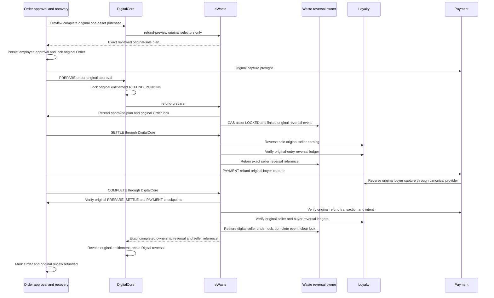

# Persisted Waste Asset Sale Owner Contract

## Meaning And Supported Outcome

This owner connects a named Waste digital asset to an already-captured Commerce
purchase. Think of a registry clerk: the clerk verifies the original payment,
pays the recorded seller and changes the register once. The clerk does not
charge the buyer a second time or arrange movement of the physical item.

For example, one retained Product/SKU represents one listed asset. Checkout
reserves that asset, authorizes and captures Loyalty points. eWaste verifies the
original authorization and buyer capture, requests only the original seller's
earning and asks Waste to commit digital ownership. DigitalCore then records
entitlement/delivery through its existing owners.

This is a source-implemented, disabled/unqualified owner pathway. No business
proposal is adopted, installed data approved or native/provider qualification
established. Business users use their authorized application; this contract
does not expose a new customer purchase route. Partner application-specific
setup belongs to the partner's contract, which must reference this one instead
of copying authority or embedding a customer policy in accelerator source.

The [DigitalCore contract](../../../../../../../nodics.commerce/modules/digitalCommerce/modules/digitalCore/llm/contracts/persisted-digital-ownership.md)
owns classification and the exact Checkout/request/response interface. This
document owns eWaste orchestration, domain policy and Waste evidence. Waste's
[asset contract](../../../../../../../nodics.waste/modules/wasteCore/llm/contracts/README.md)
remains the generic persistence and ownership authority. Payment's
[capture contract](../../../../../../../nodics.commerce/modules/payment/modules/paymentCore/llm/contracts/README.md)
owns financial evidence; this bridge is not a new payment provider.

## Owner Boundaries

| Authority | Source | What it owns |
| --- | --- | --- |
| DigitalCore | `DefaultDigitalCommerceOwnershipService` | Retained Product/binding contract, private typed DTOs, exact entitlement/delivery readback. |
| eWaste | `DefaultEWasteDigitalSaleService` | Secured domain admission; canonical binding/policy/Profile/Store reads; original capture verification; seller earning coordination. |
| Waste | `DefaultWasteAssetTransferOperationService` digital methods | Existing `wasteAsset` lock and `wasteAssetOwnershipEvent`, CAS, immutable original command, cancellation and transfer completion. |
| Payment/Checkout/Order | DigitalCore's bounded ownership evidence API over canonical owners | Root command, authorization/capture, complete Order units and durable compensation checkpoint/receipts. |
| Loyalty/Profile | Existing module APIs | Buyer debit, original seller earning and canonical customers/wallets. |

No direct database access, alternate lock table, shadow transfer state store,
new wallet, identity registry or physical Inventory fallback is permitted.
`DefaultEWasteMarketplaceService.purchase` and the legacy asset settlement
helper are not invoked: they own a different purchase path that can debit or
transfer Loyalty itself. Checkout has already performed the buyer capture.

## Exact Supported Financial Path

| Dimension | Supported value or bound | Refused alternative |
| --- | --- | --- |
| Order allocation | Exactly one complete OrderEntry, quantity `1`, bound to this reservation | Multiple assets, other entries, mixed physical/coupon allocation or inferred per-line proceeds. |
| Payment | One original active `CAPTURED` `LOYALTY_REWARD` entry, provider `loyalty-reward-points` | Pending/authorized-only, split, duplicate, Card, cash, other provider or fabricated receipt. |
| Money | Positive captured total equals complete Order total and original authorization total using ExactAmount | Floating-point price reconstruction or a caller-supplied sale price. |
| Seller proceeds | Explicit retained policy `CAPTURED_TOTAL` to `CURRENT_SELLER` | Commission allocation, alternative payee or settlement defaults. |
| Original approval rewards | `RETAIN_ORIGINAL_OWNER` | Reassigning historical submission/approval rewards. |
| Carbon | `NONE`, empty settlement refs | Carbon minting, carbon transfer or inferred environmental credit. |
| Physical state | Leave `physicalOwnerRef` and `custodyStatus` untouched | Shipping, collection, receipt, physical return or custody inference. |

This bounds confirmation, not Cart financial-allocation design. DigitalCore can
collect reservations before capture; an unsupported mixed Order cannot settle
through this owner and requires original Checkout/domain recovery. Do not
interpret a successfully reserved asset as approval of a mixed cart.

## Admission And Configuration

The service-only route is `POST /internal/digital-sales/:phase`, logical
`eWaste.internalDigitalSale.internalDigitalSaleInvoke`. Its existing `wasteInternal` exposure,
secured admission, `authTokenTypes:[service]`, `serviceAccountUserGroup` and
`waste.asset.sale.transfer` permission remain independent gates. The controller
allowlists `evidence/compensation-resolve/availability/reserve/confirm/deliver/cancel` plus the scoped original-sale
`refund-preview/refund-prepare/refund-settle/refund-complete` phases and forwards only
router-derived auth/tenant plus the phase/body. Body fields cannot replace actor
or enterprise. This does not introduce another exposure category.

The service independently requires signed service token/principal type, an exact
allowed principal ID, matching technical tenant, signed enterprise aliases and current transfer
permission. Human/customer callers and an employee permission alone refuse.
An explicitly approved business-enterprise grant is the only permitted difference
between the selected business enterprise and the unchanged signed principal enterprise.
Signed principal, tenant and enterprise identifiers are 1..128 characters from
letters, digits, underscore, period, colon, at-sign and hyphen. Every supplied
signed/input `tenant/tenantCode` and `enterpriseCode/entCode` alias must be valid
and equal to its canonical scope; conflicts, null/empty aliases and malformed
allowlists refuse before owner reads. Body scope/qualification flags remain
non-authoritative and cannot substitute for signed context.

| Effective setting | Source default | Meaning |
| --- | --- | --- |
| `eWaste.marketplace.digitalOwnership.enabled` | `false` | Integration admission only. |
| `eWaste.marketplace.digitalOwnership.qualified` | `false` | Explicit admission assertion, not substitute for installed evidence. |
| `allowedServicePrincipals` | `[]` | Exact approved signed internal callers; not a body grant. |
| `targets` | `{}` | Server-owned module targets for `commerce`, `loyalty`, `profile`; absent target refuses. |
| `digitalCore.digitalOwnership` | Disabled/unqualified with null owner fields | Standard DigitalCore owner selection; see its contract. |

Module invocation uses existing service transport and fixed owning module/API
names, trusted tenant/enterprise headers, 15-second timeout and `maxAttempts:1`.
No credentials, customer bearer fabrication, automatic mutation retry or body
selection of targets/services is added. Generic schema HTTP is not an integration
contract, even when a module's router is enabled. `sale.rows` refuses all generic
reads; listing and sales use DigitalCore's protected
`/internal/ownership/evidence/query` with exact `LISTING`, `BINDING`, `PURCHASE`
or `REFUND` commands. Original command selectors come from the persisted Waste
event. Product's existing publication-status API remains the serving pointer.
DigitalCore binding admission obtains the read-only domain plan through
`POST /internal/digital-listings/plan`; `preview` remains a compatible read-only
alias. Both phases return the same digest and never create a binding or qualify
a sale. Only `complete` attaches the independently admitted binding through
Waste-owned persistence. The route is sensitive and returns `Cache-Control: no-store`.
Loyalty uses `/reward-ledger-evidence` with exact customer, program, reward type,
entry/original-entry and source selectors; no hidden wallet/ledger schema reads
or wallet-opening projection calls qualify financial evidence.

Canonical customer code/login resolution must use a separately approved Profile
capability endpoint selected by server-owned `customerEvidenceApiName`. It accepts
`{contractVersion:1,enterpriseCode,identifier}` and must return
`{contractVersion:1,tenant,enterpriseCode,customer:{code,loginId,active}}`.
Profile owns `POST /nodics/profile/v0/internal/customer-evidence`, disabled by
default under `profileCustomerEvidence`. It requires `profile.customer.reference.read`,
private request capture and one exact approved deployment/business-enterprise grant.
It freshly checks active Enterprise/Tenant placement before and after a bounded
unique code-or-login Customer read, exposing only code, loginId and active. Select
`customerEvidenceApiName: /internal/customer-evidence` only in an approved deployment.
An arbitrary customer code, display reference or notification recipient API is
not a substitute; never reopen Customer CRUD or fabricate caller groups.

Known static integration failures use append-only registered statuses from
`src/utils/digitalSaleDiagnostics.js`. The private router emits only the registered
code and static message, never an error object's diagnostic text. Unknown controller failures use the fixed controller-unavailable status; unknown errors outside that boundary retain normal private-request
masking. Neither error path exposes remote responses, identities, tokens or
financial records, and capture protection remains mandatory.

Amount verification uses the canonical pure decimal utility at
`nCommon/src/utils/exactAmount.js` through the mergeable sale `amount()` accessor.
The reversal owner reuses that accessor; Waste must not activate Pricing or
depend on `SERVICE.DefaultExactAmountService` for arithmetic. The ownership bridge
fixture deliberately has no Pricing amount service for Waste confirmation,
delivery and the original-sale refund/replay regression. Its combined Commerce
Payment owner still has its own Pricing runtime. CLI acceptance uses the same pure utility, not a registry
dependency that happens to be available in a combined test process.

Internal sale, listing and legacy reversal route leaf keys are respectively
`internalDigitalSaleInvoke`, `internalDigitalListingInvoke` and
`internalOrderReversalInvoke`. nRouter registers common/module routes using the
module and leaf key, not the containing group. Keep these leaf identities unique
so refreshing a bound route cannot select another controller or permission.
All three controller operations remain `invoke`; their HTTP paths and authority
are unchanged. The registry regression uses real route preparation and refresh
before controller dispatch, without opening a listener or qualifying native calls.

Unexpected failures inside the exact evidence read expose only an append-only
fixed evidence stage (private admission, selectors, snapshot, authority,
projection, original event, generated context or generated records). Per-call
stage state is private and survives runtime service cloning without cross-request
sharing. Original exception messages, names, stacks and causes are not forwarded.
These diagnostics locate a failed gate; they do not relax or qualify it.

## Exact Original Ownership Read Evidence

`POST /nodics/eWaste/v0/internal/digital-sales/evidence` is a private read-only
business capability, not a maintenance-inspector or generic schema endpoint.
It retains the existing `waste.asset.sale.transfer`, integration enablement and
qualification gates, original scoped runtime principal and private capture proof.
Every body contains `contractVersion:1`, `kind`, `bindingCode`, `productCode`,
`sku`, `storeCode`, `locale`, `assetCode`. LISTING verifies the current original
seller, binding/reverse projection and current supported policies. PURCHASE adds
`code` (original transfer), `ownerId`, `orderCode`, `entryCode` (original Cart entry),
`checkoutIdempotencyKey`; REFUND adds `refundCode`. Unknown fields/queries refuse.
The owner joins the original persisted sale, and for REFUND its exact completed
reversal and restored seller. Results expose bounded allowlisted asset/custody,
policy, sale/settlement/reversal fields plus owner fingerprints, never arbitrary
metadata/history. Stable before/after generated reads are not an atomic snapshot.
Financial/approval proof still comes independently from Commerce and Loyalty.
The maintenance inspection's transaction fingerprint ceiling remains unchanged.

Waste operational schemas do not require a stored `tenant` field. Evidence
projects the admitted tenant into its asset, projection, policy, original-sale
and reversal DTOs only after a bounded uncached generated reread verifies the
actual persistence request partition and unchanged original admitted request.
An absent row tenant is valid; an explicitly conflicting, null or blank tenant
refuses. Generated request/auth/query/limit/cache drift, failed or ambiguous
envelopes, inconsistent counts and changed records refuse. Original signed
principal/business scope, private capture and configured admission are checked
across awaits. Stored rows are never modified and fingerprints hash the original
records without the projected tenant. These reads remain non-atomic evidence,
not a transaction or sale/refund qualification.
The generated get initializer may add only `limit:2,skip:0,snapshot:false` to
`pageSize:2,pageNumber:1`. Accept that exact canonical normalization, not another
limit, offset, projection or snapshot. Tests exercise the real initializer as
well as isolated owner responses; normal generated paging is not authority drift.

Default-enterprise runtime credentials may act in a business enterprise only
through an exact `businessCallers` selection containing tenant,
principalEnterpriseCode, enterpriseCode, serviceId, projectCode, environmentCode,
serverCode, instanceCode, assignmentCode and literal permissions. The existing
principal allowlist still applies. A top-level body `enterpriseCode` selects the
reviewed business scope. Canonical runtime claims use the original `serviceId`
as the allowlist identity when `principalId` is absent, only after nAuth's
`requireRuntimePrincipal` validates the original private request for `eWaste`.
No synthetic principal ID or service group is added; private capture and literal
permission checks still apply, including for same-enterprise runtime callers.
An existing signed `principalId`, when present, must still match its allowlist;
an unapproved explicit identity cannot fall back to an approved service ID.
The top-level body selector is removed before exact domain-selector validation.
The HTTP enterprise header and normalized request aliases, when present, must
match the original signed principal enterprise; they cannot select the business
scope. Original claims and groups are never rewritten. Private
capture, signed runtime/module/instance, permission, environment and policy drift
are rechecked. Same-enterprise callers retain the original scope checks.

Exact Commerce, Loyalty and Profile evidence calls omit the business enterprise
header so canonical module transport uses its actual outgoing runtime token's
namespace, not the incoming caller's enterprise. The separately allowlisted
business enterprise remains in each evidence body. The native acceptance helper
likewise does not overwrite runtime actors' headers with the business namespace;
its eWaste evidence body carries that explicit selector. Commerce callers of
both digital-listing and digital-sale phases must follow the same body contract.

The acceptance helper now uses these capabilities and normal Cart/Checkout,
customer dispute and staff-approved refund routes. Supply original Waste-runtime
credentials as the `loyalty` and `commerce` evidence actors (and Profile read),
and the original Commerce-runtime credential as the `waste` evidence actor.
These are recipient capability labels, not new identities. CLI variables are
`NODICS_EWASTE_LOYALTY_EVIDENCE_TOKEN`, `NODICS_EWASTE_COMMERCE_EVIDENCE_TOKEN`,
`NODICS_EWASTE_WASTE_EVIDENCE_TOKEN`; customer/reviewer sessions remain separate.
With all admitted APIs, `--plan` returns a redacted reviewable digest. `--execute`
requires it, verifies actual buyer capture, seller earning, original approved
refund, ownership/custody, both compensating ledgers, balances and exact replays.
No wallet opening/funding, seed, qualification write or mock capture occurs.
Interrupted business commands require canonical owner recovery, not a new key.

## Retained Binding And Policy

The owner re-reads exactly one active DigitalCore binding for tenant, merchant,
Product and SKU. Its typed provider is `wasteCore`, its delivery classification
is `DIGITAL_OWNERSHIP`/`DIGITAL_COMMERCE`, and its provider reference contains:

| Binding field | Canonical check |
| --- | --- |
| `assetCode/projectionCode` | Existing active Waste asset and LISTED marketplace projection for that exact asset. |
| `sellerRef` | Exact `profile/customer` reference matching projection owner, resolved through current Profile. |
| `storeCode` | Exact requested retained selling Store. |
| `transferPolicyCode` | Same exact policy code as Waste marketplace projection. |
| `rewardSettlementPolicyCode/carbonSettlementPolicyCode` | Exact projected policy identities; no inferred default policy. |
| `evidence.retainedProducts[]` | Unique locale pins, 1..20 entries, each selected by original Cart locale. |

Reverse evidence requires `commerceProductRef` to the exact Product,
projection `metadata.storeCode/sku`, and the original seller. Selected retained
Product evidence must match code, merchant/tenant/Store/locale/Product,
sourceHash/publicationVersion, variant-to-SKU map, localized `assetCode` and all
three exact digital classification attributes. The current asset must still be
active; reservation separately enforces LISTED seller ownership and no competing
lock. A locale pin is translation evidence, never extra asset inventory.

Store validation follows
[Store's owner contract](../../../../../../../nodics.commerce/modules/baseCommerce/modules/store/llm/contracts/README.md)
and `DefaultStoreContextService`: exact technical tenant, code, active ACTIVE
record, positive revision and merchant enterprise. `enterpriseRef` accepts a
string code, a code object, canonical `moduleName/schemaName`, or existing
`module/schema` names. Supplied module/schema aliases must all identify
`profile/enterprise`; contradictory aliases and foreign enterprise refuse.
This normalization never changes enterprise identity or accepts a browser Store.

All three policies must be active ACTIVE records with integer revision and
currently valid effective dates. The entire resolved binding/policies and
canonical Profile references are retained in the original reservation command.

| Policy | Required supported terms |
| --- | --- |
| Asset transfer | `SELL`, `TRANSFER_TO_COUNTERPARTY`, completion `SOLD`, cancellation `LISTED`, `allowSelfTransfer:false`, `lockRequired:true`, reward `RETAIN_ORIGINAL_OWNER`, carbon `NONE`. |
| Asset transfer restrictions | No requested completion custody status, receipt/compliance review or counterparty-acceptance step unsupported by this bridge. |
| Reservation | Explicit integer `metadata.digitalOwnership.reservationSeconds` in `1..86400`; no source-selected business TTL. |
| Reward settlement | Trigger `SALE`, mode `POLICY_RESOLVED`, explicit wallet currency, and `metadata.digitalOwnership` with `version:1`, `proceeds:CAPTURED_TOTAL`, `payee:CURRENT_SELLER`, program/type codes and integer scale `0..12`. |
| Carbon settlement | Trigger `SALE`, mode `NONE`; transfer policy also carbon `NONE`. |

Absent, DRAFT, expired, future, ambiguous or unsupported policy refuses. A source
fixture's synthetic terms do not approve an application policy. No default
reservation duration, proceeds formula, currency/program, review waiver or
qualification is created by this contract.

## Successful Sequence

The diagram shows the supported successful path. Equivalent prose: reserve the
original asset before payment, let Checkout capture once, verify the original
capture, retain the settlement fence, earn once for the seller, commit the
original Waste event, then read back DigitalCore's own evidence.

```mermaid
sequenceDiagram
    participant C as Checkout
    participant D as DigitalCore
    participant E as eWaste
    participant W as Waste persistence owner
    participant P as Commerce owners
    participant L as Loyalty
    C->>D: reserveForCheckout with persisted Cart Store and locale
    D->>E: availability then original reserve command
    E->>P: Read retained Product, binding and Store
    E->>W: Read seller asset, projection and exact policies
    E->>W: CAS asset SALE_PENDING; insert original RESERVED event
    W-->>D: Original event, keys and expiry
    D-->>C: RESERVED unit
    C->>P: Authorize then capture original Loyalty payment
    P->>L: Original buyer reservation and capture
    L-->>P: Original buyer debit ledger
    C->>D: confirmSale with original reservation and Order
    D->>E: confirm original event
    E->>P: Read complete Order, authorization and captured Payment
    E->>L: Read exact original buyer debit and wallet
    E->>W: CAS retain immutable original capture fence
    E->>L: Seller EARN with event-code sale-proceeds key
    L-->>E: Original seller earning ledger
    E->>W: Retain settlement; CAS digital owner under LOCKED
    E->>W: Complete original event; clear lock to SOLD
    E->>L: Verify retained original seller ledger and payee
    E-->>D: SOLD with original capture, settlement and time
    D->>D: Save and exactly read back ACTIVE entitlement
    C->>D: deliver with original sale unit
    D->>E: Reverify capture, settlement and current ownership
    E-->>D: DELIVERED with original ownership time
    D->>D: Save and exactly read back DELIVERED record
    D-->>C: Verified digital delivery; physical custody unchanged
```

### Original Capture Proof

The event's original command must match every incoming purchase selector,
technical tenant/merchant, canonical asset/seller/buyer and original binding.
`capture` re-reads bounded protected owner results, not a supplied transaction.

| Evidence | Required binding |
| --- | --- |
| Order | Exact original code/buyer/tenant/enterprise, root `idempotencyKey`, nonempty original Cart, Store evidence, supported placed/completed/fulfilled state and original total/currency. |
| Complete OrderEntry | Exactly one active entry, `<order>:<original-entry>`, same buyer/merchant/Cart, exact Product/SKU, quantity one, `<root>:order-entry:<entry>` key and this original digital reservation code. |
| Captured Payment | Exactly one active original `<order>:capture`, same buyer/tenant/**enterprise**/Cart/order, `CAPTURED`, `CAPTURE`, exact method/provider/currency/amount, `<root>:payment:capture` and nonempty buyer ledger reference. |
| Authorization | Original active `<order>:authorization`, same buyer/tenant/**enterprise**/Cart/order, `AUTHORIZED`, `AUTHORIZE`, matching method/provider/currency/total and `<root>:payment`. Its provider reference equals Order `evidence.paymentReference`. |
| Buyer ledger | Exact captured Payment `providerReference`, `CAPTURE`, matching amount/program/reward type/wallet, original capture key, `sourceType:PAYMENT`, original order source and ORDER target. Its `reservationCode` equals the original authorization reference. |
| Payment wallet evidence | Both original payment entries' wallet/program/reward type agree with the captured ledger; Loyalty wallet is CUSTOMER-owned by the canonical buyer Profile code. |

Payment now retains `enterpriseCode` in fresh transaction/entry evidence and
declares it in the owning schemas. It does not backfill historical records from
later callers. Missing original enterprise, even with matching order/buyer/amount,
refuses this pathway. The original captured amount, not mutable catalogue price,
determines supported proceeds.

Generated Payment projections retain operation/methodCode/providerCode/providerReference
inside `evidence`. Internal `paymentEvidence` falls back to those exact fields
only when root mirrors are undefined, and from undefined `amount` to mandatory
`totalAmount`. Contradictory mirrors reject. Tenant, enterprise, owner, keys,
status, currency and totals never fall back to evidence or caller aliases.
Original decimal strings remain unchanged in retained capture/refund intent.

The retained `capture` contains typed original Payment and authorization refs,
merchant enterprise, original Checkout key, authorization Loyalty reservation,
buyer `ledgerCode`, amount and currency. Only after Waste CAS retains that exact
capture may the domain request seller earning. This fences cancellation against
uncertain ledger execution; the fence itself is not proof of an earning.

### Seller Credit And Original Delivery

Before credit, eWaste rechecks the original seller against canonical protected
Profile evidence and the three current active Waste policies against the complete
retained purchase command. Program/reward/scale come from that approved retained
policy, never response overrides. Seller wallet discovery uses the existing
protected Loyalty `POST /wallet-evidence` with exact business enterprise,
canonical seller `customerCode`, `programCode` and `rewardTypeCode`, omitting
`walletCode`. Loyalty resolves exactly one existing OPEN CUSTOMER owner; it does
not open a wallet, derive its code or accept a general query. Explicit-code
consumers keep their existing exact read mode.

The consumer independently verifies contract version, tenant/business scope,
customer/program/reward echoes, wallet identity/tenant/owner/status/active state
and every returned balance's wallet/program/reward/tenant binding. A missing
balance is `null` and may precede a first earning; it is not invented as zero or
treated as program activation. A missing, ambiguous, inactive, closed, foreign or
contradictory wallet refuses before credit, retaining the original capture fence
for recovery. Tenantless canonical rows succeed only through Loyalty's verified
generated-read envelope, without adding tenant fields to stored records.

Policy, Profile and original authority are rechecked after wallet lookup; response
or retained-command drift also refuses before earning. The evidence transport
leaves the enterprise header absent so the original outgoing runtime token owns
its namespace; the separately authorized business enterprise remains in the
body. No principal/group rewrite, new grant, generic schema route, `/wallets`
POST or `/wallet-projections` fallback is part of seller lookup. These bounded
reads are not an atomic snapshot, installed financial proof or permission to
enable sale flags; Loyalty still owns earning admission and posting.

The only seller financial mutation is existing Loyalty `POST /reward-earnings`
with canonical seller wallet, explicit retained policy program/type/scale,
captured amount, `sourceType:WASTE_ASSET_SALE`, original event source and key
`<eventCode>:sale-proceeds`. The owner verifies exact returned EARN identity,
amount and wallet before retaining typed `loyaltyLedger/rewardLedgerEntry` refs.
Completed-sale replay does not request another earning. Uncertain pre-completion
recovery reuses the same key; installed Loyalty uniqueness/idempotency and
partial-write behavior must be qualified, not assumed from these source tests.

Before delivery/completed replay, the owner reads the original seller ledger
again and verifies its key/source/program/type/amount and canonical seller wallet.
It also revalidates original capture and current Waste ownership. No new debit,
replacement ledger, fresh financial key or flag-based settlement success is used.

## Persisted State And Recovery

Waste uses its existing generated services. Asset and event require unversioned
primary `code`, installed `compareAndSetItem`, inspected unique non-sparse,
non-partial code identity with simple collation, and supported revision behavior.
Asset concurrency must be managed by `revision`; event revision may be managed
or explicitly advanced. Updates require one revision match and exact successor
readback. Event creation is insert-only; lost acknowledgements are accepted only
after exact original-event readback. Configuration booleans cannot satisfy this
installed persistence inspection.

| Stage | Existing durable evidence | Recovery rule |
| --- | --- | --- |
| Acquisition | Asset `SALE_PENDING`, `pendingTransferCode/pendingTransferEvent`; original RESERVED event with command/deadline | If event insertion fails after lock, same original command recovers the pending original event without extending expiry. |
| Capture fenced | Original event retains `metadata.digitalSale.capture` under CAS | Cancellation refuses, including after timeout; inspect original payment and settlement. |
| Seller credit uncertain | Capture fence retained; original Loyalty command may have committed | Keep lock/recovery. Reconcile/retry only the original seller key; never debit buyer again or acknowledge compensation. |
| Settlement retained | Original reward refs and empty carbon refs under `metadata.digitalSale.settlement` | Compare exact retained settlement; do not choose replacement refs. |
| Ownership committed | Asset digital owner/buyer under `LOCKED`, original last-transfer code and ownership timestamp | Event completion may be retried with original time; no second ownership mutation. |
| Event complete, cleanup interrupted | Event COMPLETED; asset still LOCKED for same event | Original confirm recovery clears only that lock to SOLD, retaining original time/ledger; deliver does not fabricate cleanup. |
| Digital record write/readback fails | Completed Waste sale and original financial evidence remain | Retry original confirm/deliver through DigitalCore, which must exactly verify saved evidence. No new charge. |
| Onward transfer or refund | Current owner/last-transfer no longer original buyer/event | Refuse original delivery or automatic reversal; manual domain resolution. |

Successful delivery requires active SOLD asset, original last-transfer code,
matching owner/digitalOwner, no remaining pending lock, original event COMPLETED,
valid identical original event/asset timestamp and matching retained settlement
refs. It never changes physical owner or custody status.

## Cancellation And Compensation Safety

`cancel` is not a financial reversal. It reads the root-key Checkout failure
checkpoint and original Order payment entries before Waste cancellation. The
checkpoint must belong to the same tenant/buyer/root and have durable
`COMPENSATED` or `COMPENSATION_REQUIRED` state. Those state labels alone do not
prove payment safety. Current bounded reads reject oversized/incomplete evidence.

| Observed original payment evidence | Cancellation result |
| --- | --- |
| No payment entries | Requires durable pre-payment completed-step evidence without AUTHORIZED/ORDERED/PAYMENT_CAPTURED and no payment compensation intent. |
| AUTHORIZED | Requires one original VOIDED entry and one durable COMPLETED PAYMENT_VOID receipt, matching transaction/reference and `<root>:payment:void`, plus scoped original VOID intent. |
| DECLINED/CANCELLED terminal entries | Allowed only with the scoped durable compensation checkpoint and permitted original payment states. |
| CAPTURED with full original REFUND_SUCCEEDED but no Waste capture fence | Only the bounded refunded-reservation cleanup below can release. A refund is not an uncaptured VOID. |
| Pending, ambiguous, unknown, failed owner read or no checkpoint | Refuse release; retain recovery. |
| Event already capture-fenced/completed | Refuse cancellation irrespective of elapsed expiry. |

Waste CAS first makes the original RESERVED event CANCELLED or EXPIRED, then
clears only its own seller SALE_PENDING lock back to LISTED. Original replay
must prove released seller state and must not unlock a later lock. Time alone
never releases an asset and there is no new background expiry worker.

Checkout may attempt digital release before it has confirmed payment reversal.
That first attempt can correctly fail. Recovery must retain the original
checkpoint/financial key, obtain durable original VOID proof or qualify the
refunded-reservation cleanup below, or keep manual recovery. Never label a
seller-settled asset as compensated through cancellation. A transport timeout,
qualification flag or application status is not proof of financial absence.

### Refunded Unfenced Reservation Cleanup

`compensation-resolve` is a read on the existing private route/permission. Body:
`contractVersion:1`, reservation `code`, original `ownerId`, `orderCode` and
`checkoutIdempotencyKey`, plus the existing top-level business `enterpriseCode`.
It resolves only the persisted original Waste command, validates its canonical
event identity and `<root>:digital:<entry>:0` key and joins protected original
financial/checkpoint evidence. Response: bounded original unit, `eventRevision`
and canonical `commandDigest`, without policies/raw command. No Cart/current
Product/price reconstruction or new customer identity is admitted.

Existing `cancel` requires exactly the retained completed stages VALIDATED,
CALCULATED, RESERVED, DIGITAL_RESERVED, AUTHORIZED, ORDERED, PAYMENT_CAPTURED;
both reservation-recovery flags false and no uncertain digital key; the original
failed DIGITAL_OWNERSHIP_RELEASE and completed PAYMENT_REFUND receipts; scoped
original REFUND intent; exactly original AUTHORIZE/CAPTURE/REFUND rows; full
REFUND_SUCCEEDED amount/currency; and exact buyer CAPTURE/REVERSE ledger chain.
No Payment operation is executed. Only active RESERVED without capture,
settlement, completion timestamp or reward/carbon settlement refs qualifies.

Waste CAS first records CANCELLED with `metadata.digitalSale.compensationRecovery`
FENCED, immutable financial proof/digest, custody snapshot and asset/event
revision fences, retaining SALE_PENDING. Both `capture` and
`prepareDigitalSettlement` freshly reject this fence, including stale callers.
If capture's CAS wins first, cleanup refuses; settling/completed sales never
qualify. After fencing, fixed Commerce PURCHASE must successfully return
`entitlements:[]`; its owner requires the explicit successful generated count
and validates exact buyer/business/order/provider/binding/unit scope.

Loyalty `/reward-ledger-evidence` uses persisted `sellerRef.code`, retained
program/reward type, `sourceType:WASTE_ASSET_SALE`, `sourceCode:<event>` and
`earningIdempotencyKey:<event>:sale-proceeds`. Its owner reads source-wide EARNs
in the existing exact seller wallet with mandatory generated count. Consumer
requires `entries:[]` and exact `ledgerSelection` {entryType:EARN, sourceType,
sourceCode, idempotencyKey, programCode, rewardTypeCode}. Any row, other key,
ambiguity, missing selection, malformed response or failed read refuses absence.

Fresh original financial proof is rechecked before bounded absence audit is
persisted and only this asset lock CAS-clears to LISTED; the marker then becomes
COMPLETED. Owners and physical custody never change. Lost acknowledgements and
interrupted cleanup recover only by exact original readback/replay. Revision or
custody drift, later locks, entitlement/earning presence or changed proof refuses;
unknown outcomes retain the fence/lock for reconciliation. No entitlement,
seller earning/reversal, buyer debit/refund, new Order or purchase is created.
Checkout owns explicit customer-authorized original-key recovery and checkpoint
claim/CAS. Source tests do not qualify installed/native cleanup. Later modules
may narrow owner methods but must retain these proof/privacy/concurrency gates.

Loyalty seller earning and seller reversal transports omit business enterprise
headers and forward no incoming auth/token. nService supplies its unchanged
original signed runtime namespace; exact wallet/source/key checks remain.
Evidence reads retain explicitly admitted business selectors in their bodies.

## Original Sale Refund

This source slice implements the already-reviewed original-sale-only mode, not
a general asset refund grant. Business execution still requires an original
Order review and signed employee approval through Order's existing commands.
DigitalCore refreshes that staff authority through `paymentAuthority` on each
phase; eWaste accepts only its configured signed service principal and also
rereads the exact persisted Order approval. No service token, caller flag or
matching amount alone authorizes a financial reversal. The legacy
`/internal/order-reversals` adapter continues to reject modern digital sales;
the stronger flow uses only `/internal/digital-sales/refund-*`.

### Explicit Policy And Original Identity

The original sale's retained transfer policy and its current exact active record
must include `metadata.digitalOwnership.refund` with value
`ORIGINAL_TRANSFER_REVERSAL_ONLY_BEFORE_ONWARD_TRANSFER`. Current transfer,
reward and carbon policy records must exactly match their original snapshots
and remain effective. The approved local-demo proposal's `assets.refund` term is business
approval evidence for the owning data author, not automatic runtime adoption.
The parent policy/data owner must carry the approved term into the transfer
policy before sale reservation. This source does not edit data, enable defaults,
backfill old sale events or certify installation. An older sale lacking the
retained term remains manual-review-only.

| Evidence | Required original binding |
| --- | --- |
| Private request | Only original sale code, entitlement code, Order/buyer selectors, canonical Order refund code and identical refund idempotency key. No amount, wallet, programme, ledger, payee, phase grant or policy selector. |
| Sale | One active completed SELL event; exact tenant/merchant/Order/buyer/asset, original seller/buyer references freshly resolved through Profile, original complete captured-payment chain and sole seller earning; no carbon refs. |
| Entitlement | Exactly one full Order entitlement; original Product/SKU/entry/event/key/time and complete original capture/settlement/binding evidence. ACTIVE for preview; original refund lock for mutations. |
| Approval | One original active Order REFUND request with approved/executing/reconciliation/completed status, original DISPUTE case, nonempty reviewer/time/reason/stable command and exact digitalCore ownership plan. Same canonical refund code, amount/currency, original capture, sale/asset/entitlement and locked Order. |
| Original capture | Exact Payment capture and authorization, original buyer CAPTURE ledger/wallet and complete quantity-one OrderEntry. Locked/refunded Order states are accepted only after separate persisted approval validation. |
| Asset | Original latest buyer-held SOLD asset with matching owner/digital owner, original transfer timestamp/code and no competing lock. Onward transfer or competing refund refuses. |
| Seller reversal | Fresh unique Loyalty REVERSE of the sole original seller EARN: exact wallet/program/type/amount and `<refundCode>:<originalSellerEntryCode>`, source `ORDER_REFUND` and original Order. Another previously posted reversal/key is not silently adopted. |
| Buyer refund | Successful original Order PAYMENT checkpoint, exact canonical PaymentTransaction and original refund intent, original full-refund key/provider/amount/currency/scope/approval, plus unique matching Loyalty REVERSE of original buyer CAPTURE. A checkpoint alone is insufficient. |

### Existing Order Phase Sequence



Seller reversal uses existing Loyalty `/reward-ledger-entries/:code/reverse`;
both body and transport header carry the same original per-entry key. Loyalty
owns insufficient-balance refusal, balance CAS and interrupted ledger posting.
There is no second debit, alternate payee or eWaste buyer-refund operation.
Order performs its original-capture preflight before PREPARE. The plan is not
a promise that seller funds will remain available; spent proceeds or concurrent
financial changes retain owner recovery, never a negative seller balance.

### Recovery And Limits

| Interruption | Retained evidence and safe retry |
| --- | --- |
| Asset locked before reversal insert | `pendingRefundCode/pendingRefundEvent` pins the original model; original command inserts/readbacks it without a new lock identity. |
| Seller reversal timeout or ledger posting failure | Asset and entitlement stay locked. Retry only the original seller entry/key; Loyalty recovers its pending immutable posting without a repeated debit. Buyer Payment does not run until SETTLE succeeds. |
| Seller reversal posted but Waste reference write fails | Re-read exact original Loyalty reversal and CAS the same reference; no replacement ledger or key. |
| Buyer Payment uncertain/failed | Order retains original phases and reconciliation. No returned ownership or inferred successful refund. Canonical Payment owns original-key recovery. |
| Ownership restored before event/cleanup write | Asset remains LOCKED with original refund identity until linked event COMPLETED, then only that lock clears to OWNED. Exact readback resumes, without another financial effect. |
| Digital revocation/reversal write fails | Domain financial/ownership evidence remains; retry the original COMPLETE and exact Digital evidence readback. No new charge, seller debit or replacement reversal. |
| Changed asset/custody/approval/policy/reference | Refuse and retain reconciliation. Never switch owner/buyer scope or silently reopen a listed offer. |

Only digital owner/owner reference changes back to the original seller; physical
owner and custody snapshot must remain unchanged. Original SELL event and original
submission rewards remain intact. The restored asset becomes OWNED, not LISTED;
publication/relisting remains its own reviewed workflow. Fee/carbon reversal,
partial refunds, onward-sale recovery, multi-asset/mixed Orders and physical
returns remain unsupported. Source tests are not installed CAS/transport/Profile
or financial qualification, and no distributed transaction or recovery worker
is claimed.

Native entitlement/delivery date fields can return BSON Date objects while the
original Waste metadata retains ISO strings. Compare exact milliseconds using
`Date.getTime()` for Date objects and parse only strings; `Date.parse(Date)` loses
sub-second precision through string coercion. Missing/invalid dates and even a
one-millisecond mismatch refuse. Original buyer CAPTURE ledger readback must be
unique and complete before constructing its wallet-bound refund pin; a record
disappearing between protected reads yields an explicit owner refusal, not a
TypeError or guessed wallet. The bridge fixture covers 123ms native Date records,
complete refund/replay, millisecond drift and an interrupted later ledger read.

## Explicit Unsupported Boundaries

| Request | Contract outcome |
| --- | --- |
| Unapproved/generic asset refund | Generic Digital entitlement remains MANUAL_REVIEW/nonrefundable. Only the exact original-sale policy/approval path above can execute; legacy adapter still returns `DIGITAL_OWNERSHIP_REFUND_POLICY_REQUIRES_REVIEW` for modern sales. |
| Onward-transfer refund | Existing Waste latest-owner/event check refuses; preview reports `ASSET_MOVED_OR_LOCKED`. Owning another later asset is not original refund authority. |
| Physical return/custody | Digital RETURN is BLOCKED/nonrefundable. No physical Inventory, receipt, shipping or custody mutation is inferred. |
| Carbon, fees, mixed/split allocation | Unsupported by this exact settlement contract; require owner design/policy/testing before extension. |
| Coupon redemption or ITEM merchant fulfillment | Separate DigitalCore/Promotion/provider contracts; ownership delivery is not a coupon benefit or physical fulfillment receipt. |
| Imported documentation or business pack | Import does not grant service permissions, approve policy, install a qualified owner or publish an offer. |

## Installed And Publication Gates

The existing read-only `digital-listings/plan` persistence preflight must use
`DefaultWasteAssetTransferOperationService.digitalPersistence` for only
`wasteAsset`, `wasteAssetMarketplaceProjection` and `wasteAssetOwnershipEvent`,
with `sale.recheckAuthority` before and after awaited owner checks. It adds no
endpoint, persistence write, caller-selected resource or configuration
authority. Persistence capability results must stay outside the original
listing command and `planDigest`; the same command must retain the same digest.
The owner verifies installed generated CAS, unversioned unique code identity
and its revision contract. An ownership-event managed revision field can be
absent: the existing event owner still uses explicit revision-guarded CAS; do
not invent a mandatory managed field or add one to stored records.

This preflight is available before sale flags are selected. It proves only
the inspected installed prerequisites, not an executed CAS, distributed
atomicity, a financial capture, seller posting, refund, production qualification
or permission to enable another environment. The existing owner-runtime helper
`wasteCore/test/helpers/installedOwnerAcceptance.inspectOwnershipPersistence`
separately checks asset/event prerequisites in an explicitly opted-in booted
Local Waste process. `/waste/installed-data/inspect` is a protected bounded
record/fingerprint API, not an index/CAS qualification API. Never substitute
raw database inspection or a record fingerprint for these owner checks.

| Gate | Required evidence | What is not sufficient |
| --- | --- | --- |
| Source/build | Loader-visible services/controller/route, declared inert settings, focused and affected owner tests | A source pass is not connected acceptance. |
| Effective runtime | Correct active modules, overrides, configured server targets, secured service credentials and permitted route exposure | Repository package presence or a successful HTTP response from another endpoint. |
| Installed persistence | Qualified Waste generated CAS/indexes/revisions/insert-only identity; generated Digital evidence read/write and readback | In-memory doubles or `qualified:true`. |
| Cross-owner protected reads | Exact authorized Product/binding/Store/Profile/Order/Payment/Loyalty/Checkpoint evidence | Missing/error reads interpreted as empty or body-selected grants. |
| Business review | Exact approved policy identities, settlement mode/program/currency/scale/reservation terms and seller eligibility | Synthetic fixtures, proposal files or this documentation. |
| Publication | Existing owners' Staged review/approval, exact Online pointers, retained Product pins and current Waste projection/binding | Installed data, stale index payload, arbitrary CURRENT/STALE record or documentation publication. |
| Financial/native acceptance | Original buyer debit, seller earning replay/uncertainty, partial persistence/concurrency and recovery proven through qualified owners | Isolated test count, one simulator receipt or manually asserted success. |

The bridge does not install data, build search indexes or publish CMS/Product/
Media records. Operators preserve those existing owner's workflows and asset
access rules. If publication changes the pinned hash/version, review/update the
binding through the owning governed data lifecycle; do not silently rewrite a
reserved event's original binding/policies. An old retained reservation is not
permission to sell a newly listed asset to another buyer.

## Scenarios And Safe Extension

| Scenario | Expected behavior |
| --- | --- |
| Smallest success | One listed asset, exact approved binding/policies and one complete original Loyalty capture settle to original seller and deliver original digital ownership. |
| Unauthorized or foreign merchant | Signed scope/principal/permission or capture enterprise mismatch refuses before seller credit/ownership mutation. |
| Boundary | Quantity two, an extra OrderEntry, more than 20 locale pins or oversized owner results refuses rather than partial success. |
| Failure/recovery | Lost event acknowledgement reads original evidence; uncertain seller earning keeps capture fence and original key; interrupted cleanup retains original timestamp. |
| Later-layer customization | Project-owned configuration can select reviewed integration and exact approved policies; a later-loaded availability override can narrow supply while delegating existing checks. It cannot invent grants, financial proof or custody. |

Partner developers keep custom application adapters and selections in their own
modules. Framework maintainers extend Waste persisted operations only when
canonical owner semantics can express the new mode. Supporting counterparty
acceptance, carbon transfer or another refund mode requires that owning policy and
recovery contract first; a new flag or parallel state table is not an extension.
Administrators should troubleshoot the failed gate without dumping private
buyer/payment/ledger bodies into public logs. No new monitoring/repair worker is
claimed. Business evaluators should treat physical delivery and actual financial
qualification as separate acceptance outcomes.

## Verification Scope And Source Map

From the framework root:

```bash
node --test nodics.accelerators/modules/waste/modules/eWaste/test/eWasteDigitalOwnershipBridge.test.js
node --test nodics.waste/modules/wasteCore/test/*.test.js
node --test nodics.commerce/modules/payment/modules/paymentCore/test/*.test.js
node --test nodics.commerce/modules/digitalCommerce/modules/digitalCore/test/*.test.js
node --test nodics.commerce/modules/checkout/modules/checkoutCore/test/*.test.js
```

`npm test` in eWaste additionally executes all its independent owner fixtures.
The bridge's focused tests use real owner service/controller functions with
isolated generated storage and module invocation. Refund tests additionally run
real Order approval/lifecycle, Payment dispatch/provider and Loyalty reversal
owners with a bounded staff-admission double; they do not qualify real Profile.
The source batch also exercised Payment, DigitalCore, Checkout, WasteCore and
separate reference-project publication checks. Executed counts belong in the
build's test report, not permanent acceptance claims or proof of a native
environment. Re-run the commands against the build's actual source.

| Suite | Evidence it supplies | Does not establish |
| --- | --- | --- |
| `test/eWasteDigitalOwnershipBridge.test.js` | Retained binding/locales/Store, signed service gates and scope aliases, original capture enterprise/key/authorization chain, one seller credit, no repeated debit, CAS/index refusal, cancellation/VOID/uncertainty, exact Digital evidence, original-sale refund execution/replay, concurrent retry, spent proceeds, tampered approval/ledger/Payment and interrupted ownership/Digital cleanup | Installed distributed atomicity, live wallets, credentials, approved business policy or Online pointer deployment. |
| Payment `paymentEnterpriseRetentionContract.test.js` | Real Payment execution retains original enterprise/keys; conflicting/malformed aliases refuse before reads/dispatch/retention; legacy replay does not backfill merchant; owning schemas declare the field | Migration/backfill or retroactive qualification of old captures. |
| Existing DigitalCore/WasteCore/Checkout suites | Coupon compatibility, generic Waste lifecycle and parent Checkout routing/Cart-scope behavior | Connected Commerce/Waste/Loyalty transport or provider qualification. |
| Reference-project publication suite | Actual retained Product classification across both locales; unqualified ownership refuses without physical fallback | A sale, import, publication or installed owner becoming qualified. |

Authoritative implementation:
[domain service](../../src/service/defaultEWasteDigitalSaleService.js),
[controller](../../src/controller/defaultEWasteDigitalSaleController.js),
[route](../../src/router/routers.js),
[disabled defaults](../../config/properties.js),
[refund guard](../../src/service/defaultEWasteOrderReversalService.js),
[bridge fixture](../../test/eWasteDigitalOwnershipBridge.test.js), and Waste's
[persisted transfer owner](../../../../../../../nodics.waste/modules/wasteCore/src/service/defaultWasteAssetTransferOperationService.js).
