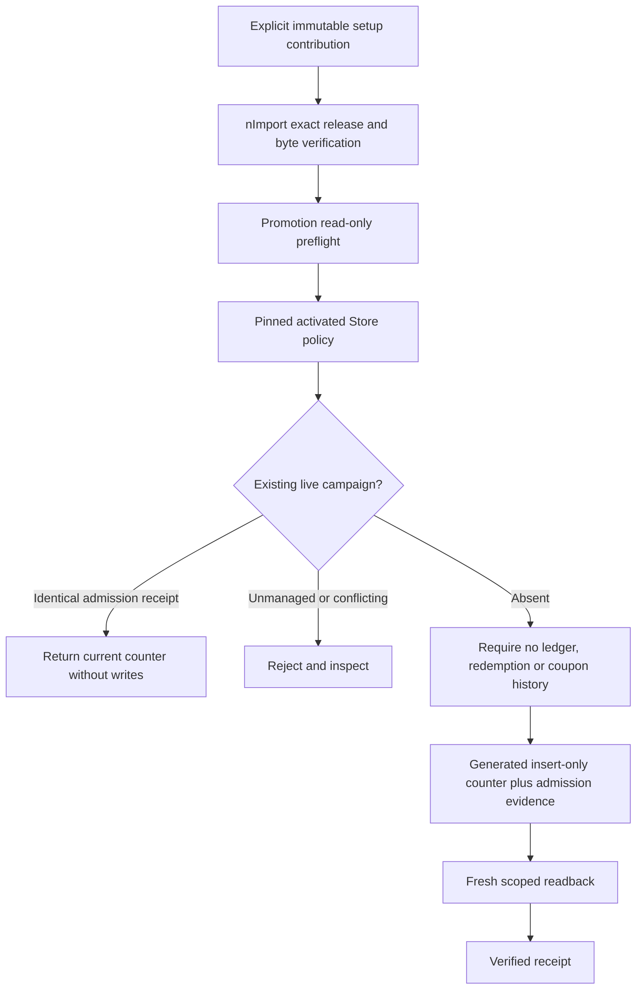
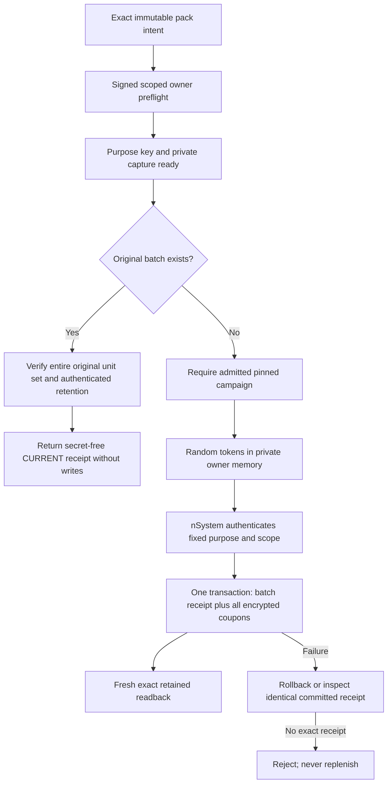

# Promotion Setup Contributions

## Owner And Readiness

Promotion accepts an explicitly selected accelerator setup contribution through
the existing nImport custom-installer dispatch. This is a maintainer-owned
capability extension, not a new importer, BackOffice action type, approval engine,
or operational snapshot loader. The accelerator supplies immutable instructions;
Promotion owns admission and generated persistence.

The nImport HTTP controller retains the original `httpRequest`, not a separately
mapped seller bearer field. Promotion's contribution snapshot captures its
`httpRequest.headers.authorization` as `authorization` before asynchronous owner
work, retaining detached original signed claims. Existing direct owner calls may
supply the same bounded bearer field. Malformed or conflicting header/field values
reject; body tokens cannot substitute. Secure issuance still requires issuer
management permission and fresh Profile scopes with DENY precedence on preflight,
installation and replay. No service principal or policy-derived seller replaces
the human issuer. The delegated issuance contract tests compose the actual
nImport HTTP controller/installer handoff with seller and secure issuance owners;
isolated persistence/Profile ports are not native qualification evidence.

Persistence refusals distinguish atomic transaction support, protected schema
shape, installed private hooks and actual unconditional unique indexes through
the fixed `ERR_PROMOTION_ISSUANCE_*_REQUIRED` codes. They carry no provider
diagnostics, queries, ciphertext or credentials. A declaration alone cannot
qualify any of these prerequisites; callers must repair the owning boundary,
not bypass the check or replace it with a configuration flag.

Studied authorities include root-to-leaf guidance, Promotion lifecycle, seller
authorization and publication contracts, generated save insert-only dispatch,
model concurrency, installed index inspection, Process contribution installers,
nImport installer dispatch and the current coupon reveal/issuance sources.
Source and provider-double tests are not installed qualification or permission
to enable a deployment. No live operations are performed by this change.

## Selectable Instruction Pack

Register `PROMOTION_CAMPAIGN_ISSUANCE` to
`DefaultPromotionSetupContributionService` in the existing
`data.dataReleases.installers` map. The capability declares that mapping once.
Its contribution requires `dataType: sample`, `selectionPolicy: EXPLICIT`,
`destinationRole: COMMERCE`, and `lifecycle: OPERATIONAL_VERSIONED`.
The owning accelerator supplies `sample-v001/operations/records/promotionSetup.json`;
the contribution's declared file set/checksum remains nImport-owned.

The fixed owner call is
`DefaultDataReleaseService.readContributionPayload(contribution,
'PROMOTION_CAMPAIGN_ISSUANCE', 'promotionSetup.json')`. That existing shared owner
must rediscover the exact current release, compare its complete qualified
identity, role and environment, verify containment and all declared byte hashes,
and return detached JSON. Missing reader or changed bytes fails before writes.
The Promotion installer never loads arbitrary paths or JavaScript payloads.

```json
{
  "campaigns": [
    {
      "promotionCode": "reviewedCampaign",
      "storeCode": "reviewedStore",
      "rootCode": "reviewedRoot",
      "policyFingerprint": "<64 lowercase hexadecimal SHA-256 characters>",
      "commandReference": "stablePackCommand001"
    }
  ],
  "couponBatches": []
}
```

The fingerprint is `DefaultPromotionPublicationService.fingerprint(policy)`
for the exact campaign policy returned by `readActivated`, including its retained
source identity. Generate it canonically from the reviewed source with
`publication.fingerprint(publication.capturePolicy('promotion', exactSourceRecord,
{tenant, enterpriseCode}))`. This owner has no `policyRecord` method. Source
`versionId`, revision, enterprise references and dates must match the exact record
installed and captured by publication; use the canonical importer/source model
rather than hand-writing a runtime hash. Do not hash the live counter, the release
wrapper or a mutable draft. A changed policy requires a new reviewed instruction, not latest-version
fallback. Campaign codes must be distinct within a contribution. The maximum
defaults to fifty and later layers may narrow it; fifty remains the hard ceiling.
No instruction may carry spent, balances, credentials, raw coupon tokens,
approval grants, tenant, enterprise or actor overrides.

## Budget Admission

`promotion.budgetAdmission` declares only
`{maximumCampaignsPerContribution:50}`. No enablement or qualification flag grants
admission. Explicit nImport selection and actual installed evidence are required
per command; this never runs at startup. Seller consent, merchant benefits,
purchased rights and publication qualifications remain independent and unchanged.
Admission requires the Online role, selected activated delivery,
signed human access-token scope and `commerce.promotion.manage`. The authenticated
tenant/enterprise supplies scope. A body or pack does not grant it.

The Store must map to the requested retained root. Exactly one ACTIVE retained
campaign must match its code, authenticated tenant/enterprise and fingerprint.
Budget policy contains an exact nonnegative limit only. The operation never
reads mutable policy as a substitute or restores an approved limit over current
consumption.



| Condition | Required result |
| --- | --- |
| New campaign, no operational history, qualified persistence | Insert opening spent `0` and receipt in one record |
| Identical command after later spend | Return current spend/revision; never replenish |
| Same pinned command inspected/replayed by another authorized operator | Return current state; preserve the original actor evidence |
| Same command with changed provenance or policy | Reject identity conflict |
| Existing campaign missing spent | Reject; absence does not mean zero |
| Existing ledger, redemption, coupon batch or coupon | Reject; this is not historical reconciliation |
| Missing/failed owner read | Reject; failed read is not empty history |
| Lost insert acknowledgement | Read back exact receipt; do not write again |
| Concurrent same-command insert | Unique identity admits one record; exact receipt resolves replay |
| Concurrent conflicting command | At most one insert; other command rejects |
| Unqualified provider/model/installed index | Reject before insert |

The effective model must declare the receipt field, be unversioned, use canonical `code` identity, support
the database owner's atomic create primitive and remain outside managed-counter
save semantics. Effective pre-save/update/remove interceptors must include the
active private admission guards. Installed index inspection must prove unconditional, nonsparse
unique `code` (optionally scoped by tenant). A flag alone is insufficient.
Generated `save` uses `options:{insertOnly:true, recursive:false}`; ordinary upsert
is never a fallback. The opening counter and command evidence share that one
atomic insertion, so no separate receipt transaction can leave a resettable gap.
Existing consumption writers retain their own revision predicates.

Admitted rows supply live consumption only. Legacy/unselected Store policy reads
exclude them, and mutable purchase/merchant fallback refuses them. Activated
readers retain their pinned policy authority. Activated own-enterprise consumption
and reversal use `DefaultPromotionBudgetMutationService`: exact previous-spend
CAS and the immutable insert-only ledger receipt commit in one qualified generated
database transaction. Reversal requires the exact original COMMIT and retains
one RELEASE fence per COMMIT. Missing consumption, over-release and uncertain
evidence reject rather than reinitialize or clamp an admitted counter. Disabled
or unselected delivery never downgrades an admitted counter to legacy accounting.
Existing non-admitted legacy behavior remains unchanged. This is not a distributed
transaction across redemption, coupon and payment. See
[activated budget accounting](issuer-seller-and-merchant-benefits.md#activated-own-enterprise-budget-accounting)
for installed qualification, replay, private receipt protection and limitations.

Admission evidence binds module, release code/version/checksum, original signed actor,
tenant/enterprise, campaign, Store/root, fingerprint and command reference.
The receipt belongs to the pack intent and scope, not to an individual operator.
Every inspector/replayer still needs current signed management authority. Replay
validates the retained actor as a nonempty, trimmed string of at most 192 characters
without control characters, then compares the canonical command using that original
actor. It never rewrites the receipt to attribute admission to the current operator.
Schema interceptors reject generic manufacture/erasure and fence generic
save/upsert, update or removal of admitted records. Only private in-flight request
identity permits the existing activated consumption/reversal CAS paths to update
admitted rows. The Seller owner separately admits its exact in-flight consent-only
CAS, with unchanged tenant, equality selector and the exact owner-built
`code`, `revision`, `sellerAuthorizations` model. Budget and admission-evidence
mutations remain forbidden even on that request. Retaining, modifying or copying
a request after completion grants nothing.
Private request-object identity admits the owner's insert; no HTTP/body flag is accepted. Inspect current state before
repair; the installer does not migrate an old operational campaign.

The seller-consent pre-save hook recognizes only
`DefaultPromotionBudgetAdmissionService.isAdmissionWrite(request)`, backed by
that canonical owner's private WeakSet for the exact in-flight generated command.
This keeps the reviewed first-use insert's exact equality selector unchanged;
ordinary seller-consent writes retain their absence fence. Copies, serialized
options and retained requests after success or failure grant nothing. Do not relax
the database insert-only constraint guard to accommodate interceptor predicates.
Regression coverage executes the declared ordered Promotion pre-save hooks through
the generated save interceptor slice before the real insert-only dispatch, with
an isolated provider double. Passing that test is not installed qualification.

All campaigns are preflighted before the first mutation. Each insert rechecks
admission. A multi-campaign release is not an all-or-nothing transaction:
earlier verified inserts can remain after a later failure. Retry the same pinned
release under any currently authorized operator, preserving those receipts. Do not delete/recreate a
campaign or change command identity to force a new opening balance.

## Secure Coupon Boundary

`couponBatches` supplies bounded issuance intent, never pre-owned codes or
operational stock snapshots. It accepts at most fifty entries, each with exactly
these fields:

```json
{
  "promotionCode": "reviewedCampaign",
  "batchCode": "reviewedOpeningBatch",
  "quantity": 100,
  "commandReference": "stableIssuanceIntent001"
}
```

The three identifiers match `[A-Za-z0-9_.:-]{1,128}`. Quantity is an integer from
one through one thousand; batch codes and command references are distinct across
the intent list. Every promotion code references a campaign in the same payload.
Additional fields, tokens and provider overrides are rejected. All campaign and
coupon preflights complete before any campaign insertion. An empty list permits
budget-only admission. Missing/unready key protection returns the typed
`ERR_PROMOTION_SETUP_TOKEN_OWNER_REQUIRED` blocker without private diagnostics.
Other persistence/scope/evidence failures reject rather than pretending readiness.
No setup is performed at startup; selection, management permission and exact
activated Store roots remain mandatory. Issuance supports canonical
self-issued/self-vended references and bounded issuer-authorized delegated stock;
it does not manufacture seller consent. Delegated issuance uses the existing
[Seller owner contract](issuer-seller-and-merchant-benefits.md#delegated-secure-issuance).
The exact retained policy must declare both references; a compatibility
`enterpriseCode` alone never implies issuer or vendor rights. Missing or malformed
references and a foreign issuer produce `ERR_PROMOTION_ISSUANCE_ENTERPRISE_REQUIRED`.
A canonical distinct vendor additionally requires actual qualified live consent;
unavailable consent produces `ERR_PROMOTION_SELLER_UNCONFIRMED`. First-use budget
creation preserves the reviewed Profile references alongside operational evidence;
it must not drop them while copying conditions, actions and dates. Correct an
unreleased source pack through a governed fresh baseline, or use a reviewed
successor release for installed data. Never overwrite an immutable import receipt.

### Ordered Admission And Issuance Packs

A later immutable instruction may reference an **already admitted** budget using
the optional campaign field `admissionContribution`. Its exact keys are
`moduleName`, `releaseCode`, `version` and `checksum`, copied from the original
verified budget admission. Campaign `commandReference` remains the original
budget command; Store, root and policy fingerprint must also remain exact.
The later selected pack is still independently verified by nImport's fixed
byte reader. A reference is not selection authority for another pack.

```json
{
  "promotionCode": "reviewedCampaign",
  "storeCode": "reviewedStore",
  "rootCode": "reviewedRoot",
  "policyFingerprint": "<original retained policy fingerprint>",
  "commandReference": "originalBudgetCommand001",
  "admissionContribution": {
    "moduleName": "reviewedOwner",
    "releaseCode": "reviewedOwner:budget",
    "version": "0.0.1",
    "checksum": "<original admitted pack checksum>"
  }
}
```

This form is replay-only. Preflight, install and secure issuance freshly verify
the original admission through the Budget owner, including current signed
management scope, activated policy, original actor and all receipt fields.
An absent, unmanaged, conflicting or disappeared campaign refuses; it can
never become an opening-budget insert under referenced provenance. Current
spend, revision, seller consent and the original admission receipt are unchanged.
The original admitted bytes need not remain in the current checkout: the
persisted admission is historical evidence, not permission to load an old path.

Secure issuance binds its own current selected pack provenance separately from
the explicit original admission provenance and command reference. Replaying a
later pack cannot attribute original admission to a new pack or operator, and
changing either identity refuses rather than replenishing stock. Existing
combined budget-and-issuance instructions without this field retain their
original receipt format and behavior.

```mermaid
sequenceDiagram
  participant O as Authorized operator
  participant I as nImport
  participant P as Promotion owners
  O->>I: Select budget-only immutable pack
  I->>P: Qualify bytes and admit opening budget
  P-->>O: Durable original admission receipt
  O->>P: Issuer reviews seller consent through existing owner
  P-->>O: Fresh revisioned consent evidence
  O->>I: Select issuance pack with original admission reference
  I->>P: Qualify current bytes; verify original admission
  P->>P: Recheck issuance scope, protected key and persistence
  P-->>O: Verified issuance receipt or typed refusal
```

This sequence removes a provenance conflict; it does not itself enable delegated
issuance. The secure owner separately requires canonical references and qualified
live issuer consent, and derives vendor stock scope only from that pinned policy.
Seller-scoped stock reads are supported by the owner extension. The exact
[seller policy/budget read bridge](issuer-seller-and-merchant-benefits.md#seller-policy-and-budget-reads)
reuses the issuer receipt and current consent; parent consumer/mutation wiring and
native qualification remain separate integration gates.
No instruction carries grants, consent overrides, tenant/enterprise overrides or
approval flags.

### Purpose Key Ownership

Promotion declares only `secretProtection.purposes.PROMOTION_COUPON_TOKEN` with
`activeKeyId: primary` and `keys.primary.encryptionKey` resolved from
`NODICS_PROMOTION_COUPON_TOKEN_KEY` through nConfig's existing environment descriptor.
Its fallback is null. There is no development key, new success/qualification flag,
runtime-configuration-key fallback, plaintext store or parallel vault.
Deployment credential tooling owns explicit generation and private persistence;
Promotion never prints or receives the resolved key bytes.

The existing nSystem owner `DefaultSecretProtectionService` supplies:

| Method | Fixed inputs | Required result |
| --- | --- | --- |
| `assertReady` | `{tenant,purpose}` | `true` only with actual valid purpose-key material and qualified private capture |
| `protect` | `{tenant,purpose,binding,value}` | Authenticated versioned ciphertext envelope |
| `unprotect` | `{tenant,purpose,binding,envelope}` | Original value or sanitized refusal |

The purpose is always `PROMOTION_COUPON_TOKEN`. The binding contains tenant,
issuer enterprise, vendor enterprise, promotion, batch, coupon, token hash and the
canonical original-intent digest. Delegated stock additionally authenticates the
original `sellerAuthorizationProof` (issuer, seller, promotion and grant revision).
Its immutable command includes `issuanceAuthority` with both exact canonical
references and that proof. Self-issued commands and their ciphertext binding
remain unchanged; no authority field or grant is retrofitted onto old receipts.
nSystem owns AES-256-GCM, random IVs, strict
envelope parsing, authenticated purpose/scope and historical key resolution.
Promotion never calls the separate runtime-configuration encryptor or nToken's
plain OTP challenge store. Password/API-key one-way digests cannot retain a
recoverable coupon code.

Retain original decrypt-key IDs when selecting a new active key. Never rotate on
ordinary startup, overwrite a historical key with unrelated bytes, regenerate
after a missing-key error, or copy key values into data packs. Losing an original
key makes the corresponding stock unrecoverable until the exact key is restored;
preflight/replay validates original decryption and cannot claim `CURRENT` merely
because a ciphertext field exists. Back up keys under the deployment's protected
credential policy independently of data backup. Existing request-capture
qualification remains operator-owned and is not automatically proven by a key.

### Atomic Issuance And Replay

`DefaultCouponSecureIssuanceService` generates independent 256-bit random tokens;
only canonical token hashes and authenticated ciphertext are stored on `coupon`.
`couponBatch.secureIssuance` retains immutable command/provenance/original actor,
creation time and each unit's code/hash/ciphertext fingerprint. The batch, receipt
and every coupon insert share one opaque generated database transaction. There
is no plaintext response, issuance-code export or separate receipt store.

For delegated stock only, aggregate `enterpriseCode` and `enterpriseRef` identify
the vendor so existing seller-scoped generated reads can find the stock. The
receipt's `command.enterpriseCode` and actor retain signed issuer authority.
Original issuer/vendor references are preserved verbatim. Every coupon also
retains the issuance grant in its existing `sellerAuthorizationProof`; disabling
consent or regranting it cannot turn that stock into unbound legacy inventory.
Owner-generated insert selectors use the aggregate's vendor scope without
rewriting signed issuer authentication. Replay checks every original coupon's
tenant, enterprise, complete references, proof, identity/hash and authenticated
ciphertext, as well as the original batch and command. Private reveal resolves
the vendor from the immutable receipt while retaining issuer authority and all
existing customer entitlement/payment checks.

Actual installed unconditional unique code indexes are required for both models,
and an actual unique tenant/tokenHash index for coupons. Declared metadata alone
does not qualify the database. Both schemas must be unversioned, transaction-enabled
with no cache/event/search side effects or managed-save counters; private effective
interceptors and database protected-read hooks must be present. Unsupported topology
or disabled transaction configuration fails before writes. Tests with isolated
provider doubles do not establish replica-set/native qualification.



| Condition | Recovery |
| --- | --- |
| Failure before commit | Transaction aborts every batch/unit write; same intent may retry |
| Lost commit acknowledgment | Verify exact original receipt and every encrypted unit; no replacement tokens |
| Concurrent identical commands | Unique identities admit one batch; loser validates original actor and units |
| Another currently authorized operator | Inspect/replay without changing the original actor or sale state |
| Changed quantity, command, scope, policy or release bytes | Reject; do not append stock |
| Revoked, expired or regranted original seller consent | Reject issuance/replay; do not adopt the new grant or replenish stock |
| Missing/extra unit, altered ciphertext/proof or lost historical key | Reject and recover original evidence/key; never regenerate |
| Earlier campaign/batch committed before a later pack failure | Retry pinned pack; verified owners remain committed |

The whole pack is not one transaction: budget admission and separate batches have
their own verified commit boundaries. A failure can leave earlier admitted
campaigns/batches; retry the same immutable selection. Do not delete/recreate them.
Each batch is bounded at 1000 units and replay requires a complete bounded generated
read; truncated provider results cannot imply complete stock. Later layers may
narrow bounds through exported owners, not weaken keys, scope or private evidence.

Delegated consent is freshly rechecked after original-unit inspection, before
transaction work, after all generated inserts but before the transaction callback
returns, and around committed readback/recovery. Observed changes abort uncommitted
stock or refuse confirmation of already committed stock. A failed confirmation
never permits deletion/reissuance. These checks are not a distributed Profile/
Promotion lock: revocation after the final check can still race database commit.
The retained proof allows subsequent sale admission to refuse changed authority;
native transaction/isolation and race qualification remain required.

Budget admission remains issuer-owned. Its retained policy and original receipt
must match the signed issuer enterprise, including the general association from
which `withSchemaBase` derives `enterpriseCode`. Ordinary publication reads still
check request enterprise scope. The separate `DefaultPromotionSellerPolicyService`
can resolve an exact issuer-pinned policy and original budget snapshot through
fresh seller consent and private Publication read identity, without impersonating
the issuer or broadening those checks. Parent checkout and budget consumption/
reversal must adopt the explicit owner boundary. Source stock/reveal/read-bridge
proof is not complete cross-enterprise checkout or native budget qualification.
These extensions change neither the setup installer, policy data, runtime
configuration nor grants.

### Protected Reads And Purchased Reveal

Prepared schema `readProtection` points to this Promotion owner. Generic generated
reads/exports strip ciphertext, issuance proof and private receipt links. Filters,
sort/projection references to those fields and computed projections are refused.
Generic save/update/remove cannot manufacture or erase retained fields and are
atomically fenced against issued aggregates. Existing private lifecycle CAS may
change sale/delivery/revocation state while preserving ciphertext; copied body
flags and retained request objects grant no private writer identity. Mutation
snapshots from a generic writer cannot reveal issued rows because those writes
cannot match them. Provider/read-policy/custom-export acceptance remains part of
installed qualification, never a reason to bypass these guards.

Checkout consumption and its reversal use `commitLifecycleCoupon`, including
the existing private in-flight write admission, exact previous revision/status
and uncached readback. They patch only usage, benefit/status and revision, never
rewrite encrypted retention or original purchase identity. Generic updates remain
fenced out of encrypted aggregates; a zero-match result cannot qualify checkout
consumption. A consumed single-use coupon is no longer revealable. Successful
owner reversal restores the original delivered coupon without generating a token.

Only the private, non-cacheable Digital customer reveal route returns a code.
It requires signed customer access, current `commerce.digital.own.reveal`, exact
tenant/enterprise/buyer and COMMERCE runtime. Digital reuses its existing committed
evidence owner: complete Order units, COMPLETED Checkout, one exact captured
Payment, ACTIVE owned entitlement and matching DELIVERED digital evidence.
Promotion requires the corresponding delivered/claimed, unexpired coupon sold
to that buyer and validates retained purchase rights where present. Reservation
alone, pending payment, another buyer, refund/revocation or hash-only legacy stock
cannot reveal a token. Stored `protectedToken` values and vault references are
never returned as plaintext fallbacks.

After owner authorization, the original receipt/unit binding is verified and the
token decrypted only in qualified private memory. Its hash must match. Digital
evidence is rechecked after decryption and a final coupon revision/status/owner/
ciphertext read must be unchanged before returning. Reveal is repeatable for the
same still-authorized buyer, never new issuance. A concurrent revocation observed
during these checks rejects. This is not a distributed lock across Payment and
Promotion; authorization describes the current verified evidence, not a promise
that another owner cannot change immediately afterward. HTTP responses are
`no-store`; no code enters a notification, pack receipt, generic export or log.
This path does not claim a durable reveal-count/audit transaction.

## Verification And Customization

For business evaluators, this prepares campaign consumption without fabricating
purchases, discounts or payment history. Business users still acquire coupons
through the normal purchase journey. Administrators explicitly select the pack
and inspect refusals; deployment owners qualify the generated schema, unique
index, private interceptors, native nImport reader and actual failure/restart
behavior before enabling. Partner developers customize the owning accelerator's
instructions or narrow exported admission members through the existing hierarchy.
Do not copy this service into an application or build a second loader.

`promotionSetupContributionContract.test.js` exercises real insert-only dispatch
with atomic provider doubles: read-only preflight, concurrent/lost-response
replay, later spend preservation, history/missing-counter refusal, immutable-reader
errors, scope/permission/policy/Store denial, generic evidence guards, unsupported
provider refusal, bounded payload and later-layer narrowing. Run the complete
Promotion test directory for publication, coupon and seller regressions.
`couponSecureIssuanceContract.test.js` adds real nSystem cipher and nConfig private
context with generated save, read-protection and opaque transaction owners plus
isolated provider doubles. It covers rollback, lost responses, races, retained
rotation/loss, immutable stock/proof checks, reads/exports/writes, signed scope,
private context and later-layer narrowing.
`couponDelegatedSecureIssuanceContract.test.js` additionally exercises actual Seller
management with isolated Profile/generated persistence ports: signed issuer/DENY
and active-enterprise checks, absent or unqualified consent, exact vendor stock,
original grant AEAD, revoke/regrant during encryption/inserts/replay, transaction
rollback, concurrent/lost-response replay, association tampering, private reveal,
legacy receipt compatibility and later-layer narrowing. Digital's
`digitalCouponSecureRevealContract.test.js` exercises actual retained tokens through
the real committed-evidence/reveal owners, including payment/delivery/refund,
wrong-customer and race denials. Installed database, cross-runtime nImport and
native purchased-coupon/payment acceptance remain distinct gates. Source tests
do not claim end-to-end Apparel or external-provider acceptance.
