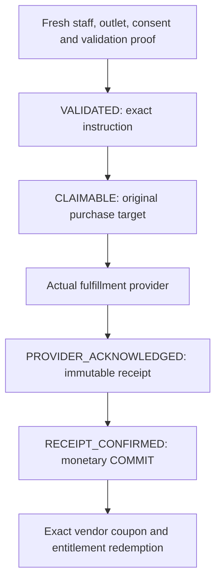

# Exact Issuer Merchant Stock Admission

## Ownership

`DefaultPromotionMerchantScopeService` connects signed issuer staff to one
purchased vendor-owned coupon through its original secure issuance receipt.
Digital Core owns validation, instructions, claims, provider acknowledgement,
immutable receipts and recovery. Profile owns identity/scopes; Store owns outlets.
No vendor impersonation, general cross-enterprise access, registry or new route
is introduced. Ordinary same-enterprise requests retain their existing path.

| Coordinate | Authority |
| --- | --- |
| Tenant, issuer, employee and Bearer | Original staff request and fresh Profile scopes |
| Operational enterprise | Exact persisted purchase and original secure batch |
| Issuer/vendor and consent revision | Protected issuance membership and current live consent |
| Distribution Store/root | Original issuance and approved publication selection |
| Redemption outlet | Current Store revision and exact employee STORE scope |
| Buyer, Product, Order and policy | Matching persisted coupon and entitlement |
| Monetary benefit | Independent qualified priced evidence, not typed amounts |
| Budget | Original issuer admission, never a substituted vendor budget |

## Exact Admission

`admit` accepts one presented token or exact entitlement identity. Separate system
persistence contexts stay private inside fixed owner operations; original staff
authentication is unchanged. Ambiguous reads refuse. Every operation verifies
secure installed persistence, complete batch membership, token fingerprint,
original issuer/vendor/grant proof, selected root, current campaign, Profile
enterprises, employee scope and outlet. Expiry, revocation or revoke/regrant
cannot adopt another consent. Monetary campaigns additionally need independent
qualified benefit selection. Private capture covers persistence work.

Fresh entitlement rows use generated record JSON wire values before returning
them to the merchant coordinator and before exact comparison with detached
owner arguments. BSON IDs remain their full hexadecimal values and dates remain
ISO strings: `structuredClone` alone can discard BSON ID contents. Update and
lifecycle readbacks use the same representation. IDs, dates, metadata, revisions
and purchase fields are not omitted; changed fields still refuse. This conversion
never clones the private admitted staff request or grants persistence authority.

Generic Coupon reads continue to remove ciphertext and secure issuance fields.
An exact registered merchant lifecycle child therefore re-reads its original
coupon through the secure owner before checking batch membership and consent.
The presented generic business projection must match that fresh record; supplied
private fields, when present, must also match. Only the Mongo storage `_id` is
excluded from this projection comparison, never the domain code, tenant, vendor,
revision, purchase identity, rights, dates or metadata. The fresh private receipt
establishes authority; missing projected secrets do not become permission or
public proof, and copied lifecycle commands remain inadmissible.

WeakMaps bind actual request identity and unchanged inputs. Copies, mutations
during awaits and public system/admission flags grant nothing. Generic model
enterprise predicates remain unchanged; no arbitrary query/callback is admitted.

The generated Coupon/CouponBatch read pipeline preserves the exact private
request through its early Mongo and final protected projection hooks. Token
discovery remains tenant plus exact hash; only the original retained batch
establishes vendor scope. Generic or copied reads do not retain issuance proof.
`admissionFailureStage(error)` returns a fixed secret-free diagnostic only for
the original in-memory failure object captured by this owner's `admit` call.
Copied errors, request flags and public stage properties grant nothing. The
original error, private cause, signed inputs and admission checks are unchanged;
this diagnostic is neither persisted evidence nor an authorization capability.
The stage writer remains an unexported security-only object member so caller
code cannot inject diagnostic text during an admission await. Pure
`recordSnapshot` is a mergeable service member and internal calls use the
effective receiver; overrides must preserve every generated wire coordinate.

## Confirmed Write Phases

Read admission cannot authorize writes. Only canonical Digital `confirm` mints
private action commands bound to exact request, session, phase, operation and
arguments. Strict successful receiver admission is required; `finally` clears
registrations on success/failure. Promotion lifecycle children are exact and
in-flight, not general issuer campaign authority.

| Write | Required phase | Additional fence |
| --- | --- | --- |
| `update` | `VALIDATED` | Evidence-only patch, original employee/key/outlet and successor readback |
| `claim` | `CLAIMABLE` | Durable original instruction and exact target |
| `persistReceipt` | `PROVIDER_ACKNOWLEDGED` | Actual matching provider acknowledgement |
| `redeem` | `RECEIPT_CONFIRMED` | Durable receipt and monetary COMMIT before redemption |

## Accounting And Recovery

The private [coupon budget receiver](coupon-bound-issuer-budget.md) requires the
original grant's explicit `ISSUED_COUPON_BENEFIT_V1` purpose. Ledger/counter and
first-COMMIT coupon revision fence use one qualified Promotion transaction.
Lifetime coupon identity prevents duplicate spend through another retry key.
Budget refusal leaves CLAIMED stock with its original receipt; exact retry does
not repeat the provider. REDEEMED recovery requires its actual original COMMIT,
never a first charge. Fresh authority/consent remain mandatory. These checks are
not a distributed Profile/Store/Pricing/database lock.

RELEASE validates an actual original COMMIT and exact inverse, but this bridge
cannot mint RELEASE authority. A canonical original used-benefit reversal workflow
is still required. An unused purchase refund is not proof of benefit reversal.
Never manufacture it from confirmation flags or imported ledgers.

Recovery queue is bounded to 100 original issuer/outlet markers, re-admits every
purchase and returns safe summaries. Original receipt inspection is non-mutating.

## Qualification Boundary

Source contracts exercise actual owners with isolated persistence/Profile/
transaction ports, not installed native qualification. Defaults stay disabled/
unqualified. PRICED_CART proves priced intent, not external POS settlement.
`test/promotionMerchantScopeContract.test.js` also compiles the real generated
service template and runs the actual get pipeline, Mongo adapter and protected
hooks against isolated cursors. It checks original/copy identity, both projection
windows, generic secret removal, input drift and final-envelope refusal.
[ITEM](verified-item-benefits.md) requires an independently authenticated delivery
source; simulation or staff confirmation does not prove real delivery. See also
[trusted distribution](trusted-distribution-read-admission.md). Native installation,
coordinated publication and full live journeys remain separate gates.
