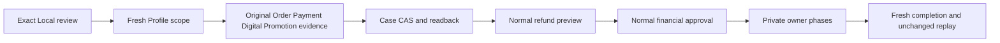

# Purchase Review and Guarded Refunds

Order owns customer review cases, refund intent and outcome. Profile owns employee
membership, permissions and scope. Payment owns the original capture and refund;
Digital Core and Promotion own coupon revocation. Configured domain ports own
non-Commerce reversals. Clients never supply payment amounts, wallet references,
original ledger entries, asset owners or a provider implementation.

Customer cancellation, return, refund and dispute requests are stored as DISPUTE records
in the existing `orderLifecycleRequest` store. Requests require confirmation,
a bounded reason and stable idempotency. Manual resolution remains available and
does not execute financial changes. Operators require `commerce.dispute.review`
and current Profile scope; generic lifecycle actions cannot bypass these checks.

When a deployment explicitly enables `order.refunds`, a moderator can preview a
full refund for a configured exact retained Store or legacy order prefix. Store
admission loads the original owner-bound Cart and rejects absent, conflicting or
foreign scope. Checkout pins that Store into Order evidence; only that matching
retained Store selects `ownerByStore`. Caller Store fields are not authority.
Existing legacy prefixes and external `defaultOwnerPort` remain independent.
Payment reads the single successful
capture from the existing `paymentTransactionEntry` store. The first supported
automatic provider is Loyalty reward points; other provider and split-capture
cases require manual resolution. The captured total must exactly match the order.
No partial refunds are inferred.

Digital Core permits unused, unclaimed coupon entitlements only and locks them
before Promotion revocation. Mixed or incomplete digital orders fail closed.
A configured external domain port must supply preview, prepare, settle and
complete operations. Generic Commerce contains no Waste asset or carbon rules.
The local `fulfillmentCore` provider implements reviewed full physical cancellation
before dispatch or returned-goods reversal after owner-issued shipment. It requires
explicit `CANCELLATION`/`RETURN`, original holds, current Profile review and physical
scope, persisted full-refund approval and the actual consignment lock. Receipts and
inspections are retained manual warehouse attestations; full received quantity and
every accepted inspection must precede Inventory settlement and Payment. See the
[physical bridge](../../../../../fulfillment/modules/fulfillmentCore/llm/contracts/physical-order-reversal.md).

Execution requires `commerce.refund.execute`, fresh reviewed eligibility, a reason,
confirmation and a stable command. A canonical per-order REFUND record prevents a
second customer case from issuing another full refund. The existing
`DefaultOrderLifecycleService` processor calls owner ports. Each successful phase
is checkpointed in the existing request evidence. Payment completes before final
ownership/revocation projection. Failures remain RECONCILIATION_REQUIRED with
original approval and completed phases intact. Retry reuses the original command
and receipt/ledger identities; it does not create another refund.

The staff-only recovery preview supplies the bounded `approvalCommandKey` and
immutable `approvalReason` for the original case. These are replay references,
not permission or provider credentials. Another case receives ineligible progress
without the approved reference. Missing or malformed stored references remain
reconciliation work. Clients must not manufacture a new key after a reload or an
uncertain response; explicitly inspect the current preview and reuse its original
command. All signed scope, execution permission and retained approval checks still
run on every attempt. Axis presents `RETURN` as well as `CANCELLATION` and `REFUND`
cases; return logistics remain independently owned by Fulfillment.

The customer case becomes REFUNDED only after every owner completes. Otherwise
it shows REFUND_RECONCILIATION and linked recovery evidence. Original history is
retained. Raw provider credentials are never placed in customer responses.

Completed original-command replay rechecks current staff scope, execution permission
and persisted refund authority. The linked DISPUTE projection is a no-op when its
status and refund result already match; it does not advance revision, rewrite audit
or financial evidence, or dispatch owner effects again. An omitted optional result
reason and an undefined reason are equivalent. Stale case progress is repaired only
on the original tenant/enterprise/buyer/order/case/type and current revision, with
an affirmative generated read, exact count, acknowledged single-row CAS and uncached
persisted readback. Missing, foreign, ambiguous, truncated or unconfirmed evidence
requires reread/reconciliation, never inferred projection success. Other case
evidence remains intact. Notification attempts remain independently governed.

Completed replay failures expose fixed registered Order gate codes only:
`ERR_ORDER_REFUND_REPLAY_AUTHORITY`, `ERR_ORDER_REFUND_REPLAY_STATE`, and
`ERR_ORDER_REFUND_PROJECTION_BINDING`, `_READ`, `_WRITE`, `_READBACK` (the latter
three share the `ERR_ORDER_REFUND_PROJECTION` prefix). These are conflict responses
on the existing secured operation, not an additional diagnostic endpoint or an
authorization bypass. Provider exceptions are replaced without retaining raw
causes, records, identifiers, tokens or financial details. A gate failure does not
authorize a replacement command or re-execution of completed owner phases.

Validation: `test/orderDisputeContract.test.js`,
`test/orderRefundRecoveryContract.test.js`, Payment original-capture tests,
Digital Core revocation tests and connected refund/replay qualification.

## Local Missing-Policy Adjudication

Missing retained refund policy still returns
`PURCHASE_REFUND_POLICY_REQUIRES_REVIEW`. A separate explicit
`POST /disputes/:code/refund-exception` operation records an exceptional review;
it does not execute finance or change original purchase terms. It is disabled
by default, available only on operational COMMERCE with canonical `LOCAL`
environment classification and an exact environment-name allowlist. An
environment suffix, role name, import or caller flag cannot enable it.

Deployment configuration under `order.refunds.policyExceptions` has `enabled`,
`environmentNames` and `approvals`. Every approval is an exact nine-field object:
`tenant`, `enterpriseCode`, `ownerId`, `orderCode`, `caseCode`, `amount`,
`currency`, `entitlementCode`, `couponCode`. No wildcard or partial binding is
accepted; amounts use the existing exact decimal owner. Keep project identities
in the deployment layer, never framework defaults. Selection must remain
unchanged across owner evidence reads.

| Gate | Required Evidence | Refusal / Recovery |
| --- | --- | --- |
| Reviewer | Genuine human, ordinary review plus `commerce.refund.exception.adjudicate`, fresh Profile ALLOW without applicable DENY | No adjudication or financial dispatch |
| Original case | Exact submitted REFUND review, expected revision and stable command; no existing financial refund | Reload/reconcile the original case, never replace its identity |
| Purchase | Complete acknowledged single-unit Order and Digital reads; original capture fully matches amount/currency and Loyalty provider | Split, mixed, missing, foreign or unconfirmed evidence refuses |
| Policy | Original retained purchase policy exists and its refundPolicy is absent | Explicit policy, expired, claimed or redeemed purchases are not exceptions |
| Issuer | Promotion validates immutable issuer/vendor references, purchase timestamp and validity | Marketplace scope never replaces merchant ownership |
| Audit | Immutable original scope, normalized capture/policy hashes, reviewer, reason, time and command; acknowledged single-row CAS and uncached readback | Lost or uncertain writes require original-command read/replay |
| Execution | Normal financial approval plus fresh exceptional validation at each private Digital phase and Payment/replay | Retain existing reconciliation checkpoints; no new credit or owner bypass |

The request accepts only confirmation, expected case revision, a bounded reason
and stable idempotency. Same-command adjudication replay is a no-op; changed
reason, scope, evidence or competing revision cannot overwrite it. Successful
adjudication leaves the case `SUBMITTED`, entitlement unused and wallet unchanged.
The normal refund preview/execute operations then retain the exception reference
in the canonical financial approval and execute their usual PREPARE, SETTLE,
PAYMENT and COMPLETE phases.

Digital accepts the exception only from the exact private phase object admitted
by Order. Copies and flags do not carry authority. This permits only the missing
refund-policy gate to be reviewed: complete units, original capture, unused
status, current scope, owner locks and normal refund checkpoints remain mandatory.
Already-redeemed benefit reversal stays unsupported. Native Local conformance
is not production refund-policy, real-money or merchant-delivery qualification.

Validation: `test/orderRefundExceptionContract.test.js` uses real Order, Digital,
Promotion purchased-rights and Payment original-capture services with isolated
generated-owner fixtures. It covers successful adjudication and normal refund,
decimal normalization, drift, failed/truncated reads, DENY, explicit policy,
used units, write/readback, concurrent review and private-context rejection.
Native installation, original financial movement and replay require separate
deployment evidence.

## Reverse Execution Safety

Generic `CANCELLATION`, `RETURN` and `REFUND` requests are submission/review
intent, not financial or physical reversal authority. Generic approval,
reconciliation and retry fail preflight before digital revocation, payment or
Fulfillment calls. Return receipt, inspection and disposition fail the same gate.
An Inventory reservation release authenticated as the original checkout customer
does not authorize an operator cancellation. Order must not manufacture that
customer identity or call the customer-only route as an operator.

Without prior effects, the request stays `SUBMITTED` with
`evidence.execution.status=BLOCKED`, the exact `missingGate` and a manual-review
next action. Prior downstream evidence or previously progressed status remains
`RECONCILIATION_REQUIRED`, including reject/retry attempts, with original evidence
intact. An identical blocked replay does not advance revision. Submission replay
binds enterprise, owner, order, type, reason, quantities and selected evidence;
legacy submissions without a pinned intent require manual review.

The scoped refund path reuses signed Profile staff scope and
`commerce.refund.execute`. Payment re-reads Order's persisted approval and original
Order totals; caller amounts/currency cannot become authority, and provider/token,
wallet, ledger and financial-key overrides are rejected. The approval pins the
full original capture privately. The browser preview omits its wallet and ledger
references. The financial key is stable across APPROVE/RECONCILE and distinct
customer cases cannot issue another full refund.

Before domain prepare/settle, Payment preflight verifies the original capture,
provider availability and remaining refundable authority in both Payment journals.
Execution additionally requires the persisted Order lock and explicit successful
PREPARE/SETTLE checkpoints. Failed/unknown phase responses, failed owner reads,
unconfirmed persistence and changed capture/intent fail closed. Provider failed,
delayed, unknown or receipt-less outcomes never complete the Order and replay does
not dispatch another refund. Recovery evidence links the Payment transaction and
reconciliation record when available. Every owner checkpoint and final Order
status requires readback before reporting completion.

Remaining deployment qualification includes the installed physical owner models,
normal-API native cancellation/return and actual warehouse attestations. Generic
actions still lack execution authority. Partial/split-capture refunds and live
provider-confirmed recovery still need their own qualified contracts. Existing refund/compensation records consume
remaining authority conservatively, including ambiguous failures. Recovery never
invents provider success, enables policy or bypasses protected reads. Release
readiness requires every declared gate to be explicitly `true`; absent evidence
is not readiness.

Focused isolated coverage: `test/orderReverseSafetyContract.test.js`,
`test/orderRefundRecoveryContract.test.js`,
`test/orderLifecycleOperationalReadinessContract.test.js` and PaymentCore's
`test/paymentRefundSafetyContract.test.js`. These are not live acceptance.
