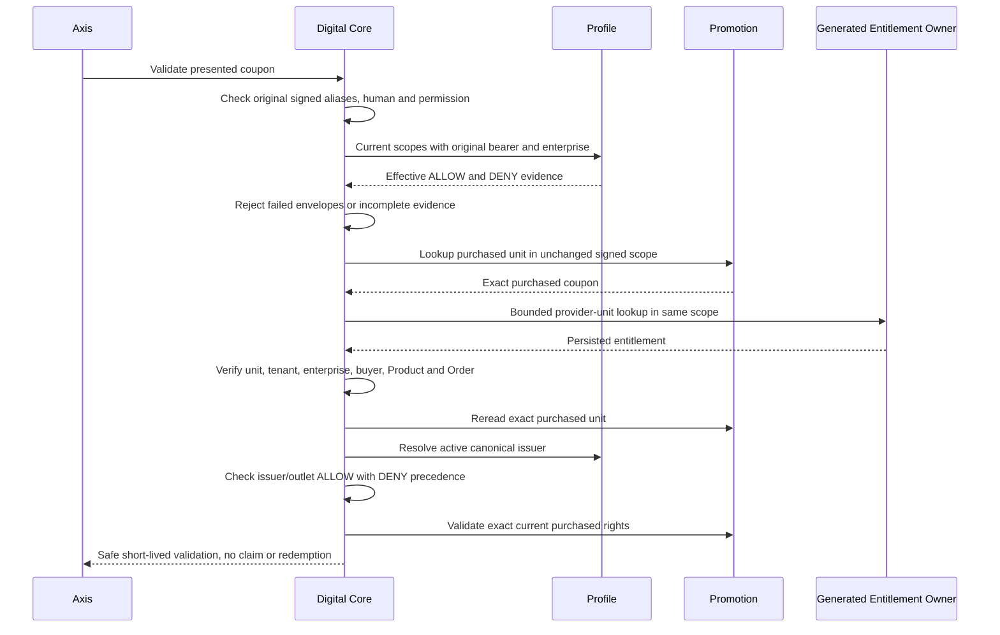

# Enterprise Merchant Redemption

Unclassified validation failures retain `ERR_DIGITAL_MERCHANT_INVALID`. The
controller may return a registered `ERR_DIGITAL_MERCHANT_DIAGNOSTIC_*` status
from the actual failing validation object
(staff, input, issuer admission, coupon, entitlement, merchant, Store, scope,
purchase state, rights or validation binding). Private error text, coupon tokens
and record fields never cross this boundary. Copied errors or caller-provided
diagnostic fields are not evidence; other merchant operations remain masked.
Issuer admission may append Promotion's fixed substage from the same original
failure object. An unknown substage is omitted, never copied into the response.
Private nRouter responses use only the registered status message, not custom
exception text. The append-only status map preserves this suppression boundary.

## Staff And Persisted Identity Admission

`DefaultDigitalCommerceMerchantService.context` retains the original signed
enterprise. Every supplied tenant alias (`tenantCode`, `authData.tenant`,
`authData.tenantCode`) must equal the routed tenant. Every supplied enterprise
alias on the request or authentication must agree; an empty/conflicting alias is
not ignored in favour of another field. When present, `tokenType` must be
`access`. Existing routed contexts without that optional claim retain their
legacy path, but staff still need an original bounded Bearer header, human login
and the independent router operation permission. No payload field supplies the
tenant, enterprise, staff identity or effective scopes.

Before awaiting Profile, the owner detaches authentication, payload and query
values from the caller. Each staff admission calls `/identity/scopes/me` again
with the original Bearer and enterprise header. Every transport/result envelope
is checked for failure, including a negative acknowledgement, before unwrapping.
A failed outer envelope cannot be made successful by placing matching scopes in
`data` or `result`. At most seven wrapper levels are accepted; the terminal value
is still checked and deeper envelopes refuse rather than returning unchecked data.

The resulting principal must match the employee login; a supplied principal type
must be human. Both scope arrays are required, a supplied `scopeCount` must match,
and the combined result is bounded to 1,000 assignments. Larger owner results
require a separately qualified complete-read contract, never truncation. All
entries, including sparse/malformed DENY entries, require bounded non-empty
selectors and well-formed optional qualifiers. Canonical Profile blank optional
qualifiers (`undefined`, `null` or empty string) retain their unrestricted meaning;
required selectors cannot be blank. An explicit effect must agree
with its array; inactive evidence refuses. Results are detached before use.
These are consumer admission checks, not a second Profile scope resolver or a
local cache of employee/group assignments.

Relevant explicit DENY still wins over ALLOW. A wildcard capability applies to
the merchant operation; it cannot make a denial disappear. An enterprise
qualifier must match the issuer even for STORE or broader scopes. Qualified
outlet fulfillment still requires a positive exact STORE grant independently.

Successful generated reads are necessary but not sufficient. The merchant
owner verifies persisted tenant, operational enterprise, coupon provider,
entitlement/unit/Product/Order identities, buyer and nonnegative safe revision.
Customer reads also compare the persisted buyer with the authenticated owner.
Before resolving an issuer, the returned coupon must match the entitlement's
exact unit, tenant, operational enterprise, buyer, Product and original Order.
Profile lookup keeps the routed tenant unchanged. An optional `Enterprise.tenant`
in its projection is a business Tenant relationship, not the lookup partition;
do not reject a legitimate issuer because those differ. Profile owns reference
isolation and active filtering, and the returned identity must match exactly.
Marker writes require the original ACTIVE entitlement and UNCLAIMED/CLAIMED
claim state, with room for a safe revision successor. The generated CAS selector
pins tenant, operational enterprise, exact code, revision, status and claimStatus;
zero matches refuse rather than retrying. Exact successor and patch readback must
also preserve the original buyer, unit/provider, Product/SKU, Order/entry, delivery
type, purchase dates and retained policy. Changed purchase identity cannot be
acknowledged before continuing to claim, provider confirmation or redemption.

| Evidence failure | Required outcome |
| --- | --- |
| Conflicting scope aliases or invalid staff transport | Refuse before Profile or record access |
| Failed Profile envelope with apparently valid scopes | Refuse before coupon lookup |
| Missing, malformed, contradictory or oversized scope evidence | Refuse; never discard a denial |
| Foreign/missing persisted entitlement identity | Refuse before merchant resolution |
| Coupon/entitlement purchase binding differs | Refuse before issuer reference lookup |
| Current relevant DENY after a prior successful operation | Refuse using the new Profile response |

`test/merchantStaffAuthorityContract.test.js` exercises the actual admission and
identity members with isolated owner ports, including failure envelopes, caller
mutation during awaits, fresh denial, email-shaped buyer identities and foreign
purchase evidence. The existing merchant journey, receipt recovery and priced/
outlet contracts remain regression gates. These checks are source validation,
not installed cross-runtime qualification.

**Delegated purchased stock has a separate exact owner handoff.** The implemented
[issuer merchant bridge](../../../../../baseCommerce/modules/promotion/llm/contracts/issuer-merchant-stock-admission.md)
privately resolves original secure issuance and purchase identity while keeping
staff authentication issuer-scoped and generic queries unchanged. It rechecks
current employee/outlet authority and original live consent on every operation.
Read admission grants no writes: only actual `confirm` phases mint private exact
mutation commands, and provider acknowledgement precedes receipt persistence.
Monetary redemption requires the separate coupon-bound issuer COMMIT. Native
installed acceptance and an authenticated ITEM provider remain distinct gates.
Already-redeemed benefit reversals are explicitly unsupported in the approved
local-demo scope: no canonical RELEASE caller exists or is enabled. Policy-read
admission alone grants none of those authorities.

## Explicit Local Item Simulation

Promotion's [separate simulation mode](../../../../../baseCommerce/modules/promotion/llm/contracts/verified-item-benefits.md#explicit-local-simulation)
uses Fulfillment's default-off, canonical LOCAL/selected-environment allowlist.
It does not qualify real delivery. The ITEM provider checks fresh signed staff,
issuer, Store and original instruction, then passes the exact `pricedAuthority`
object to `validateCoupon`. SIMULATED_ITEMS is accepted only while the real
Promotion simulator selection is admitted; it must retain simulated/unverified
tags and exactly the original benefit binding and Store revision. A changed mode,
bundle, hash, reference or outlet cannot be acknowledged as the original result.

Confirmation and queue summaries, and both pending/completed original receipt
inspection, preserve `simulated: true`, `deliveryVerified: false` and
`evidenceMode: LOCAL_SIMULATION`. A REDEEMED entitlement means this coordinated
demo redemption completed, not that physical goods were delivered. The benefit
has no deliveredAt or monetary amount; existing merchant command timestamps are
coordination metadata, not carrier proof. Frontends must display explicit local
simulation/unverified goods rather than a money discount or verified fulfillment.

The actual MerchantScope source fixture covers the complete isolated simulator
flow through validation, claim, protected receipt, redemption, replay and query.
It preserves issuer staff identity, vendor storage and encrypted coupon stock.
Native installed private persistence, real Profile/Store authority, authorized
publication and signed-in browser acceptance remain separate gates. Used-benefit
inverses remain disabled; unused coupon and original asset refunds are independent.

## Runtime Contract Corrections

Merchant workspace uses the module-unique logical router name `merchantWorkspace`;
its URL and controller operation remain unchanged. nRouter runtime identities are
module-scoped, so reusing notification's `workspace` key incorrectly substitutes
notification admission for merchant admission. Keep route keys unique across groups.

Issuer resolution uses Profile's existing bounded service `/references/read` with
`type: enterprise` and one code. The runtime credential needs
`profile.enterprise.reference.read`; employee `profile.scope.read` and merchant
redemption permission remain independently required. Profile filters active issuer
references; zero or multiple returned identities are unavailable. Do not restore
generic identity CRUD or manufacture schema user groups on runtime tokens.

Receipt verification pins original `deliveredAt`, correlation, command, buyer,
issuer and fulfillment fields. Generic persistence owns `created` and `updated`;
those storage timestamps are not required to equal the business confirmation time.
Exact receipt evidence and original-command checks remain mandatory.

See Copilot Workbench's [native acceptance guide](../../../../../../../nodics.copilot/modules/copilotWorkbench/llm/examples/secure-coupon-fulfillment.md)
for separate Platform/Commerce persistence and response-loss tests. These tests
qualify synthetic native merchant-screen fulfillment, not payment or external POS.

## Read-Only Original Receipt Inspection

Employee `POST /merchant/redemptions/:code/receipt/query` uses access-token
authentication, `commerce.coupon.pos.redeem`, sensitive-request logging and no-store
responses. Supply the original `Idempotency-Key`, `merchantReceiptReference` and
optional `storeCode`. It loads current Profile scope, issuer/outlet and the exact
entitlement marker. Replacing any original coordinate fails closed.

The V1 response is `UNCONFIRMED` unless the entitlement is REDEEMED and the original
receipt passes the same generated-owner/readback checks used by fulfillment.
Completion includes only entitlement, original command/receipt, issuer/mode and
outlet coordinates. Staff and entitlement/outlet revisions are checked again after
the receipt read. Customer identity, token and validation proof are not returned.
No provider, claim, redeem or mutation operation is called. Missing/failed evidence
never grants retry. This lets a caller reconcile its own uncertain action without
duplicating Commerce recovery authority. Current scope remains required even when
the historical validation proof expired. See Copilot Workbench's secure coupon
guide for its separately authorized action CAS and user workflow.

## Qualified Outlet Increment

`digitalCore.merchantRedemption.storeScope` defaults disabled/unqualified. Disabled
policy rejects supplied storeCode instead of ignoring it. Qualified activation
requires joint acceptance of Store, Profile scopes, Promotion and provider contracts.

GET `/merchant/redemptions/workspace` returns at most 100 live authorized Store
choices using caller Store read permission and current Profile STORE ALLOW. Broader
positive scope alone cannot grant an outlet; relevant DENY wins. Store must be active,
tenant-consistent, revisioned and linked to the coupon issuer. No static project
store list is authority. Axis supplies selected storeCode for queue/validate/confirm.

Validation binds outlet code/revision and staff identity. Promotion optionally
restricts campaigns through bounded unique conditions.storeCodes; absent outlet
cannot satisfy it. Confirmation retains canonical storeRef/storeRevision and checks
original receipt/key/outlet on replay, verifies entitlement single-match persistence
and readback, then rereads staff/Store authority before provider attestation.
This is not a distributed transaction; installed CAS/races remain acceptance gates.

Qualified providers acknowledge matching storeCode/storeRevision with receipt fields.
Merchant receipt owner availability is checked before acquiring a fulfillment
claim. Provider acknowledgement must match the original receipt reference and
mode as well as operation, issuer and outlet. Receipt persistence uses the existing
Digital Entitlement save/read helpers, successful generated-owner envelopes and
exact uncached readback. Failed or missing receipt evidence cannot consume a code.
A retry reuses only the original matching committed receipt rather than invoking
the provider again. Failed/ambiguous reads are not absence; when the provider
executed but no receipt was saved, its original operation-key idempotency and
reconciliation remain required. This is not an exactly-once external POS guarantee.
Receipt correlation is the persisted redemption operation, not a new retry's
transport correlation. Duplicate entitlements and conflicting receipt evidence
fail closed. New receipt-authority/replay fixtures remain unexecuted.

Delivery evidence retains the outlet reference. Circa displays an outlet only from
REDEEMED evidence with canonical Store reference and positive revision. No new
purchase/debit or frontend authorization is introduced. Customize owning backend
policy, Store data and Promotion restrictions through later layers. New outlet-scope
and extended Circa history fixtures are authored, not executed acceptance.

Every merchant is a Profile enterprise. Its registered employees perform the
merchant journey in Axis at `/commerce/coupons/fulfillment`. The Profile
`MERCHANT_OPERATOR` enterprise-access role assigns the canonical nAuth
`commerceMerchantUserGroup`; membership and current enterprise scope are checked
at each operation. Explicit denials win over broader grants. There is no separate
merchant registry, frontend merchant identity or Circa merchant screen.

The issuing enterprise comes from the purchased Promotion coupon's
`issuerEnterpriseRef`, with the existing enterprise association compatibility
mapping for older records. Profile must still resolve an active enterprise.
The authenticated record partition and the business issuing enterprise are
separate checks; employee scope must match the issuer.

The customer uses the existing purchased coupon code display. Axis posts that
code to Digital Core validation. Promotion resolves its token hash and checks
purchase state, customer ownership, issuer, active campaign, validity dates and
supported campaign conditions. Unsupported conditions fail closed until an owning
Promotion extension validates them. Validation neither claims nor redeems a
coupon and returns no raw token, token hash or customer identity.

A validation proof binds the coupon, entitlement revision, issuer and five-minute
expiry. The employee reviews the benefit and enters their transaction/receipt
reference before confirming. Digital Core persists the instruction, claims under
the original customer's ownership, obtains the configured fulfillment provider's
acknowledgement, records delivery evidence and invokes Promotion redemption.
The merchant-screen provider records authenticated staff attestation; it does not
claim to have contacted an external POS. The existing customer claim API remains
compatible, but no new customer screen is required.

Selected monetary benefits require the native basket reference BEFORE validation.
The concrete native provider binds the priced snapshot to validation, original
marker and receipt, and reuses live Profile/Store membership and activated prices.
See [native priced evidence v1](../../../../../baseCommerce/modules/pricing/llm/contracts/native-merchant-priced-evidence-v1.md).
MERCHANT_SCREEN/PRICED_CART remains native attestation, not external POS settlement.

Confirmation is idempotent and cannot change the entered receipt. If completion
is interrupted after the instruction is persisted, the scoped Axis queue exposes
recovery under the original reference; another customer action is unnecessary.
Redeemed coupons return their receipt and cannot be reused. Coupon redemption does
not change attached asset carbon or invoke a refund.

These owning operations support the future merchant POS integration boundary.
External connectors, provider credentials and public POS qualification remain a
separate integration task. The framework defaults merchant redemption off.

Validation: `test/digitalCommerceMerchantContract.test.js` and the connected Axis
employee journey with persisted customer receipt history.

Promotion retains canonical `TENANT_UPPERCASE_SHA256` issuance. A deployment may
explicitly enable `promotion.legacyTokenHashPolicies` with
`TENANT_COLON_UPPERCASE_SHA256` for previously issued coupons. Lookup stays inside
Promotion and accepts exactly one matching purchased row. No plaintext lookup or
reissue is performed. New Circa sample data uses the canonical digest; its project
configuration enables compatibility for existing sample purchases.
