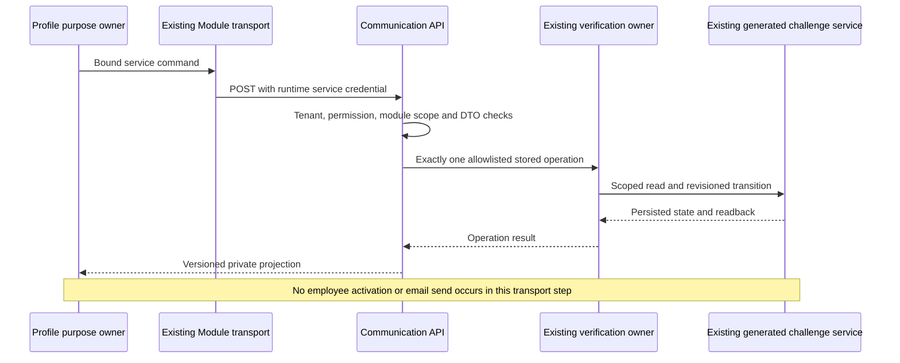

# commsApi contracts

[Private internal transport](private-internal-transport.md) requires exact admitted
capture before sensitive input mapping and inherited verification owner context.

[Source-scoped intent authority](source-scoped-intent-authority.md) governs
signed source delegation for creation, stored-intent inspection, retry and resolution.

Verification RPC helpers remain mergeable service exports. Later projection
overrides must preserve operation-specific fields and service authorization;
never expose a code or proof from another operation. The focused
`communicationVerificationCustomization.test.js` delegates to the real adapter,
checks an effective projection override and proves denied module scope cannot
reach either the verifier or the customized projection.

Status: active Phase 1C. Secured Communication HTTP contract. Later-loaded projects may override implementation while retaining Communication ownership, security, audit, retry, and recovery invariants.

Customer inbox projections may include `source: { module, type, code }`, resolved
from the existing intent only when its recipient and IN_APP channel match the
authenticated inbox owner. No template variables, recipient addresses or internal
intent payloads are returned. This selector conveys no permission; a client must
use the owning domain's authorized detail operation to display the referenced
item. Existing immutable messages and delivery records are not rewritten.

## Internal persisted-verification transport

### Purpose, ownership and rollout

`POST /internal/verification/commands` (under the normal `commsApi` module/version
prefix) makes the existing Communication challenge owner callable from another
runtime. It is not a public registration route. `DefaultCommunicationApiController`
and `DefaultCommunicationApiFacade` delegate to `DefaultCommunicationVerificationApiService`;
that adapter only validates the service command and projects the existing owner's
reply. `DefaultCommunicationVerificationService` still owns all verification,
expiry, hashing, replay and consumption transitions. Its generated challenge
service remains the only persistence path. No authentication session, employee,
wallet, notification intent or delivery is created by this API adapter.

Persisted verification stays disabled by default. Publishing this route does not
enable `communicationVerification.stored`, add a trusted source, grant a runtime
permission, generate a service credential or change any enterprise's authority.
No client navigation item is added. Axis must never call this internal endpoint.

### Required caller authority

The normal route has `secured: true`, `authTokenTypes: ['service']`, the existing
service access-group convention, `communicationIntegration` exposure and explicit
`communication.verification.execute` permission. The adapter independently requires
an authenticated service principal, matching request/authenticated tenant, that
explicit permission and signed module scopes containing both `commsApi` and the
requested `sourceModule`. Wildcard-only permission is deliberately insufficient at
this boundary. Source-module selection is delegation within those signed grants;
it does not assert which process physically originated a request.

A string role, enterprise name, body `isSystem`, body `authData`, arbitrary
`sourceModule` or headers cannot create authority. The existing Profile deployment
grant and nAuth/nRouter layers must issue and validate the runtime credential.
Revocation and credential freshness remain those owners' responsibilities. This
source patch does not qualify the complete service-token middleware in a running
installation. Keep stored operations disabled until that qualification passes.

### Request contract

Every operation carries `operation`, `sourceModule`, `purpose`, `subjectReference`,
`channel`, `destination` and a high-entropy 64-character hexadecimal
`bindingReference`. The purpose owner creates that continuation binding; it must
not accept a predictable reference or a customer's claimed verified flag.
Destination is a service-private input, not an ordinary public response. Supported
transport channels are EMAIL and SMS; channel support does not imply configured
message delivery. Identifiers, dates and proofs are revalidated by the owning service.

| Operation | Additional inputs                                    | Meaning of a successful response                                                                                                        |
| --------- | ---------------------------------------------------- | --------------------------------------------------------------------------------------------------------------------------------------- |
| ISSUE     | None                                                 | One stored challenge; a transient secret only for fresh issuance. A repeat returns status without another secret or send.               |
| VERIFY    | challengeCode, generation, secret                    | Persist a failed attempt, expiry or verification. Only VERIFIED returns the short-lived proof.                                          |
| CONSUME   | challengeCode, generation, proof, operationReference | Exactly one persisted consumption. Only a fresh successful consume returns executionGranted true.                                       |
| RECEIPT   | Same as CONSUME                                      | Inspect an exact prior consumption using the original proof; executionGranted is always false. It is not provisioning-resume authority. |
| REPLACE   | challengeCode, expectedRevision                      | Apply the existing cooldown, generation and revision policy, replacing the previous code/proof.                                         |
| CANCEL    | challengeCode, expectedRevision                      | Invalidate an unused challenge through the existing owner; no reopening of consumed evidence.                                           |

The body rejects extra fields, including credentials, roles, tenant override,
caller-chosen service name and clock. ISSUE cannot choose its secret. Operation
selection uses a fixed, own-property allowlist: names such as `constructor`,
`toString` or an internal helper name cannot become executable methods.

### Replies, secrets and uncertainty

Replies have contractVersion 1 and an operation-specific allowlist. Common fields
are challengeCode, status, revision, generation, expiresAt and nextIssueAt. Fresh
ISSUE/REPLACE may include secret; successful VERIFY may include proof and
proofExpiresAt; CONSUME/RECEIPT include consumedAt and executionGranted. Raw
challenge records, binding/destination hashes, proof hashes, employee information
and arbitrary provider fields are excluded. Sensitive input fields are marked
writeOnly in OpenAPI; this documentation flag is not a logging redaction engine.

Use the existing secured internal transport with validated endpoints, no redirects,
no automatic mutation retry and a bounded response. Never include secret, proof,
bindingReference, destination or request bodies in logs, screenshots, traces,
analytics, exported diagnostic data or a public Axis response. Real deployment
acceptance must verify the actual logging/caching and TLS configuration. Do not
claim mailbox receipt from ISSUE; it does not send email. Secret delivery still
belongs to Communication Core and the qualified provider.

A lost response after CONSUME is uncertain. Request RECEIPT with exactly the same
binding, generation, proof and operationReference. A receipt permits reading the
purpose owner's existing outcome only. If that business outcome is incomplete,
use the purpose owner's separately qualified recovery operation. Never retry
credential or scope creation solely because a receipt exists. Expired proof cannot
be extended into an indefinite recovery login. No local helper, memory store or
older unverified registration route is a fallback.

### Worked internal-call sequence

A service authorised for a prepared employee invitation creates a private random
binding and invokes ISSUE for that purpose/subject. The caller securely hands the
transient secret to its qualified delivery integration, never to the public
registration response. After the applicant presents the emailed code, the purpose
owner calls VERIFY with the saved binding and current generation. It then binds
the successful proof to one registration command and calls CONSUME. The purpose
owner performs its own recoverable provisioning. Repeating ISSUE/VERIFY/CONSUME is
not a substitute for those recovery operations.

This editable diagram explains the source contract. It is not a screenshot or
proof of a running network. A lost-response RECEIPT follows the same authority
chain but performs no challenge update and returns no execution grant.

### Troubleshooting and acceptance

| Symptom                                                 | Safe next step                                                                                             |
| ------------------------------------------------------- | ---------------------------------------------------------------------------------------------------------- |
| Context refused before a record read                    | Inspect the actual runtime grant and signed module/permission claims; do not broaden a public group.       |
| Stored policy disabled/source unavailable               | Resolve current layered owner policy; enable only in an explicitly qualified target.                       |
| Expired or locked challenge                             | Follow the purpose owner's bounded replacement/restart flow; do not extend stored expiry by editing a row. |
| Unknown/malformed result                                | Treat the write outcome as uncertain; do not fabricate success or repeat business provisioning.            |
| No email received after ISSUE                           | Inspect the separately required delivery intent/provider integration; ISSUE does not deliver a message.    |
| Receipt reports consumed but provisioning is incomplete | Follow Profile recovery once qualified; do not re-register a second account.                               |

`commsVerification/test/communicationVerificationPersistenceContract.test.js`
reuses its existing storage fixture for actual controller/facade/API-adapter,
verification and Profile-adapter composition. It tests successful flow, negative
service contexts, strict DTOs, privacy, failure, concurrency and receipt semantics.
The Module transport is injected in those tests. Real HTTP, token validation,
installed schemas, generated pipelines, network/storage durability, email and UI
acceptance remain separate. Run the normal Communication suite and framework
quality gates in a complete checkout before target enablement. Later-layer
customisation must retain the allowlist, truthful result and no-fallback invariants.
