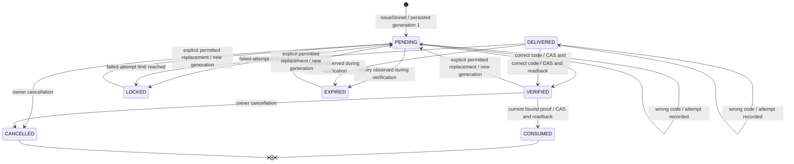

# Communication verification contract

## 1. Ownership, purpose and qualification level

`commsVerification` owns reusable challenge mechanics; `commsSchema` owns the
existing `commsVerificationChallenge` source schema. The generated
`DefaultCommsVerificationChallengeService` is the only persistence boundary used
here. Foundation retains generated pipelines, concurrency and database-provider
semantics. Communication Core owns delivery. Profile owns identity,
authentication, employee membership, approval, continuation and access.

The pure `create(command, policy)` and `verify(challenge, secret, now)` helpers
are retained. Their return values are calculations, **not persisted proof**.
New stored methods implement opt-in persistence and single-use consumption. They
do not expose public HTTP endpoints or wire the currently existing enterprise
registration endpoint. That endpoint must not be called proof-protected merely
because these methods exist. No Gmail transport is enabled by this change.

Read [worked examples](../examples/README.md) for successful, rejected,
concurrent, interrupted and customised cases. The method interface is for
framework maintainers and authorised owning services. Business applicants never
supply module names, tenant identifiers or private challenge records.

## 2. Authorised context and binding

Each persisted method receives `(request, command)`. `request` must carry the
already authenticated internal service's `authData`, a matching trusted
`tenant`, and optional correlation ID. It must not be assembled from browser
fields. The same authData is passed to generated storage without replacement by
an invented system identity.

The **owning adapter** derives and validates these command fields:

| Field              | Meaning and source                                                                                                                               |
| ------------------ | ------------------------------------------------------------------------------------------------------------------------------------------------ |
| `sourceModule`     | The capability actually performing the purpose. It must be allowed by rollout policy and independently authorised by the route/service boundary. |
| `purpose`          | The fixed purpose of this flow, not a browser-selected alternative. Registration and account recovery do not share interchangeable proof.        |
| `subjectReference` | The owner's stable application, invitation or pending subject reference.                                                                         |
| `channel`          | The permitted verification channel; delivery remains a separate capability.                                                                      |
| `destination`      | The owner's canonical destination, bound to this flow. This service hashes it and does not normalise or merge identities.                        |
| `bindingReference` | An opaque, owner-authenticated continuation/session reference. A client-selected value cannot reset limits or create an authority context.       |

The record binds the exact tenant/source/purpose/subject/channel/destination/
continuation tuple by digest. It separately checks source, subject, channel and
destination hash on state transitions. Sensitive raw continuation and destination
are not stored here. An enabled source list is configuration, **not proof of a
caller's authority**. Public adapters must enforce existing API permissions,
source ownership, invitation/account policy, anti-enumeration and rate limits
before invoking these methods. Re-read live invitation/account restrictions
before using proof; verification does not override revocation or approval.

No direct browser or merchant role gets generated challenge CRUD. The source
schema disables generic operations and BackOffice editing. Apply the effective
route/access contract during build and acceptance; source settings are not proof
of deployed route absence.

## 3. Policy and supported customisation

`config/properties.js` owns all effective policy. Defaults are inherited through
normal Nodics layering; no project identity, sender, SMTP account or environment
literal belongs in this module.

| Property                            | Default | Effect                                                                                |
| ----------------------------------- | ------: | ------------------------------------------------------------------------------------- |
| `communicationVerification.enabled` |  `true` | Enables the existing pure mechanics unless a later policy disables them.              |
| `ttlSeconds`                        |   `600` | Code lifetime; bounded positive integer, maximum 86,400.                              |
| `maximumAttempts`                   |     `5` | Per-generation failed attempts; bounded integer 1–100.                                |
| `secretBytes`                       |     `6` | Random code entropy in bytes; 6–64. Default code is hex, not an assumed six-digit UX. |
| `stored.enabled`                    | `false` | Separate explicit opt-in for persisted internal methods.                              |
| `stored.trustedSourceModules`       |    `[]` | Permitted purpose-owner labels, in addition to real caller authorisation.             |
| `stored.proofTtlSeconds`            |   `300` | Proof lifetime, not longer than the code's configured lifetime or remaining expiry.   |
| `stored.resendCooldownSeconds`      |    `60` | Minimum time before replacement.                                                      |
| `stored.maximumIssues`              |     `3` | Maximum generations for the same continuation; 1–100.                                 |

The limits are not a global abuse/rate-limiting service. The public purpose owner
must reuse the existing throttle/admission mechanisms across IP, destination and
sessions. Creating a new arbitrary continuation must not bypass those controls.
Shorten both code and proof TTL when the latter would exceed the former. Policy
must be valid before persistence; malformed settings fail closed.

Every meaningful helper is a documented member of the mergeable service export.
Later layers may override `now`, policy resolution or another owned member through
normal service layering. The stored methods always use server `now()`: a request
body cannot choose a time or secret. Preserve binding, revision, privacy and
acknowledgement checks in overrides. Never copy the full service to customise one
limit or build another registry.

## 4. State model and operation sequence

This diagram explains source behaviour, not a verified Axis screen. `DELIVERED`
is an existing compatible schema state; the new service itself does not send
mail or mark mailbox receipt. Expiry is enforced at use even when no scheduled
job has changed the displayed stored status. Cancellation and replacement also
accept the eligible DELIVERED/LOCKED/EXPIRED states as described below.

### Issue

`issueStored` deterministically resolves one record per trusted binding. For a
new record it returns `{challengeCode, status, revision, generation, expiresAt,
nextIssueAt, secret, replayed:false}` only after saved state is reread and matches.
Only the transient secret is passed by the owning adapter to an approved secure
delivery mechanism. Never return it to a public registration caller.

A repeated issue returns current progress with `replayed:true`, **without a
secret and without sending anything**. A consumer must inspect this result;
retrying creation cannot fabricate another email. The module does not store a
recoverable plaintext secret. If a write succeeded but its reply or subsequent
delivery was lost, resume from state; obtain a new code only by an explicit
permitted replacement. Repeated issue does not reopen consumed/cancelled records.

### Verify

`verifyStored` additionally requires `challengeCode`, current `generation` and
the entered `secret`. Incorrect codes persist an increased attempt count before
returning progress. Exhausted attempts lock even when a later supplied code is
correct. Malformed hashes, invalid or missing dates and unusable records fail
without releasing proof. At the exact expiry instant the code is expired.

On a correct code it generates a transient random proof, persists only its hash
and short expiry, and returns the proof only after exact mutation readback. A
competing request cannot independently win the same transition. Caller-owned
limited continuation must retain the proof securely; ordinary application access
is not granted by `VERIFIED`.

### Consume

`consumeStored` additionally requires current `generation`, `proof` and the
owner's stable `operationReference`. It validates both code and proof lifetimes,
then changes VERIFIED to CONSUMED through managed concurrency. It stores the
consumption timestamp and a hash of source/operation as private evidence, clearing
the usable proof hash. The result is a one-use prerequisite acknowledgement,
not a user session, membership or permission.

A repeated consume fails, even for the same operation reference. The future
Profile registration command must separately journal/prove its permitted
provisioning stages and resume the same command after a partial write. This
service does not atomically cover employee/password/scope writes. Lost consumption
acknowledgement requires owning-command recovery; it must not cause a second
grant or a blind repeat. That cross-owner recovery integration remains unqualified.

### Replace or cancel

`replaceStored` requires `challengeCode` and the current `expectedRevision`.
PENDING, DELIVERED, VERIFIED, EXPIRED and LOCKED are eligible only when cooldown
and issue-count policy permit. It updates the existing row with generation +1,
fresh random code, reset attempts and new bounded expiry. Previous proof is
invalidated in that same transition. No caller-chosen code/time is accepted.

`cancelStored` invalidates unused proof; repeated cancellation is read-only. A
consumed record cannot be cancelled or reopened. Wrong/stale revisions fail
rather than overwriting a newer state. Replacing or cancelling does not retract
an already delivered email; the old email simply contains unusable proof.

For BSON-compatible invalidation, proofHash becomes the empty string and
proofExpiresAt uses the epoch. Do not write null into ordinary string/date schema
fields. A previous verifiedAt may remain as the last verification's audit time;
only the current status/generation/proof determines usability. It does not label
a replacement generation verified. No history deletion or general reset is added.

## 5. Persistence, concurrency and fail-closed behaviour

The existing Foundation managed-concurrency contract applies even with
BackOffice editing disabled. Creation submits token 0 and expects stored
revision 1; this prevents a late duplicate save from overwriting a fresh record.
Every update submits the current revision; Foundation alone calculates the next
revision. Queries retain tenant, binding, status and applicable expiry guards.
Updates are non-upserting and do not access a database directly.

Each mutation has a random per-invocation marker. After the generated operation
acknowledges, the service rereads uncached, demands the exact revision/marker and
compares intended fields. No submitted record or bare write acknowledgement is
returned as verified persistence. Explicit failure, ambiguous state, failed
readback, zero-match mutation or a lost response releases no code/proof/grant.
A concurrent later update may deliberately turn an earlier apparent success into
a safe conflict; do not strip this check for convenience.

These are ordinary generated CAS and readback semantics. They **do not certify
majority/journal durability, replicated failover or a cross-owner transaction**.
Qualification must inspect the selected generated pipeline/provider and its
consistency settings. Do not label this output `durable:true` or misuse the
separate internal DURABLE_JOURNAL capability as an unreviewed shortcut.

Legacy challenges without the bound-record fields and managed revision cannot
be used for new proof consumption. Existing pure-helper callers remain supported
with valid inputs. Effective schema generation and installed validation/index
compatibility require a governed rollout; no automatic record migration, reset,
new tenant, credential change or live send is authorised by this source patch.

## 6. Errors and safe recovery

| Code                        | Meaning                                                       | Safe next action                                                                                       |
| --------------------------- | ------------------------------------------------------------- | ------------------------------------------------------------------------------------------------------ |
| `ERR_COMMS_VERIFY_INPUT`    | Invalid command, date, hash or proof format.                  | Correct permitted input or inspect owner evidence; never expose raw hashes/secrets.                    |
| `ERR_COMMS_VERIFY_POLICY`   | Persisted flow disabled, source disallowed or invalid policy. | Resolve effective owner configuration; do not bypass into an older unauthenticated route.              |
| `ERR_COMMS_VERIFY_CONTEXT`  | Wrong tenant, caller, subject, purpose or continuation.       | Reject; rebuild only through the authorised purpose owner.                                             |
| `ERR_COMMS_VERIFY_STATE`    | Proof/code no longer usable or already consumed.              | Show a safe status; use the owner's permitted new-code/recovery process.                               |
| `ERR_COMMS_VERIFY_STORAGE`  | Storage/readback not confirmed.                               | Treat outcome as unknown, retain non-secret reference and investigate; do not infer no write happened. |
| `ERR_COMMS_VERIFY_CONFLICT` | Concurrent/stale mutation or unexpected reread.               | Refresh through authorised owner; do not automatically repeat a grant.                                 |
| `ERR_COMMS_VERIFY_RATE`     | Cooldown or issue limit prevents replacement.                 | Explain permitted wait/restart through the owner's existing limit policy.                              |

An incorrect OTP normally returns persisted PENDING/DELIVERED/LOCKED progress;
it does not reveal an account directory. Owner-facing safe states should be
mapped to clear business language by the existing Profile/Axis metadata, not by
parsing English exception strings.

## 7. Required integration gates still open

Before public use, prove the existing registration and recovery adapters enforce
this prerequisite; securely compose the message dispatch without persistent raw
proof leakage; integrate single-use continuation and recoverable provisioning;
qualify schema/route generation and the selected live provider; verify public
abuse controls, neutral account disclosure, real email and Axis UX. No feature
flag should open the public route before these gates pass.

The current focused tests cover default and custom pure policy, stored binding,
attempts, expiry, replay, concurrent transition, replacement/cancellation and
storage failures. Five execute actual Foundation concurrency logic with injected
data helpers/provider. The test-only Map is not a production fallback. Full
repository/build/LLM generation, composed runtime, real database and human user
walkthrough are separate evidence. Published screenshot-led user guides must
follow the actual finished Axis journey; these developer examples do not replace
the required business manuals.

## Read-only recovery of a consumed-proof receipt

`readConsumptionReceiptStored(request, command)` is an internal evidence read, not
an alternative consume or a general-purpose authentication endpoint. New consumption
retains a private `consumedProofHash` verifier while clearing the usable `proofHash`.
Neither the verifier nor the raw proof is included in the projected receipt.

The read requires the original trusted tenant/source/subject/destination/continuation,
current generation, exact owning operation and original high-entropy proof. It rejects
expired proof, changed commands, failed reads and legacy consumed records without this
verifier. It never updates the record and always returns `executionGranted: false`.
The Profile owner may inspect whether its original command already completed; it
must not reinterpret this receipt as a second grant to create credentials or scopes.

An uncertain consumption reply can therefore be reconciled without relaxing the
single-use rule. If the business command only partially completed, its own qualified
recovery mechanism—not Communication—must decide what happens next. Expiry is not
extended for recovery and legacy receipts are not silently migrated into authority.

## Remote owner transport

The existing `commsApi` owns the secured service-only HTTP adapter described in
[its contract](../../../commsApi/llm/contracts/README.md). This verifier does not
become an HTTP handler or duplicate Profile registration. New consumption grants
and read-only receipts have different semantics at both service and transport
boundaries. Stored rollout remains disabled by default.

### Isolated Private-Entry Fixture Coverage

The persistence/RPC fixture models exact receiving private admission with a
WeakSet, and explicitly inherits that admission into facade-derived verification
contexts. Profile outbound envelopes must be detached and admitted before the
transport double runs; HTTPS is required and insecure loopback defaults false.
Copied privacy flags are not admission and reject before private body getters or
storage. Unqualified outbound entry rejects before transport.

Lost consume acknowledgements retain their read-only receipt recovery, but public
errors must be the fixed ERR_COMMS_VERIFY_STORAGE or Profile ERR_PRFL_00003, never
raw transport diagnostics, causes or errInfo. These fixture assertions do not
weaken source checks, enable stored operations or qualify external capture.
The real controller/facade/verifier sources run against in-memory generated-store
doubles only. Execution evidence is isolated contract testing, not deployed
HTTP authentication, real persistence, email delivery or visual acceptance.
