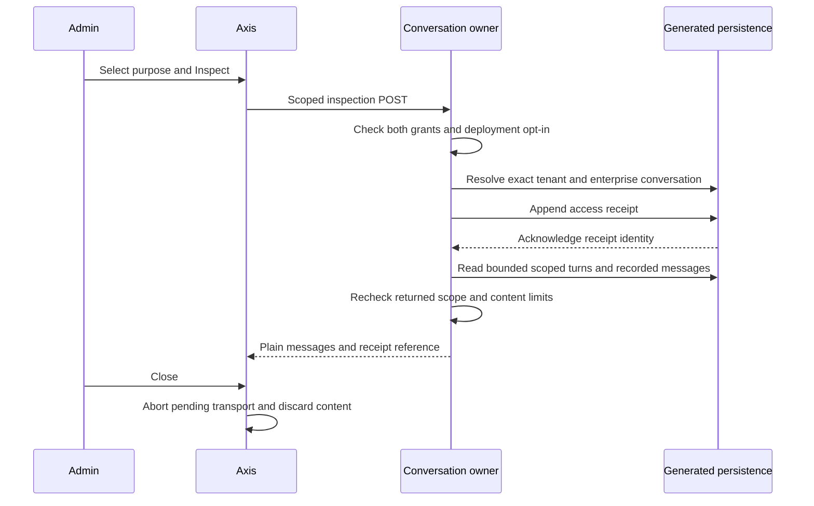

# Audited Transcript Inspection

## Purpose and Boundaries

An authorized enterprise administrator can inspect recorded user and assistant
messages for a support, security or quality review. This is a separate sensitive
read from the metadata-only activity list. It is not export, log-lake search,
business-action replay, retention deletion, or permission to perform the tasks
described in a conversation.

The conversation owner enforces policy and uses private generated persistence.
Core/API only delegate; Axis renders bounded plain text. The model is not called.
No customer identity is impersonated. Neither a prompt nor an admin-looking role
name grants inspection authority.

## Prepare an Isolated Runtime

1. Deploy the conversation owner, Core/API delegates, schema and matching Axis
   client. Compose the private `copilotTranscriptAccess` generated service and its
   unique code index through the normal schema lifecycle. Generic CRUD/event
   exposure stays disabled, with cache disabled for access evidence.
2. Use the existing Profile authorization owner to grant both
   `copilot.activity.read` and `copilot.activity.transcript.read` to the intended
   reviewer in the correct tenant/enterprise. This feature creates no grants.
3. Enable `copilot.conversation.transcriptInspection.enabled` in reviewed layered
   configuration. It defaults to false. Keep conversation storage as
   `GENERATED_SERVICE`; volatile test storage cannot provide durable inspection.
4. Review the configured `purposes` allowlist and presentation copy. Default codes
   are `CUSTOMER_SUPPORT`, `SECURITY_REVIEW`, and `QUALITY_REVIEW`. They are fixed
   reason codes, not free-text fields that could accidentally record secrets.
5. Refresh authorized Axis discovery and select the intended enterprise. Keep
   backend, proxy, APM and browser telemetry from collecting response bodies.
6. Test allowed and denied users before rollout. A fixture screenshot proves
   rendering, not installed grants, durable storage or production privacy policy.

## Administrator Journey

1. Open **AI & Copilot > Copilot Activity**.
2. Find the intended conversation using metadata filters. No title, message or
   transcript content is fetched by this listing.
3. Choose **Inspect recorded conversation**. The action appears only when the
   backend publishes the separately permitted inspection capability.
4. Select an inspection purpose. Opening the dialog or selecting a purpose does
   not fetch transcript content. **Inspect** remains disabled without a purpose.
5. Choose **Inspect**. The server rechecks permission and trusted enterprise,
   resolves the conversation, and writes an access receipt before querying turns
   or messages. Missing or uncertain audit acknowledgement stops the read.
6. Review the access receipt and the recorded employee/Copilot messages. Content
   is plain text, not HTML or executable Markdown. Tool/system messages, tool
   arguments, citations, exports and provider payloads are not part of this view.
7. Unrecorded turns display **Content not recorded**. Earlier recording policies
   cannot recreate missing content. No model generation or task retry occurs.
8. Use page controls for additional 25-turn pages. Every page is a separately
   authorized and audited command. A full page means another page may exist, not
   a known total. The view is a live bounded window, not a frozen export.
9. Close the dialog, change enterprise, or refresh/filter the activity list to
   discard the component-local transcript. It is not stored in local/session
   storage or the shared query/mutation cache. This cannot prevent an authorized
   reader from manually copying or taking screenshots of displayed content.

## API Contract

`POST /v0/activity/:conversationCode/transcript` on the discovered copilotApi
connection requires the independent transcript route permission and the owner's
activity permission. Body: `{ "purpose": "QUALITY_REVIEW", "page": 1 }`.
No tenant, enterprise, employee, storage, URL, query-operator or arbitrary field
override is accepted. Page is an integer from 1 to 1000. A valid authenticated
enterprise is mandatory; unbound legacy conversations are not migrated on read.

The owner queries conversation metadata with trusted tenant/enterprise/code,
then turns with that same scope plus the stored employee. Messages must belong
to one of those authorized recorded turns in that conversation/tenant. Returned
rows are checked again before projection. Foreign or malformed results fail
closed, rather than being delivered as partial history.

Maximum response window: 25 turns, 100 messages and 256 KiB of serialized message
records. An over-limit window fails explicitly. Roles are `user` and `assistant`;
no event replay endpoint is used. HTTP responses should be treated as sensitive
and noncacheable by deployment infrastructure.

## Evidence and Failure Semantics

Access receipts contain an opaque identity, trusted tenant/enterprise, inspecting
principal, conversation code, allowlisted purpose, page and timestamp. They never
contain prompt text or message bodies. `READ_AUTHORIZED` proves permission to
attempt that page read, not successful browser delivery. A later read failure
can leave that receipt in place. Receipt persistence is append-only through this
owner; this is not a claim of database-level WORM/tamper-proof storage.

- Missing grants/opt-in/context return a non-enumerating denial.
- Missing conversation or a foreign conversation returns the same denial.
- Missing/failed/uncertain audit persistence prevents transcript reads.
- Corrupt/foreign/oversized results prevent content delivery.
- Offline inspection fails before sending; reconnect does not replay it.
- Transport failure clears visible content; only a new explicit inspection can
  retry. A failed response can still have created an access receipt.
- Closing aborts transport and drops late responses; the server may already have
  recorded the authorized access attempt.

## Customization and Acceptance

Customize purpose labels and UI copy through the owner presentation contract.
Keep codes stable and inert. Extend the mergeable service only while preserving
the independent grant, current scope, pre-content acknowledged audit and bounds.
Axis extensions use `CopilotTranscriptDialog` and the typed client; never add
transcript data to activity metadata or expose a generic private-schema API.

Backend: `node --test nodics.copilot/modules/copilotConversation/test/copilotTranscript.test.js`.
Axis: `npx vitest run test/assistant/CopilotTranscript.test.tsx test/assistant/CopilotActivity.test.tsx`.
Responsive synthetic fixture: `test/assistant/transcript.visual.html` on the local
Axis development server. Verify desktop and 375px mobile, focus/close controls,
long text, no horizontal overflow, denied inspection, storage failure, recording
off and identity switching in the real authenticated deployment before acceptance.

Physical retention, legal-hold lifecycle, full-text transcript search and log-lake
connectors remain separate requirements. Enabling inspection does not implement
or activate any of them.
