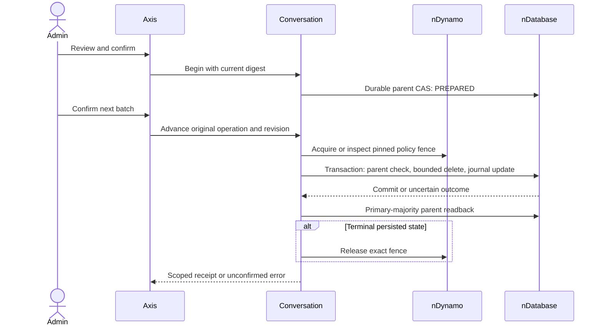

# Bounded Conversation Retention

## Ownership

Conversation owns reviewed retention and the private `retentionOperation` on its
existing parent record. Generated services own persistence, nDatabase owns opaque
transactions, MongoDB owns snapshot/majority/journal mechanics, and nDynamo owns
committed configuration and its private revision fence. Axis is presentation only.
No project/Kickoff implementation, new journal store or background scheduler is added.

Only bound messages, events and turns of one expired CLOSED/ARCHIVED conversation
are eligible. The parent tombstone, operation reason/actor/counts, transcript access
receipts, action audit and provider accounting remain. Their retention is separate.
This is not backup erasure, export cleanup, a legacy migration or a close-session API.

## Deployment Steps

1. Deploy every Conversation writer with the transactional parent guard, including
   remote workers. Verify no legacy writer can bypass it. Local tests do not prove
   full writer coverage, and age is not proof that a worker has stopped.
2. Qualify the actual transaction-capable MongoDB replica set or sharded topology.
   Enable `databaseTransactions.enabled` with `failClosed: true`. All participating
   schemas retain transaction eligibility and disabled cache/events. The adapter
   must advertise `journaledCommit` and commit with majority plus journal.
3. Enable canonical nDynamo persistence and
   `runtimePropertyGovernance.persistence.requireDurableJournal: true`. Internal
   generated CAS uses majority/journal; readback uses primary/majority. Unqualified
   providers, broad updates and transaction mixing are rejected.
4. Enable `runtimePropertyGovernance.readFence.enabled` and explicitly admit
   `readFence.owners.copilotConversation: true`. Verify a committed persisted
   property revision exists before preparing retention.
5. Configure `copilot.conversation.storage: 'GENERATED_SERVICE'`,
   `writerFence.enabled: true` and `lifecycle.maximumBatch` between 1 and 100.
   Only after qualification separately enable `lifecycle.deletionEnabled` through
   normal configuration governance. Both writer/deletion gates ship disabled.
6. Grant the original employee `copilot.activity.read`,
   `copilot.activity.lifecycle.read` and `copilot.activity.lifecycle.execute`.
   These grants do not confer transcript access or any cross-enterprise authority.
7. On disposable data qualify two employees/enterprises, competing writers, hold
   activation, rollback, process termination, primary changes and lost responses.
   No automatic deployment, real deletion or topology qualification is performed
   by the source test suite.

## Administrator Journey

1. Select the enterprise, open Activity, then Retention review and Load review.
2. Review age, hold and state; open Retention operation for the conversation.
   Backend capability admission controls whether the command panel is displayed.
3. Enter a business reason and choose Review deletion. This creates no operation
   or fence. The digest binds actor, parent, timestamp, writer token and policy.
4. Check the confirmation and choose Confirm retention operation. PREPARED evidence
   is durably persisted. No content is deleted and no policy fence is acquired yet.
5. Confirm and choose Delete next batch. The owner acquires/inspects its pinned
   property fence, then removes at most one bounded page and advances the journal
   in one transaction. Empty pages advance through messages, events and turns.
6. Confirm each next batch explicitly. There is no auto-run loop or retry. At
   PURGED the content stages are empty, the parent tombstone remains and the exact
   fence is released after durable readback. Never reuse the conversation identity.

## Recovery and Holds

After a timeout, choose Inspect original operation, not Begin or automatic retry.
An empty inspect body retrieves the original actor's operation for that exact
conversation, including after a lost begin response. It returns the stored revision
and counts. A later explicit advance must use that revision; stale ones fail.

Stop and preserve remaining content records STOPPED transactionally and freezes
the parent as RETENTION_STOPPED. Only after primary-majority terminal readback
does it release the fence. It neither restores deleted content nor reopens writers.
STOPPED cannot advance directly. A fresh review can reauthorize the remaining
deletion without restoring content or reopening writers. If terminal acknowledgement or
release is lost, inspect and explicitly repeat terminal stop/release with the
observed revision. That operation cannot delete another page.

Inspection and stopping work with deletion disabled while durable persistence,
writer fencing and original authority remain qualified. If those prerequisites
are disabled, restore qualified deployment before recovery. Never delete a fence
manually. Legacy/foreign child bindings abort the page; stop and escalate to the
migration owner instead of guessing or silently omitting ownership.

### Close an Active Conversation

1. Select the conversation, enter a business reason and choose **Review conversation closure**.
2. Read the closure notice. Closure stops new content writes; it does not cancel
   provider calls or business operations already running.
3. Confirm the reviewed closure. The exact parent revision/write token must still
   match; concurrent conversation activity invalidates the review.
4. The owner records CLOSED and the closure timestamp atomically. No content is
   deleted, and retention age starts at closure rather than an earlier activity.
5. After an uncertain response, choose **Inspect original closure**, never submit
   Close again. Inspection requires the original actor and current independent
   lifecycle authority. Holds remain effective and closure does not remove them.

Closure remains available with the deletion gate off, but requires qualified
durable persistence and the transactional writer guard. Its private receipt is
not exposed in ordinary conversation records.

### Resume a Stopped Retention Operation

1. Inspect the original retention operation and confirm STOPPED.
2. Finish its exact stop/fence release if that acknowledgement was lost.
3. Enter a fresh business reason and choose **Review remaining deletion**.
4. The owner checks the current committed policy, active holds, original content
   cutoff, original actor, exact revision and absence of the prior fence.
5. Confirm the new review. State becomes RESUMING; no content is removed by this
   command. The operation identity, stage and cumulative deletion counts remain.
6. Explicitly delete the next batch. It acquires a fence for the newly reviewed
   policy and continues from retained progress, without repeating deleted pages.

Lost resumption acknowledgement requires original-operation inspection. A stale
review, new hold, longer unelapsed retention period or missing historical cutoff
rejects. At most twenty resumptions are retained; reaching that bound refuses
another resumption rather than truncating prior audit. Old operation journals
without an original cutoff remain inspectable/stoppable but cannot be resumed.
Partner overrides may change presentation, not these identity, fence or recovery
rules. Run retention execution, API routing and Axis retention tests for changes.

The tenant property fence blocks governed property changes, including new holds,
while deletion is in progress. A proposed hold is not active until activation
succeeds. For an urgent hold, stop retention, verify durable STOPPED and fence
release, then activate the hold. The broad fence may delay unrelated settings;
there is no TTL or implicit takeover that could admit deletion under stale holds.

## Secured API

All are sensitive, no-store, employee access-token POSTs below
`/activity/:conversationCode/retention/`. The route owns conversation identity;
the body cannot override tenant, actor, enterprise, storage options or policy.

| Suffix | Exact body | Effect |
| --- | --- | --- |
| preview | reason | Read-only digest and bounded batch size |
| begin | reason, reviewDigest, confirmed: true | Persist reviewed intent once |
| inspect | empty, or operationCode | Read original actor's evidence |
| advance | operationCode, expectedRevision | One transactional bounded page |
| stop | operationCode, expectedRevision | Freeze terminal state and release exact fence |
| resume-preview | operationCode, expectedRevision, reason | Review remaining stopped work under current policy |
| resume | operationCode, expectedRevision, reason, reviewDigest, confirmed | Record resumption without deleting content |
| close-preview | reason | Review ACTIVE conversation closure |
| close | reason, reviewDigest, confirmed | Close without deleting content or canceling external work |
| close-inspect | empty | Read original actor's recorded closure |

Receipts contain contractVersion 1, tenant/enterprise context, conversationCode,
operationCode, revision, state, per-store counts and terminal completedAt. Private
reason, policy, fence token and content are omitted. Stale/foreign/duplicate evidence,
body extensions, contradictory acknowledgements and unqualified storage fail closed.

## Customization and Verification

Customize `lifecycle.executionPresentation` through layered configuration or wrap
the existing typed Axis panel. Preserve grants, scope, explicit confirmation,
no-replay recovery and late-response disposal. No arbitrary transport destinations,
local authority, browser persistence, audit deletion, TTL or batch above 100.

Run Conversation retention/writer/persistence suites, API route tests, nDynamo
fence tests, generated durable-pipeline and MongoDB transaction tests. Axis has
`CopilotRetention.test.tsx`, lifecycle tests and synthetic `retention.visual.html`.
These do not prove deployed failover, backup erasure, writer coverage or signed-in
persistent-runtime acceptance. Independent audit retention remains outside this
content-purge operation and must not be claimed as completed by it.

## Persistent Local Acceptance

From the framework root, use the prerequisites and opt-in variables in
[persistent local acceptance](../../../copilotCore/llm/examples/persistent-local-acceptance.md)
and run `node --test nodics.copilot/modules/copilotCore/test/copilotRetentionRuntime.live.test.js`.
The fixture creates explicitly aged synthetic records through generated services;
it does not advance the system clock, age shared conversations or bypass holds.

The scenario commits policy through nDynamo, reviews the expired parent, begins
without deletion and advances one record per command in actual MongoDB transactions.
It stops after one page, restarts, activates a hold and requires resumption denial.
After a separately approved hold removal, it reviews/resumes remaining content,
reaches PURGED and checks the retained tombstone after restart. New conversation
closure is tested separately and does not make fresh or held content eligible.

The generated schemas accept the lifecycle's explicit null title and nDynamo's
explicit null released fence. Durable update acknowledgements compare the
adapter-normalized schema values. These are contract corrections, not relaxed
authorization, transaction or acknowledgement rules.

Independent audit selection uses the durable owner's supported bounded first
page, with no requested driver sort. The exact reviewed identities and complete
record fingerprints are rechecked before deletion. This is not an oldest-first
or exhaustive inventory promise; changed selection fails closed and needs a
fresh review. Content retention does not expire those independent records.

The same live test separately reviews and executes one TRANSCRIPT_ACCESS batch
and one terminal ACTION batch. Each removes exactly its eligible synthetic row,
rejects a repeated execute and returns the unchanged original receipt after
restart. Read-only inspection through the generated owners verifies the held
transcript-access row and OUTCOME_UNKNOWN action remain. The content tombstone
also remains, with no messages/events/turns. Conversation holds do not silently
become independent audit policy; each class has its own configured hold rules.
This evidence applies to the disposable local replica set, not primary failover,
backups or a distributed writer deployment.
