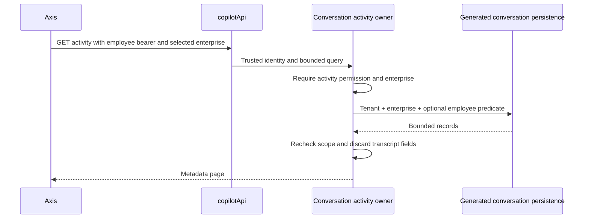

# Enterprise Activity Guide

## Business Purpose

An authorized administrator can inspect conversation activity across employees
in the currently selected enterprise. The view contains conversation identifiers,
employee identifiers, state and last-updated timestamps only. Titles are excluded
because they can contain the employee's first prompt. Messages, provider payloads,
citations, tool arguments and execution audit payloads are not included.

This is an activity inventory, not an immutable security audit log or transcript
viewer. It does not add recording toggles, retention deletion or export rights.

## Administrator Journey

1. Select the intended enterprise through the existing Axis enterprise context.
2. Have the identity/permission owner grant `copilot.activity.read` where appropriate.
   Normal `copilot.assistant.read` is insufficient. This feature does not create
   grants automatically or infer them from an admin-looking role name.
3. Open AI & Copilot > Copilot Activity. The navigation contribution belongs to
   copilotApi and is admitted only when the authorized runtime is available.
4. Inspect the fixed 25-record page. No global totals are inferred from this page.
5. Enter an exact employee identifier, conversation identifier or state and choose
   Apply filter. Optionally set Updated from/to in your browser's local time; Axis
   converts these to explicit UTC instants. Both boundaries are inclusive. Clear
   filters and apply again to restore the authorized enterprise metadata view.
6. Use Previous/Next page or Refresh activity. Next means another page may exist;
   a full final page can be followed by an empty page. The endpoint is a live
   paged view, not a frozen export snapshot.
7. Switching enterprise or signing in as another employee immediately removes
   the old client state and starts a new scoped request.

## API and Security

`GET /v0/activity` on the selected copilotApi connection accepts `page` (1-1000)
and optional scalar `principalCode`, `conversationCode`, `state`, `updatedFrom`
and `updatedTo` (maximum 128 characters each). Dates must be valid UTC ISO instants
with seconds and optional three-digit milliseconds; reversed ranges are rejected.
These are exact metadata filters, not transcript or full-text content search.
It never accepts a
tenant or enterprise override from query parameters. Pages use deterministic
updatedAt/code ordering. Query operators and unbounded page numbers are rejected.

Permission is checked before storage composition/read. Generated persistence is
queried with the trusted tenant and enterprise predicates; every returned record
is checked again against scope and every filter before allowlisted projection,
including volatile local storage. Private schemas still expose no
generic CRUD routes. Reading activity never impersonates the listed employee.

## Failure, Recovery and Extension

- Missing grant or enterprise is denied before reading records.
- Hidden/down/wrong-owner navigation is not a route bypass; Axis sends no request.
- A transport failure clears stale page content and offers a manual GET retry.
- Empty results do not prove an enterprise never had conversations; the view is
  bounded and follows current storage/configuration and permissions.
- Customize business copy in `copilot.conversation.activity.presentation` and
  navigation through the owning capability contribution. Do not move this query,
  permission decision or registry into the frontend.
- Test scope narrowing, foreign persistence results, operator-shaped filters,
  denied reads and identity switching before extending the projection.
- Do not add transcript fields to this endpoint. Optional inspection capability
  metadata opens a separate [audited inspection](audited-transcript-inspection.md)
  command; it does not read content on activity load or dialog opening.

Validation is source/test evidence until a deployed runtime and authorized admin
complete manual acceptance. The visual renderer fixture uses synthetic metadata.
