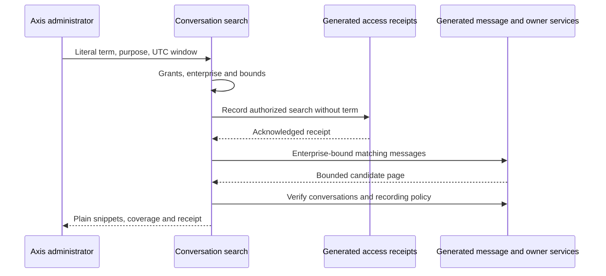

# Recorded Conversation Search

## Purpose And Authority

Business support and quality administrators can locate recorded employee or
Copilot messages within their current enterprise. This is sensitive content
access, separate from activity metadata. It does not grant business-operation
rights, export, deletion, arbitrary database queries or model invocation.
Copilot Conversation owns messages and receipts; Profile owns grants; generated
schema services own persistence. Axis renders plain snippets and holds them only
in component memory. The HTTP command uses POST and no-store, not URL query text.

## Enable And Use

1. Compose the existing Conversation, API and Core modules with generated durable
   storage. Deploy the private message and transcript-access schema changes using
   the normal schema lifecycle; generic CRUD routes remain disabled.
2. Explicitly enable `copilot.conversation.transcriptInspection.enabled` and
   `copilot.conversation.recordedSearch.enabled`. Defaults remain off.
3. Provision `copilot.activity.read`, `copilot.activity.transcript.read` and
   `copilot.activity.content.search` through Profile. Missing any grant denies
   search before persistence. Choose the enterprise using normal Axis context.
4. Open **AI & Copilot > Activity**, then **Search recorded content**. The control
   appears only when the backend advertises search and transcript inspection.
5. Enter exact text, both local date/time endpoints and an inspection purpose.
   The browser sends UTC instants. Matching is case-sensitive literal substring,
   not regex, semantic similarity or stemming. `coupon.*` means those characters.
6. Select **Search**. A durable `RECORDED_SEARCH` receipt is acknowledged before
   querying message content. It stores actor, enterprise, purpose, page and UTC
   window, never the term or excerpts. Its conversation marker is
   `enterprise-search`, not the identity of an individual conversation.
7. Inspect snippets, conversation/employee identities and timestamps. Each page
   has at most 25 hits and its own receipt. A full page means another page may
   exist, not a total count. Use Activity's separate transcript inspection for
   the full recorded conversation, with its own authorization and receipt.
8. Editing filters clears displayed content. Closing, navigation or identity
   changes abort pending delivery. No content is placed in browser storage.

## Coverage And Bounds

New recorded messages carry trusted enterprise and principal bindings copied
from their conversation. Search predicates require those bindings before content
reads; every returned message is then rechecked against its conversation and
turn through generated services with the original employee identity.

Legacy messages without an enterprise binding are deliberately absent. Do not
assign them to the current enterprise or reconstruct missing recordings.
Their existing authorized transcript inspection remains a separate path. A
future migration must prove each original owner before adding bindings.

The default window is at most 31 days; configured windows may narrow or extend
up to 90 days. Terms are 3-128 characters, pages 1-1000 and excerpts at most 320
characters. Response content is bounded at 256 KiB before projection. This is a
bounded generated-storage search, not a new search index; operators must measure
their dataset and provision appropriate owner-approved indexes before enabling
large-scale use. There is no claim of exhaustive historical coverage.

## Failure And Recovery

Unknown audit acknowledgement blocks the content query. Denied, foreign,
duplicate, oversized, nonmatching or recording-off results fail the whole page;
they are not represented as zero matches. No POST is retried automatically.
Offline searches are never queued. A receipt proves authorization to attempt a
read, not delivery, completeness or a successful customer journey.

## Customization And Verification

Later layers can narrow `maximumWindowDays`, raise `minimumTermLength`, change
allowlisted purposes and translate `recordedSearch.presentation`. Preserve
independent grants, literal escaping, trusted scope, durable audit and plaintext
rendering. Never move authorization or persistence into Axis.

Maintainers run `copilotRecordedSearch.test.js`, existing transcript/recording
tests and Axis `CopilotRecordedSearch.test.tsx`. These cover success, regex-like
literals, unauthorized/foreign results, uncertain audit and offline behavior.
Generated-service doubles and browser fixtures do not prove a deployed schema,
production-scale latency, authentication or enterprise isolation in a live DB.
