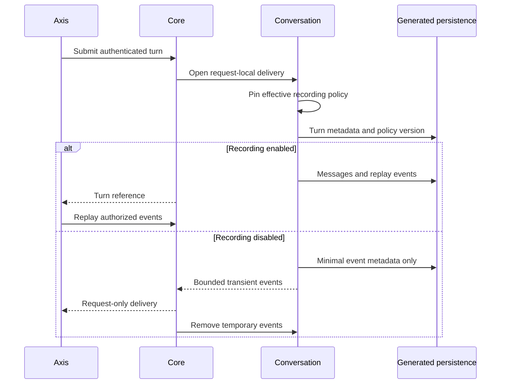

# Conversation Recording Policy

## Ownership and Status

`copilotConversation` owns transcript persistence and per-turn policy snapshots.
Core coordinates delivery; Axis renders notices and events. This switch is
backend configuration, not an administrator policy editor. Audited administrator
transcript access is a [separate opt-in workflow](audited-transcript-inspection.md);
physical retention is not implemented by this switch.
Activity remains metadata-only.

## Configure and Use

1. Use the existing Nodics configuration hierarchy to set
   `copilot.conversation.recording`. Keep generated-service storage configured.
   Do not put framework implementation into a customer module.
2. Set `enabled: true` to record subsequent user and assistant messages, including
   clarification exchanges. This is the default.
3. Set `enabled: false` and increment the policy `version` to stop subsequent
   content recording. Use a stable version such as `enterprise-policy-2`.
4. Open Conversation. The context area shows the effective recording notice.
   Submit a question. The answer arrives in that request and remains in the
   current browser conversation state, but is not written to transcript storage.
5. Reload the conversation. Unrecorded turns show Content not recorded rather
   than an invented empty answer. Previously recorded exchanges remain subject
   to their existing access and retention policy.
6. Re-enable recording with a new version when authorized. This cannot recover
   missing content or retroactively save unrecorded exchanges.

```javascript
copilot: {
    conversation: {
        recording: {
            enabled: false,
            version: 'enterprise-policy-2',
            disabledNotice: 'Content not recorded. Answers cannot be restored after this session.'
        }
    }
}
```

Optional `enabledNotice` customizes the recording-on disclosure. Both notices
are bounded inert text of at most 500 characters. Do not hide history limitations
or suggest that essential approved business records are not saved. Enterprise
admins do not acquire configuration-write rights from this example. Delegate
changes only through an owner-governed authorization/audit API; no such editor
is claimed here.

## Delivery and Persistence



Recording-off suppresses new supplied/generated titles, message writes, and all
persisted content-bearing event payloads, including citations, exports and clarification text.
Minimal events retain turn identity, sequence and time; content events become
metadata-only status events. Accounting remains owned by `copilotProvider`.
Approved action details remain governed business records: this is not anonymous
mode or a promise that no task data is stored anywhere. Usage events retain only
allowlisted nonnegative integer token counts, with unknown counts explicitly
null, even when budget enforcement is disabled. Unrecorded failures retain a
fixed generic failure code, never arbitrary provider error content.

Temporary delivery uses a request-keyed WeakMap, not a global conversation cache.
The channel is removed in a `finally` block on success or failure. It is bounded
to 500 events and 1 MiB of serialized content and exists only during active
submission. Axis rejects foreign turns, unordered sequences, invalid modes and
oversized delivery. No browser-local durable transcript cache is introduced.
Operators must independently prevent HTTP/APM/proxy/body logging from recording
request or response content; this feature does not configure external logging.

When recording is off, provider prompts use the current request rather than
silently relying on unavailable multi-turn history. Retrieved evidence remains
governed by current knowledge policy. Repeating an idempotent completed submit
returns metadata with no transient content; it does not call the model again to
recreate the answer. Lost responses, crashes and closed sessions cannot recover
unrecorded content. Upgrade Axis before enabling recording-off; older clients
do not consume request-only answer delivery.

## Failure and Recovery

- Invalid enablement, version or notice rejects policy resolution.
- Policy is pinned at acceptance, so mid-turn changes do not split an exchange.
- Temporary limits fail without persisting the content.
- Failures store bounded codes, not free-form error content.
- Unavailable history does not trigger mutation retries to reconstruct answers.
- Retention remains unavailable: a duration is not proof of legal-hold-aware
  physical deletion. Disabling recording does not delete prior content.

## Customization and Verification

Customize policy/notices through canonical configuration and presentation through
typed Axis renderers. Never copy transcripts into logs or reintroduce durable
replay bodies when recording is off. Keep required action audit independent.

Run `node --test nodics.copilot/modules/copilotConversation/test/copilotRecording.test.js`
and Core acceptance tests. Axis checks are `assistantRecording.test.ts`,
`useAssistantPresentation.test.tsx` and the timeline suite. Test both modes and a
policy transition in an isolated authenticated runtime before rollout. Offline
generated-service fixtures prove supplied persistence models, not deployed DB
indexes, middleware log policy or authenticated browser acceptance.
