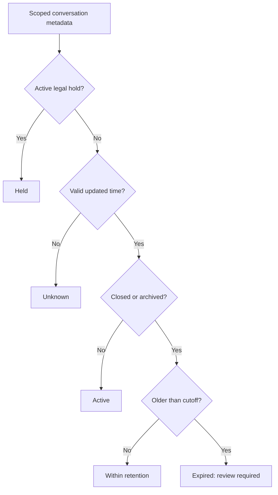

# Retention and Legal Holds

Conversation owns lifecycle interpretation; nConfig owns effective policy and
nDynamo owns proposed changes, approval, activation and history. This release
provides governed controls and a metadata-only review. **That review does not
delete anything.** Separately admitted deployments can use the explicit
[bounded retention workflow](bounded-retention-execution.md). Its deletion gate
is off by default; independent audit/accounting is never purged by that workflow.

## Administrator Journey

1. Select the enterprise and open AI & Copilot Settings. The administrator needs
   configuration read, manage and admin permissions.
2. Select **Retention and legal holds**. Retention days accepts 1-3650 days.
   The default comes from `conversation.retentionDays`; enterprise overrides
   belong to `conversation.lifecycle.enterprisePolicies`.
3. Enable **Preserve all enterprise conversations**, or supply exact conversation
   identifiers to hold. Individual identifiers are checked against the current
   enterprise's canonical records before a proposal can be prepared.
4. Enter the business reason and review the before/after values. Submit the
   revision-bound proposal, then use the existing runtime governance workspace
   for independent approval and activation. Submission alone does not apply a hold.
5. Refresh effective settings and confirm the hold is active. Holds have no
   automatic expiry. Removing a hold requires another reviewed policy change.
6. Open Activity and **Retention review**. Independent metadata-read and
   `copilot.activity.lifecycle.read` permissions are required.
7. Choose **Load review**. Review the oldest-updated 25-record page. Next/Previous
   repeat current scope and policy checks; no transcript is read.

## Review States

| State | Meaning |
| --- | --- |
| HELD | Enterprise-wide or exact conversation hold applies, regardless of age |
| ACTIVE | Conversation is not explicitly CLOSED or ARCHIVED; age alone is insufficient |
| UNKNOWN | Updated timestamp is absent/invalid; no expiry inference is made |
| WITHIN_RETENTION | Closed/archived record is not older than the cutoff |
| EXPIRED_REVIEW_REQUIRED | Closed/archived metadata is older than the cutoff, not authorization to delete |

## Contract and Recovery

`GET /activity/retention?page=1` returns context, cutoff, effective policy,
bounded metadata, and `destructiveExecution: false`. Scope/policy are rechecked
after the asynchronous read. Foreign records, unknown persistence responses,
duplicate identities and malformed policy fail closed.

An unavailable preview is not proof that there are no expired records. Correct
configuration, persistence or grants and load again. Do not manually delete
generated records to simulate this lifecycle. Recording-off settings do not
retroactively purge existing recordings or exempt accounting/security metadata.

## Customization and Remaining Boundary

Customize lifecycle presentation through layered
`conversation.lifecycle.presentation`. Preserve the state meanings and separate
permission. Override policy only through the existing governance process, not
frontend storage or a Copilot-specific policy database.

`deletionEnabled` remains false by default. Enabling it without the transactional
writer guard is rejected. The separate execution API additionally requires
journal-qualified persistence, nDynamo fence admission and explicit employee
authority. It retains a tombstone and operation evidence, never infers legacy
ownership and never treats age alone as worker quiescence. Distributed writer
qualification and backup/export retention remain deployment work. The metadata
preview still reports `destructiveExecution: false` because it is read-only.
PURGING, PURGED and RETENTION_STOPPED distinguish retention from active sessions.

Verify `test/copilotLifecycle.test.js`, administration tests and Axis
`CopilotLifecycle.test.tsx`, including denied/foreign scopes, malformed policies,
held active/old records, null dates, policy changes during reads and no delete UI.
