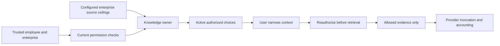

# Conversation Context and Workspace Attention

## Business Journey

1. Open the separate Conversation page under AI & Copilot.
2. When configured groups are enabled, Knowledge context lists only active,
   assigned groups containing sources currently accessible to this employee.
3. Clear groups to narrow the next request. No selection means an explicit empty
   set; it does not restore all groups. Before choosing, the default is all
   currently permitted active groups.
4. Submit the message. Core forwards the selected codes to Knowledge. Knowledge
   rechecks current assignment, active state, enterprise ceilings and source
   permissions before retrieval and again on retrieved records.
5. Expand My access to inspect the current broad knowledge, preparation,
   execution and administrative activity grants. These are grant summaries,
   not promises that every record, field or business operation is accessible.
   Owning APIs still enforce detailed policy for each operation.
6. Return to Workspace to inspect Needs attention. Items may concern exhausted
   capacity, warning thresholds, missing model configuration, stale/unknown
   knowledge, prepared/approved work, running execution or uncertain outcomes.
7. A task item's resume control opens the owned conversation. It does not approve,
   replay or reverse a business operation. Unknown outcomes require the domain's
   reconciliation procedure; the attention panel never retries them.

## API and Ownership

`GET /context` requires authenticated `copilot.assistant.read`, current tenant
and enterprise. Core obtains groups from the existing Knowledge owner and grants
from Policy. It returns no source paths, hidden groups, raw policy or provider
configuration. Axis cannot submit assignments or permissions through this API.

The optional `knowledgeGroupCodes` array on turn submission is narrowing input.
Omission uses the backend's current default; `[]` selects none. Invalid or stale
choices are rejected, not replaced with a wider default. When group governance
is enabled, old conversation text is not included in future model prompts;
historical screen content is not automatically redacted by this mechanism.

Workspace attention is a bounded projection, not a workflow engine or a global
queue count. It reads at most 13 current actor/enterprise action records and
displays at most 12. Proposal payloads and other employees' actions are excluded.
Missing action persistence is shown as unavailable, never an empty queue. Source
freshness retains the existing process-local evidence boundary; configuration
status is not a live provider-health result.

## Failure and Customization

- A permission or group change is authoritative on the next backend request.
  New choices may require refreshing the page; a stale selected code fails closed.
- Enterprise, employee, endpoint or token changes remount conversation state and
  discard the previous group selection. Selection is not saved in local storage.
- If the context projection cannot load, the optional selector is absent and
  requests still use the server's currently authorized default. This does not
  bypass backend group enforcement or grant hidden sources.
- Configuration and labels belong to their Core/Knowledge owners. Customize
  `copilot.core.conversationContext` and Workspace attention presentation keys
  through the normal later-layer configuration mechanism.
- Axis renderer customization must preserve inert typed choices, empty-selection
  semantics and scope remounting. Never derive permission from displayed labels.

The current access summary is not the complete record/field/purpose denial
explanation originally requested. Saved context preferences, recording controls,
admin transcripts and retention execution also remain separate work.

## Verification

Core tests prove denied context reads do not reach group lookup, inactive/source
metadata is omitted, attention queries are scoped before persistence and foreign
records are discarded. Axis tests cover group narrowing, duplicate/malformed
choices, backend-owned usage figures and bounded permission-specific views.
Manual authenticated acceptance must additionally verify the deployed navigation,
current enterprise switching and an actual model request under selected groups.
