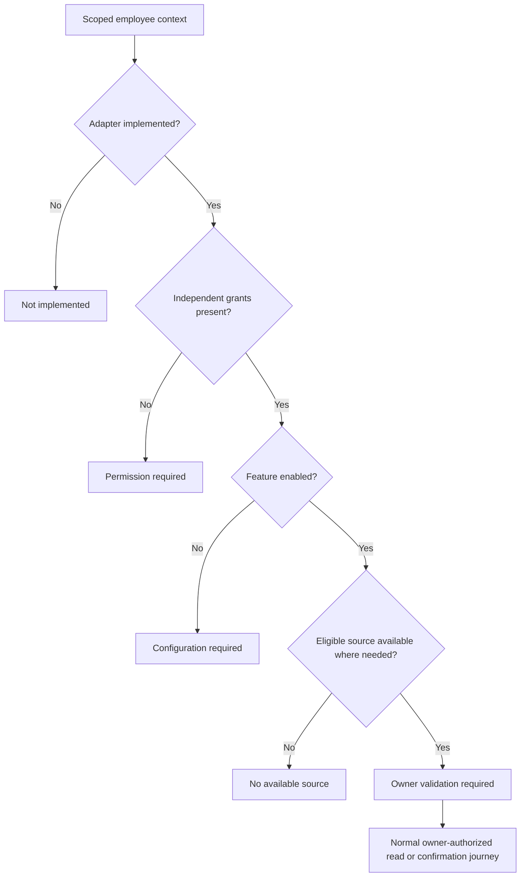

# Operation Access And Remediation

## Business User Journey

1. Open a Copilot conversation in the intended enterprise.
2. Expand **Operation access** below the knowledge-group selector. Expand the
   relevant business operation for its reason and next step.
3. If a permission is missing, ask the administrator responsible for that
   enterprise to review the listed grant and business role. Neither this view
   nor the assistant grants access. Profile remains the authority for identity,
   enterprise membership and role assignment.
4. If configuration is required, ask the feature owner to review its effective
   configuration and approved enablement. A granted permission cannot enable a
   disabled adapter, recording inspector or source connector.
5. If no source is available, ask the knowledge administrator to review group
   assignment, activation, source scope and exclusions. Hidden source names,
   counts, connection details and other enterprises are not revealed.
6. If owner validation is required, continue through the normal read or reviewed
   action journey. This status is not approval: records, fields, operations,
   selected knowledge groups, budget and domain rules still apply at execution.
7. If an adapter is not implemented, use the authorized owning application.
   Adding grants or asking the model to ignore a restriction cannot implement it.

The panel is an initial prerequisite snapshot. It does not query domains, inspect
private records, reserve tokens, invoke a provider or expose executable actions.
Reload conversation context after role or configuration changes. Every actual
operation independently rechecks current authorization; stale presentation cannot
authorize a command.

## Supported Explanations

| Journey | Independent boundary | Correct remediation owner |
| --- | --- | --- |
| Internal knowledge | Internal-read grant, enabled retrieval, visible static source | Knowledge administrator; group assignment and index readiness |
| Business data | Live-read grant, eligible active source, collection selection, domain record/field/search rights | Data owner; do not widen field policy in Axis |
| Incident logs | Log-read grant, enabled connector, eligible source, scoped time/runtime/service/category | Observability owner; coverage gaps remain explicit |
| Prepare changes | Preparation grant and complete business input | Business/domain owner; preparation does not persist business data |
| Execute changes | Independent execution grant, reviewed current actor-bound plan and owner checks | Domain owner; inspect unknown outcomes before another attempt |
| Enterprise and employees | Copilot grants plus Profile enterprise-create and access-assignment rights | Profile; explicit roles, pending invitations, separate registration |
| Recorded transcript | Activity and sensitive transcript grants, inspection opt-in and purpose receipt | Authorized activity administrator; recording-off content cannot be recovered |
| Recorded search | All transcript grants plus independent content-search grant and opt-in | Activity owner; bounded literal search and pre-content audit |
| Retention review | Activity and lifecycle-read grants, scope and effective hold policy | Lifecycle administrator; metadata review only, purge remains unavailable |
| Coupon redemption | Copilot adapter not implemented | Commerce merchant redemption journey; never a generic status edit |
| Collection centres | Copilot adapter not implemented | Waste collection-point workspace with Location/Profile references |

## Decision Order

Missing-grant explanations take precedence over enablement/source diagnostics.
The code does not expose a hidden source as an explanation for denied access.
`OWNER_CHECK_REQUIRED` intentionally never becomes `READY` or `AUTHORIZED`.
Unavailable adapters are visibly distinct from denied but implemented operations.
These diagnostics are not the capability/tool catalogue and must never supply
model tools, routes, permission decisions or dispatch handlers.

## Administration And Customization

Enterprise administrators review membership and grants through Profile, source
assignment through Knowledge governance, and feature enablement through effective
configuration governance. Superadmin ceilings still limit enterprise delegation.
No inline permission-edit or self-approval command is provided in this panel.

Later layers may customize
`copilot.core.conversationContext.journeys.{title,notice,labels,states,reasons,steps}`.
Preserve keys, inert text bounds and the distinction between prerequisite and
authority. To support a new journey, its capability owner first supplies and
tests the actual adapter and authorization contract. Core may then add a bounded
diagnostic for that existing journey. Do not implement business commands inside
the explanation service or register another tool catalogue.

Axis customization belongs in a project-owned renderer using the typed
`parseCopilotAccessJourneys` result. Preserve strict allowed states, duplicate and
size checks, text rendering, no executable returned URLs and responsive wrapping.
Malformed diagnostics fail closed instead of rendering an invented access state.

## Verification And Evidence Limits

Backend: `test/copilotAccessExplanation.test.js` proves employee admission,
independent grants, source privacy, state distinction and no domain/provider
dependencies. Axis: `test/assistant/CopilotAccessJourneys.test.tsx` proves inert
expansion and rejection of fabricated authorization states and execution payloads.
Context and action/security regressions remain required. Browser fixtures prove
layout only. Live acceptance must use a signed-in employee with controlled grant,
enterprise, source-selection and owner-policy variations; never change production
roles merely to manufacture a passing demonstration.
