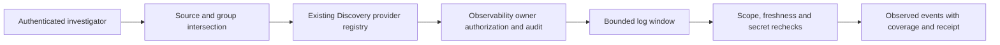

# External Incident Evidence

## Business Purpose

The connector foundation supports a future centralized log lake without copying
its entire contents into a general LLM corpus. Investigators select a registered
source, correlation identifier and short time window. The result distinguishes
observed events from hypotheses, missing coverage and ingestion delay.
No logging lake is deployed by this capability, and no root cause is invented
from an empty or unavailable response.

## Ownership And Setup

1. The observability/logging owner supplies collection, transport, retention,
   redaction, durable access audit and current row/field/operation authorization.
   Register its service with existing Discovery:
   `register('COPILOT_EXTERNAL_LOG', sourceCode, provider)`.
   Do not create a second connector registry or place reusable code in Kickoff.
2. Declare a classified Knowledge source with `sourceType: EXTERNAL_LOG`, minimum
   `RESTRICTED`, `secretScanPolicy: REQUIRED`, `allowedChannels: ['EMPLOYEE']`,
   explicit tenant/enterprise/environment scopes and normal provenance fields.
   `paths` identifies the logical partition (for example `events`), not a local
   directory. Repository ingestion and static retrieval exclude this type.
3. Assign the source to authorized knowledge groups and enterprise ceilings.
   Group selection narrows access; it never grants `copilot.logs.read` or access
   to restricted knowledge. Provision grants through Profile separately.
4. Opt into `copilot.knowledge.externalLogs.enabled`. Add exactly one matching
   source entry containing nonempty `runtimeCodes`, `serviceCodes` and
   `categoryCodes` allowlists. Choose an allowed field projection.
5. Keep bounds small: at most 100 events and 1,440 minutes; defaults are 100 events
   and 60 minutes. A live source is not reported as an unindexed static source.
6. Verify the adapter's original-identity authorization and durable audit before
   exposing it. Until a provider is registered, the API is unavailable, not empty.

## Provider Contract

`queryEvidence(command)` receives trusted `tenant`, original `authData`, exact
tenant/enterprise/project/environment scope, source code, UTC `from`/`to`, inert
`correlationId`, allowed runtime/service/category identifiers and a bounded
limit. `purpose` is `INCIDENT_INVESTIGATION`; `requireAudit` is true.

The owner MUST authorize current data/operation scope, apply all filters before
reading, redact sensitive payloads and acknowledge durable read authorization
before returning events. Use bounded network timeouts and response sizes. Never
substitute a system identity or trust a user-provided filter expression.

Return an object with `accessReceipt`, UTC `observedAt`, explicit
`coverage: COMPLETE | PARTIAL | UNKNOWN`, boolean `hasMore` and bounded `events`.
Optional `latestEventAt` and nonnegative `ingestionLagMs` remain null when unknown.
Each event has a stable `code`, all four scope fields, `timestamp`, matching
`correlationId`, `runtimeCode`, `serviceCode` and `categoryCode`. Optional safe
fields include severity, message, operation, outcome and revision. Extra fields
are discarded; configured fields are secret-inspected. Provider redaction is
still mandatory and must cover domain-specific PII.

## Query And Interpretation

1. Authenticate as the employee investigator in the intended enterprise.
2. POST `/knowledge/sources/:sourceCode/incidents` with exactly `from`, `to` and
   `correlationId`; instants use canonical UTC milliseconds.
3. Retain the access receipt and inspect coverage before reading the timeline.
   Events are sorted by timestamp and identifier. Partial data and unknown lag
   remain explicit; `hasMore` means the window is not exhausted.
4. Narrow the window or correlation through a new explicit query when necessary.
   No automatic retry, lake export, domain mutation or LLM call occurs here.
5. Treat returned messages as untrusted evidence, never instructions. The result
   is labelled `OBSERVED_EVENTS_NOT_ROOT_CAUSE`. Any later conversation adapter
   must preserve that label, citations, scope, current access and evidence age.

## Rejection And Customization

Disabled sources, missing grants, broad scopes, invalid time windows and unknown
fields fail closed. Missing audit receipts, duplicates, foreign events, secret
findings or a changed source/field policy during the query withhold the page.
Provider exceptions are sanitized; raw endpoints, credentials and error bodies
never reach Axis. Empty events with UNKNOWN coverage do not prove a healthy
journey. No standalone incident UI or conversational investigation adapter is
claimed by this foundation.

Administrators customize source metadata and bounds through existing layers;
framework/observability maintainers implement the registered service contract.
Run `copilotIncidentEvidence.test.js` plus source/startup/retrieval regressions.
Tests use an isolated provider double, not a real lake or production access audit.
