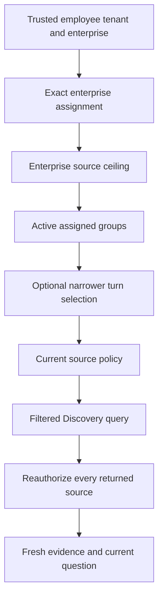

# Configured Knowledge Groups

## Scope

The runtime can group registered sources and restrict each tenant/enterprise to
explicit groups and a source ceiling. Axis Knowledge Studio displays these
groups and filters its authorized source inventory. This is configured runtime
selection, not a group authoring database or publication workflow. Group editors,
user-persisted activation choices, revision comparison and nPublish activation
remain separate work. No database collection or log lake is ingested by this feature.

## Operator Setup

1. Register the sources through the existing classified source registry. Each
   source still needs provenance, version, channel restrictions, required grants,
   secret inspection and explicit enablement. Group membership supplies none of
   these permissions.
2. Define `copilot.knowledge.groups` in the appropriate trusted configuration
   owner. Defaults keep it disabled. Use nConfig's documented replacement/keyed
   update contract for arrays; never rely on a shorter list removing inherited
   entries automatically.
3. Give every group a unique code, display name, boolean `active` and registered
   `sourceCodes`. Maximum: 100 groups, 1000 codes per list.
4. Assign groups using exact `tenantCode` plus `enterpriseCode`. Every assignment
   also supplies `allowedSourceCodes`, the maximum source set that enterprise may
   use. There is no wildcard assignment. At most 1000 assignments are accepted.
5. Enable group governance after reviewing all assignments. An enterprise without
   an assignment receives no sources, not the legacy unrestricted selection.
6. Open Knowledge Studio. The group filter shows only assigned groups containing
   at least one currently authorized source. Inactive groups are not selectable.
   Filtering this screen does not change conversation or server configuration.
7. Test a permitted source, excluded source, another enterprise and revoked source
   permission before using the deployment. Check that forbidden requests do not
   call Discovery or source preview providers.

Example effective configuration, using already registered source identifiers:

```javascript
groups: {
    enabled: true,
    definitions: [
        { code: 'framework-guides', name: 'Framework guides', active: true,
          sourceCodes: ['nodics-framework-readmes'] },
        { code: 'engineering', name: 'Engineering', active: false,
          sourceCodes: ['nodics-framework-contracts'] }
    ],
    assignments: [
        { tenantCode: 'example-tenant', enterpriseCode: 'example-enterprise',
          groupCodes: ['framework-guides'],
          allowedSourceCodes: ['nodics-framework-readmes'] }
    ]
}
```

These are fictional deployment identifiers, not a preconfigured customer.
The default framework source definitions remain disabled and UNRESOLVED until
their owning deployment supplies reviewed versions.

## Conversation Selection

The secured turn API accepts optional `knowledgeGroupCodes`. Omission uses all
active assigned groups. An explicit empty array selects none. A nonempty list may
only narrow to active, assigned, visible groups. Unknown, unassigned and inactive
codes return the same unavailable-context response. Sending a selection while
group governance is disabled is rejected; it is never silently ignored.

Selections apply to that turn only. They do not change permission, group
configuration, source enablement or the authority to execute business operations.
No selection persistence or conversation selector UI is claimed by this slice.



When groups are enabled, previous conversation messages are not resent to the
provider. This conservative boundary prevents an old answer from restoring
knowledge excluded by current group selection or permissions. History remains
visible through its existing owner-scoped conversation API; source-aware history
redaction and a reauthorized multi-turn memory projection are not implemented.

## Failure and Customization

- Missing assignment or empty allowed sources means no knowledge and no search.
- Invalid references, duplicates, nonboolean flags and missing service composition
  fail closed. Correct the owning configuration; do not disable authorization to
  make the UI load.
- Source refresh/preview must pass both group selection and source permission
  before delegated ingestion. Trusted startup ingestion remains a separate System
  path; indexed content does not itself become visible to any enterprise.
- Customize group labels and Studio copy through their owning configuration.
  Keep retrieval, policy and Discovery in their existing modules, not Axis or
  customer kickoff code.
- Tests: `test/copilotKnowledgeGroups.test.js`, Studio view tests in Axis and the
  Core acceptance case that excludes prior history from the provider prompt.

This feature supplies a configured source-level ceiling, not a field/record-level
business-data policy or a superadmin management screen. Owning domain APIs remain
responsible for business information and operations.
