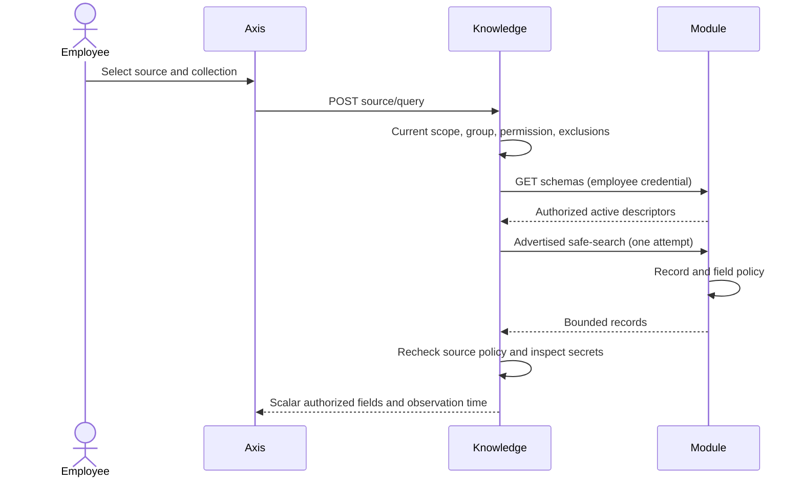

# Live Database Sources

Owner: `copilotKnowledge`. Database schema discovery, search syntax, record
visibility and field permissions remain with nDatabase and the functional module.
Copilot does not copy operational collections into a vector index.

## Setup

1. Register a classified source with `sourceType: DATABASE`, an existing canonical
   functional `module`, repository/project provenance and a stable version.
2. Limit `channels` to `EMPLOYEE`. Set explicit tenant, enterprise and environment
   scopes. Missing scope is invalid, not a wildcard.
3. Set `paths: ['*']` to include all currently eligible collections. Put collection
   identifiers such as `user` or `policy` in `excludedPaths` to exclude them.
   Alternatively list only selected identifiers in `paths`. Exclusions win.
4. Assign the source to the enterprise's permitted knowledge group and activate
   that group. Group and source permissions must both allow the employee.
5. Grant the independent `copilot.data.query` capability only to suitable roles.
   The employee still needs the owning domain's search and record permissions.
6. Deploy the owner's canonical `/schemas` and advertised safe-search APIs.
   The original employee bearer credential is forwarded. No system credential
   fallback is supported, including when the source is in the same runtime.

Schema discovery lists only active, authorized, search-capable collections. A
wildcard does not include private or disabled schema capabilities. The source's
module must match the canonical module identity returned by discovery.
Every returned descriptor must also have that module identity. Discovery hides
inactive or noncanonical search declarations; query refuses them before record
transport. The supported read is POST `/<lowercase-schema-name>/safe-search` at
the advertised API version. Metadata cannot redirect a read to a create/delete
command, another collection, a query-bearing path or another origin. Native
error envelopes do not become success merely by also containing a success code.

## Business User Journey

1. Open AI & Copilot, then Knowledge Studio and the authorized database source.
2. Choose **Load collections**. This loads metadata, not records.
3. Select an included collection. Excluded collections cannot be selected.
4. Enter a search term and choose **Search**. This is one explicit live read.
5. Inspect the plain-text results and observation time. Move through bounded pages
   with Previous/Next. Each page repeats current authorization and schema discovery.
6. Changing collection/search text clears the earlier records. Leaving the source,
   changing identity or refreshing inventory discards results and aborts requests.

The source selection editor is in governed Copilot Settings. Changes require
preview, request submission and the existing runtime approval/activation process.
The browser does not save collection policy directly.

## Call Sequence

## Contract and Limits

- `GET /knowledge/sources/:sourceCode/collections` returns policy-bound collection
  choices; no raw schema internals or record counts.
- `POST /knowledge/sources/:sourceCode/query` accepts only `schemaName`, `search`
  and `page`. Search is a non-empty string up to 100 characters, page is 1-1000.
- The owner supplies allowed page sizes. Copilot uses the largest size no more
  than 25. No supported size means unavailable, not an invented fallback.
- Owner response records are bounded to 256 KiB. Only descriptor-declared,
  non-sensitive, non-hidden scalar fields can leave this service.
- Errors do not disclose vendor details. Scope revocation or a policy fingerprint
  change while a request is pending denies delivery of the result.
- Results are not persisted by Axis, ingested as knowledge, or sent to an LLM by
  this inspector. The [conversation adapter](live-evidence-conversation.md) reuses
  this owner and excludes live exchanges from subsequent provider context.
  Conversation recording remains independently governed.

## Recovery and Customization

For unavailable data, verify the source scopes/group assignment, employee grant,
canonical module route, schema operation activation and owner transport health.
Retry explicitly after correction; there is no automatic query retry. Policy
changes require refreshing inventory before another read.

Override `knowledge.studio.presentation` for labels. Use existing schema metadata
to control domain labels and searchable fields. Extend the owner safe-search
contract for richer records rather than adding raw Mongo queries, arbitrary API
URLs, operator objects or nested unfiltered data to Copilot/Axis.
Later modules may narrow the mergeable `searchOperation` member (for example,
return `null` for a collection disallowed by local policy). Do not relax its
read-only route, current owner, source or employee authorization invariants.
The customization regression proves that this override governs both inventory
and query and cannot accidentally fall back to the default implementation.

Verify `test/copilotDatabaseSource.test.js` and Axis
`test/assistant/CopilotCollections.test.tsx`: inclusion/exclusion, denied scopes,
source revocation, original credential forwarding, inactive/unsafe operations,
plain text, offline behavior and response binding. Local tests use isolated
services. `test/copilotDatabaseRuntime.live.test.js` separately exercises actual
Profile authentication, runtime registration, native schema read access, explicit
collection exclusion, same-employee native result comparison and restart in a
disposable local composition. See the
[persistent acceptance setup](../../../copilotCore/llm/examples/persistent-local-acceptance.md).
The Copilot-only actor cannot discover or query the enterprise schema. This does
not certify other domains' record policies or enable database indexing.
