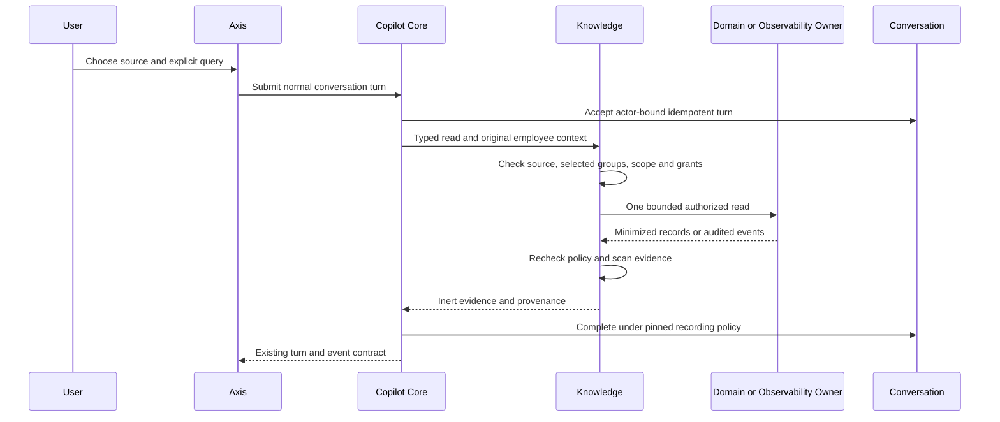

# Live Evidence In Conversation

## Purpose And Boundaries

Employees can inspect current business records or a bounded customer-journey
timeline from Axis Conversation. The form constructs one explicit read command.
It does not ask a model to invent queries, mutate data or prove a root cause.
Results never enter a vector index or a model prompt. Source/group policy and
owning APIs remain authoritative. Appearing in the form is not an execution grant.

This is a deterministic conversational adapter, not general natural-language
planning, automatic follow-up queries or cross-turn execution planning. Incident
reads require the separately deployed observability lake and its registered,
redacting, audited Discovery provider.

## Administrator Setup

1. Enable the existing conversation API and generated persistence. Apply current
   Conversation schemas, including `copilotMessage.providerContextEligible`.
2. Configure sources using the [database guide](live-database-sources.md) or
   [incident guide](external-incident-evidence.md). Require explicit tenant,
   enterprise and environment scopes; both live source types remain RESTRICTED.
3. Assign and activate groups within enterprise ceilings. Grant assistant read/use,
   required source/classification permissions and independently `copilot.data.query`
   or `copilot.logs.read`. Keep the domain's record, field and operation grants.
4. Configure recording before onboarding users. Recorded live results become
   point-in-time transcript content with independent inspection/search permissions
   and retention holds. Recording-off content cannot be replayed after loss.
5. Refresh the conversation page. `/context` supplies permitted sources and labels.
   Identity, enterprise or endpoint changes discard the form and source selection.

These deterministic reads require no model connection or token allocation and
consume no model tokens. They still require current owner authorization.

## Business User Steps

1. Open **Copilot Conversation** under AI & Copilot.
2. Select active knowledge groups. An empty selection permits no sources when
   group selection is enabled.
3. Select **Read live evidence**, then an authorized source.
4. For business data, choose a currently selected collection, enter a search and
   page, and select **Read in conversation**. Source selection fetches metadata;
   only submission fetches records. No silent pagination or exports are performed.
   To inspect available collections without supplying a record search, select
   **List collections** instead. Copilot performs fresh native metadata discovery
   and displays only selected eligible collections. Zero selected collections is
   a valid empty result, never permission to fall back to every collection.
5. For incidents, supply an exact correlation ID and review the visible time
   interval, initially the last fifteen minutes. Edit it as needed. Axis converts
   browser-local times to canonical UTC. The owner enforces its configured maximum
interval, event cap and runtime/service/category restrictions.
6. Inspect observation time, source provenance, coverage and lag. A small page is
   not a global count; a partial timeline does not prove the absence of more events
   or establish a root cause. Open the form again for another explicit read.

Results render as inert JSON code text. Display size is bounded for the default
event transport; `omittedForDisplay` explicitly counts rows omitted from the
owner's response. This is not a complete export or incident reconstruction.

## Request And Authority Flow



Direct clients can use the existing turn endpoint with these fictional examples:

```json
{"intent":"copilot.data.collections","sourceCode":"business-data","input":{}}
```

Collection discovery accepts exactly an empty `input` object. It does not accept
schema names, search predicates, URLs or an include-excluded switch. Its observation
time and source policy digest describe the metadata read, not a record count or a
guarantee that a subsequent read will be admitted. Large catalogues use the same
display cap and explicit omitted-row count as other live evidence. It uses
`copilot.data.query` and the existing source/classification/domain discovery grants;
no new permission or activation authority is introduced.

```json
{"intent":"copilot.data.query","sourceCode":"business-data","input":{"schemaName":"employee","search":"Alice","page":1}}
```

```json
{"intent":"copilot.logs.query","sourceCode":"journey-events","input":{"correlationId":"journey-1","from":"2026-10-03T09:00:00.000Z","to":"2026-10-03T10:00:00.000Z"}}
```

Source identifiers are not URLs. Commands cannot override tenant, enterprise,
permissions, connection, operation path, query expressions or fields.

## Recording, Recovery And Migration

- Recording on: owned history retains the explicit query and answer. Replaying an
  accepted turn reads events without querying the data owner again.
- Recording off: output is request-only, with no durable content. Lost output is
  not reconstructable and is never automatically re-queried.
- Later model turns exclude both sides of a live-read exchange. Only explicitly
  eligible messages can enter provider history. Legacy absent markers fail closed;
  there is no backfill of old messages into model context.
- An old persistence schema loses history eligibility, not the confidentiality
  boundary. Deploy regenerated schemas before enabling this UI.
- Missing grants, empty groups, stale sources or exclusion changes fail without
  evidence delivery or model fallback. Refresh context and resolve permissions
  with the appropriate administrator; form selections cannot grant access.
- Unavailable providers do not become invented empty timelines. Inspect the
  observability owner's audit receipt and health before a new explicit read.
- Closing or changing the source aborts obsolete metadata. Offline submission
  does not queue. A later explicit read is a new query, not write recovery.

## Customize And Verify

Presentation belongs to `copilot.core.conversationContext.liveReads`. A project
frontend may wrap `CopilotLiveReadComposer` but must preserve typed source choices,
input limits, UTC conversion, original context and explicit submission. Extend
the domain/observability API for new semantics, never add raw Mongo/SQL, credentials
or model-selected authority to Axis or the conversational adapter.
The optional `inspectCollections` label advertises the List collections command
to Axis. Deploy the backend adapter before that label; old contracts without the
label retain record-search behavior and do not offer catalogue submission. A
project can customize the label or wrap the composer, but must preserve the fixed
intent, empty input, original identity, explicit submission and source selection.

Optional `inspectSchema` and `inspectCapabilities` labels expose **View fields**
and **View capabilities** after selecting a collection. Neither needs record
search input. They submit `copilot.data.schema` or `copilot.data.capabilities`
with exactly `{ "schemaName": "employee" }` as input. These call `/schemas/:schema`
or the exact active native capabilities GET respectively. They return only
visible field names/labels/types/required/read-only/primary flags and advertised
operations; no defaults, values, relationships or native transport metadata.

The technical command `copilot.data.deleteImpact` takes `schemaName` and an
explicit `identity` containing the native primary field and required revision.
It requires independent `copilot.mutation.prepare` as well as source/read grants
and native delete advertisement. It calls only the native POST delete-impact
preview, returning `targetCount` and `blocked`, without relationship names/counts.
Zero matching targets can mean a stale identity/revision; it never means deletion
is safe or complete. It is a typed command, not a new deletion form or mutation
adapter. See the detailed [collection inspection guide](../../data/docs-v001/records/documentation/copilotKnowledgeDocumentationComponentData.js)
for exact steps, failure/recovery, supported customization and evidence limits.

Run `copilotLiveConversation.test.js`, database/incident/group and recording tests,
plus Axis `CopilotLiveReadComposer.test.tsx` and context tests. Cover missing grants,
malformed authority overrides, empty selections, revocation, offline state, late
responses, injection-shaped text, oversized output, recording off, replay and
legacy history exclusion. `live-read.visual.html` is synthetic desktop/mobile
evidence, not signed-in domain or lake acceptance.
