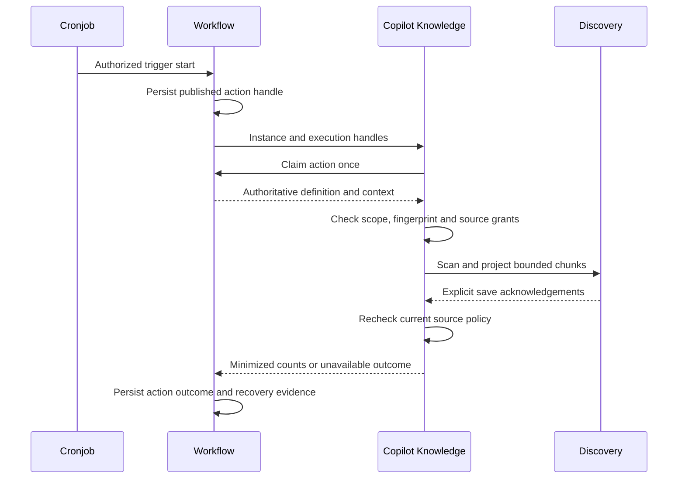

# Process-Backed Knowledge Refresh

## Authority And Limits

Workflow owns published definitions, single-use action claims, instance history
and recovery. Cronjob owns schedules and operational admission. Knowledge owns
source authorization, preparation and Discovery projection. No scheduler, timer,
job database or callback-controlled source registry is added to Copilot.

This adapter executes one bounded synchronous refresh. Process records its action
outcome. The optional [generation publication mode](generation-publication.md)
adds durable current-index evidence and exact obsolete-generation cleanup, not
durable job progress. Legacy Studio reports remain process-local. The opt-in
[source-event bridge and incremental mode](source-events-and-incremental-refresh.md)
reuse this lifecycle. External subscriptions and a Studio schedule editor are
not provisioned by the implementation. Installing source code does not activate jobs.

## Domain Setup

1. Deploy compatible Copilot API/Knowledge and Workflow versions. Configure their
   existing nService peer connections and scoped runtime credentials. Do not reuse
   employee credentials or create an unrestricted service identity for schedules.
2. Configure `copilot.knowledge.workflowRefresh.actionAuthority.connectionName`
   to the actual Process peer alias, `runtimeRole` to its actual deployment role
   and `timeoutMs` from 1 through 30,000. The alias `default` is rejected. Keep
   `workflowRefresh.enabled` false until setup is reviewed.
3. Register the source normally. Automation requires explicit `SYSTEM` in
   `allowedChannels` alongside employee access where appropriate. The verified
   workflow runtime must actually hold `copilot.knowledge.source.manage` and
   every source-required permission. No grant is synthesized by the callback.
   Treat this access expansion as a separately approved security change.
4. Include the source in the enterprise's allowed and active groups. Removed
   ceilings, inactive groups and missing permissions deny an otherwise valid
   Process action. DATABASE and EXTERNAL_LOG cannot use static refresh.
5. Preview as an authorized administrator and record the current
   `sourcePolicyDigest`. Inclusion/exclusion and runtime-order changes invalidate it.

## Workflow And Schedule Setup

1. Install Workflow's private `processActionAttemptRecord` schema using the normal
   framework schema lifecycle. Select the module-owned declaration in the existing
   `process.actionAdapters.definitions` and `allowedActions` registry. The key is
   `copilotApi.refreshKnowledge`; declare `moduleName: copilotApi` and
   `operation: refreshKnowledge`. Its `remote` object contains the deployment's
   target key, `moduleName: copilotApi`, its actual `runtimeRole`, and
   `apiName: /workflow/actions/refreshKnowledge`, with `recordAttempts: true`.
   The owner provides an inert default declaration; explicitly override its
   `COPILOT` role and `copilotKnowledge` target if deployment topology differs.
   Installing the declaration does not add it to `allowedActions`.
2. Configure that target in `process.remoteActions.targets` using the existing
   connection/timeout contract. Preserve other deliberate selections; do not
   enable a broad action allowlist just to install this adapter.
3. Through existing nImport release preflight/install, explicitly select
   `copilotApi:knowledgeRefreshWorkflow` on the PROCESS destination. Its immutable
   release 1.1.0 contributes `copilotKnowledgeRefresh`: START, one refresh ACTION,
   END, with one attempt and a service-start context allowlist. Release 1.0.0 bytes
   remain unchanged. Existing ownership and same-version checksum conflicts
   fail closed. This installs a definition, not grants, assignments or a schedule.
   A custom definition may instead use the same ACTION. Its domain input contains
   exactly `sourceCode` and `expectedPolicyDigest`.
   No tenant, permission, filesystem path or executable code belongs in context.
   Start with one attempt: investigate uncertain projection before recovery.
4. Add one entry in `knowledge.workflowRefresh.assignments` with exact
   `tenantCode`, `enterpriseCode`, `projectCode`, `environmentCode`,
   `definitionCode`, positive integer `version` and `sourceCode`. Duplicate
   matches fail. This grants source execution separately from Process-start
   permission. Review/activate through existing configuration governance, then
   enable `workflowRefresh`.
5. Create the Process trigger relationship and Cronjob-owned schedule through
   their existing authorized APIs/Axis controls. Cronjob must pass current
   registration and runtime-credential admission before starting new instances.
   Cron's bounded `source: cronjob`, `cronJobTenant`, `scheduledExpression` and
   `firedAt`, plus Process's `triggerCode`, `cronJobCode` and `correlationId`, are
   accepted as inert provenance. A foreign tenant, other source label, unknown
   key, invalid timestamp or oversized value fails before ingestion. These
   values never replace source, runtime or employee authorization.
6. Run one controlled test instance before recurrence. Inspect the published
   version, source fingerprint, scoped Process action history and indexing
   evidence. Keep partitions within the configured synchronous action timeout.
7. Enable recurrence only after acceptance. Large asynchronous ingestion and
   per-source durable progress remain separate implementation work.

## Callback Contract

`POST /v0/workflow/actions/refreshKnowledge` uses `moduleInternal` exposure,
service-token authentication and the framework internal-route permission.
Knowledge additionally requires a verified `workflow` principal with exact
tenant, enterprise, project/environment and independent source grants.

The body contains only `instanceCode` and `executionCode`. Knowledge invokes
`/instances/:code/actions/claim` on the configured Workflow owner once. nService
uses the callback runtime's scoped identity, not a forged user identity. Workflow
atomically claims the handle and returns authoritative published context. A
missing, foreign, expired, replayed or ambiguous claim cannot start ingestion.
The claim must confirm `attemptRecorded: true`; an old Process deployment or an
unrecorded declaration cannot start this adapter.

## Change And Recovery

- New definition versions need a reviewed matching assignment; changed source
  fingerprints need freshly reviewed instance context.
- Lost claim acknowledgement creates no inferred authority. Inspect Process;
  the handler never retries its claim or projection automatically.
- Timeout or failed final acknowledgement may follow partial/full projection.
  Failed Process status does not prove no chunks were written. Preserve the
  execution code, inspect the indexing owner and use governed Process recovery.
  Do not edit states to manufacture success or assume rollback.
- Disabling the gate, removing the assignment or deactivating the source prevents
  later runs. Cronjob suspends schedules; Process cancels instances. Already
  admitted search writes are not abruptly interrupted or implicitly rolled back.
- Logical exclusion prevents stale chunks from retrieval. When generation mode
  is enabled, ingestion also publishes complete replacement generations and
  cleans recorded obsolete IDs through Discovery. An uncertain cleanup remains
  recorded as debt; the callback never issues an unbounded source deletion.

## Customization And Verification

Override the smallest owner member while retaining opaque handles, exact scope,
single-use claims, independent source authority, bounded nService calls and safe
outcomes. Do not add another scheduler or frontend action registry.

Run `copilotKnowledgeWorkflow.test.js`, group/ingestion tests and the existing
Process remote-action suite. Cover foreign/replayed claims, changed policy,
missing grants, empty active selection and uncertain projection. Tests use
isolated doubles; schedules, grants, Process persistence and cross-runtime
authenticated acceptance require separate deployment verification.
