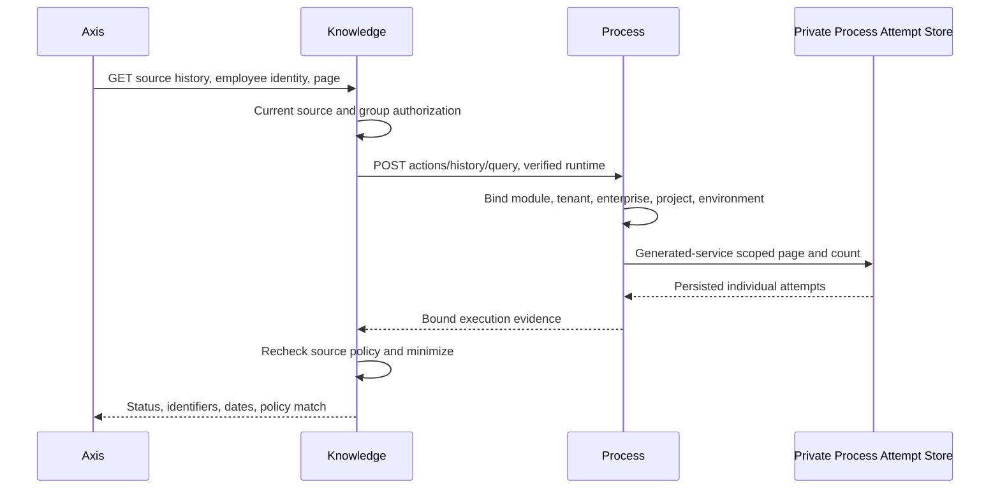

# Refresh Execution History

## Audience And Boundary

Business users inspect whether a configured refresh ran. Knowledge administrators
manage source visibility. Process operators investigate executions. Maintainers
and partners customize presentation and deployment selection through the existing
owners. This feature reads private Process-owned attempt evidence; it does not create a
Copilot job store, install schedules, retry actions or prove physical index state.

The history includes **every recorded remote action attempt**, across published
versions of the source's currently configured definition. Later actions on the
same instance do not erase earlier attempts. Recording starts when the deployment
installs the private `processActionAttemptRecord` schema and enables the owner's
`recordAttempts` declaration. Old instance records are not backfilled or presented
as complete history. New [recorded manual refreshes](recorded-manual-refresh.md)
use this same evidence. Old synchronous manual refreshes and other definition
codes are not included.
Preserve Process audit/incident evidence for detailed investigations.

## Prerequisites

1. Follow [Process-backed refresh](process-backed-refresh.md). Configure approved
   assignments for the source and exact tenant, enterprise, project and environment.
   Multiple distinct versions of the same definition remain readable; the header
   shows the highest assigned version and each attempt retains its original version.
   Duplicate versions or competing definitions fail closed. Revoking any assignment
   during an awaited history read invalidates that response.
2. Select the explicit Process `actionAuthority` connection and runtime role.
   Neither Axis nor the request may supply another connection.
3. The target Copilot runtime must have a router-verified service credential
   admitting `copilotApi` in the same enterprise and deployment as the action.
4. The employee needs `copilot.knowledge.internal.read` and the source's own
   required grants, plus current group assignment/activation. Source-management
   permission alone is neither required nor sufficient for this read.
5. Process attempt persistence must return the generated-service success
   envelope, rows and scoped total count. Missing acknowledgement is unavailable,
   not an empty successful history.

## Business User Journey

1. Open Copilot > Knowledge Studio and select an authorized static source.
2. Select **Load execution history** under **Refresh executions**. Sources with
   no usable configured assignment do not offer this control.
3. Check the assigned Process definition/version and each attempt's own version.
4. Review the execution identifier, start/completion timestamps and status.
   Current/previous source policy is calculated against today's source
   fingerprint; a previous-policy completion does not prove current readiness.
5. Move through pages using the arrows. Each page is at most 25 executions;
   reads are bounded to 1,000 pages and sorted newest-first, then by identifier.
6. Reload history explicitly to obtain a fresh view. This performs only a read.
   Leaving the source, changing identity or reloading inventory aborts and drops
   the old view. No history is stored in a browser-wide cache.

## Status And Recovery

| Status | Meaning | Operator action |
| --- | --- | --- |
| Awaiting claim | Process prepared the target action | Inspect the Process runtime if it remains pending |
| In progress | Target claimed the single-use action | Wait for owner evidence; do not launch a duplicate |
| Completed | Process persisted callback completion | Check source policy and index readiness separately |
| Failed | Process persisted callback failure | Inspect incident and owner evidence before any governed retry |
| Outcome requires inspection | A ready/claimed handle expired without a terminal outcome | Treat index outcome as unknown; inspect Process and projection evidence |

History never exposes a retry button or treats timeout as proof that nothing
happened. Recovery continues through existing Process incident and domain-owner
controls with their independent permissions. No blind replay, fabricated
completion, callback claim, or business mutation occurs during inspection.

## API And Security Flow

The public route is `GET /knowledge/sources/:sourceCode/history?page=1`.
The internal Process route is `POST /actions/history/query`, service-token-only,
module-internal and non-cacheable. The request contains an exact module/action,
definition, `historyMode: ATTEMPTS`, `version: null`, one scalar context equality
and expected scope. The response is contract version 2, `PROCESS_ACTION_ATTEMPTS`.
Process verifies that scope against the authenticated runtime before reading.
No client-supplied database operators are accepted. Process rechecks returned
rows against all filters. Its target-only context does not reach Axis: Knowledge
admits only source/digest and bounded canonical scheduling metadata, and strips context, decisions, actors,
credentials and raw failures. Current employee authorization is rechecked after
the remote response, preventing revoked group access from returning history.

## Failures And Customization

Foreign enterprise, hidden source, explicit empty group selection, disabled
workflow integration, malformed persisted evidence and changed assignment all
fail closed. An unavailable history must not be interpreted as no previous work.
Empty history means no matching recorded attempts for the selected definition only.
Concurrent executions can move between pages; this is an operational view, not
a frozen export or exhaustive evidence archive.

The instance's compare-and-set action handle remains the execution authority.
Process persists READY evidence before callback dispatch, CLAIMED evidence before
returning the claim, and terminal evidence after the instance transition. A lost
acknowledgement withholds success. History may therefore conservatively remain
READY/CLAIMED after work completed; never infer a safe replay from this projection.
Expired active handles and failed recorded attempts cannot be overwritten by an
automatic retry. Owner reconciliation is required.

Override `copilot.knowledge.studio.historyPresentation` in a later configuration
layer to change labels. Preserve all text keys and bounded inert strings. Change
the existing refresh assignment/connection only through deployment governance;
do not add credentials, endpoints or Process definitions to Axis. A custom Axis
renderer may consume `knowledgeHistoryClient`, but must preserve source teardown,
explicit reads, strict parsing and read-only behavior.

## Verification

Run Knowledge workflow/Studio tests and Process remote-action inspection tests.
Axis has `KnowledgeHistoryPanel.test.tsx`, including foreign/malformed responses,
explicit reads, abort and transport tests. Synthetic UI fixtures establish layout
only. Signed-in deployment acceptance must prove real service credentials,
generated persistence, current employee grants and an actual Process execution.
