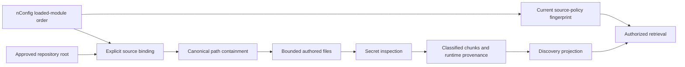

# Runtime-Bound Code And Documentation

## Purpose

Technical employees need evidence from the modules actually loaded by their
runtime, including later extension layers. `runtimeModule` binds an explicitly
registered knowledge source to nConfig's `NODICS.getIndexedModules()` result.
Copilot does not resolve dependencies, execute source files or invent a second
runtime loader. Unloaded modules cannot satisfy an enabled runtime-bound source.

## Configure A Partition

Source selection is runtime administration, never a `properties.js` change. Read
the [framework contract](../contracts/runtime-knowledge-configuration-contract.md)
before configuration or migration. New installations deliberately have no sources.

1. Obtain active module names and load indexes from the existing runtime inventory.
   Repository availability alone does not prove a module is active.
2. Use the inherited `framework` and `project` roots supplied by nConfig. Additional
   approved transport coordinates are deployment configuration, not source grants.
   Do not accept a browser-supplied filesystem root.
3. Use the Axis registration steps below to propose classified source records for
   approved partitions. nDynamo persists the reviewed selection. A later module
   needs no source-code registration hook to become an eligible candidate.
4. Paths and exclusions are relative to that module, for example `src`, `config`,
   `nodics.js`, `README.md` or `llm/contracts`. Existing file/byte, extension and
   secret-inspection limits remain in force. Generated copies stay excluded.
5. Assign approved source codes to knowledge groups and enterprise ceilings.
   Each layer is a separately classified source. A later module's load index
   does not make its content readable without current user/source permission.
6. Preview in Knowledge Studio, investigate rejected-file counts, then explicitly
   refresh and confirm. No automatic enablement or startup indexing is implied.
7. Repeat for the approved active framework and project layers. A source can
   cover its complete authored module only within configured bounds. Partition
   large modules instead of silently increasing limits or truncating evidence.

### Axis Registration

1. Open **Copilot Settings > Register runtime sources** with elevated configuration
   management, source management and restricted-content read permission.
2. Select partitions from the loaded inventory. Only modules within configured
   repository roots appear. Missing trusted environment/project context hides
   this form; the caller cannot invent either scope.
3. Choose code or internal documentation, a stable source-code prefix, revision
   and module-relative patterns. `**/*` selects eligible authored files, still
   constrained by extensions, exclusions, secret scans and ingestion bounds.
   Child `modules`, `envs` and `nodes` trees are excluded from their parent's
   partition; select eligible children separately. Inactive children stay excluded.
4. Review and submit. An authorized runtime reviewer approves and activates
   registration. The resulting sources are restricted and disabled.
5. Review enablement and group assignment separately, then preview and refresh
   each source in Studio. Previous/next controls reach every authorized source.

At most 100 partitions can be registered per proposal, with a 1,000-source registry
ceiling. Registration is not an ingestion job or proof of full-codebase coverage.

An enabled binding fails closed when its module is missing, its repository root
is missing, the indexed order is malformed or the real module path escapes the
registered root. Symbolic path aliases do not defeat real-path containment.
Disabled source definitions may remain configured without loading their module.

## Provenance And Refresh

Each bound source and chunk carries module name, load index, repository-relative
module root and a hash of the authoritative ordered module names/indexes.
Absolute paths are never projected. File citations retain repository-relative
paths, even though selection patterns are module-relative.

Load indexes retain Nodics' dotted hierarchy, such as `1.17.5.20`; they are not
decimal numbers. Copilot validates numeric segments without sorting or flattening
the loader's ordered Map. Invalid segments fail closed before file access.

The binding participates in the source-policy fingerprint. A changed load order
invalidates previously indexed evidence; refresh is required. Changed source
content still requires an updated source revision. Load precedence is provenance,
not proof that one snippet alone describes the final merged service behavior:
answers must inspect relevant permitted layers and cite them.
Retrieval and the answer prompt carry current authorized runtime provenance,
not untrusted provenance copied from an index payload.

## Documentation And Publication

Internal framework/project Markdown follows the same bounded partition process.
It is never made public because it is a README. Public documentation requires
the existing publication-aware source provider and Online/public proof;
`runtimeModule` is rejected for public published sources and external logs.
Keep customer documentation in its owning project, not copied into framework
modules. This binding does not deploy a publication provider or crawl remote docs.

## Customize And Test

Administrators may select different modules, revisions and narrower paths through
runtime governance; deployment layers may change trusted transport coordinates.
Neither may replace active-module authority with a folder scan.
Provider overrides preserve path containment and source classification. Run
`copilotRuntimeKnowledgeSource.test.js` and ingestion/retrieval tests, including
unloaded modules, outside-root paths, order changes and generated-copy exclusion.
Isolated file fixtures do not prove full project coverage or a live search index.
