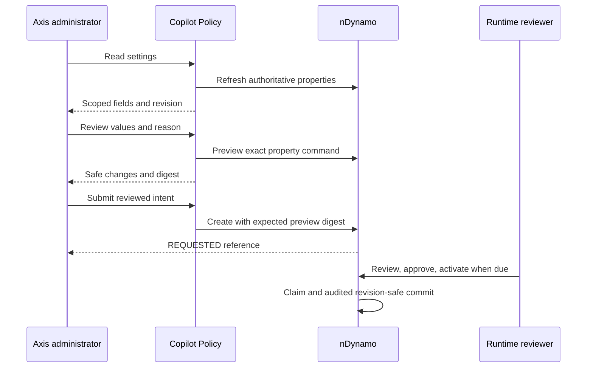

# Governed Copilot Administration

## Audience And Authority

Business administrators use **AI & Copilot > Copilot Settings** in Axis.
Profile supplies the authenticated enterprise; form input cannot change it.
Settings are proposals, not direct writes. Copilot Policy checks editable fields;
nDynamo owns approval, persistence and activation; nConfig owns effective values.
Domain APIs still authorize every business read and operation independently.

The current forms cover recurring defaults, enterprise ceilings, delegation,
provider/model selection, recording, group authoring, enterprise group/source
ceilings, active groups and source paths/exclusions. Current-period allocation
adjustments remain in Usage. Credentials, endpoints, employee provisioning and
tenant-wide accounting activation remain with their existing deployment owners.

## Prerequisites

1. Compose Copilot API, Policy, Knowledge, Conversation and Provider with the
   existing nDynamo/nSystem runtime governance. Preserve API exposure and login.
2. Opt into `runtimePropertyGovernance.persistence` and provision its generated
   storage/indexes using the nDynamo
   [durable activation guide](../../../../../nodics.foundation/modules/nDynamo/llm/examples/durable-property-activation.md).
   The default remains disabled; unavailable durability does not fall back to
   volatile settings.
3. Provision `copilot.configuration.read` for viewers and
   `copilot.configuration.manage` for proposal authors through Profile.
   `copilot.configuration.admin` is independently required for elevated controls.
   Role names are not used as authorization.
4. Runtime reviewers/activators retain existing `runtime.config.request.*`
   grants and separation of duties. Copilot does not approve its own proposal.
5. Refresh authenticated BackOffice discovery. The module-owned native binding is
   `copilot.administration/overview`; a typed URL never grants navigation.

## Recurring Budgets

1. Select the enterprise through the existing Axis context selector.
2. Open **Recurring allocations**. Every number shows its default and ceiling.
   Zero is a real zero allowance; blank is invalid.
3. Edit defaults and enter a reason. Choose **Review proposal** and inspect every
   before/after value. Editing any value or reason invalidates the review.
4. Choose **Submit for approval** once and retain the request reference.
5. A separately authorized operator reviews, approves and activates that request
   through the existing runtime configuration lifecycle.
6. Refresh Settings and Usage. Current-period overrides still win for their
   period. Defaults apply where there is no override and recur in later periods.
   No usage is erased, no reservation is released and no unused capacity carries.

Elevated administrators use **Enterprise ceilings** for the current enterprise
and its configured employees. Tenant limits bound enterprise limits; enterprise
limits bound employee limits. Defaults must fit proposed ceilings: reduce them
first when needed. These forms do not enroll employees or edit other enterprises.

**Enterprise administration** independently delegates recurring-default editing,
active-group selection and enterprise-owned group authoring. Delegation is a
ceiling, not a permission grant: read/manage grants are still required. It never
delegates provider, recording, global-group or source-ceiling changes.
Revocation is rechecked on review and submission. Runtime
approval and activation remain independently authorized.

## Providers And Recording

**Provider and model** offers enabled adapters and configured profiles only.
Model names are bounded inert identifiers; endpoints, handlers and credentials
are never returned or edited. Enable adapters in their existing deployment owner
first. Start acceptance with local Ollama. After activation, use the existing
explicit Workspace provider check, or **Check configured model** in Settings.
The latter probes the selected enabled adapter's currently configured model,
not an unsaved model-name draft. It retains independent check permission and
enterprise/user adapter eligibility. A selected model is not proof of readiness.
Each fully configured **Model profile** section edits temperature (0-2), sampling
probability (0-1), positive maximum output tokens (up to 1,048,576) and structured
output. These are provider-neutral upper bounds, not a claim that a selected
model supports every value. The adapter still enforces its capabilities. Partial
legacy profiles remain deployment-owned until their four tuning fields are
explicitly configured. Review and activate profile changes before probing/using
the configured model. No budget or enterprise allowlist is broadened by tuning.

**Enterprise provider access** sets the current enterprise's adapter and profile
allowlists. Empty selections revoke access; they do not mean all providers.
User eligibility remains an additional intersection. A provider cannot be used
or probed merely because it is enabled in the runtime. No existing usage is
removed by changing these lists.

**Conversation recording** changes future turns and advances the policy version.
Existing turns keep their pinned policy. This does not delete history or grant
transcript access. Recording is a tenant-runtime setting, not an enterprise
override; reviewers must consider all enterprises sharing it. Read the
[Conversation guide](../../../copilotConversation/llm/examples/recording-policy.md).

## Business Action Controls

**Business action controls** is an elevated-only, tenant-runtime section. It is
not enterprise-delegable, including when an invalid delegation names this section.
Its four checkboxes propose existing owner properties:

| Control | Property | What it does not do |
| --- | --- | --- |
| New invitations to existing enterprises | `copilot.workbench.standaloneInvitationsEnabled` | Create enterprises, grant invitation permission or activate accounts |
| New prices for existing products | `copilot.workbench.standalonePricesEnabled` | Create products, activate price books or publish prices |
| Interpret supported business requests | `copilot.core.intentPlanning.enabled` | Grant a model permission or bypass usage accounting |
| Inspect original business results | `copilot.workbench.receiptRecovery.enabled` | Record historical receipts, retry unknown writes or bypass native authorization |

1. Configure and qualify the native owner connections and persistence through
   their existing deployment authorities. Enabling invitations requires the
   enabled Profile target; enabling prices requires a valid Pricing target.
   Settings neither exposes nor edits those routing properties or credentials.
2. Open **AI & Copilot > Copilot Settings > Business action controls** as an
   independently authorized elevated administrator. Read the tenant-wide notice.
3. Select only the required controls, enter a reason and review all before/after
   values. Original-result inspection can remain selected while both new-write
   controls are off. A control is admission, not a permission grant.
4. Submit once for independent runtime approval. The response is `REQUESTED`,
   not active. Use the existing runtime review and activation journey, then reload
   effective Settings. Failed or lost submission responses must not be retried.
5. Verify current permissions and native contracts using approved test data.
   Existing enterprise/invitation and collection-centre write gates remain
   deployment-owned; this form edits only the four listed properties.
6. To stop new standalone writes, clear their checkboxes and follow the same
   approval lifecycle. In-flight native commands cannot be undone by a flag.
   Keep independent recovery enabled when original evidence must be inspected.

Non-coupon original-result inspection ignores only new-write admission flags. It
still needs the same current actor/enterprise/native grants, unchanged original
target and qualified native receipt. Proven completion can yield a fresh review
for unstarted rows; execution remains blocked while its journey is disabled,
even if approved. Re-enablement requires separate governance. Turning off the
recovery control itself intentionally disables Copilot receipt inspection.
Coupon fulfillment retains its separate sensitive owner contract.

## Knowledge Automation

**Knowledge automation** is elevated and tenant-runtime scoped. It is never
delegated to enterprise administrators, even if a deployment accidentally lists
`automation` in a delegation. It changes no employee grants, publisher identities,
source assignments, peers, credentials or Process definitions.

1. Provision the Discovery manifest/index contract and the explicit-install
   Process definition using the [refresh guide](../../../copilotKnowledge/llm/examples/process-backed-refresh.md).
   Configure approved runtime peers and exact source/publisher assignments through
   deployment-owned configuration. Do not enable a feature merely to probe whether
   these dependencies exist.
2. In **Copilot Settings**, open **Knowledge automation**. Inspect its
   tenant-runtime scope notice: every enterprise sharing that runtime is affected.
3. Enable atomic generation publication before selecting unchanged-source reuse
   or reviewed pending-writer retirement. Enable Process-backed refresh before
   selecting assigned source-change publishers. Inconsistent combinations cannot
   be submitted. Independent permissions and source/group ceilings still apply.
4. Set the minimum pending-writer age between 60,000 and 86,400,000 milliseconds.
   This is an eligibility floor for an explicit recovery review, not a timer,
   automatic lock takeover or proof that the worker stopped.
5. Enter the change reason, review all changed values, and submit once. The
   receipt means **Requested**, not activated. Follow the existing independently
   approved runtime activation workflow, then reload the effective revision.
6. Verify one authorized source in Knowledge Studio. Test unchanged reuse,
   changed content, denied/revoked access and pending-writer inspection with
   isolated data before deployment acceptance. Source events acknowledge a
   Process start, not indexing completion. Review Process attempt evidence for
   completion and inspect physical readiness separately.

To disable publication, disable reuse and retirement in the same proposal. To
disable Process-backed refresh, disable source-change publishers in that proposal.
Disabling a gate is not cancellation of an already-dispatched job; inspect the
owning Process state and durable manifest. No schedule, subscription, permission,
definition installation or recovery command is created by this form. Detailed
semantics are in [source events and incremental refresh](../../../copilotKnowledge/llm/examples/source-events-and-incremental-refresh.md)
and [pending writer recovery](../../../copilotKnowledge/llm/examples/pending-writer-recovery.md).

## Knowledge Administration

1. With elevated administration and source-read grants, choose **Create knowledge
   group**, enter a stable code and business-readable name, then select sources.
   Start inactive while preparing it. Review and submit through runtime approval.
2. Existing group sections edit name, activity and source membership. Codes cannot
   be renamed. Deactivate referenced groups instead of deleting them.
3. **Enterprise knowledge access** sets separate group and source ceilings for the
   current enterprise. Both apply. Empty lists grant nothing; removed groups are
   also removed from that enterprise's active selection.
4. **Active knowledge groups** selects a subset of assignments and may be delegated.
   Global inactivity or missing source permission still denies retrieval.
5. Enable **Enforce enterprise group assignments** after preparing assignments.
   Missing assignments then select no sources. Disabling this gate restores
   source-policy-only selection across the runtime and needs elevated review.
6. Source editing additionally requires `copilot.knowledge.source.manage` and
   source visibility. Edit enabled state, revision, included paths or excluded
   paths. Paths are repository-relative, one per line; traversal/absolute paths
   are rejected. Roots and classifications are not editable here.
7. After approved activation, preview ingestion in Knowledge Studio, select
   **Refresh index**, then confirm. The command binds the current source-policy
   fingerprint. Settings does not perform indexing. An uncertain refresh blocks
   another attempt until inventory is reloaded and its outcome investigated.
   Advance source revisions for repository-content changes.

Delegated authors use **Create enterprise knowledge group** and the existing
enterprise-owned group sections. The backend fixes tenant and enterprise from
authentication. Only sources within the enterprise ceiling and the author's
source permissions are selectable. New groups are assigned only to that
enterprise; activating one never grants another source. Global and foreign-owned
definitions are not editable. Revoking authoring prevents new proposals.

**Register runtime sources** selects loaded module partitions contained in an
approved repository root. Choose code or internal documentation, a stable prefix,
revision and module-relative include/exclude patterns. At most 100 partitions
can be proposed at once; the registry is bounded to 1,000 definitions. New
sources are restricted, employee-scoped, secret-scanned and disabled. Approve
registration first, then review enablement, group assignment, preview and refresh
as separate steps. See [runtime partition setup](../../../copilotKnowledge/llm/examples/runtime-source-partitions.md).

**Conversation lifecycle** sets retention days, an enterprise-wide hold and
individual conversation holds through the same approval lifecycle. Identifiers
must resolve in the current enterprise. Activity provides metadata-only review;
these controls do not run deletion. See [retention and holds](../../../copilotConversation/llm/examples/retention-and-holds.md).

New chunks carry a source-policy fingerprint. Discovery filters and returned
evidence require the current fingerprint, so changing exclusions invalidates old
content even at the same human revision. Legacy chunks without fingerprints need
refresh. This is logical exclusion, not physical index deletion. Process-local
readiness reports are not durable index receipts. Database/log access must still
enforce current record, field and operation authorization; these forms do not
turn operational data into unrestricted static corpus content.

## API And Lifecycle

| API | Result | Writes |
| --- | --- | --- |
| `GET /administration` | Revision and safe constrained fields | None |
| `GET /administration/history?page=1` | Up to 25 enterprise-origin request states | None |
| `POST /administration/preview` | Before/after changes and review digest | None |
| `POST /administration/requests` | `REQUESTED` receipt | One nDynamo request |

Commands contain `section`, `values`, `revision`, `reason`, optional UTC
`notBefore`, and a submission `previewDigest`. Caller paths, tenant/enterprise,
raw configuration, permissions and request codes are rejected. Indexed field
identities resolve against the fresh revision. Full array replacements preserve
foreign entries internally; those values are never projected to Axis.

Settings displays **Configuration requests** with request identity, author, latest
state and lifecycle timestamp. History omits patches, reasons, raw snapshots and
legacy requests without an enterprise origin. It does not imply a tenant-wide
change affects only its originating enterprise. `ACTIVATING` is not success;
investigate it through runtime governance without replaying the write. Approval,
activation, rollback and recovery remain in the existing runtime control plane.

## Recovery And Customization

- Offline commands are rejected, never queued. A lost acknowledgement is unknown:
  inspect runtime requests before resubmitting. There is no automatic POST retry.
- Stale values, revision or delegation require a fresh read/review. nDynamo checks
  the expected preview again before persisting the request.
- Earliest activation is a guard, not a scheduling promise. Automatic dispatch
  requires the existing opt-in CronJob setup and operational grants.
- Runtime failures never fall back to direct writes or a Copilot settings store.
- Later layers may customize mergeable service members but must retain independent
  permissions, exact paths, ceilings, source restrictions and secret exclusions.
- `secretScanPolicy: REQUIRED` is public metadata, not a credential. Knowledge
  contributes an exact nDynamo public-literal declaration for that path only.
  Other values and similarly named fields elsewhere remain forbidden.

Verify the owner `copilotAdministration.test.js`, group/ingestion regressions,
nDynamo activation/persistence suite, Axis `CopilotAdministration.test.tsx`,
typecheck and synthetic `administration.visual.html`. Doubles and screenshots do
not establish deployed grants/indexes, propagation or authenticated acceptance.
