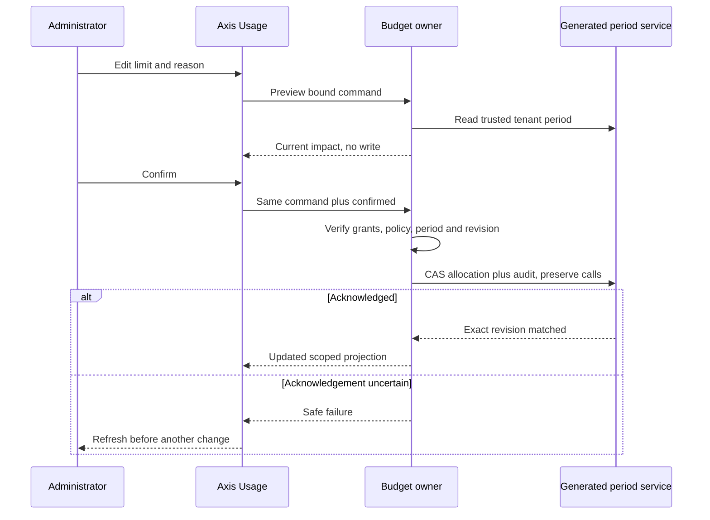

# Current-Period Allocation Administration

## Scope

This workflow narrows or restores enterprise and employee token limits within
configured ceilings for the active DAY or MONTH period. It does not assign new
users, grant business permissions, select providers, change period/timezone,
carry unused tokens forward, or change next-period defaults. A cap is not a
reserved share of the enterprise pool; shared tenant and enterprise capacity
still constrain every model call.

Deployment eligibility and ceiling policy remain layered nConfig properties.
Operational allocations and their audit belong to copilotProvider's existing
private generated `copilotUsagePeriod` journal, not nSystem configuration records
or a customer module. Accounting remains disabled by default.

## Business User Journey

1. Sign in to Axis in the intended enterprise context.
2. Open AI & Copilot, then Usage and budgets, then Manage allocations.
3. Check the enterprise identifier, reset timestamp and timezone. The page shows
   current limits, maximum allowed values, consumed tokens and reserved tokens.
4. Select the settings icon beside the enterprise or employee. Only separately
   authorized targets have an edit control.
5. Enter a whole-number token limit from zero through the displayed maximum.
   Enter a short reason without credentials, personal content or transcript data.
6. Select Review change. This reads the current period again; it does not save.
7. Review the before/after values and committed tokens. A limit below commitments
   blocks new calls when capacity is exhausted; it does not undo spending.
8. Select Confirm allocation once. Acknowledged changes refresh the allocation
   projection and appear in Allocation history with actor, timestamp and reason.
9. Return to Usage to reload current usage. At the next configured reset, normal
   configured defaults apply. Period-specific allocations do not roll forward.

Read-only administrators can inspect allocations and history but cannot edit.
An enterprise cap reduction may leave an existing employee limit above the new
shared cap. That is intentional: the employee's cap is retained, but the shared
pool limits actual availability. Subsequent employee edits cannot exceed the
current enterprise cap.

## Permissions and Deployment

| Operation | Required trusted permissions |
| --- | --- |
| Read current enterprise budgets/history | copilot.assistant.read and copilot.usage.read |
| Preview or change enterprise limit | Both read grants plus copilot.budget.enterprise.manage |
| Preview or change employee limit | Both read grants plus copilot.budget.user.manage |

1. Deploy the provider owner, Core delegation and secured Copilot API together
   with the existing private accounting schema and generated service.
2. Verify the unique period key and exact-revision update behavior in the target
   generated database service. Do not enable accounting on an unverified adapter.
3. Configure eligibility, ceilings and adapter/profile restrictions through the
   established authorized configuration layer; inspect the effective merged result.
4. Provision grants through the existing identity/access owner. A UI button, body
   role, enterprise identifier or provider response never supplies permission.
5. Deploy Axis, refresh backend discovery, and test an authorized administrator
   and a denied employee in an isolated acceptance enterprise.
6. Exercise concurrent calls and edits with local Ollama first. Source fixtures
   do not prove live permissions, generated persistence or deployed acceptance.

An administrator manages only the enterprise resolved from trusted authentication.
There is no body field for selecting a foreign tenant or enterprise, and no
cross-tenant superadmin directory in this workflow.

## API and Persistence Contract

| Method and relative route | Behavior |
| --- | --- |
| GET /budgets | Authorized current-period amounts, grants, copy and newest 50 changes |
| POST /budgets/preview | Read-only normalized command and impact |
| POST /budgets/allocations | Confirmed atomic allocation plus audit |

Command fields: `target` (ENTERPRISE or USER), `principalCode` (null for enterprise),
`limit` (nonnegative safe integer), `reason` (nonblank, at most 500 characters),
`changeId` (stable bounded identity), `periodKey`, `policyDigest` and
`expectedRevision`. The write additionally requires `confirmed: true`.
Extra fields are rejected. The browser sends the same change identity as its
idempotency header, but service-level journal identity is authoritative.

The configuration digest binds the calendar settings, tenant ceiling and exact
enterprise eligibility/ceilings. The allocation revision is that enterprise's
latest change ID. Other enterprises and ordinary model calls do not invalidate
an edit, but another allocation change in the same enterprise does. Consumption
can change after preview; saving rechecks current commitments and capacities.

The journal preserves `items` (calls), `allocations` and `allocationChanges` in
one atomic transition. Reserve and settle retain both allocation arrays. A
definite revision conflict re-reads and retries within the configured bound.
Unknown save/update acknowledgement exits without another write. An exact
duplicate command can recover its acknowledged projection without another audit
entry; reusing its identity for a different actor/scope/payload is rejected.

The journal permits at most 500 allocation changes per tenant period; reads show
the current enterprise's newest 50 and an explicit truncation notice. Reaching
the change bound blocks further allocation changes, not valid reserve/settle
operations. Existing call bounds still apply separately. No entries are silently
dropped. Higher-volume deployments need a separately designed transaction-backed
partition contract before raising these bounds.

## Failure and Recovery

| Symptom | Next step |
| --- | --- |
| Edit control absent | Check exact owner-issued target grant; do not edit browser state |
| Review unavailable | Refresh to obtain the current revision, period and policy |
| Limit exceeds maximum | Reduce it, or have the authorized configuration owner review the deployment ceiling |
| Usage exceeds new cap | Keep usage evidence; accept blocked new calls or raise within the ceiling |
| Save outcome uncertain | Refresh; inspect amount, actor, time and reason before a new command |
| Offline | Reconnect, reload and explicitly submit; commands are not queued |
| History bound reached | Escalate to the owner; do not delete audit rows or manufacture a new period |
| Malformed journal or unavailable persistence | Fail closed and investigate the generated persistence owner |

A reload never proves an ambiguous command failed. This workflow cannot repair
unknown provider usage, refund tokens or change business-operation outcomes.
Detailed command-status reconciliation and recurring/default allocation editors
remain separate pending work.

## Customization and Verification

### Recurring Defaults Versus Ceilings

The accounting owner accepts optional `defaultLimit` on each configured enterprise
and eligible user. `limit` remains the hard ceiling. An absent `defaultLimit`
preserves the previous behavior of starting at the ceiling; an explicit zero
starts with no capacity. Every default must be a nonnegative safe integer no
greater than its own ceiling. Defaults never enroll an unlisted employee.

For example, an enterprise can have `limit: 100000` and `defaultLimit: 60000`,
with an eligible employee having `limit: 10000` and `defaultLimit: 5000`. The
employee starts each calendar period with a 5,000-token cap. A separately
authorized current-period change can increase it within the displayed ceiling;
that operational change does not carry forward. Shared tenant and enterprise
capacity still constrains every reservation.

1. The authorized configuration owner reviews eligibility and hard ceilings first.
2. Set optional enterprise/user defaults through layered nConfig configuration or
   the existing reviewed durable property workflow. These paths use `defaultLimit`,
   not a secret-pattern exemption or another configuration store.
3. Use `notBefore` plus qualified CronJob dispatch for a future effective change.
   Changing configuration immediately changes defaults for users without an
   explicit current-period allocation; it is not implicitly next-period-only.
4. Inspect Usage and Manage allocations after activation. Existing screens show
   effective period limits and ceilings. They still edit only the current period;
   a dedicated recurring-default editor and enterprise delegation remain pending.
5. At the next DAY/MONTH boundary, the new period uses recurring defaults through
   the existing calendar owner. There is no token-minting job or carry-forward.
6. Verify a reservation above the default is denied even when the hard ceiling is
   higher. A default change invalidates already-reviewed budget commands through
   the existing policy digest. Old-period usage and uncertain reservations remain
   in their original journals.

Later layers may customize the existing exported `limits` method, but must retain
the default/override/ceiling intersection, explicit eligibility and tenant scope.
`copilotBudgets.test.js` covers default projection, actual reservation enforcement,
zero, invalid values, policy drift and the absence of period-override carryover.

Customize inherited `copilot.providers.accounting.budgetPresentation` text and
`presentation.allocations`. Preserve required fields, bounded inert labels,
exact identity scope and separate grants. Later service overrides must retain
atomic audit, no-retry ambiguity behavior, ceiling intersection and reset rules.
Do not introduce a browser ledger, direct database driver, identity catalog or
alternate configuration hierarchy.

Run `copilotBudgets.test.js` and `copilotUsage.test.js` together, then the complete
Copilot suite. Axis coverage is in `CopilotBudgets.test.tsx` and
`CopilotUsageRoute.test.tsx`. The synthetic `budgets.visual.html` fixture supports
desktop/mobile and confirmation-dialog checks; it is not live acceptance.
Confirm current-period persistence, authorization and real local Ollama behavior
again in an authenticated deployment before enabling customer access.
