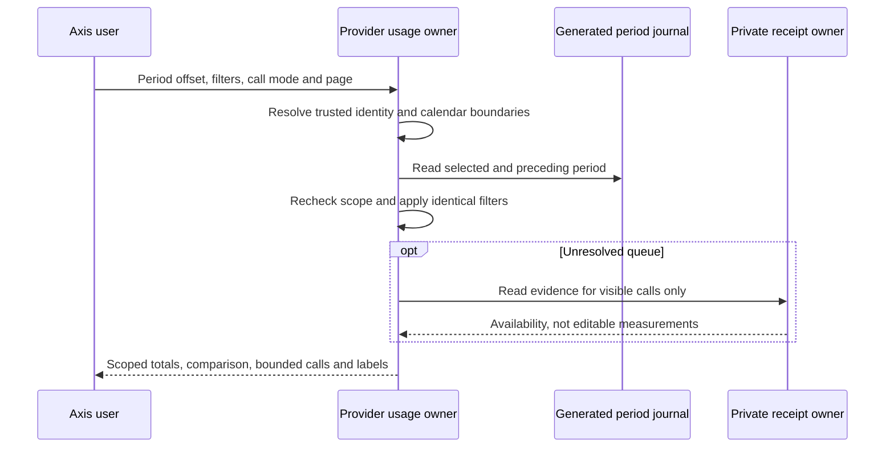

# Historical Usage and Provider Checks

## User Journey: Usage History

1. Open AI & Copilot > Usage and budgets. Personal usage is the default; enterprise
   access remains independently authorized by the existing usage owner.
2. Choose Accounting period. Current period is offset zero. Previous periods use
   the configured DAY or MONTH calendar and timezone, including daylight-saving
   transitions. The default window is twelve periods, including the current one.
3. Review consumed, reserved, pending and call counts for that selected period.
   Pending is already part of reserved. Historical selection does not reset,
   refund or move charges to the current period.
4. Inspect Period comparison. Each metric shows the selected period and the prior
   full period using the same principal, model, purpose and call-state filters.
   An incomplete current period is not a like-for-like full-period forecast.
5. A missing matching journal/entry is explicitly unavailable history, not a
   fabricated zero-consumption period. A real zero measurement remains zero.
   Another enterprise's journal cannot establish that your history exists.
6. Change filters or select a chart breakdown. The first page loads again, with
   old data removed while the request is pending. Normal calls show newest first,
   at most 100 per page. Charts and totals use the full authorized filtered ledger.
7. Allocation administration is offered only for the current period. Historical
   reads cannot revise past limits through the current-period budget editor.

## Administrator Journey: Unresolved Calls

1. Select Unresolved calls in the Model calls selector. The queue shows only
   non-measured records in the selected period, oldest first, 25 per page.
2. Inspect Started to understand the call's age and the evidence status. AVAILABLE
   means a scoped retained receipt was found; MISSING means none was found;
   DISABLED means receipt inspection is disabled by configuration.
3. Open the call detail using the existing detail control. Queue visibility does
   not grant repair permission or guarantee that all receipt contents are valid.
4. Follow the [reconciliation guide](usage-insights-and-reconciliation.md): inspect,
   enter a reason, preview, then explicitly confirm the verified measurement.
5. Refresh after an uncertain outcome. Never enter a manual token amount, replay
   a business operation, or automatically release a reservation because it is old.

Queue evidence reads are limited to the visible 25 calls. They cannot trigger a
model invocation or a ledger mutation. Pagination is bounded to the first 5,000
matching calls; this is an operational view, not an unbounded export or bulk repair.

## Configuration and Customization

`copilot.providers.accounting.historyPeriods` accepts an integer from 1 to 24,
default 12. It bounds selectable periods, not data retention. The comparison may
read the immediately preceding period beyond that selectable window. Changing
accounting timezone or interval is not a migration of existing journal keys;
plan those changes with the usage owner before deployment.

Customize business copy through `accounting.presentation`, including history,
comparison, absence, pagination and evidence labels. Keep accounting and receipt
capture opt-ins explicit. Deploy backend labels before the stricter Axis parser.
GET `/usage` adds `periodOffset`, zero-based `page` and `calls=ALL|UNRESOLVED`.
It never accepts a tenant override or treats an administrator filter as identity.

## Operator Journey: Provider Check

1. Configure the provider through the normal nConfig hierarchy and qualify its
   adapter. Use the [setup guide](provider-setup-and-verification.md), starting with
   local Ollama. Do not enter credentials or endpoint URLs into conversation text.
2. Obtain the independent `copilot.provider.check` permission through Profile.
   Assistant-read permission alone does not authorize a probe. Accounting-enabled
   deployments also require the current enterprise and user to be eligible for
   the configured default adapter/profile.
3. Open the full Copilot Workspace and select Check connection. This is explicit:
   loading Workspace or the compact dashboard does not make a provider request.
4. The backend checks only the effective default adapter/profile, invokes its
   health method once, and returns a bounded, secret-free status and timestamp.
   It accepts no submitted URLs, model selectors, prompt or credential fields.
5. Interpret UP as the adapter's health result, not proof that text generation,
   tool execution, budget settlement or a customer operation will succeed.
   DEGRADED/DOWN require diagnosis through the owning runtime. NOT_CONFIGURED
   requires correcting configuration; UNSUPPORTED means the adapter has no
   compatible health method, not that it is necessarily offline.
6. A transport error leaves the result unknown. Retry deliberately only when
   ready. Offline clicks are rejected and never queued for reconnect replay.

POST `/providers/check` requires an empty body. The configured adapter must supply
finite `healthTimeoutMs` (1-30,000) and `maximumResponseBytes` (1-1,048,576); the adapter
owns bounded transport. Provider errors and raw payloads are not returned. The
check is not a generation call and does not reserve generation tokens. It is not
an arbitrary-model test, provider settings editor or continuous health monitor.
Customize messages at `copilot.providers.healthPresentation`; preserve the
allowlisted status contract and separate check grant in visual overrides.

## Verification and Acceptance

Backend cases live in `test/copilotReconciliation.test.js`: bounded historical
calendars, leap/DST boundaries, reset-crossing reservations, scoped comparisons,
oldest-first queue paging and independent provider-check authorization. Axis
cases cover period selection, query/response binding, offline behavior and raw
payload minimization in `CopilotUsageHistory.test.tsx` and
`CopilotProviderCheck.test.tsx`.

The `usage-history.visual.html` fixture uses synthetic data and supports period
and queue selection. It does not emulate the authenticated API or every filter.
Live acceptance must verify generated storage, real grants, configured provider
transport, receipt persistence and tenant isolation. Local Ollama invocation
tests alone do not establish acceptance of the deployed provider-check endpoint.
