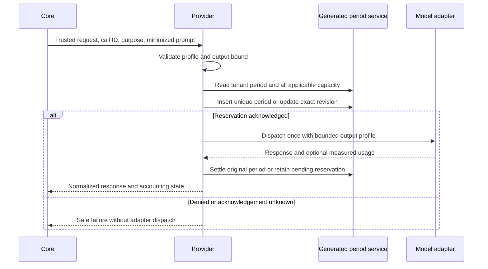

# Usage and Budgets

## Scope and Readiness

The provider-neutral owner now implements opt-in token reservations and measured
settlement through the private generated `copilotUsagePeriod` service. Axis
renders the resulting Workspace balances and personal/enterprise usage views.
This is bounded accounting, not a billing system or a completed allocation
administration product. [Current-period editable/audited allocations](allocation-administration.md)
are available separately. Monetary pricing, unlimited policy, recurring/default
allocation administration, cross-tenant platform pools, role/capability caps and cross-period trends
remain incomplete. [Evidence-backed call reconciliation and current-period
insights](usage-insights-and-reconciliation.md) are implemented; they cannot
reconstruct missing provider counts or browse arbitrary historical periods.

The accounting record is one tenant/calendar-period aggregate, with an explicit
maximum of 5,000 call entries. Capacity exhaustion of this journal blocks new
model calls; it never drops old entries or silently starts another budget. This
boundary needs a transaction-backed partitioned implementation before use at a
higher volume. Private generic CRUD routes are disabled. Generated-service and
unique-index deployment must be verified before enabling accounting.

## Business Journey

1. Open AI & Copilot, then Copilot Workspace.
2. Inspect Assigned limit, Consumed, In progress, Available and Pending
   reconciliation. Pending is part of In progress, not another charge.
3. Check the explicit reset timestamp and budget timezone. Available is bounded
   by both the personal cap and shared enterprise/tenant capacity.
4. Open Usage and budgets to inspect the current period's call attribution.
5. Use exact Model or Purpose filters and Apply filters. The displayed totals
   apply to the filtered period; the call list is limited to its newest 100 rows.
6. An employee with `copilot.usage.read` may select Enterprise and filter an exact
   employee identifier within the current enterprise. Ordinary read permission
   does not expose this view.
7. When capacity is exhausted, inspect existing results/history without another
   model call. A provider switch or fresh conversation does not refill the pool.

An assigned cap is a spending ceiling, not an exclusive allocation from the
shared pool. For example, a 100,000 personal cap with 40,000 measured and 10,000
reserved leaves at most 50,000 available. If the shared pool has only 8,000 left,
Available is 8,000. No other employee's usage rows are included in that personal
projection.

## Operator Setup

1. Keep `copilot.providers.accounting.enabled` false while deploying the schema,
   service, status definitions and API routes. Refresh BackOffice discovery for
   the native `copilot.usage/overview` navigation contribution.
2. Verify generated get/save/update services and the unique code index in the
   owning runtime through normal framework deployment/acceptance procedures.
3. Select the runtime-owned provider and profile. Start with the existing local
   Ollama configuration and a locally installed model; do not copy credentials.
4. Configure tenant capacity, exact tenant/enterprise assignments, permitted
   adapter/profile names and employee caps in an authorized later configuration
   layer. Do not add reusable behavior to a customer module.
5. Inspect effective merged configuration before activation. Arrays must use the
   existing nConfig replacement/keyed-change contract; a shortened list must not
   accidentally retain old assignments.
6. Enable accounting only after scoped acceptance. Unassigned identities and
   missing generated persistence fail closed before provider dispatch.

Illustrative effective configuration, not a customer data pack or merge syntax:

```js
accounting: {
    enabled: true,
    period: 'MONTH',
    timezone: 'Asia/Dubai',
    tenantLimit: 200000,
    warningPercentages: [80, 95],
    maximumEntries: 5000,
    maximumAttempts: 8,
    enterprises: [{
        tenantCode: 'example-runtime-tenant',
        enterpriseCode: 'example-enterprise',
        limit: 100000,
        adapters: ['ollama'],
        profiles: ['conversation'],
        users: [{ principalCode: 'example-employee', limit: 50000 }]
    }]
}
```

Inherit the module-owned presentation map. `DAY` and `MONTH` are supported;
calendar boundaries use the configured IANA timezone, including DST offsets.
No carryover is implied. A zero cap blocks calls; an absent assignment is
Unassigned. Unlimited is intentionally unsupported. `tenantLimit` is a cap for
this runtime tenant, not a global platform cap across isolated databases.

Do not change period/timezone in place during a live period: doing so changes
the accounting partition. A governed cutover/migration contract is still needed
for that administrative operation. Mid-period config edits do not have a new
Copilot configuration change-history API in this implementation. Operational
allocation changes are audited separately and expire at the configured reset.

## Accounting Contract



The reservation is an estimate based on serialized request bytes plus the
bounded output allowance. It is not a universal tokenizer or guaranteed exact
maximum bill. Measured overruns are charged in full and reduce future capacity;
missing measurements retain the full reservation. Prices and token subcategories
are not added together. The provider output profile is clamped to the same
allowance used for reservation, including adapters which read the profile rather
than the top-level input.

Standard and streaming paths use the same wrapper. The wrapper never retries
dispatch. Each call requires a unique stable ID and a trusted purpose. Axis
conversation calls use their turn code. Other call sites must supply an explicit
owning identity and purpose; enabling accounting without that attribution blocks
them. Supporting an `INDEXING` or `EVALUATION` purpose does not mean all such
framework workflows are integrated or shared preparation is correctly assigned.

The generated record keeps identifiers, adapter/model/profile/purpose, estimated
reservation, measured total, state and timestamps. It never stores prompts,
responses, credentials or source content. All capacity dimensions are checked
inside one optimistic revision transition, not independent process-local locks.

## Failure and Recovery

| Situation | Behavior |
| --- | --- |
| Missing assignment or disallowed adapter/profile | No storage reservation or model dispatch |
| Competing requests exceed available capacity | Only an acknowledged fitting reservation may dispatch |
| Same call ID submitted again | Rejected; no automatic model replay |
| Missing usage or provider exception | Full reservation remains pending |
| Save/update acknowledgement lost | Fail closed; do not infer rollback or retry dispatch |
| Settlement unavailable after provider response | Reservation remains; response delivery may fail, never claim free usage |
| Calendar resets while a call is running | Settlement updates its original period |
| Configuration reduces a cap below current spending | Available becomes zero; existing evidence remains |
| Journal bound reached | New calls blocked; no deletion or implicit rollover |
| Accounting read unavailable | Workspace says unavailable, not zero |

`RESERVED` after a restart may itself require reconciliation; it is never timed
out into free capacity. A verified trusted service can settle a pending entry
with authoritative usage. There is deliberately no employee API for inventing
measurements or releasing reservations. A governed administrative repair command
with private measured receipts is available through the linked reconciliation
guide. It is explicit, permissioned and audited, not automated reconciliation
or authority to invent missing measurements.

## Customization

Provider-neutral methods are loader-visible mergeable services. A later layer
may narrow assignments, limits, warnings and window bounds, or customize
presentation. A persistence replacement must preserve atomic multi-cap claims,
stable call identity, scope rechecks and ambiguous acknowledgements. Never add
a parallel browser ledger, copy a raw database driver into Copilot, or fall back
to in-memory accounting when generated services are missing.

Run `copilotUsage.test.js` for concurrency, lost acknowledgements, isolation,
policy customization, resets, standard/streaming parity and bounded capacity.
The opt-in command below uses the real local model but isolated generated-service
fixtures; it does not validate a deployed enterprise ledger:

```sh
NODICS_COPILOT_LIVE_OLLAMA=1 node --test nodics.copilot/modules/copilotProviders/modules/copilotProvider/test/copilotUsage.test.js
```

Axis owns typed clients, navigation admission, filter interactions and visual
fixtures. Test malformed/foreign responses, unavailable states, keyboard controls,
mobile wrapping and context switches. Source tests, synthetic screenshots, local
provider tests and authenticated generated-persistence acceptance are separate
evidence categories.
