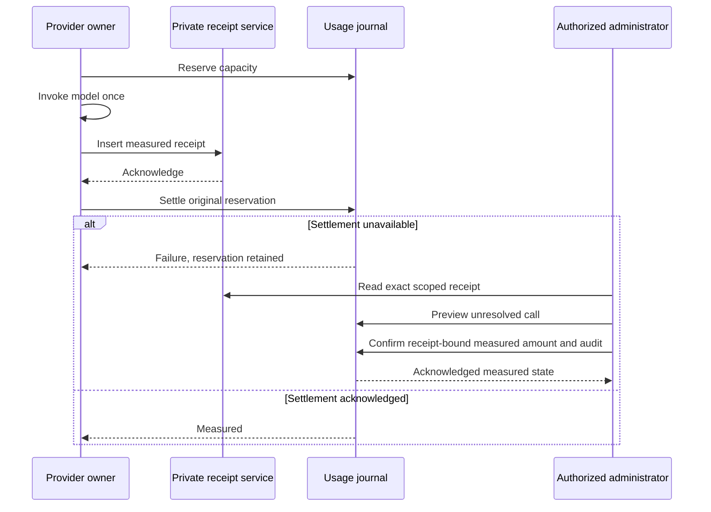

# Usage Insights and Evidence-Backed Reconciliation

## Business Scope

Usage and budgets now answers three questions: which calls consumed capacity,
which allocations still hold reservations, and whether a retained reservation
can be settled from a recorded provider measurement. This is not invoicing,
automatic refunding, transcript access, or a retry of the business operation.

Daily charts cover the selected configured accounting period in its timezone.
Ranked breakdowns cover the full authorized filtered ledger, not just the newest
100 calls displayed. Each dimension shows at most 20 groups and a truncation
notice. The current DAY/MONTH period has at most 31 daily buckets; only dates
with calls are returned. Missing dates are not manufactured historical records.
Historical period browsing, adjacent-period comparisons and a bounded unresolved
queue are described in [the history guide](historical-usage-and-provider-checks.md).
Multi-period trend series and bulk reconciliation remain pending.
The call API accepts an exact original period reference for retained
records, so an authorized integration can repair a known call after a reset.

## Usage Journey

1. Open AI & Copilot, then Usage and budgets.
2. Select Personal, or Enterprise when your identity has enterprise usage access.
3. Review consumed, reserved and pending counts. Pending is a subset of reserved,
   not an additional charge.
4. Apply exact employee/model/purpose filters. Ordinary employees cannot select
   another principal or widen their view by changing the URL.
5. Inspect Daily usage. Green represents measured consumption; the theme warning
   color represents reserved tokens. Numerical labels accompany every bar.
6. Switch Usage breakdown between model, purpose and, for enterprise views,
   employee. Select a row's search control to apply that exact filter.
7. Open Call details from Recent calls. Check its reference, original period,
   principal, provider adapter, model/profile/purpose, timestamps and accounting
   state. These are accounting facts, not evidence of business-task completion.
8. Close the detail panel to reload usage after any acknowledged change.

Copilot Workspace attention now includes personal pending usage. Its accounting
arrows open the authorized Usage workspace. The compact main-dashboard summary
continues to lead through Workspace; neither page executes a recovery action.

## Reconciliation Journey

1. Open an unresolved call as an administrator with all required grants below.
2. Inspect Recorded provider measurement. When no verified receipt exists,
   the reservation remains held and no reconciliation action is offered.
3. Enter a short reason without secrets, prompt text or personal source content.
4. Select Review reconciliation. The backend re-reads the exact call and receipt;
   no ledger write or provider invocation occurs.
5. Review the currently reserved amount and measured amount. The measured amount
   may be lower or higher than the reservation. It is not editable.
6. Select Confirm reconciliation once. The backend rechecks permission, scope,
   evidence digest and unresolved call state, then writes amount and audit
   together through the journal's exact-revision update.
7. On success, inspect Measured, zero remaining reservation, and Reconciled by.
   The original reservation remains in the audit evidence.
8. If the outcome is uncertain, select Refresh call. Do not assume rollback,
   invent zero usage or repeat the model call. An exact duplicate command can
   recover the existing result; a changed command cannot overwrite a prior repair.

An already normally settled call cannot be adjusted using this workflow.
Corrections to measured charges need a separate owner-reviewed adjustment
contract. Unknown calls without receipts stay unknown even when a user says
that no answer was received.

## Grants and Isolation

| Operation | Required authority |
| --- | --- |
| Read personal usage/call | copilot.assistant.read; original principal and current enterprise |
| Read another employee in current enterprise | copilot.assistant.read and copilot.usage.read |
| Review or confirm reconciliation | Both read grants plus copilot.usage.reconcile |
| Capture a measurement receipt | Trusted provider wrapper only; no employee API |

Trusted authentication resolves the tenant and enterprise. Submitted identities,
counts, provider URLs and arbitrary query operators cannot supply authority.
The receipt key binds tenant, enterprise, original employee, period and call.
The command actor may be an administrator, but the charge remains on the original
employee and original accounting period. Other enterprises cannot inspect or
repair it, even when a call reference is guessed. No global superadmin bypass
or frontend-owned entitlement registry is added.

## Deployment and Configuration

1. Keep `copilot.providers.accounting.reconciliation.enabled` false.
2. Deploy the private `copilotUsageReceipt` schema alongside the existing usage
   period schema. Generic CRUD routes, events and cache are disabled.
3. Verify generated get/save, insert-only behavior and the unique receipt code
   index in the actual runtime. Receipt capture has no update API.
4. Verify the period service's acknowledged exact-revision CAS independently.
5. Deploy Core/API delegation and Axis together, with backend presentation keys
   available before the new typed client.
6. Provision the explicit reconciliation grant through the existing access owner
   in an isolated acceptance enterprise, not by changing application code.
7. Opt in through the normal authorized nConfig layer:

```js
copilot: {
    providers: {
        accounting: {
            reconciliation: { enabled: true }
        }
    }
}
```

This is an override fragment, not a full provider configuration. Existing provider,
accounting, assignment and API opt-ins still apply. Do not copy defaults or
credentials into customer code. Malformed reconciliation enablement fails closed.

8. Start acceptance with local Ollama. Verify receipt/ledger count parity for a
   successful call, then use controlled persistence fault injection to verify
   retained capacity and explicit recovery. Do not cause a real outage to test.
9. Verify both positive and denied requests through the authenticated APIs.

When opted in, missing receipt-service composition blocks provider dispatch.
If receipt persistence fails after a provider has replied, the reservation remains
held and the response may fail delivery. An uncertain receipt save is never
repeated automatically. Disabling capture preserves existing evidence; it neither
deletes receipts nor authorizes manual refunds.

Receipt retention/deletion is not implemented. Plan retention and storage
capacity before production activation. Receipts contain scope, token counters,
timestamps and digests, never prompts, answers, credentials or raw vendor payloads.

## Low-Level Flow



`DefaultCopilotProviderService.accounted` shares capture across standard and
streaming invocation. It stores only fully measured normalized input/output/total
counters before calling normal settlement. A checksum binds the canonical inert
receipt fields; the checksum is a consistency check, not a cryptographic claim
that a vendor signed the measurement. The private trusted persistence boundary
is the evidence authority.

`DefaultCopilotReconciliationService` rechecks the private receipt and ledger
identity, rejects malformed evidence, and uses the existing Usage owner read/write
functions. The confirmed transition preserves allocation history and all other
calls. Its embedded audit retains command identity/digest, actor, reason,
measurement digest, previous state/reservation, measured amount and timestamp.
The browser receives only the safe audit projection.

Definite revision conflicts may re-read within the existing attempt bound.
Unknown update acknowledgements return failure without another write. Concurrent
normal settlement and admin recovery cannot double-charge: the first acknowledged
measured transition wins. An existing measured record is never overwritten.

## API Reference

| Method and route | Contract |
| --- | --- |
| GET /usage | Current scoped totals, bounded calls and optional daily/ranked insights |
| GET /usage/call?periodKey=...&callId=... | Exact authorized metadata, optional evidence and permitted action |
| POST /usage/reconciliation/preview | Read-only command and current reserved/measured impact |
| POST /usage/reconciliation | Confirmed evidence-backed transition and updated detail |

Commands contain only `periodKey`, `callId`, `evidenceDigest`, `changeId` and
`reason`. Writes also require `confirmed: true`. The browser reuses the same
command identity in its idempotency header. Unknown extra fields, including
`totalTokens`, are rejected. No API requests arbitrary model calls or filesystem
data, and there is no generic receipt-write API.

The detail transport validates the exact requested enterprise, call and period.
Preview must return the identical command; successful reconciliation must contain
its matching audit. Missing acknowledgement is an unknown outcome, not success.

## Customization and Verification

Customize labels through provider `accounting.presentation` and attention text
through Core's Workspace presentation. Theme colors and typed renderer layout
remain Axis-owned. Preserve bounded projections, null measurements, navigation
admission, original identity, independent grants and no offline write queue.
Do not replace the private receipt with operator estimates or unverified log text.
Future external provider receipt adapters require their own qualified evidence
contract; they are not supplied by this implementation.

Run the full Copilot tests plus `copilotReconciliation.test.js`. The opt-in local
test in `copilotUsage.test.js` verifies actual Ollama counters with isolated
generated-service storage, not a live enterprise ledger. Axis tests cover parsers,
review/confirmation, denial, missing evidence, offline behavior and ambiguous
acknowledgements. Use `usage-recovery.visual.html` for synthetic desktop/mobile
inspection, then perform separate authenticated runtime acceptance.

Recurring/default allocation policy and superadmin delegation remain pending:
the studied nSystem save path lacks scheduled activation, guarded revision
updates and atomic policy audit. Extend that existing authority and its migration
contract before exposing those administration controls; do not hide recurring
configuration inside accounting-period journals.
