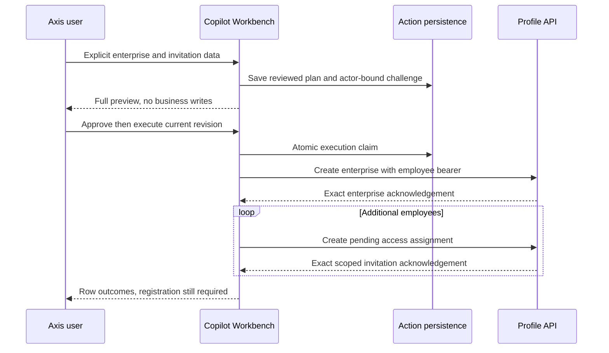

# Enterprise Creation And Employee Invitations

## Delivered Scope

Copilot prepares one enterprise and up to 20 additional employee invitations.
Profile owns enterprise creation, its default administrator invitation, access
assignments, registration and notification. This action does not activate employee
accounts, assign passwords or create an alternative identity store.

The conversational entry accepts explicit JSON. Optional, default-off Core intent
planning extracts only supplied values from supported prose through the existing
provider/accounting owner; ambiguous values require clarification.
`POST /v0/enterprises/prepare` accepts the same explicit body.
Collection-centre configuration and coupon redemption are not supported by this
adapter. Product preparation remains separate.

## Runtime Setup

1. Compose Copilot API, Core, Policy, Conversation and Workbench, and the existing
   Profile enterprise owner. Enable Copilot explicitly.
2. Configure `copilot.workbench.enterpriseTarget` in the approved configuration
   layer: `enabled: true`, the actual Profile `moduleName`, its registered
   `connectionName` and the module client's `targetAuthority` when needed. The
   default is off. Do not supply a user URL or add kickoff orchestration.
3. Provision independent `copilot.mutation.prepare`, `copilot.mutation.execute`,
   `profile.enterprise.create` and `profile.enterpriseAccess.assign` permissions.
   Profile still enforces its platform-administrator and enterprise checks.
   Preserve the employee bearer token; internal credentials are not a fallback.
4. Provision generated action persistence with atomic conditional claims. Read
   [governed actions](governed-actions.md) for approval and storage contracts.
5. Use a disposable test enterprise for authenticated acceptance. Source tests
   and synthetic Axis screenshots do not provision a live enterprise.

## Business Journey

1. Open **AI & Copilot > Copilot Conversation** in the intended administrator
   context. The audit remains bound to the initiating tenant/enterprise/actor;
   the destination enterprise code does not replace the initiating identity.
2. Supply explicit data. This example is fictional, not production test data:

```json
{
  "operation": "profile.enterprise.onboard",
  "enterprise": {
    "code": "DEMO_AI",
    "name": "Demonstration Enterprise",
    "adminEmail": "admin@example.invalid"
  },
  "employees": [
    { "email": "one@example.invalid", "roleCode": "OPERATOR" },
    { "email": "two@example.invalid", "roleCode": "VIEWER" }
  ]
}
```

3. Missing enterprise code/name/administrator email or the employees list returns
   clarification. Resubmit the complete corrected command; cross-turn automatic
   merging is not implemented. An explicit empty list means only the default
   administrator invitation. Duplicate emails, unknown fields, injected tenant
   or credentials and unsupported roles are rejected, not guessed.
4. Inspect every field in the confirmation's scrollable review: enterprise,
   administrator email and each employee email/role. The invitation count includes
   the default administrator. Preparation makes no business write.
5. Approve the current digest/revision. Approval still makes no business write.
6. Execute once. Copilot rechecks grants and target, atomically claims the action,
   calls Profile enterprise creation, then submits additional invitations
   sequentially. Profile authorizes and validates each operation.
7. Inspect row outcomes. Enterprise creation does not prove all invitations
   succeeded. Invitees still follow Profile registration and activation.



## Uncertainty And Recovery

Each Profile call is attempted once with a stable action/row idempotency key.
A success envelope must acknowledge the exact enterprise or pending invitation
identity, email, role and enterprise. A missing or mismatched response stops later
rows with an uncertain outcome. Copilot never assumes rollback, retries that
command or deletes completed records as compensation.

Read the action with the original authorized identity. With qualified native
command receipts, the explicit original-result inspector can reconcile exact
Profile completion and renew approval for never-started rows. It never retries
an uncertain invitation. See the canonical original-business-results guide.
A changed target, actor, enterprise, argument,
expiry or revision invalidates the reviewed authority. Revocation between rows
stops subsequent submissions.

## Standalone Invitations

`DefaultCopilotInvitationActionService` separately supports
`profile.enterprise.invite` for an existing enterprise using
`{ operation, enterpriseCode, employees: [{ email, roleCode }] }`.
It requires `standaloneInvitationsEnabled: true`, the existing Profile target,
Copilot preparation/execution grants and `profile.enterpriseAccess.assign`, not
enterprise-create permission. Profile remains the destination access authority.
`POST /v0/invitations/prepare` and conversation input use the same contract.
Run `test/copilotStandaloneActions.test.js` with the enterprise/executor tests.

## Customization And Verification

Keep Profile's creation/invitation contracts authoritative. Extend explicit owner
adapters with a complete inert review, digest binding, fresh authorization and
exact result evidence. Do not generalize this into arbitrary URLs or schema
status writes. Nested structures require an explicit review projection.

Run `test/copilotEnterpriseAction.test.js`, action-execution and Core acceptance
tests, plus Axis `AssistantConfirmationCard.test.tsx`. Coverage includes missing
input, denied grants, altered plans/targets, ambiguous persistence, employee
credentials, partial outcomes and no replay. These focused tests use isolated
doubles. The separate opt-in `test/copilotEnterpriseRuntime.live.test.js` uses
actual Profile authentication, tenant namespace admission, generated MongoDB
persistence, native HTTP execution and local Ollama.

### Disposable Native Acceptance

Use the opt-in variables and local prerequisites in Core's
[`persistent-local-acceptance.md`](../../../copilotCore/llm/examples/persistent-local-acceptance.md).
Run the live file with `node --test`. The fixture is never a production module.

1. Create an owned Local composition with distinct random master/test databases.
   Reserve only absent provider-derived namespaces for `acceptance_business`.
   Native Profile deployment grants, namespace binding and runtime authentication
   remain enabled and mandatory; no default-tenant proof is relabeled.
2. Sign in as the reader and require a preparation denial. Sign in as the
   operator and require clarification for missing enterprise details.
3. Prepare one enterprise plus three employee invitations. Query Profile to
   prove zero enterprises before and after approval. Execute once, then verify
   one enterprise and exactly four PENDING invitations, including its admin.
4. Repeat in a fresh composition with one response dropped only after the real
   native enterprise command completes. Later invitation rows stay NOT_STARTED.
   Restart, deny the reader's inspection, and verify the retained unknown state.
5. Inspect the exact native command receipt. Inspection starts no invitations.
   Approve the renewed revision, execute only the remaining three rows and verify
   exactly one native enterprise creation acknowledgement across the whole run.
6. Repeat in a fresh composition using ordinary prose through actual local
   Ollama. Require the expected typed review and measured usage before any native
   write. Repeating the original conversation turn creates no second model charge.
7. Restart after completion and verify the same confirmation and native records.
   Teardown drops only the owned random databases and reserved derived namespaces.

The normal scenario additionally prepares a standalone VIEWER invitation to the
new existing enterprise. It refuses a reader, invalid role and stale execution
revision, clarifies an omitted role, and proves preparation/approval create no
invitation. One explicit execution produces exactly one additional PENDING
invitation; its original completion and total of five invitations survive restart.

All three scenarios pass on the supported local replica-set profile. This is
authenticated API acceptance, not proof of notification delivery, invitee
registration or distributed failover.

### Full Axis Recovery Walkthrough

The separate four-runtime Axis acceptance composition uses the same native
owners, actual Profile sign-in and local Ollama. Enable the disposable session's
`NODICS_COPILOT_ENTERPRISE_ACCEPTANCE=1` and
`NODICS_COPILOT_ENTERPRISE_RESPONSE_LOSS=1` options together with the Axis,
registration, Ollama and budget options in the persistent acceptance guide.
These fault options belong only to the test fixture, never runtime defaults.

1. Initialize and publish the owned Axis application through its normal workflow.
   Sign in as the fixture operator. Open AI & Copilot, then Conversation.
2. Ask to create `acceptance_business`, named Disposable Copilot Business, with
   administrator `admin@acceptance.invalid`. Request three invitations:
   `one@acceptance.invalid` as OPERATOR, `two@acceptance.invalid` as VIEWER and
   `three@acceptance.invalid` as CONTENT_MANAGER. These are synthetic addresses.
3. Review every field on desktop and a 390px mobile viewport. Approve, then
   execute explicitly. The test fault loses the first successful enterprise
   response; the UI must show OUTCOME_UNKNOWN and three NOT_STARTED invitation
   rows, with original inspection available and no execute/retry control.
4. Restart the backend and reload the recorded conversation. Inspect original
   business results. The enterprise row becomes COMPLETED, while all three
   requested invitations remain NOT_STARTED. Native Profile queries must show
   one enterprise and only its administrator invitation at this point.
5. Review and approve the new revision, then execute. Expect four COMPLETED
   action rows. Profile must contain exactly one enterprise and four PENDING
   invitations. Fixture diagnostics must record one enterprise acknowledgement
   and one lost response, not a second enterprise execution.
6. Start another conversation requesting a fourth VIEWER invitation. Reload
   while Ollama is working, then reopen that conversation from history without
   resubmitting. Its original review must recover. Reject it and confirm that
   Profile still contains four invitations. In the captured local run, usage
   remained two calls, 663 consumed tokens and zero reserved/pending tokens.
   Token totals vary with model and prompt; equality across recovery is the rule.
7. Check the completed and uncertain states at desktop and 390px widths, and
   reach the action controls by keyboard. Restore the viewport and close the
   disposable session. Require every owned cleanup resource to be CLOSED.

The canonical [original-results guide](../../../../../nodics.docs/docs/pages/nodics.copilot/original-business-results.md)
contains signed-in screenshots. Browser evidence covers this local enterprise
journey, not all Axis business operations. It does not demonstrate delivered
invitations, activated employee accounts or future external logging systems.
