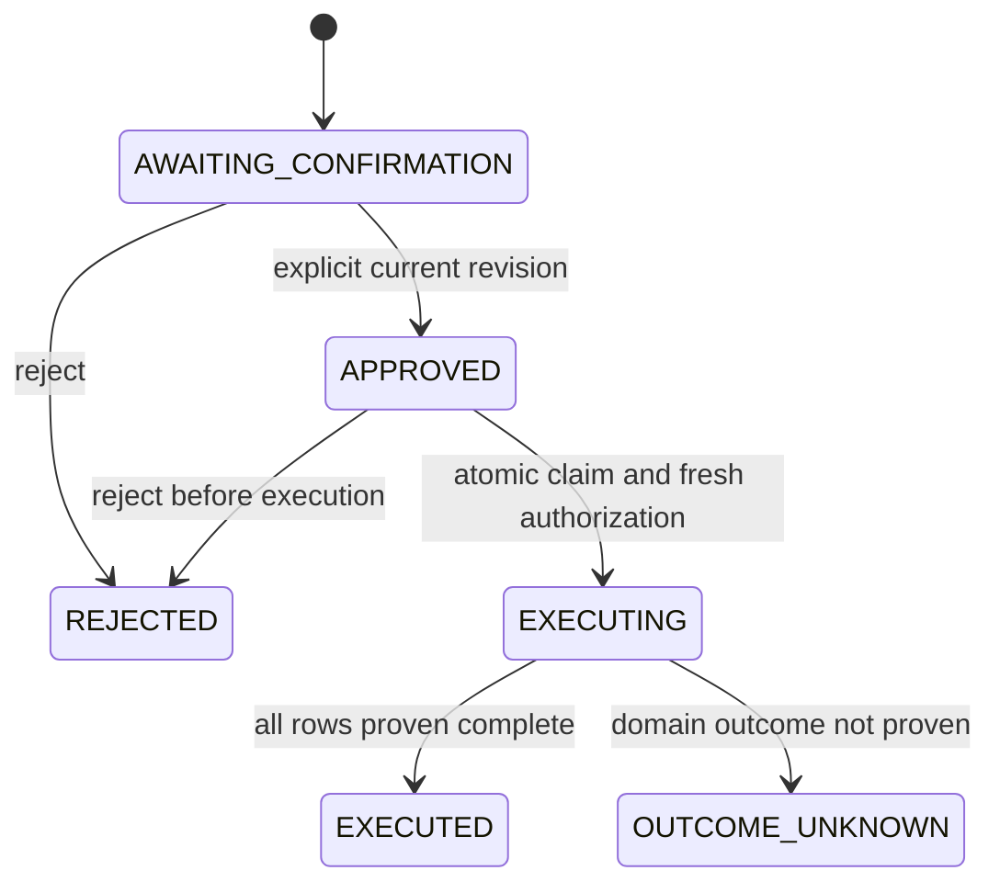

# Governed Actions Guide

## Scope and Prerequisites

This guide covers Product and related PriceRow preparation. The separate
[enterprise and invitation adapter](enterprise-invitations.md) prepares Profile
enterprise creation and pending employee invitations. The
[collection-centre adapter](collection-centres.md) delegates reviewed Waste
records, and [secure coupon fulfillment](secure-coupon-fulfillment.md) provides
masked input and Commerce-owned receipt inspection. These are typed adapters,
not a generic implementation of every Axis operation. Invitations do not activate
employee accounts.

The selected runtime must compose Copilot API, Policy, Conversation, Workbench,
Core and the owning Product/Pricing APIs. Copilot must be enabled explicitly.
The employee needs the applicable preparation/execution permissions plus the
domain permissions enforced at each owning API. Select an enterprise first.
Configure `copilot.workbench.target` through the existing layered configuration;
do not place implementation code in a customer kickoff module.

## Supported Action Inventory

The Workspace catalogue derives these entries from the Capability owner, filtered
by current employee permissions. It has no generic handler that can execute any
Axis screen. `IMPLEMENTED` means source implementation; disabled deployment targets,
domain denials and missing persistence qualification still prevent execution.

| Operation | Owning Execution Path | Outcome Evidence | Recovery |
| --- | --- | --- | --- |
| `commerce.product.create` | Workbench resolves Product/Pricing schema owners and uses employee APIs | Private original Product/PriceRow command receipts when admitted | Explicit receipt inspection; fresh approval only for never-started rows |
| `profile.enterprise.onboard` | Profile enterprise creation and pending access assignments | Private original setup/invitation acknowledgements, not activated accounts | Current native authority and original receipts; no uncertain setup replay |
| `profile.enterprise.invite` | Profile pending invitations to an existing enterprise; no enterprise creation | Exact native invitation receipt, not an activated employee | Original inspection and fresh approval for never-started invitations |
| `commerce.price.create` | Pricing generated price-row authoring; no product creation or publication | Exact native price-row receipt | Original inspection and fresh approval for never-started prices |
| `waste.collectionCentre.create` | Waste Collection, with existing canonical location references | Private original collection-centre create receipt when admitted | Explicit receipt inspection; no inference from record existence |
| `commerce.coupon.redeem` | Digital Core's sensitive merchant fulfillment contract | Bound original merchant receipt | Explicit original-receipt inspection may reconcile the action; never repeat redemption |

Every adapter requires preparation and execution authorization at the appropriate
step. The visible catalogue is not approval, configured routing or domain access.
Enterprise preparation independently needs enterprise creation and assignment
grants; coupon preparation independently needs the merchant redemption grant.
Product/Pricing and Waste enforce their current schema/domain permissions on
each actual owner request. Scope restrictions continue to apply to the catalogue.

Issue assistance and product discovery remain adapter-required. Cart proposals
and checkout execution remain future descriptors. They must not be displayed or
documented as executable merely because another CRUD adapter exists. Add future
adapters in their owning framework layer with explicit receipt and recovery
contracts, not in a customer kickoff module or through arbitrary model-generated
URLs. See the [original-result operator guide](../../data/docs-v001/records/documentation/copilotWorkbenchDocumentationComponentData.js) for native journal admission, current permissions and remaining uncertainty boundaries.

## Prepare and Review

1. Open Copilot Workspace, then start or resume a conversation.
2. Review the operation catalogue. Implemented means a source contract exists;
   it does not guarantee that the current runtime target is configured or healthy.
   Adapter required and Planned entries cannot become executable merely by
   appearing in this catalogue.
3. For the Product adapter, supply count, name, code prefix, catalog version,
   price book, currency and price to `POST /v0/products/prepare` on copilotApi.
   Missing required input returns clarification; do not invent business values.
4. Review the primary and related records in the preview. Both groups are
   validated. Validation errors identify the schema and row index.
5. Send explicit approval through
   `POST /v0/confirmations/:confirmationCode/approve`, including the displayed
   `expectedRevision` and `argumentsDigest`.
6. Use the returned revision for execution. Approval alone writes no business
   record. A changed revision, digest, enterprise, target or expired approval
   requires a fresh review; never override the conflict in the frontend.
7. Execute through `POST /v0/confirmations/:confirmationCode/execute` with the
   approved revision and digest. Keep the authenticated employee context.

## Execution and Outcomes

Each row is NOT_STARTED, RUNNING, COMPLETED or OUTCOME_UNKNOWN. The UI shows
persisted row identities and states without rendering raw domain response bodies.
Two concurrent requests cannot both claim the same approved revision. Idempotency
keys are passed to the owning API, but are not a substitute for owner-side
idempotency and are not an exactly-once guarantee across distributed systems.

## Investigate an Uncertain Outcome

1. Do not click Execute again or create a replacement task for the same records.
2. Read `GET /v0/confirmations/:confirmationCode` using the same authorized actor,
   tenant and enterprise. The response includes the current revision and row states.
3. Preserve the action code, schema and record code. COMPLETED rows are already
   confirmed; later NOT_STARTED rows were not submitted by this attempt.
4. Ask an authorized operator to inspect the owning domain's record and audit
   evidence for the RUNNING or OUTCOME_UNKNOWN row. A matching code alone is not
   proof that this exact attempt created it.
5. Use the original-result inspector for admitted Product/PriceRow, enterprise
   and collection-centre actions. Only proven original receipts unlock a fresh
   approval for never-started rows. Coupon retains its separate receipt inspector.
   Do not manually edit the action state, infer a rollback, or retry on a timeout.
   If persistence failed after a domain write, the UI may show an unknown result
   while the stored action still says EXECUTING. This is deliberately unresolved.

## Cancel, Reject and Reverse

Reject applies only before execution starts. Conversation cancellation concerns
the conversational turn; it does not roll back Product or PriceRow records.
Reversal requires the owning domain's explicit authorized operation and is not
implemented by deleting completed rows in Copilot. There is no generic undo.

## Migration and Customization

1. Deploy the matching backend and Axis client together in a test runtime.
2. Keep old actions as evidence. Version-1 challenges, actions without an
   enterprise binding, and stale revisions cannot execute under version 2.
3. Prepare and review a new action rather than upgrading old approval authority
   automatically. Do not backfill a tenant-wide default enterprise onto approvals.
4. Verify generated action persistence supports atomic conditional updates and
   returns `matchedCount: 1` (or an unambiguous `modifiedCount: 1`). Unknown
   acknowledgement shapes fail closed; adapt at the persistence contract owner.
5. Extend capability descriptors in the appropriate framework/domain layer with
   risk class, permissions, restrictions and explicit maturity. Do not fork a
   second operation registry in Axis.
6. A new mutation adapter must preserve whole-plan digest binding, current-user
   authorization, CAS claims, bounded row evidence and no blind retry. General
   long-running workflows belong to Process; domain compensation stays domain-owned.

## Validation Boundary

Automated tests simulate conditional persistence, concurrent claimants, price-row
tampering, expired approvals, enterprise changes and response loss. Axis tests
cover duplicate clicks, partial result presentation and hidden retry controls.
These are not live authenticated business acceptance or database crash testing.
The action audit stores current revision and row evidence, not a complete immutable
administrative audit log. Admin transcript controls and audit record links remain
separate requirements.
