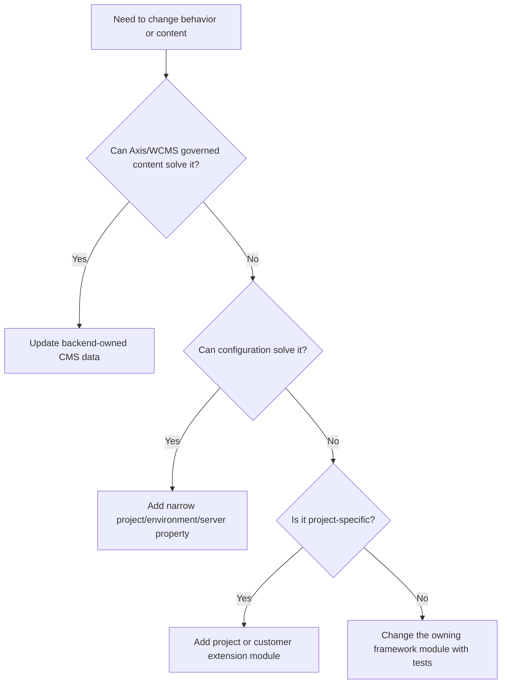

# Customization and extension guide

Nodics is built for customization, but customization must happen in the right
owner. The safest path is to reuse an existing capability, configure it, extend
it in a later-loaded module, and create new framework behavior only when the
existing contract truly cannot satisfy the requirement.

For a beginner, customization means “where should I put my change so I can
still upgrade the framework later?” The safest answer is usually configuration
first, then a customer project module, then a customer extension module, and
only then a framework change if the behavior is truly reusable for everyone.

## What this is

This guide explains how a customer or partner changes Nodics behavior without
turning a customer project into a fork of the framework. It applies to backend
customization, Axis presentation customization, and documentation ownership.

## The customization ladder

Start with the least invasive option:

1. Use existing behavior.
2. Change configuration in the correct project, environment, server, node, or
   tenant scope.
3. Add customer project modules under the customer project.
4. Add a customer extension module that extends a framework functional module.
5. Create a new implementation only when the existing capability contract is
   missing or incorrect.

This ladder protects upgradeability. The later a customization loads, the more
specific it is. Framework modules stay reusable; customer modules carry
customer decisions.

| Customization level | Who should use it | Beginner example | Upgrade risk |
| --- | --- | --- | --- |
| Axis/WCMS content | Business user or content admin | Change a heading, image, documentation page, or dashboard card. | Low, because backend content is governed and versioned. |
| Project configuration | Developer or operator | Change a local port, database name, or feature override for one environment. | Low when the property stays narrow. |
| Project module | Developer | Add Kickoff-specific schema fields or business services. | Medium, because tests must prove the behavior. |
| Customer extension module | Senior developer | Override Platform behavior while keeping the Platform functional identity. | Medium to high, because service precedence must be explicit. |
| Framework module change | Framework team | Improve Core import behavior for every project. | Shared release risk, so it needs broader validation. |
| New functional module | Architecture owner | Add Commerce, Workflow, or another independent capability. | High if ownership is blurry. |

## The role an AI tool or developer must play

Nodics is too broad for a narrow “make the code pass” mindset. A developer or
AI assistant working on Nodics must deliberately switch through several
perspectives before changing files. This is not ceremony; it is how the
framework avoids accidental shortcuts that work for one screen and break the
ecosystem.

| Role | Question to ask before coding | Example |
| --- | --- | --- |
| Business analyst | What problem is the user, operator, partner, or business evaluator trying to solve? | If the request is “register Cron,” explain the lifecycle and what business capability becomes available, not only the button click. |
| Enterprise architect | Which module, runtime, tenant, security boundary, and release unit owns this behavior? | Module registration is Platform/BackOffice state; Axis renders it; Cron only reports its runtime availability. |
| Nodics framework expert | Is this Core, Platform, WCMS, Cron, Axis renderer, customer project, or customer overlay work? | A documentation content pack belongs in the backend owner, not in the frontend repository. |
| Domain expert | Could this pattern apply to commerce, telco, logistics, content, workflow, or another domain without becoming domain-locked? | A media picker should be reusable for product media, CMS media, and future workflow attachments. |
| Principal engineer | Can configuration or extension solve this before new framework code is written? | Prefer a server property, content component property, or customer module overlay before editing a framework default. |
| QA and tester | What small failure will a user notice after the happy path succeeds? | Register/activate/deactivate buttons must refresh state immediately without forcing login or page reload. |
| TechOps/DevOps reviewer | How will this run, restart, roll back, and be diagnosed in local and production topology? | A fresh bootstrap script must drop only named local databases and refuse to run if unrelated servers occupy the expected ports. |

If these roles point to different answers, document the trade-off before
implementation. For example, a browser-only workaround may be fast, but if the
real authority is a backend registry, the correct fix belongs in the backend
contract or typed client flow.

## Coding principles that protect customization

Nodics code should be written so future customer projects can extend it without
copying framework files. Use these rules as the practical checklist:

1. Prefer configuration first. If behavior can be changed through properties,
   feature metadata, content component properties, server/environment deltas, or
   tenant configuration, do that before changing code.
2. Put files in the owner that matches the behavior. Error/status definitions
   belong in status-definition files, API exposure belongs in owning module
   properties, runtime topology belongs in server configuration, and renderer
   code belongs in Axis.
3. Keep JavaScript export-friendly. Prefer small exported functions, services,
   and configuration objects over sealed inline behavior, so a later customer
   module can override or compose the behavior through Nodics loading.
4. Document the file and exported behavior. A future AI tool may read only the
   nearest file and `AGENTS.md`, so ownership, override path, side effects, and
   test expectations must be visible.
5. Treat generated data as output. If CMS documentation, import manifests, or
   generated records are wrong, fix the source and regenerate; do not hand-edit
   generated projections.
6. Keep public and private configuration separate. Browser-visible values,
   runtime coordinates, secret references, and actual secrets have different
   owners and different storage rules.
7. Test both the owner and the integration. A service override needs focused
   tests; a runtime graph change needs startup/acceptance tests; a frontend
   state change needs UI or smoke coverage.

## Backend customization

Backend behavior belongs in the backend project or module that owns the
business rule. In Kickoff, project modules live under `modules/`, while
environment and server composition live under `envs/`.

A future module such as `kickoff.platform` may extend `nodics.platform` to
customize Platform services. The runtime server can load the customer extension
after Platform. Service precedence then follows the normal module merge and
index order. Axis should still display the functional capability as Platform,
because the customer extension changes implementation, not the business-facing
identity.

## Axis customization

Axis is the browser application. It owns renderers, interaction behavior,
layout, accessibility, and static recovery. It must not own imported CMS data,
backend schemas, permissions, or business rules. If a customer needs a new
BackOffice page, the backend should expose the authorized navigation,
capability metadata, API contract, and CMS content where applicable. Axis then
renders that authorized contract.

Simple presentation changes, such as logo, copy, theme, or demo content, should
come from backend-owned CMS or configuration where possible. Hard-coding those
values in the frontend makes future customers harder to support.

## Business and DevOps impact

The business value of this discipline is lower long-term cost. A customer can
receive framework upgrades without reapplying hidden edits. DevOps teams also
gain a clean release story: framework packages, customer modules, environment
properties, and imported content packs can be rolled forward or backward as
separate operational units.

For production support, every customization should answer three questions:
which module owns it, which runtime loads it, and which test or document proves
the intended behavior? If those answers are missing, the customization is not
ready for a production release.

## Documentation customization

Documentation follows the owner of the thing being explained:

- framework guidance goes to `nodics.docs`;
- Axis product guidance goes to `nodics.platform/modules/axis`;
- project guidance goes to the owning customer project, such as
  `nodics.kickoff`;
- generated content records stay under `data/core/data/documentation`;
- manifests stay under `manifest/docs-content-pack.json`.

Do not put customer project documentation into `nodics.docs`, and do not put
importable documentation records into `nodics.axis`.

## Common mistakes

- Editing framework source for one customer.
- Adding business authorization in the browser.
- Creating a second module registry or endpoint list in Axis.
- Moving generated CMS data into a frontend repository.
- Changing a functional module display name because an implementation was
  customized.
- Skipping tests after service override changes.

## Verification

Every customization should prove success and failure behavior. For backend
changes, run the owning module tests and any affected runtime smoke test. For
Axis changes, run typecheck and focused UI tests. For documentation changes,
regenerate the owning content pack, validate checksums, import through WCMS,
and verify the route in Axis.
