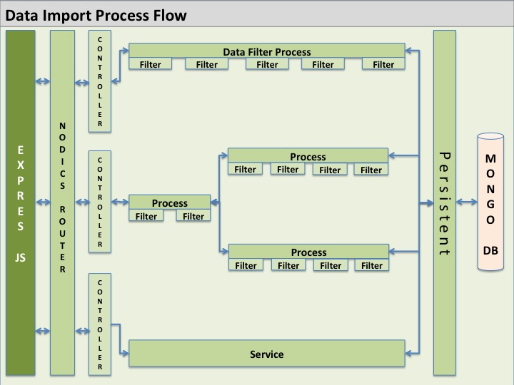
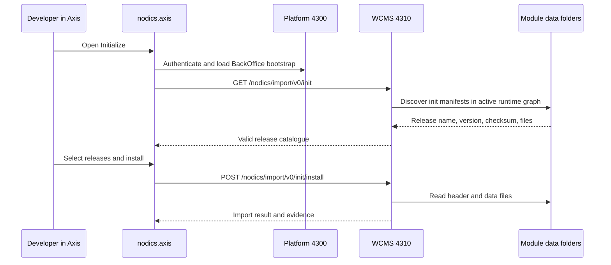
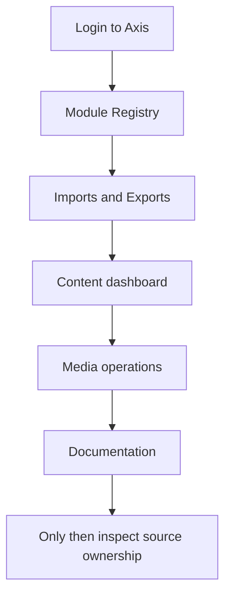

# Local quick start with Kickoff and Axis

This guide starts the local reference stack from zero. It is written for a
developer who is new to Nodics and wants to see the framework, BackOffice, WCMS
documentation, and Axis working locally.

For a beginner, the goal is not to understand every internal module on the
first day. The goal is to prove that the framework can start, authenticate,
import governed content, show documentation, and expose a safe BackOffice
workspace before any custom business code is written.

For a business evaluator, this quick start demonstrates adoption friction. If a
new partner can clone the framework, run Kickoff, and see Platform, WCMS, Cron,
and Axis working together, then the framework is easier to evaluate than an
architecture that exists only on slides.

## What you will run

The reference setup uses three projects:

- `nodics.ai` contains framework backend modules.
- `nodics.kickoff` is the reference customer project and local server owner.
- `nodics.axis` is the BackOffice frontend.

Kickoff starts backend servers. Axis connects to Platform, authenticates an
employee, reads the BackOffice bootstrap contract, and renders workspaces and
documentation from registered backend sources.

## Business outcome of the quick start

After this guide succeeds, the business-facing proof is simple: a customer
project can run the framework without forking framework code, content can be
managed through backend-owned packs, and operators can see which capabilities
are live. That is the first adoption story Nodics must make boring and
repeatable.

## Prerequisites

Install Node.js and npm versions compatible with the repositories. Start
MongoDB before starting the backend. Elasticsearch and Redis may be needed when
their providers are enabled by configuration; disabled providers may produce
informational logs and are not a failure in the reference setup.

## Step 1: configure Kickoff

Open `nodics.kickoff`:

```bash
cd ../nodics.kickoff
cp .env.example .env
```

Edit `.env`:

```bash
NODICS_FRAMEWORK_ROOT=../nodics.ai
```

This tells Kickoff where the framework checkout lives. The path may be
absolute or relative to the Kickoff project root.

Generate local framework links and install:

```bash
npm run configure:framework
npm install
```

The configure step creates local links under `.nodics/framework`. That folder
is machine-local and must not be committed.

## Step 2: start backend servers

Use separate terminals from `nodics.kickoff`.

Start Platform:

```bash
npm run start:platform
```

Platform provides employee authentication, Profile, BackOffice bootstrap,
runtime module registry, documentation-source registry, and Platform APIs.
Local HTTP port: `http://localhost:4300`.

Start WCMS:

```bash
npm run start:wcms
```

WCMS owns CMS sites, content catalogs, pages, components, routes, media, and
documentation content-pack delivery. Local HTTP port:
`http://localhost:4310`.

Start Cron when scheduled work is needed:

```bash
npm run start:cron
```

## Step 3: start Axis

Open `nodics.axis`:

```bash
cd ../nodics.axis
npm install
npm run dev
```

Open `http://localhost:3100`.

## Step 4: log in

Use the reference employee:

```text
Enterprise: default
Username: admin
Password: adminPassword
```

After login, open `http://localhost:3100/docs`. You should see Framework,
Swaggers, Nodics Axis, and Nodics Kickoff.

## What “initial data import” means

The local stack does not become useful only because the servers start. The
servers also need governed data: catalogs, Profile records, WCMS sites, Axis
pages, documentation routes, module registry records, and sample data. Axis
shows this through the Initialize experience.





If Axis says `INVALID RELEASE`, do not ignore it. That means the manifest
checksum does not match the current files. Run the framework manifest generator
from `nodics.ai` before importing again:

```bash
node nodics.core/modules/nTooling/bin/generate-data-release-manifests.js
```

Then restart the affected backend server so it rediscovers the updated
manifests. In local development the most common affected server is WCMS
because the Initialize page reads import catalogues from port `4310`.

## Fresh database test

For the safest repeatable local verification, use the Kickoff acceptance
runner from `nodics.kickoff`:

```bash
npm run acceptance:local:fresh
```

This command drops only the local reference databases:

```text
kickoffLocal
kickoffLocalWcms
kickoffLocalCron
```

It then starts Platform, WCMS, Cron, and Axis if they are not already running;
waits for each server; logs in as the reference admin user; checks the module
registry; imports and verifies Framework, Axis, and Kickoff documentation
content packs; verifies CMS counts; opens the important Axis routes; and runs
the live Axis smoke gates for module registry, documentation packs, and Cron
lifecycle. The runner stops the servers it started after the checks complete;
pass `--leave-started` if you intentionally want to keep the local stack
running for manual inspection.

The fresh runner intentionally refuses to drop databases when local Nodics
ports are already busy. Stop Platform, WCMS, Cron, and Axis first so the test
really proves a clean bootstrap. If you only want to verify the stack that is
already running, use the non-destructive command:

```bash
npm run acceptance:local
```

When you drop local MongoDB schemas to test from zero, use this order:

1. Stop Platform, WCMS, Cron, and Axis.
2. Drop only the local Nodics development databases you intentionally want to
   reset.
3. Start Platform and wait until it finishes module loading.
4. Start WCMS and wait until it finishes module loading.
5. Start Cron only if you want to test optional module registration.
6. Start Axis and log in with the reference admin user.
7. Open Initialize and import required `init`, then `core`, then `sample`
   releases as needed.

Do not drop databases in a shared or production-like environment from this
guide. This quick start is only for local developer machines.

## Manual server checklist

Use this checklist if something looks wrong:

| Check | Expected result |
| --- | --- |
| `http://localhost:4300` | Platform server is listening. |
| `http://localhost:4310` | WCMS server is listening. |
| `http://localhost:3100` | Axis Vite dev server is listening. |
| Axis login | `default / admin / adminPassword` logs in. |
| Documentation dashboard | Framework, Swaggers, Nodics Axis, and Nodics Kickoff are visible after content import. |
| Initialize screen | Releases are grouped by selected data type and do not repeat across Init/Core/Sample. |

## Troubleshooting

If Axis says the BackOffice registry is unavailable, Platform is not reachable
or still starting. Check the Platform terminal and confirm port `4300`.

If CMS documentation is unavailable, WCMS is not reachable, the content pack
has not been imported, or the imported version is stale. Check port `4310` and
the content-pack import status.

If npm cannot resolve framework packages, rerun `npm run configure:framework`
after checking `NODICS_FRAMEWORK_ROOT`.

## What success looks like for each reader

The quick start is successful only when different readers can see their own
evidence, not merely when terminal processes stay open.

| Reader | Evidence they should see | Why it matters |
| --- | --- | --- |
| Business evaluator | Axis opens, login succeeds, dashboards and documentation are visible. | Proves the framework is not only an architecture idea; it has a runnable business workspace. |
| Developer | Platform, WCMS, and Cron start from Kickoff without editing framework source. | Proves customer projects compose the framework through configuration and dependencies. |
| Architect | Module Registry shows mandatory and optional functional modules at the correct level. | Proves business capability identity is separated from internal technical modules. |
| Operator | Ports, runtime logs, import releases, and module lifecycle states are observable. | Proves the stack can be diagnosed without guessing from frontend behavior. |
| QA engineer | Fresh acceptance can recreate the local system from empty databases. | Proves the demo is repeatable and not dependent on accidental local state. |

If one reader's evidence is missing, the quick start is not complete. For
example, a developer may see servers running, but a business evaluator still
cannot evaluate Nodics if Axis documentation is missing. Likewise, Axis may
open, but an operator cannot trust the bootstrap if content packs show checksum
errors or stale releases.

## First guided walkthrough after login

After login, use this short walkthrough before changing any code:

1. Open **Dashboard** and confirm Axis is in the authenticated workspace, not
   the static recovery screen.
2. Open **System and Integrations > Module Registry** and confirm Core,
   Platform, and WCMS are mandatory active capabilities.
3. If Cron is running, register and activate Cron, then deactivate and
   deregister it to understand the optional module lifecycle.
4. Open **System and Integrations > Imports and Exports** and review
   initialization, core, sample, file import, export, and history tabs.
5. Import missing documentation packs if a fresh database was used.
6. Open **Content and Experience > Content** to see the content dashboard.
7. Open **Content and Experience > Media** to see governed media operations.
8. Open **Documentation > Nodics Documentation** and read Framework, Swaggers,
   Nodics Axis, and Nodics Kickoff.

This walkthrough intentionally uses Axis screens first. A beginner should see
the framework's behavior before reading internal files. Once the user sees the
running product, repository structure becomes easier to understand.



## First safe customization exercise

The first customization should be intentionally small. Do not begin by editing
Core, Platform, WCMS, or Axis source. A good beginner exercise is to change
project-owned documentation or demo content in the customer project, regenerate
the project documentation pack, import it through Axis, and verify the updated
page.

The learning outcome is important:

- the source content lives in the owner project;
- generated data lives under the owner project's generated data folder;
- the manifest checksum changes with the content;
- WCMS imports the release;
- Axis renders the result from backend delivery contracts;
- no frontend renderer or framework source file is edited.

That small exercise teaches the full Nodics pattern: owner first, generated
data second, import through governance, render through Axis, verify through the
running system.

## Beginner glossary

| Term | Plain-language meaning |
| --- | --- |
| Framework repository | Reusable Nodics backend capabilities, currently `nodics.ai`. |
| Customer project | The adopting project that composes and customizes the framework, such as the reference project. |
| Functional module | Business-facing capability group such as Platform, WCMS, Cron, or Docs. |
| Technical module | Internal implementation unit under a functional module group. |
| Runtime server | A process that loads a configured module graph and exposes APIs or background behavior. |
| Axis | Browser BackOffice renderer that discovers backend capabilities. |
| Content pack | Versioned backend-owned data release imported into WCMS. |
| Manifest checksum | Integrity evidence proving the release files match the manifest. |
| Registration | Persisted project decision to accept an observed optional functional module. |
| Activation | Persisted project decision that a registered module should be usable. |

## Next actions

Once the reference stack is running, read the customization guide before
changing code. Use Axis customization for presentation and project modules for
backend behavior.
