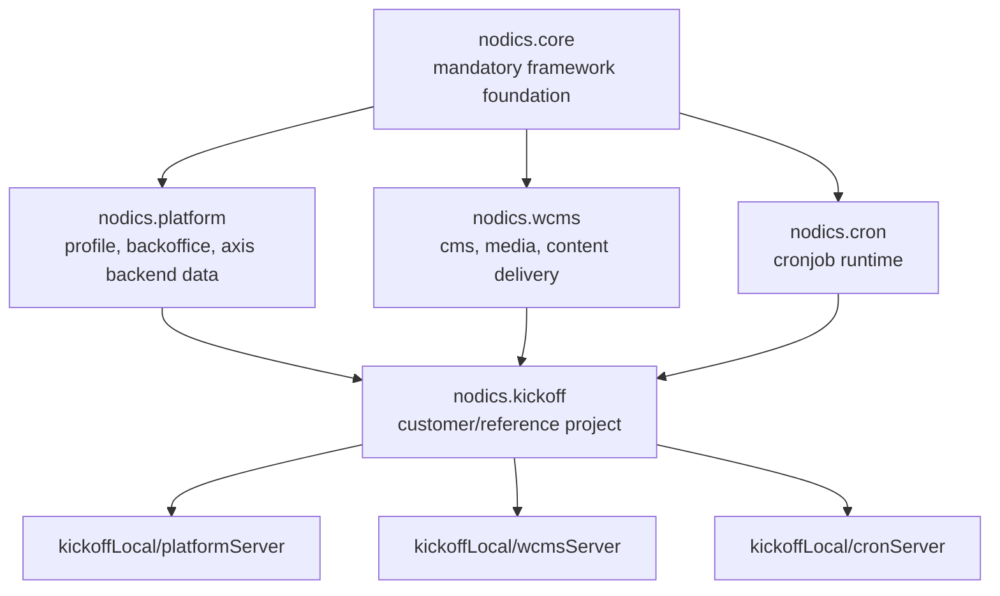
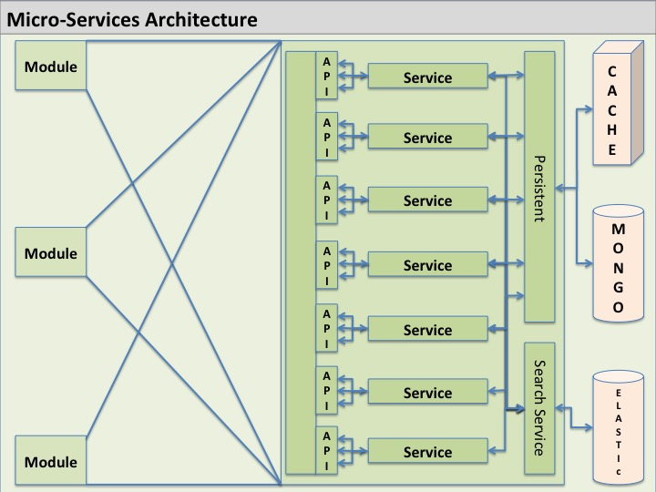
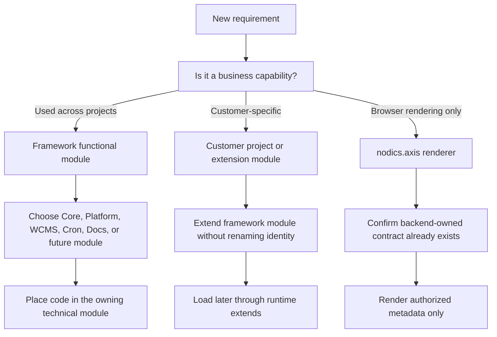

# Modular architecture and ownership

Nodics is organized around ownership. Every meaningful behavior should have a
capability owner, and every runtime server should load an explicit chain of
modules. This is what lets a local reference project stay small while the same
framework can later support larger distributed deployments.

## What this is

The modular architecture defines how framework modules, functional module
groups, customer projects, environment modules, server modules, and services
fit together. It prevents the common failure where code is placed wherever it
first works and nobody can later tell which component owns the behavior.

## Functional modules and technical modules

A functional module is the business-facing capability identity. Examples are
`nodics.core`, `nodics.platform`, `nodics.wcms`, and `nodics.cron`. Axis and
BackOffice talk about these capabilities at this level because business users
do not need to manage every internal technical module.

A technical module is an implementation unit inside a functional module group.
For example, Core contains many technical modules for configuration, data,
services, routing, validation, cache, and system behavior. Those modules are
important to developers, but they should not flood the module registry user
experience unless a business capability genuinely needs to expose them.

## Runtime server composition

Repository dependencies only make code available. Runtime `extends`
configuration decides what actually loads. A Platform server normally loads
Core first, Platform second, then project and environment/server modules. A
WCMS server loads Core, WCMS, and project modules. A Cron server loads Core,
Cron, and project modules.

The order matters because service override and merge behavior follow runtime
load order and module indexes. Module hierarchy describes functional
availability; service precedence describes which implementation wins at
runtime. These are related but different concepts.

## Customer projects

Customer projects live outside `nodics.ai`. The reference project is
`nodics.kickoff`. It shows how a project can compose framework modules, provide
local environment configuration, add project modules, and contribute
project-owned documentation without copying framework source.

A future customer extension module such as `kickoff.platform` may customize
Platform behavior. That does not rename the functional capability. BackOffice
and Axis should still present Platform as Platform unless the customer
intentionally exposes a separate functional module.

## Ownership boundaries

- Framework source belongs in `nodics.ai`.
- Framework documentation content belongs in `nodics.docs`.
- Axis product documentation belongs in `nodics.platform/modules/axis`.
- Customer documentation belongs in the owning customer project.
- Browser renderers belong in `nodics.axis`.
- CMS records that are imported into a database must be owned by backend
  modules or backend projects, never the frontend repository.

## Current capability map

Use this map when deciding where new code, data, or documentation should live.

| Capability | Repository or module owner | Runtime role | Documentation owner |
| --- | --- | --- | --- |
| Core framework | `nodics.ai/nodics.core` | Mandatory base for every runtime server | `nodics.docs` |
| Platform and profile | `nodics.ai/nodics.platform` | Platform server capability for user onboarding, authentication, and registry-facing services | `nodics.docs` for framework behavior; `nodics.platform/modules/axis` for Axis product behavior |
| Axis backend content | `nodics.ai/nodics.platform/modules/axis` | Backend-owned CMS records that allow the Axis frontend to render product documentation and shell experience | `nodics.platform/modules/axis` |
| WCMS | `nodics.ai/nodics.wcms` | Content management runtime for sites, catalogs, pages, components, routes, and renderable content | `nodics.docs` |
| Media | `nodics.ai/nodics.wcms/modules/media` | Governed media and asset lifecycle used by content experiences | `nodics.docs` |
| Cron | `nodics.ai/nodics.cron` | Optional scheduled-job runtime capability | `nodics.docs` |
| Framework documentation | `nodics.ai/nodics.docs` | Backend content pack imported into WCMS; not a UI renderer | `nodics.docs` |
| Axis frontend | `nodics.axis` | Browser renderer for BackOffice, WCMS, docs, and module-owned capabilities | `nodics.platform/modules/axis` for product docs |
| Kickoff reference project | `nodics.kickoff` | Customer-style project that composes framework servers locally | `nodics.kickoff` |

The key rule is simple: a frontend may render content, but it should not own
database-importable content. If a page, component, catalog, route, or
documentation record is imported into WCMS, it must be shipped by the backend
module or project that owns that content.

## Runtime composition diagram



This picture shows the concept, not a Git repository dependency tree. The
important idea is that each server loads an effective runtime graph. A server
does not load every module in the workspace just because the files exist. It
loads the modules that are part of its configured extension chain.



The archived micro-service visual is not a command to split every feature into
a separate process on day one. It explains the direction of travel: modules
expose API/service contracts, persistence is hidden behind owning services,
and shared infrastructure such as cache, search, and databases are reached
through governed module contracts. A partner can begin with multiple runtimes
on one machine and later distribute Platform, WCMS, Cron, Commerce, or other
capabilities without changing the ownership model.

## Beginner reading path

For a beginner, read the architecture in two passes. First, ignore every
technical module and look only at the functional module chain: Core gives the
base framework, Platform gives identity and BackOffice, WCMS gives content,
Cron gives scheduled work, and Kickoff composes those capabilities for a local
project. That view explains what is available.

Second, look at runtime order. Runtime order explains which service
implementation wins when more than one module contributes the same service,
router, schema, or configuration. A beginner mistake is to assume that a parent
folder or package dependency controls behavior. In Nodics, installed packages
only make code reachable; the active server graph decides what is loaded.

## Module hierarchy versus service precedence

Two ideas are easy to mix together:

| Concept | What it answers | Example |
| --- | --- | --- |
| Functional module hierarchy | Which capability is available? | A WCMS server has the `nodics.wcms` capability, which itself depends on Core. |
| Service precedence | Which implementation wins at runtime? | If a customer module overrides a service after Platform loads, the later module implementation wins for that runtime. |

Functional hierarchy is about capability identity. Service precedence is about
runtime execution order. That is why a customer extension such as
`kickoff.platform` may customize Platform behavior while the functional module
name remains `nodics.platform` in Axis and BackOffice.

## Why `extends` is the right word

`extends` makes the architecture readable because a later module builds on an
earlier module. It does not mean every file is copied. It means the later
module participates in the same runtime composition and can add configuration,
services, routers, schema records, import data, tests, and documentation.

For example:

```text
platformServer
  extends kickoff project modules
    extends nodics.platform
      extends nodics.core
```

The exact physical folders can change. A customer may keep framework source in
one checkout and the customer project somewhere else. The contract is the
runtime graph, not the parent directory name on one developer machine.

## DevOps and operator view

DevOps teams should treat the server graph as deployment evidence. A production
Platform server, WCMS server, or Cron server should declare exactly which
functional modules and customer layers are active, which ports and database
names it uses, and which properties are inherited versus overridden. That makes
rollback and support much safer: an operator can compare two runtime graphs
without reading every source file.

When production incidents happen, the first question is usually not “which Git
repository changed?” It is “which runtime process loaded which module chain
with which effective properties?” Modular architecture gives support teams a
shared language for that investigation.

## Documentation ownership matrix

Documentation is also modular. It should not become another ungoverned bucket.

| Documentation topic | Source owner | Why |
| --- | --- | --- |
| Framework vision, architecture, Core, Platform, WCMS, Cron | `nodics.docs` | This content explains reusable framework behavior. |
| Axis product behavior, renderers, shell, login, schema workbench | `nodics.platform/modules/axis` | Axis backend module owns Axis-specific CMS records and product docs. |
| Kickoff local setup and reference customization | `nodics.kickoff` | Kickoff is a customer-style project and must teach customers where project-owned content lives. |
| Customer-specific module guides | Customer project or customer extension module | Customer data must not be hidden inside framework repositories. |

When Axis displays “Framework,” “Swaggers,” “Nodics Axis,” and “Nodics
Kickoff,” that is a frontend navigation decision. It does not mean all content
comes from one repository. Each backend owner contributes its governed content
pack.

## Business value

This architecture helps teams customize without forking. It also supports
clearer cost control: teams can reuse a capability, configure it, extend it in
a later layer, and only create a new implementation when the existing contract
cannot satisfy the requirement. That avoids duplicate authority paths and makes
future framework upgrades more realistic.

## Architecture decision guide

When a requirement arrives, do not begin with a file name. Begin with the
owner. The following decision guide keeps the architecture understandable for
business users, developers, operators, and AI tools.



Use these questions:

1. Is the behavior reusable framework behavior or customer-specific behavior?
2. Is it backend authority, frontend presentation, documentation content, or
   operational topology?
3. Which functional module owns the business capability?
4. Which technical module owns the implementation details?
5. Which runtime server loads the owner?
6. Which later-loaded module may customize it?
7. Which tests prove default behavior and customization behavior?

If those answers are not clear, pause before coding. A small pause here
prevents months of cleanup later.

## Example: customer customizes Platform without renaming Platform

Suppose a partner wants to customize employee onboarding rules. The business
capability remains Platform/Profile. Axis should still display Platform, not a
new customer-branded functional module name, because the partner is extending
the standard capability rather than creating a separate business capability.

A future customer module could load like this:

```text
nodics.core
nodics.platform
customer.platform
customer project
environment module
server module
```

The important distinction is identity versus implementation. The functional
module identity remains `nodics.platform`; the implementation may be extended
or overridden by later modules according to the runtime load order. This keeps
business navigation, registry state, documentation, and API discovery stable
while allowing project-specific behavior.

## Example: why Axis does not own documentation data

Axis is the browser renderer. It can own React components, route handling,
recovery screens, and renderer mappings in the frontend. It must not own
backend-importable CMS sites, content catalogs, pages, components, routes, or
documentation content records.

The correct ownership is:

| Content type | Owner |
| --- | --- |
| Framework documentation | `nodics.docs` |
| Axis product documentation | `nodics.platform/modules/axis` |
| Customer project documentation | customer project, such as the reference project |
| Browser renderer code | `nodics.axis` |

This is not bureaucracy. It prevents the frontend from becoming a hidden
database seed repository. If a partner replaces Axis later, the backend-owned
content remains valid. If a documentation pack changes, the import manifest
and WCMS delivery contract remain the authority.

## Operator example: same capability, different topology

In a local demo, Platform, WCMS, Cron, MongoDB, and Axis may all run on one
developer machine. In production, the same capabilities may be split across
different processes, containers, nodes, or networks. The architecture must
survive that change.

| Local concern | Production concern | Stable Nodics contract |
| --- | --- | --- |
| One terminal starts Platform. | Multiple Platform nodes may serve BackOffice APIs. | Platform owns Profile, BackOffice, registry, and API discovery. |
| WCMS runs on port `4310`. | WCMS may scale separately with cache/search/storage. | WCMS owns content, routes, media, and documentation delivery. |
| Cron runs only when testing. | Cron may run on controlled scheduler nodes. | Cron owns scheduled job lifecycle and execution evidence. |
| Axis runs through Vite. | Axis may be built and hosted separately. | Axis renders backend-owned capability contracts. |

The module identity does not change just because topology changes. That is why
runtime `extends`, service load order, registration state, and deployment
topology must be discussed separately.

## Common mistakes

- Copying Core, Platform, or WCMS source into a customer project.
- Treating a server as the owner of a capability.
- Exposing every technical module as a business registry item.
- Putting CMS import data into `nodics.axis`.
- Renaming a standard functional module because a customer customizes it.

## Next actions

After this page, read the local quick start and customization guide. Those
pages show how the architecture becomes concrete commands, files, and project
rules.

## Verification

Architecture decisions must be proven in the repository, not only described in
conversation. For every new or moved capability, verify the functional module
owner, the technical module owner, the runtime server graph, the configuration
layer, generated artifacts, import data, tests, and documentation source. If a
page, component, catalog, route, or documentation record is imported into a
database, verify that it lives in a backend-owned module or customer project
and not in the frontend repository.

For a local acceptance proof, start the reference Platform, WCMS, and optional
Cron servers from the customer project, import the relevant data releases, and
open Axis. The module registry should show high-level functional modules,
documentation products should resolve from their owning content packs, and
runtime health should reflect backend observation rather than local frontend
assumptions. If the user-visible behavior can only be explained by reading a
frontend file, the ownership boundary needs another review.
