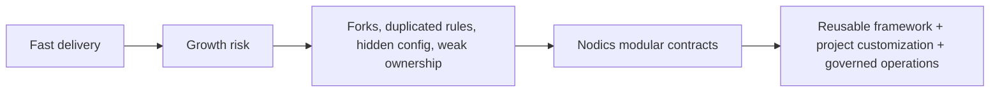
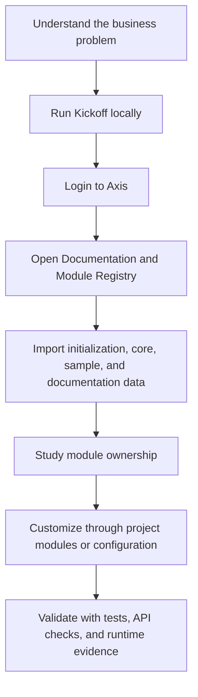
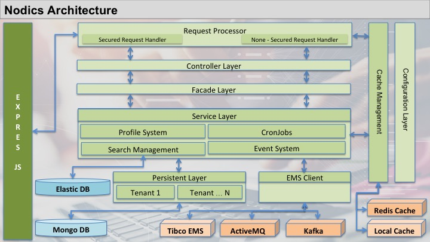
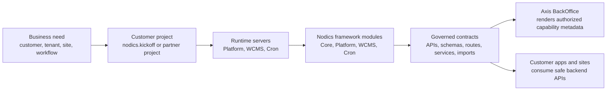

# What is Nodics?

Nodics is a modular enterprise application framework for building serious
business platforms without asking every project to reinvent the same
architecture. It gives teams a governed backend foundation for APIs, data,
configuration, authentication, permissions, runtime composition, imports,
exports, content management, scheduled work, events, testing, and operational
contracts.

In plain language, Nodics is an application factory. A factory does not decide
which product your company sells. It gives you repeatable equipment, safety
rules, quality checks, extension points, and production discipline. Your
project still owns its business rules, customer-specific behavior, integrations,
and user experiences.

## The problem Nodics solves

Modern teams can create an MVP very quickly, especially with AI-assisted
development. The hard part starts when that MVP becomes a real product. Code
that was written only to prove an idea often has no strong module boundaries,
no tenant model, no safe customization path, no consistent API contracts, weak
security, duplicated configuration, and limited tests. Every new customer adds
another exception. Every exception makes future releases slower and riskier.

Nodics turns those repeated scaling problems into explicit contracts. A feature
belongs to an owning capability. Configuration has layered scope. Services,
schemas, routes, APIs, and generated artifacts are created in known places.
Customer customizations load after framework behavior instead of editing the
framework directly. Axis renders employee workspaces, but backend modules keep
authority over data and operations.

## Why a business should care

For a business evaluator, the important point is not the folder structure. The
important point is that Nodics helps teams move from idea to production without
throwing away the architecture. It supports faster delivery while keeping
governance, maintainability, tenant isolation, operational visibility, and safe
customer-specific change in view from the beginning.

This matters when an organization wants one platform to support many
enterprises, tenants, brands, websites, internal teams, or partner
customizations. The modular approach reduces the cost of change because a
project can extend or configure the owner of a behavior instead of copying code
into another place. That lowers upgrade risk, reduces duplicate authority, and
helps teams reason about who owns what.

## Executive summary for a non-technical reader

Nodics is trying to solve a familiar enterprise problem: companies want fast
delivery, but they also need security, governance, customization, operations,
and upgradeability. Many teams get speed by building one large application.
That feels good in the first few weeks, then becomes expensive when the second
customer, second tenant, second deployment, or second integration arrives.

Nodics takes a different approach. It gives the project a modular backend
foundation from the start. Each capability has a named owner. Customer
projects extend the framework instead of modifying shared framework source.
Axis gives business users and administrators one browser workspace, but the
browser does not become the authority for business rules. Content, media,
imports, documentation, scheduled jobs, identity, and module lifecycle remain
backend-governed.

The business value is not only "we can build screens." The business value is
"we can build screens, change them safely, support many customers, explain the
system to new people, recover from mistakes, and keep upgrading the platform."

## Beginner mental model

Imagine a company needs employee login, content management, imports, media,
scheduled jobs, and APIs. Without a framework, the first team might build login
one way, the second team might build imports another way, and the third team
might put customer-specific rules directly into shared code. The application
works for a while, then becomes difficult to secure, test, deploy, or extend.

With Nodics, those concerns have named owners. Profile owns employee identity.
WCMS owns CMS content. Media owns media records and lifecycle. Cron owns
scheduled work. BackOffice exposes operational metadata. Axis renders the user
interface by consuming authorized backend contracts. A customer project, such
as Kickoff, composes these capabilities and adds project behavior after the
framework modules.

## Developer mental model

A developer should read Nodics as a set of ownership questions:

1. Which functional module owns the business capability?
2. Which technical module owns the route, schema, service, data release, or
   renderer metadata?
3. Is the requested behavior already configurable?
4. If code is required, should it live in framework source or a customer
   extension module?
5. Which server graph must load the change?
6. Which generated artifacts must be regenerated from source?
7. Which tests prove default behavior and customization behavior?

This is why Nodics asks developers and AI tools to avoid nearest-file editing.
The correct file is the one owned by the correct capability, not the first file
that happens to contain a similar word.

## DevOps mental model

An operator sees Nodics as a set of runtime graphs and release artifacts:

- Platform handles human login, Profile, BackOffice, registry, and API
  discovery.
- WCMS handles sites, catalogs, pages, components, media, and documentation
  delivery.
- Cron handles scheduled/background execution.
- Customer projects declare which modules and environments load.
- Data releases are immutable and checksum-governed.
- Public properties, private properties, environment overrides, and server
  overrides must remain explainable.

The operational benefit is traceability. When something goes wrong, the team
can ask: which module owns it, which server loaded it, which release imported
it, which property changed it, and which rollback path is safe?

## What teams can build

Nodics can be used as the backend foundation for multi-tenant business APIs,
employee BackOffice applications, CMS-driven websites, governed content and
media operations, data import/export flows, scheduled jobs, and customer
platforms that need safe extension. The framework supplies reusable capability
contracts; the adopting project supplies the business-specific behavior and
deployment decisions.

The current reference workspace demonstrates this through `nodics.kickoff`,
which starts local Platform, WCMS, and Cron servers, and through `nodics.axis`,
which logs employees in and renders discovered workspaces and documentation.

## How to read Nodics if you are new

You do not need to understand every module, database collection, service, or
runtime property on the first day. Nodics documentation is intended to be read
as a journey.

| If you are... | Start with this question | Then read |
| --- | --- | --- |
| A business sponsor | What problem does Nodics solve and what risk does it reduce? | This overview, then the local quick start so you can see Axis, module registry, imports, WCMS, media, and documentation. |
| A developer | How do I run it and where do I customize safely? | Local quick start, modular architecture, customization guide, then module-specific pages. |
| An architect | How are capability ownership, runtime loading, and extension boundaries enforced? | Modular architecture, functional module registry, runtime and DevOps operations. |
| A business administrator | What screens and actions can I use from Axis? | Axis documentation, Imports and Exports, Module Registry, WCMS, Media. |
| A DevOps engineer | Which servers, dependencies, secrets, and recovery steps matter? | Runtime and DevOps operations, local quick start, import/export lifecycle, logs and health checks. |
| A QA engineer | What should be verified before a feature is accepted? | Capability documentation, module tests, API checks, import validation, and Axis route behavior. |

This sequence matters. A beginner should first understand the product story,
then the running experience, then the customization model, and only then the
deep internals.

## How the documentation is organized

Nodics documentation is intentionally separated by ownership:

| Documentation product | Owner | What belongs there |
| --- | --- | --- |
| Framework | `nodics.docs` | Framework concepts, module architecture, quick start, customization model, runtime operations, and standard module guidance. |
| Nodics Axis | `nodics.platform/modules/axis` | Axis product behavior, browser architecture, UI workspaces, renderer contracts, and Axis-specific backend content. |
| Nodics Kickoff | `nodics.kickoff` | Reference project setup, local servers, project modules, sample customization, and project acceptance. |
| Swagger/API | Runtime modules | OpenAPI/API contracts exposed by registered backend modules. |

Axis renders these products together, but their source ownership stays
separate. This avoids a common documentation mistake where the frontend
repository becomes a dumping ground for every page users can see.

## A day-one business scenario

Imagine a company wants to launch a partner portal. The portal needs employee
login, business-unit onboarding, content pages, media uploads, scheduled jobs,
documentation, and future customer-specific changes. A quick team can build
those pieces directly into one application. That works until another customer
asks for different behavior, another region needs different rules, operations
asks for independent scaling, and security asks who owns each API.

With Nodics, the first conversation changes:

1. Platform owns employee identity, Profile, BackOffice discovery, and module
   registration.
2. WCMS owns websites, catalogs, pages, components, routes, documentation
   content, and media lifecycle.
3. Cron owns scheduled work.
4. Axis renders authorized business workspaces from backend contracts.
5. The customer project owns project-specific configuration, content, docs,
   and custom modules.

The business result is not only a running portal. The result is a portal that
has an upgrade path, a customization path, and an operational model from the
beginning.

## A day-one developer scenario

A new developer should be able to clone the framework, clone the reference
project, start the servers, and see the product before writing code.

The flow is:

1. Clone or open `nodics.ai`, `nodics.kickoff`, and `nodics.axis`.
2. In `nodics.kickoff`, set `NODICS_FRAMEWORK_ROOT` to the framework checkout.
3. Run the framework configuration command and install dependencies.
4. Start Platform, WCMS, and Cron from Kickoff.
5. Start Axis.
6. Log in as the reference admin user.
7. Open Module Registry to see which functional modules are mandatory,
   registered, active, optional, or available.
8. Open Imports and Exports to validate and install backend-owned data packs.
9. Open Documentation to read Framework, API, Axis, and Kickoff content.
10. Make the first customization in the customer project rather than editing
    framework source.

The developer learns by watching the system run. Folder structure becomes much
easier after the runtime behavior is visible.

## A day-one operations scenario

An operator should not have to inspect business source code to understand the
runtime. Nodics separates the major operational questions:

- Platform server answers login, profile, BackOffice, registry, and API
  discovery questions.
- WCMS server answers site, catalog, page, component, route, media, and
  documentation delivery questions.
- Cron server answers scheduled job questions.
- Kickoff declares which framework modules the local customer project loads.
- Axis is a frontend renderer and must not own backend data records.

For local development the servers can run on one machine. For a larger
deployment they can move into separate processes or infrastructure units. The
functional ownership model remains stable even when the physical topology
changes.

## What Nodics is not

Nodics is not a finished industry product that removes the need for business
analysis. It is not a frontend repository. It is not permission to access
another module's database directly. It does not make operations automatic:
credentials, infrastructure, monitoring, backup, scaling, and production
security remain deployment responsibilities.

The promise is more practical: Nodics gives a project a governed model for
building and evolving enterprise software without scattering ownership.

## The Nodics idea in one picture

Read the diagram from left to right. A company starts with a business need.
The customer project expresses that need without editing framework source. The
runtime servers load the required framework capabilities. Those capabilities
publish governed contracts. Axis and other applications consume those
contracts instead of guessing which modules exist or which database records are
safe to touch.

## Business mindset: why Nodics can reduce cost

A business usually pays for software twice. The first cost is building the
feature. The second cost is living with it: support, upgrades, security fixes,
new customers, new countries, new integrations, and production incidents.
Nodics is designed to reduce the second cost by making ownership visible.

| Business concern | How Nodics helps |
| --- | --- |
| Multiple enterprises and tenants | Capabilities are built with enterprise, tenant, permission, and runtime context in mind instead of adding it later as an afterthought. |
| Customer-specific customization | A project can extend a framework capability in a later module layer while preserving the same functional module identity. |
| Faster onboarding | Kickoff gives a runnable reference project so a partner can see Platform, WCMS, Cron, Axis, imports, and documentation before writing custom code. |
| Lower upgrade risk | Framework code remains separate from customer code. Custom behavior is composed through runtime extension instead of direct framework edits. |
| Operational confidence | Imports, checksums, module registration, API exposure, and runtime status are explicit contracts that can be tested and monitored. |

For a non-technical evaluator, the key question is: “Can this platform grow
without every customer becoming a fork?” Nodics answers that by separating
framework authority, customer authority, runtime composition, and frontend
rendering.

## How Nodics compares with common build approaches

This is not a claim that every other platform or project is wrong. Many large
enterprise platforms teach similar ideas through product guides, administrator
guides, developer guides, extension guides, API references, and operations
guides. Nodics follows that same reader-friendly discipline, but its own design
choice is to keep functional module ownership, runtime composition, and
customer customization explicit from the start.

| Common approach | What often goes wrong | Nodics principle |
| --- | --- | --- |
| One-off application | Fast first delivery, then scattered ownership and painful change. | Start with named functional modules and explicit runtime loading. |
| Customer fork | One customer is happy, but upgrades become expensive. | Keep framework source separate; customize in later-loaded project modules. |
| Frontend-owned business behavior | UI becomes the authority for what is installed, active, or allowed. | Axis renders backend-owned capability contracts. |
| Ungoverned microservices | Many services exist, but ownership, data contracts, and setup become unclear. | Functional modules own APIs, schemas, data releases, docs, and tests. |
| Configuration as hidden environment magic | Local, test, and production drift without traceability. | Use layered public/private properties and server/environment overrides. |
| Documentation after delivery | New users cannot understand why the system exists or how to run it. | Documentation is part of feature acceptance and content-pack ownership. |

## The learning path from simple to deep

Nodics documentation should grow from simple questions to deeper capability
guides:

```mermaid
flowchart LR
  Intro["What is Nodics?"] --> Quick["Local quick start"]
  Quick --> Axis["Explore Axis"]
  Axis --> Registry["Module registry"]
  Registry --> Imports["Imports and exports"]
  Imports --> Modules["Module guides"]
  Modules --> Custom["Customization"]
  Custom --> Ops["Runtime and operations"]
  Ops --> API["Swagger and API reference"]
```

The order is intentional. A reader first learns the promise, then sees the
system, then learns how modules are registered and data is initialized, then
goes deeper into implementation and operations.

## Developer mindset: how to think before coding

When a developer adds a feature, the first question should not be “Where can I
make this work fastest?” The first question should be “Who owns this behavior?”

Use this simple decision path:

1. If the behavior is required by every runtime, it probably belongs in Core.
2. If it is employee identity, onboarding, authorization, or BackOffice
   metadata, it belongs in Platform.
3. If it is site, catalog, page, component, route, documentation content, or
   media lifecycle, it belongs in WCMS or the backend module/project that owns
   that content.
4. If it is scheduled or background work, it belongs in Cron or a project
   module loaded by Cron.
5. If it is browser rendering only, it belongs in Axis.
6. If it is customer-specific, it belongs in the customer project or customer
   extension module, not inside reusable framework source.

Example: changing the Axis login logo is not the same as changing employee
authentication. The visual component can be configured through WCMS/Axis-owned
content. The actual authentication contract stays in Platform/Profile.

## DevOps mindset: why runtime boundaries matter

Production teams need to answer practical questions:

- Which server owns this API?
- Which modules were loaded into this server?
- Which release of initialization data was imported?
- Which credentials are public configuration and which are private secrets?
- Can we restart a server without losing module registration state?
- Can we rebuild an environment from source-controlled module data?

Nodics makes these questions first-class. Runtime servers declare what they
extend. Data releases have manifests and checksums. Functional module
registration is persisted. Axis discovers authorized capabilities from
BackOffice instead of using hardcoded assumptions.

For production, this means Platform, WCMS, Cron, and future functional modules
can run together for a small deployment or separately for a larger topology.
The contract remains the same even when the physical deployment changes.

## A beginner example

Suppose a partner wants a small internal portal with login, documentation,
media upload, and one nightly cleanup job.

The beginner temptation is to create one application, one database connection,
one upload folder, and one timer. It works locally, then becomes painful when a
second tenant, second environment, or custom customer rule arrives.

With Nodics, the same solution is expressed differently:

- Platform handles employee login and BackOffice capability discovery.
- WCMS handles documentation pages, content catalogs, routes, and media.
- Cron handles the nightly cleanup job.
- Kickoff starts the local servers and contributes project-owned docs.
- Axis renders what the backend says is authorized and active.

Nothing in this example requires a beginner to understand every internal
technical module on day one. They can start with the functional module picture
and then go deeper module by module.

## Next actions

- Read modular architecture to understand ownership and runtime composition.
- Follow the local quick start to run Kickoff and Axis.
- Read customization guidance before changing framework behavior.
- Read runtime and DevOps operations before planning production topology.
