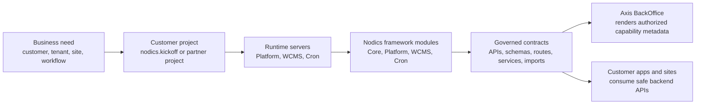

# What is Nodics?

Nodics is a modular enterprise application framework for building serious
business platforms without asking every project to reinvent the same
architecture. It gives teams a governed backend foundation for APIs, data,
configuration, authentication, permissions, runtime composition, imports,
exports, content management, scheduled work, events, testing, and operational
contracts.

In plain language, Nodics is an application factory. A factory does not decide
which product your company sells. It gives you repeatable equipment, safety
rules, quality checks, extension points, and production discipline. Your
project still owns its business rules, customer-specific behavior, integrations,
and user experiences.

## The problem Nodics solves

Modern teams can create an MVP very quickly, especially with AI-assisted
development. The hard part starts when that MVP becomes a real product. Code
that was written only to prove an idea often has no strong module boundaries,
no tenant model, no safe customization path, no consistent API contracts, weak
security, duplicated configuration, and limited tests. Every new customer adds
another exception. Every exception makes future releases slower and riskier.

Nodics turns those repeated scaling problems into explicit contracts. A feature
belongs to an owning capability. Configuration has layered scope. Services,
schemas, routes, APIs, and generated artifacts are created in known places.
Customer customizations load after framework behavior instead of editing the
framework directly. Axis renders employee workspaces, but backend modules keep
authority over data and operations.

## Why a business should care

For a business evaluator, the important point is not the folder structure. The
important point is that Nodics helps teams move from idea to production without
throwing away the architecture. It supports faster delivery while keeping
governance, maintainability, tenant isolation, operational visibility, and safe
customer-specific change in view from the beginning.

This matters when an organization wants one platform to support many
enterprises, tenants, brands, websites, internal teams, or partner
customizations. The modular approach reduces the cost of change because a
project can extend or configure the owner of a behavior instead of copying code
into another place. That lowers upgrade risk, reduces duplicate authority, and
helps teams reason about who owns what.

## Beginner mental model

Imagine a company needs employee login, content management, imports, media,
scheduled jobs, and APIs. Without a framework, the first team might build login
one way, the second team might build imports another way, and the third team
might put customer-specific rules directly into shared code. The application
works for a while, then becomes difficult to secure, test, deploy, or extend.

With Nodics, those concerns have named owners. Profile owns employee identity.
WCMS owns CMS content. Media owns media records and lifecycle. Cron owns
scheduled work. BackOffice exposes operational metadata. Axis renders the user
interface by consuming authorized backend contracts. A customer project, such
as Kickoff, composes these capabilities and adds project behavior after the
framework modules.

## What teams can build

Nodics can be used as the backend foundation for multi-tenant business APIs,
employee BackOffice applications, CMS-driven websites, governed content and
media operations, data import/export flows, scheduled jobs, and customer
platforms that need safe extension. The framework supplies reusable capability
contracts; the adopting project supplies the business-specific behavior and
deployment decisions.

The current reference workspace demonstrates this through `nodics.kickoff`,
which starts local Platform, WCMS, and Cron servers, and through `nodics.axis`,
which logs employees in and renders discovered workspaces and documentation.

## What Nodics is not

Nodics is not a finished industry product that removes the need for business
analysis. It is not a frontend repository. It is not permission to access
another module's database directly. It does not make operations automatic:
credentials, infrastructure, monitoring, backup, scaling, and production
security remain deployment responsibilities.

The promise is more practical: Nodics gives a project a governed model for
building and evolving enterprise software without scattering ownership.

## The Nodics idea in one picture

Read the diagram from left to right. A company starts with a business need.
The customer project expresses that need without editing framework source. The
runtime servers load the required framework capabilities. Those capabilities
publish governed contracts. Axis and other applications consume those
contracts instead of guessing which modules exist or which database records are
safe to touch.

## Business mindset: why Nodics can reduce cost

A business usually pays for software twice. The first cost is building the
feature. The second cost is living with it: support, upgrades, security fixes,
new customers, new countries, new integrations, and production incidents.
Nodics is designed to reduce the second cost by making ownership visible.

| Business concern | How Nodics helps |
| --- | --- |
| Multiple enterprises and tenants | Capabilities are built with enterprise, tenant, permission, and runtime context in mind instead of adding it later as an afterthought. |
| Customer-specific customization | A project can extend a framework capability in a later module layer while preserving the same functional module identity. |
| Faster onboarding | Kickoff gives a runnable reference project so a partner can see Platform, WCMS, Cron, Axis, imports, and documentation before writing custom code. |
| Lower upgrade risk | Framework code remains separate from customer code. Custom behavior is composed through runtime extension instead of direct framework edits. |
| Operational confidence | Imports, checksums, module registration, API exposure, and runtime status are explicit contracts that can be tested and monitored. |

For a non-technical evaluator, the key question is: “Can this platform grow
without every customer becoming a fork?” Nodics answers that by separating
framework authority, customer authority, runtime composition, and frontend
rendering.

## Developer mindset: how to think before coding

When a developer adds a feature, the first question should not be “Where can I
make this work fastest?” The first question should be “Who owns this behavior?”

Use this simple decision path:

1. If the behavior is required by every runtime, it probably belongs in Core.
2. If it is employee identity, onboarding, authorization, or BackOffice
   metadata, it belongs in Platform.
3. If it is site, catalog, page, component, route, documentation content, or
   media lifecycle, it belongs in WCMS or the backend module/project that owns
   that content.
4. If it is scheduled or background work, it belongs in Cron or a project
   module loaded by Cron.
5. If it is browser rendering only, it belongs in Axis.
6. If it is customer-specific, it belongs in the customer project or customer
   extension module, not inside reusable framework source.

Example: changing the Axis login logo is not the same as changing employee
authentication. The visual component can be configured through WCMS/Axis-owned
content. The actual authentication contract stays in Platform/Profile.

## DevOps mindset: why runtime boundaries matter

Production teams need to answer practical questions:

- Which server owns this API?
- Which modules were loaded into this server?
- Which release of initialization data was imported?
- Which credentials are public configuration and which are private secrets?
- Can we restart a server without losing module registration state?
- Can we rebuild an environment from source-controlled module data?

Nodics makes these questions first-class. Runtime servers declare what they
extend. Data releases have manifests and checksums. Functional module
registration is persisted. Axis discovers authorized capabilities from
BackOffice instead of using hardcoded assumptions.

For production, this means Platform, WCMS, Cron, and future functional modules
can run together for a small deployment or separately for a larger topology.
The contract remains the same even when the physical deployment changes.

## A beginner example

Suppose a partner wants a small internal portal with login, documentation,
media upload, and one nightly cleanup job.

The beginner temptation is to create one application, one database connection,
one upload folder, and one timer. It works locally, then becomes painful when a
second tenant, second environment, or custom customer rule arrives.

With Nodics, the same solution is expressed differently:

- Platform handles employee login and BackOffice capability discovery.
- WCMS handles documentation pages, content catalogs, routes, and media.
- Cron handles the nightly cleanup job.
- Kickoff starts the local servers and contributes project-owned docs.
- Axis renders what the backend says is authorized and active.

Nothing in this example requires a beginner to understand every internal
technical module on day one. They can start with the functional module picture
and then go deeper module by module.

## Next actions

- Read modular architecture to understand ownership and runtime composition.
- Follow the local quick start to run Kickoff and Axis.
- Read customization guidance before changing framework behavior.
- Read runtime and DevOps operations before planning production topology.
