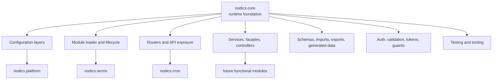
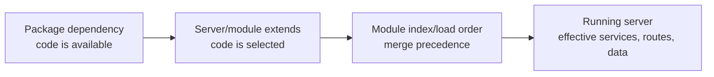

# Core overview

`nodics.core` is the foundation every Nodics runtime loads before any higher
functional module such as Platform, WCMS, Cron, Workflow, or Commerce. It is
not a business screen and it is not a customer project. It is the reusable
runtime framework that gives every server the same language for modules,
configuration, routing, services, schemas, data releases, imports, tests,
security hooks, and operational contracts.

For a beginner, Core is the engine room. Most business users will not open a
Core page in Axis every day, but every business capability depends on it being
predictable. If Core is messy, every module above it becomes harder to secure,
customize, test, and operate.

## Business purpose

Core reduces the cost of building enterprise applications by solving repeated
technical problems once. A project should not reinvent module loading, layered
configuration, API exposure, database model registration, import validation,
service discovery, logging, or test scaffolding for every new capability.

The business value is indirect but powerful:

| Business concern | Core contribution |
| --- | --- |
| Faster delivery | New modules start from a known runtime shape instead of a blank server. |
| Safer customization | Customer behavior can load later without editing framework source. |
| Upgradeability | Shared contracts stay in one foundation and are tested consistently. |
| Operations | Startup, logs, imports, schemas, routers, and validation follow repeatable rules. |
| Governance | APIs, data releases, generated artifacts, and module ownership are explicit. |

Core is what lets a partner trust that Platform, WCMS, Cron, and future modules
are not unrelated applications glued together by convention.

## Beginner mental model

Imagine building several business products: a content platform, a scheduled
job engine, a commerce application, and a documentation portal. Without a
framework, each product might invent its own config files, service structure,
database connection, routing style, error shape, and tests. That makes the
whole ecosystem difficult to learn.

Core gives them a shared base:

Every higher module builds on this foundation. A module can extend another
module, but it should not bypass Core contracts.

## What Core owns

Core owns framework-level technical capabilities, including:

- module discovery and runtime loading;
- configuration precedence and property merging;
- common utilities and status/error definition patterns;
- database connection and model registration contracts;
- routing and API category exposure;
- controller, facade, service, and pipeline conventions;
- authentication, token, validation, and security infrastructure hooks;
- import/export and data release mechanics;
- event, cache, search, test, and tooling foundations;
- generated LLM context and quality governance through nSetup/nTooling.

Core does not own customer business rules. If a customer needs special
behavior, the first question is whether the behavior belongs in a customer
project module, a later-loaded extension of an existing functional module, or a
new functional module. Do not put customer behavior into Core just because
Core is loaded everywhere.

## Runtime loading model

Core always loads before higher functional modules. The exact server graph is
defined by the customer project and server configuration.

These are different concepts:

- package dependency makes code available to npm;
- module `extends` describes functional inheritance;
- server `extends` describes the effective boot graph;
- index/load order decides which services and configuration win during merge;
- BackOffice registration decides which functional capability is accepted and
  active for business use.

Confusing these concepts is one of the fastest ways to create hidden bugs.

## Configuration-first rule

Core supports layered configuration so projects can change behavior without
editing framework source. Defaults should live in the module that owns the
behavior. Project, environment, server, node, tenant, provider, and persisted
configuration layers may override or narrow those defaults.

The rule is not "everything goes in properties." The rule is "put each setting
where its authority belongs."

| Need | Correct direction |
| --- | --- |
| Framework-wide default | Owning framework module configuration. |
| Project-specific default | Customer project configuration. |
| Local server port/database | Environment/server configuration. |
| Secret or machine-specific path | Private local/environment configuration, never committed casually. |
| Status, lifecycle, error code | Owning status-definition contract, not random properties. |
| Generated import checksum | Generated manifest from source data, not manual editing. |

## Developer workflow

When changing Core or a module that depends on Core, use this sequence:

1. Identify the owning functional module and technical module.
2. Read the nearest `AGENTS.md`, README, and relevant contracts.
3. Check whether existing configuration or extension seams solve the need.
4. Write export-friendly, documented JavaScript in the correct folder.
5. Keep generated artifacts generated from source.
6. Add focused tests for default behavior and customization behavior.
7. Run quality, docs, AI, LLM, module, and acceptance checks appropriate to the
   changed surface.

This sequence protects future custom modules. A partner should be able to
override a service, replace a provider, or adjust configuration without
patching framework source.

## Axis visibility

Core is a mandatory functional module in the current Axis-backed reference
stack, but Axis should not expose every Core technical module as a separate
business registry card. Core appears as a high-level foundation. Internal
technical modules remain developer details unless an owning functional module
exposes a browser-safe capability.

Axis uses Core indirectly through Platform, BackOffice, WCMS, Cron, and other
module APIs. The browser must not import Core source, execute Core services,
or become a second runtime loader.

## DevOps and QA checks

Core changes deserve broad verification because every runtime depends on them.
At minimum, prove:

- Platform starts with Core loaded first;
- WCMS starts and can import content packs;
- Cron starts when selected by the runtime graph;
- generated data manifests validate;
- module LLM context generation and validation still pass;
- API category exposure remains intentional;
- configuration precedence logs remain explainable;
- fresh local acceptance can rebuild from empty local databases;
- no generated files drift from their source definitions.

## Common mistakes

- Putting customer-specific behavior into Core because every server loads it.
- Treating package dependency order as service override order.
- Hiding lifecycle states or error codes in unrelated properties.
- Editing generated data instead of fixing source definitions or generators.
- Exposing every technical module as a business capability in Axis.
- Bypassing backend module authority by adding frontend-only logic.

Core is powerful because it is boringly consistent. Keep it that way.
