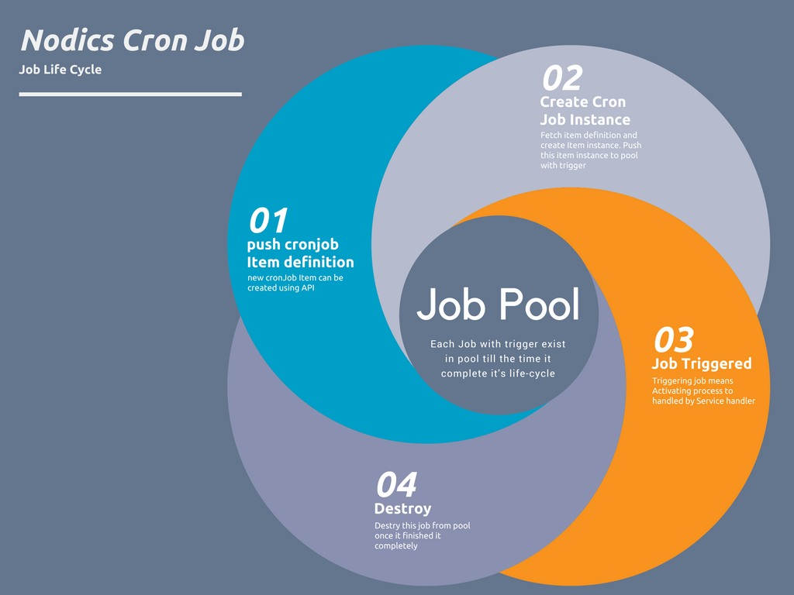
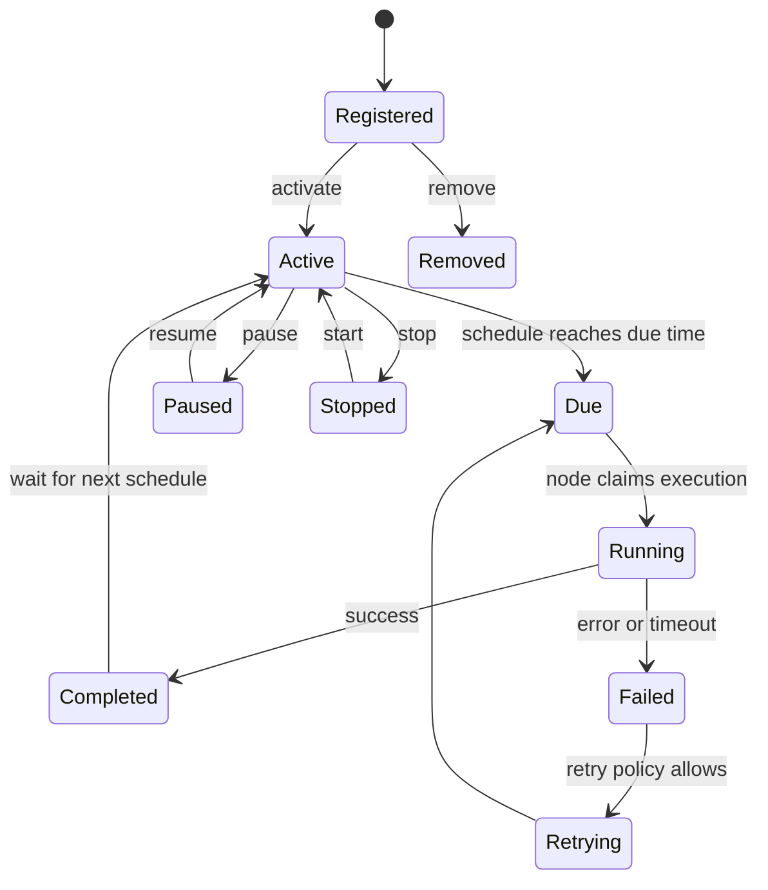

# Cron operations

Cron is the Nodics optional functional module for scheduled and manually
triggered backend work. It extends Core and contributes the `cronjob`
technical module. A project registers Cron when it needs scheduled jobs,
background maintenance, retries, cleanup, synchronization, or other timed
business processes.

## Why Cron is optional

Core, Platform, and WCMS are mandatory for Axis-driven onboarding and governed
content. Cron is different. Many deployments do not need scheduled work on day
one, so Cron should appear in the module registry as an optional functional
module when a cron runtime is live. Registering or activating Cron persists
project intent; restarting servers should not ask the same registration
question again.

## Ownership model

Cron owns scheduler mechanics, lifecycle routes, persisted job definitions,
runtime containers, execution state, logging, events, and failure handling.
The server hosts Cron, but the server is not the functional owner. Node
placement fields decide where a job may run; they do not create another module
identity.

Customer jobs belong in project modules. Reusable scheduler behavior belongs
in `nodics.cron`. If a partner needs custom scheduling behavior, they may
create a customer extension module that loads after Cron and overrides the
approved service contract.

## Job lifecycle

A job definition normally describes:

- job code and active state;
- schedule, start, optional end, and trigger type;
- handler or target module operation;
- tenant, enterprise, and node placement;
- retry, timeout, priority, and overlap expectations;
- last execution status and safe operational evidence.

Cron supports create or register, update, run, start, stop, pause, resume, and
remove through secured backend operations. Manual run and scheduled execution
must share the same tenant, permission, node, logging, and failure contracts.

For beginners, the important point is that a job definition and a job run are
not the same thing. The definition says what should happen and when. A run is
one execution attempt with its own start time, status, logs, retries, and
outcome. Production support usually investigates runs, but operators manage
definitions.

## Example job: nightly media cleanup

A realistic first Cron job might clean expired temporary media.

| Field | Example value | Why it matters |
| --- | --- | --- |
| Code | `media.temporary.cleanup` | Stable identity for logs, permissions, and support. |
| Trigger | Daily at 02:00 local environment time | Runs outside peak usage. |
| Owner module | `media` or project extension | Keeps business behavior with the module that owns the data. |
| Idempotency | Delete only records already marked expired | Safe if the job runs twice. |
| Timeout | 10 minutes | Prevents a stuck cleanup from occupying the scheduler forever. |
| Retry | Two retries with backoff | Handles temporary storage/database failures without hiding persistent bugs. |
| Audit | Count scanned, deleted, skipped, failed | Lets operators prove what happened. |

The job should not accept arbitrary paths or delete files by frontend request.
It should ask Media for expired records through a governed service and let the
storage provider perform safe cleanup.

## Registering Cron as an optional module

Core, Platform, and WCMS are mandatory in the Axis reference stack. Cron is
optional. That means Axis may discover a live Cron server and show it as
available to register. When a user registers and activates Cron, the project
intent is stored in the BackOffice/runtime registry. Restarting the server
should not ask again unless the state was removed.

The lifecycle is:

1. Cron server starts and reports `nodics.cron` as live.
2. BackOffice observes the runtime module catalogue.
3. Axis shows Cron under available modules.
4. A user registers Cron into the project.
5. A user activates Cron.
6. Cron-owned navigation, APIs, docs, and initialization data become visible
   according to permissions and content import state.
7. Deactivation hides runtime availability without forgetting registration.
8. Deregistration removes the project registration and returns Cron to the
   available state while the server remains live.

## Production safety

Scheduled jobs are deceptively simple. A timer firing every minute is easy;
making it safe in production is the real work. Jobs that change external state
must define idempotency keys, duplicate-run policy, timeout behavior, retry
safety, compensation or reconciliation steps, and alerting.

Multi-node deployments must treat scheduler memory as disposable. Persisted
job definitions are authoritative; in-memory schedules are rebuilt from
runtime state. Node failover can help, but it is not a universal exactly-once
guarantee. Network partitions, process termination, downstream timeouts, and
uncertain completion must be handled by the job contract.

## Security model

Cron lifecycle routes require authentication and authorization. A human may
authorize a Cron operation, but the job itself must use governed internal
service-token flow when calling another module. Do not accept arbitrary URLs,
service names, credentials, executable code, or node identifiers from
untrusted request data.

## DevOps model

Operations teams should monitor scheduler readiness, active job count, due
jobs, started jobs, completed jobs, failed jobs, skipped jobs, schedule delay,
duration, retry count, overlap denial, temporary ownership, node handoff, and
downstream latency. Logs should carry tenant, enterprise, job code, trigger
type, assigned node, attempt, correlation identity, and safe outcome.

Before production use, every real job should have tests for schedule boundary,
manual run, unauthorized access, cross-tenant access, duplicate execution,
timeout, retry, partial failure, restart, drain, node loss, node return,
downstream recovery, idempotency, and reconciliation.

## Axis and BackOffice view

Axis should show Cron as a functional module, not as every internal technical
schema. Once registered and active, Cron-owned navigation and workbench
capabilities can appear through BackOffice and WCMS data just like other module
capabilities. Axis remains the renderer; Cron remains the runtime authority.
