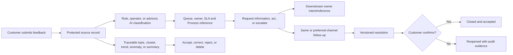

# Customer feedback, complaints, and closed-loop action

Customer Feedback helps a business collect a suggestion, complaint, experience report, praise, or survey response and turn it into a traceable outcome. This beginner-friendly guide follows the complete journey from submission through triage, assignment, follow-up, resolution, confirmation, insight, and recovery.

Think of feedback as a case folder with two sides. One side preserves what the customer actually submitted. The other records what the business inferred and did: category, priority, Process task, contact attempts, downstream handoffs, resolution, and optional insights. The inferred side may be corrected; it never overwrites the source side.

The capability is owned by `nodics.engagement/customerFeedback`. Shared submission, consent, assignment, SLA, relation, form-definition, Process-reference, and integration-reference contracts remain in `engagementCore`. HTTP routes and safe DTOs belong to `engagementApi`. Axis renders the backend-published workspaces and actions.

## Who uses it and why

| Reader | Primary outcome |
| --- | --- |
| Customer | Submit feedback, follow its progress, provide more information, and confirm or dispute resolution. |
| Business user | Triage, classify, assign, contact, escalate, resolve, and reopen feedback. |
| Administrator | Configure types, forms, queues, SLAs, permissions, channels, attempts, and insight policy. |
| Developer | Extend targets, policies, handoff adapters, rules, and project behavior safely. |
| Operator or security reviewer | Monitor backlog, SLA, provider failures, retries, tenant boundaries, privacy, and deletion propagation. |

The business value is a measurable closed loop. The organization can see not only how many responses arrived, but whether customers were contacted, whether the issue was resolved and accepted, where responsibility moved, and which themes are supported by source evidence.

## End-to-end journey

## Customer journey

1. Open the project’s feedback or survey form. The declarative form definition comes from Engagement Core and must be accessible, versioned, and server-validated.
2. Choose a type and optionally a target, desired outcome, structured answers, scores, preferred follow-up channel, and governed Media attachment references.
3. Submit anonymously only when project policy permits it. An identified customer receives an owner-scoped record; the public acknowledgement exposes only safe reference, status, time, and correlation fields.
4. When more information is requested, respond through the customer experience instead of sending secrets or private evidence through an untracked channel.
5. Review the proposed resolution and confirm it when satisfactory. A rejected or incomplete outcome can be reopened according to policy.

An anonymous record cannot later be exposed as if it had an authenticated owner. A customer cannot read another customer’s record by changing a URL. Operators may view protected content only with explicit permission and tenant scope.

## Axis business-user journey

Axis exposes five backend-governed views:

- Customer Feedback for the full operational queue and authorized lifecycle actions.
- Complaints for a complaint-focused SLA and escalation view.
- Feedback Follow-up for offered, attempted, contacted, resolved, accepted, no-response, failed, and suppressed evidence.
- Feedback Surveys for Engagement-owned form definitions and immutable versions.
- Feedback Insights for topics, clusters, trends, anomalies, summaries, confidence, model/policy versions, corrections, and deletion state.

Open Customer Experience → Customer Feedback, filter by status, priority, severity, queue, target, or due date, and inspect the protected detail. Choose only actions published by the backend. Every action includes the expected revision, so a stale browser cannot silently overwrite a newer decision.

The standard lifecycle is `RECEIVED → TRIAGED → ASSIGNED → IN_PROGRESS`. Work may wait for the customer or an internal owner, escalate, resolve, close after confirmation, and reopen. Invalid transitions fail with a stable domain error. Axis refreshes the authoritative query after an action; it does not maintain a browser-side case store.

## Follow-up, resolution, and downstream handoff

Follow-up uses the same or preferred channel, or an explicitly allowed email, SMS, phone, or in-app channel. Each attempt records a bounded status and provider reference. Attempt limits prevent endless automated contact, and Communication owns message rendering and delivery.

A resolution is versioned with an outcome code, business-safe summary, resolver, time, confirmation evidence, and status. Reopening does not erase the previous resolution. If action belongs to Order, Fulfillment, Payment, Profile, Security, or another system, Feedback creates an idempotent handoff reference. The target module executes its own business action. Feedback must not issue refunds, replace products, or change identity records itself.

## Classification and insights

Classification may be supplied by a rule, operator, import, or governed AI adapter. It records category, topic, sentiment, priority, severity, confidence, policy/model reference, evidence, and correction lineage. Sentiment is advisory; it must not by itself reject, suppress, or deprioritize a complaint.

Insights name every source feedback code. Low-confidence output is rejected by policy. A human may correct or reject a proposed value. When source feedback is deleted or anonymized under privacy policy, every derived insight that references it is marked deleted or rebuilt. If AI is unavailable, deterministic and manual operation remains available; no AI output directly contacts a customer or changes lifecycle state.

## API and security boundaries

`POST /public/feedback` accepts a bounded submission and returns a minimal acknowledgement. Authenticated customers use `/customer/feedback` for owner-scoped records. Operators use `/operator/feedback`, lifecycle actions, classification, and insight endpoints with explicit permissions. Generic generated schema routers remain disabled.

Tenant context is resolved by the backend, never trusted from a public body. Public DTOs omit message text, attachments, identity, internal evidence, handoff details, and model prompts. Media binaries remain Media-owned. Process tasks remain Process-owned. Provider secrets and message content never belong in funnel or integration events.

## Configure and extend safely

Projects can configure allowed feedback types, anonymous policy, attachment limits, default priority, lifecycle transitions, follow-up channels and attempt limits, insight confidence, and retention policy through a later layer. A project may replace routing, classification, SLA, handoff, or insight services in a later-loaded module while preserving tenant isolation, source traceability, corrections, deletion propagation, and deterministic fallback.

Do not copy framework services, edit generated CRUD files, create a second forms engine, put downstream business actions in Feedback, or calculate lifecycle state in Axis. Prove the default and project override with focused tests.

## Operations and recovery

Monitor received volume, untriaged age, SLA breaches, assignment load, waiting states, follow-up attempts, resolution and acceptance rates, reopen rate, handoff retries/dead letters, insight rejection/correction, and deletion-propagation lag. Logs and metrics use codes and correlation IDs without customer text.

| Failure | Safe recovery |
| --- | --- |
| Process unavailable | Preserve feedback and pending reference; retry Process handoff idempotently. |
| Communication unavailable | Keep follow-up evidence pending/failed; retry delivery without duplicating the case. |
| Downstream owner times out | Retain intent and idempotency key, reconcile external state, then retry or dead-letter. |
| Stale Axis action | Reject revision conflict, reload current state, and let the user reassess. |
| AI unavailable or low confidence | Use deterministic/manual classification; do not block safe operations. |
| Source deletion | Propagate deletion/anonymization to insights, exports, indexes, and provider references under policy. |

## Common mistakes

- Replacing the customer’s words with a summary or sentiment label.
- Treating every low score as a complaint or every positive score as closed.
- Letting Feedback initiate an Order refund or other domain-owned action.
- Sending private content in analytics, communication, or integration events.
- Allowing Axis to invent transitions, queues, survey schemas, or permissions.
- Publishing AI insight without confidence, model/prompt version, source codes, and human correction.
- Closing a case because a provider accepted a message rather than because the business outcome was completed.

## Verification

Prove successful identified and anonymous intake, invalid type, oversized attachments, cross-owner and cross-tenant denial, stale revision, invalid transition, complaint escalation, waiting/resume, resolution/confirmation/reopen, follow-up limit, Process/provider outage and retry, source-traceable insight, human correction, AI fallback, and deletion propagation. Run generated schema contracts, Engagement API security/route tests, the Axis Customer Engagement regression, documentation generation/validation, and the effective engagement-server build.

Next: Unified Engagement Operations explains rebuildable cross-domain queues and dashboards without creating a new writable business authority.
