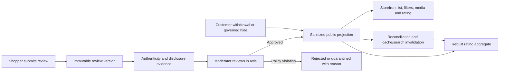

# Customer reviews and ratings

Customer Reviews lets shoppers share an experience and lets a business moderate, respond to, publish, and measure that evidence without changing or suppressing it merely because the opinion is negative. This guide starts with a beginner-friendly mental model and continues into developer and operator detail. It is owned by `nodics.engagement/customerReview`; public and operator HTTP operations are owned by `engagementApi`, and Axis renders backend-authorized workspaces.

Think of a review as a signed evidence folder. The customer's wording and rating are versioned, verification and incentive disclosures are stored beside it, moderation records explain every decision, and the public website receives a smaller safe copy. Rating totals are calculated only from those published copies, so hidden or withdrawn content cannot continue influencing the score.

## Who should read this

| Reader | Start here, then continue to |
| --- | --- |
| Shopper or customer-support user | Submit and manage a review; understand verification, publication, and withdrawal. |
| Moderator or business user | Review queue, policy decisions, responses, abuse reports, appeals, and aggregate repair. |
| Developer or partner | Ownership, API projections, configuration, safe extension, and tests. |
| Operator or security reviewer | Tenant isolation, reconciliation, cache/search invalidation, monitoring, and recovery. |
| Architect or AI tool | Module boundary, immutable evidence, generated artifacts, and prohibited parallel authorities. |

## What is available

The implemented capability supports polymorphic review targets, overall and dimensional ratings, text and media references, registered-customer ownership, authenticity evidence, incentive disclosures, immutable versions, moderation, business responses, abuse reports, appeals, CRES migration evidence, sanitized public projections, helpfulness votes, rating distributions, verified/unverified counts, deterministic rebuilding, drift detection, bounded sorting/filtering, media galleries, and Schema.org eligibility diagnostics.

Review solicitation, external import/syndication, feedback/complaint management, unified operations, optional AI assistance, and enterprise load/failover qualification are delivered by later phases and must not be represented as active merely because their design is documented.

## End-to-end journey

In plain language: the submitted record is not itself a public page. Approval produces a version-specific public projection. The aggregate service reads only projections whose status is `PUBLISHED`. Withdrawal, hiding, anonymization, migration reconciliation, or restoration changes the projection and triggers a deterministic rebuild.

## Shopper journey

1. Sign in through the customer experience and choose an eligible product, service, order, store, seller, content item, event, location, or project-defined target.
2. Submit a rating, review text, or both, as permitted by policy. Include the idempotency key supplied by the client so a network retry does not create a second review.
3. Expect a customer-owned record with a safe status. Pre-moderation normally places it in `PENDING_MODERATION`.
4. View the review through the customer API. Other customers cannot read the private record merely by guessing its code.
5. When published, the storefront reads the sanitized public projection, not the customer-owned schema.
6. Withdraw the review when permitted. The public projection leaves published state and the rating is rebuilt without it.

A one-star review is valid evidence. A moderator may restrict it for a recorded policy violation such as personal data, spam, or abusive content, but `NEGATIVE_SENTIMENT` is prohibited as a reason.

## Moderator journey in Axis

1. Open Customer Experience → Reviews or Review Moderation. Navigation appears only when the backend capability catalogue exposes `nodics.engagement` and the user holds the required permission.
2. Filter the workbench by status, target, site, locale, or queue. Open the detail view to inspect current version, verification/disclosure evidence, and prior moderation history.
3. Choose only an action supplied by the backend workbench contract. Restrictive actions require a policy reason and optimistic revision.
4. Approve a valid review. The backend creates a sanitized public projection and rebuilds the relevant aggregate.
5. Add a versioned business response through the response workflow. Only a `PUBLISHED` response is included in the shopper projection.
6. If an abuse report or appeal changes the decision, use restore/hide actions. Axis refreshes its query; the backend remains the state authority.

Axis must not calculate ratings, expose owner IDs, store review data locally, invent moderation actions, or directly edit aggregate records.

## Public API behavior

| Purpose | Method and path | Important boundary |
| --- | --- | --- |
| List published reviews | `GET /public/reviews` | Returns a bounded page of public projections only. |
| Get rating summary | `GET /public/review-aggregates/:targetType/:targetCode` | Returns current target aggregate fields; no reviewer identity. |
| Submit a review | `POST /customer/reviews` | Requires an authenticated customer and tenant context. |
| Vote helpful/unhelpful | `PUT /customer/reviews/:reviewCode/helpfulness` | One customer-owned vote is replaced/versioned, not duplicated. |
| Moderate | `POST /operator/reviews/:reviewCode/actions/:actionCode` | Requires employee permission, reason policy, tenant scope, and revision. |

Public sorting supports recent, helpful, rating-high, and rating-low modes. Filters are bounded by the API policy. Result metadata repeats applied filters, count, offset, and limit so a storefront can explain what the shopper is viewing.

## Aggregate correctness and recovery

An aggregate records count, sum, average, one-to-five distribution, dimensional summaries, verified and unverified counts, policy version, calculation version, source hash, and calculation time. Its source hash is produced from stable projection evidence. Incremental triggers use the same rebuild function, making retries safe and allowing a full rebuild to be compared with stored state.

| Situation | Expected result |
| --- | --- |
| Approval or restoration | Projection becomes published and begins contributing. |
| Hide, withdrawal, or anonymization | Projection stops contributing; audit evidence remains. |
| Duplicate event or worker retry | Same source set produces the same hash and totals. |
| Concurrent lifecycle updates | Optimistic review revision rejects stale commands; reconciliation uses final persisted state. |
| Drift or missing aggregate | Rebuild from published projections and replace stored aggregate with evidence. |
| Cache or search outage | Domain records remain authoritative; retain invalidation evidence and retry the adapter. |

## Review requests, sessions, and syndication

A review request starts from completed purchase, service, or experience evidence supplied by its owning module. Review policy calculates the waiting period and expiry, honors opt-out and suppression, restricts channels, limits reminders, and respects quiet hours. It rejects any input that tries to select recipients using predicted sentiment, predicted rating, or a “likely promoter” segment.

Email, SMS, account, QR, and in-app delivery all use the same request record. Communication providers deliver the invitation but do not own eligibility or review state. Content-free acquisition events record eligible, offered, delivered, opened, started, completed, expired, suppressed, or failed stages so administrators can measure coverage and conversion without copying review text into analytics events.

A request can contain several product targets. Starting it creates a customer-owned session with explicit target and completed-target lists, expiry, and optimistic revision. This supports one order containing several reviewable items without issuing unrelated tokens or losing partial progress.

External imports always enter a quarantine-first syndication record. The record preserves provider and external IDs, origin, license, disclosure, governed target mapping, source hash, mapping version, moderation evidence, status, and reconciliation time. A same-hash replay is skipped; a changed payload with the same external identity is reconciled. Neither state changes public ratings until a normal internal review passes moderation and becomes a published projection.

Google Customer Reviews is an optional reference adapter and remains disabled until merchant configuration, consent, disclosure, callback security, provider terms, monitoring, and rollback are qualified. The provider never becomes the Nodics review-state authority.

## Configuration and ownership map

- `customerReview/config/properties.js` owns rating bounds, moderation transitions, public page limits, aggregate/calculation versions, media limit, cache TTL, and Schema.org enablement.
- `customerReview/src/schemas/schemas.js` owns authored persistence definitions. Generated Core schema/service/controller/facade artifacts are outputs and must not be edited.
- `defaultCustomerReviewProjectionService` owns sanitization, page behavior, media allow-listing, and structured-data diagnostics.
- `defaultCustomerReviewAggregateService` owns deterministic calculation and drift comparison.
- `defaultCustomerReviewPublicExperienceService` owns lifecycle reconciliation and adapter invalidation evidence.
- `engagementApi` owns dedicated public/customer/operator routes and DTO allow-lists.
- `nodics.axis` owns rendering only. Product storefront rendering remains customer-application owned.

## Customize and extend safely

Start with a later project configuration override. A project may change page limits, cache TTL, enabled target types, rating bounds, moderation modes, or supported sort modes when the invariant remains safe. If a project needs a different aggregate store or search engine, override the relevant service in a later-loaded project module while preserving tenant scope, published-only inclusion, source hashes, and rebuild behavior.

Do not copy the framework service, edit generated schema files, calculate ratings in Axis, expose generic schema CRUD, or use search/cache as the review authority. Add a focused customization test proving the default and override produce equivalent integrity evidence.

## Security and privacy

Customer records are owner- and tenant-scoped. Operators require explicit permissions. Public DTOs omit owner IDs, internal notes, raw provenance, moderation evidence, and private media fields. Incentives must be disclosed and cannot be conditioned on sentiment. Withdrawal removes public visibility while retention/legal-hold policy determines which private evidence may remain.

## Common mistakes

- Calculating the visible average from private review records instead of published projections.
- Treating a negative rating as evidence of spam or a moderation violation.
- Returning customer identity, internal notes, raw provenance, or unapproved media in a public DTO.
- Updating aggregate counters without retaining source hashes and a full-rebuild path.
- Letting Axis, a storefront, cache, or search index become the review state authority.
- Editing generated schema services instead of the owning schema definition and regenerating.
- Retrying a stale moderation command without honoring the optimistic revision conflict.

## Troubleshooting

| Symptom | Safe check and recovery |
| --- | --- |
| Approved review is absent | Confirm a current immutable version exists, inspect projection reconciliation error, then retry reconciliation. |
| Rating looks stale | Compare aggregate source hash/count with a full projection rebuild; replace only through the review service. |
| Hidden review still appears | Verify public query requires `PUBLISHED`, clear/retry the recorded cache/search invalidation, and test the source projection directly. |
| Customer receives forbidden | Confirm access-token subject, tenant, customer group, ownership, and exact permission; never bypass in the browser. |
| Structured data is missing | Read eligibility diagnostics. Zero published ratings intentionally produces no aggregate markup. |

## Verification

Run the Phase 6 regression and Phase 7 contracts, Engagement API route/security contracts, generated schema contracts, documentation pack validation, and Axis Customer Engagement regression. Acceptance must include approval, negative-review protection, hide, withdrawal, restore, retry, drift rebuild, tenant denial, oversized page request, and later-layer configuration override.

Next: review solicitation and syndication explains how requests and imported evidence are governed without selecting only likely-positive customers.
