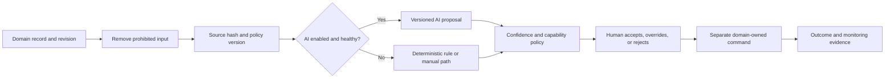

# Governed automation and AI

Governed Automation helps Engagement teams classify, summarize, translate, detect possible fraud or anomalies, cluster duplicates, recommend moderation, and draft responses. It is decision support, not a replacement business authority. This beginner-friendly guide explains how a proposal moves from a source record through evidence, evaluation, human review, and an ordinary domain-owned action.

AI is optional and disabled by default. Every safe operation must retain a deterministic rule or manual path when a provider is unavailable. `engagementCore` owns the shared evidence and evaluation contract; each engagement domain decides whether a capability is relevant and continues to own its lifecycle. Provider adapters are replaceable and may not publish content, reject a review, suppress feedback, or contact a customer directly.

## Supported capabilities

| Capability | Typical assistance | Required control |
| --- | --- | --- |
| Classification | Suggest category, intent, priority, or topic | Source evidence, confidence, correction |
| Summarization | Produce a bounded operator summary | Original remains authoritative |
| Translation | Suggest localized working text | Preserve source language and version |
| Moderation recommendation | Identify policy signals | Human review before moderation action |
| Fraud or anomaly signal | Highlight unusual patterns | Treat as a signal, never proof by itself |
| Duplicate clustering | Suggest related records | Human/domain validation before merge |
| Response drafting | Suggest a customer-visible reply | Human edit and approval before delivery |

## Decision journey

## Axis business-user journey

Open **Customer Experience → Automation Decisions**. Filter by capability, source, confidence, domain, status, or time. Open a decision to compare the suggestion with the authorized source record. Confirm that source revision and hash still match; a stale proposal must not be applied to a newer record.

For a review-required item, choose accept, override, or reject and provide a reason. Override supplies a corrected bounded output while retaining the original evidence. Acceptance does not itself send, publish, reject, hide, merge, or change status. The operator next uses the ordinary domain action, which performs its own current-state, permission, tenant, and revision validation.

Open **Automation Evaluations** before enabling a new model, provider, prompt, or policy version. Review dataset reference, sample size, accuracy, precision, recall, error rate, thresholds, reviewer, and pass/fail result. A passing offline evaluation is necessary evidence, not a guarantee of production quality.

## Evidence and evaluation

Each decision records tenant, capability, domain type/code, source revision/hash, bounded output, confidence, rule/operator/AI source, provider and model references when applicable, prompt and policy versions, status, explanation, timestamps, reviewer, reason, and correlation ID. Secrets and credentials are prohibited inputs. Full prompts, provider keys, and unnecessary personal data do not belong in decision evidence.

Evaluation uses a governed dataset reference rather than copying test data into operational records. Policy establishes minimum sample size, required metrics, thresholds, and maximum error rate. Projects should add capability-specific measurements such as unsafe-output rate, demographic quality checks where lawful, hallucination rate, translation adequacy, override rate, and customer-impact incidents.

## Failure and fallback

If an adapter times out or fails and fallback is required, the service invokes the deterministic implementation and marks the source as `RULE`. If neither automatic path is safe, the record remains for manual work. Provider failure cannot block contact intake, feedback resolution, review moderation, consent withdrawal, testimonial takedown, or customer communication performed through approved manual processes.

Low confidence causes review. High confidence does not waive mandatory review for sensitive capabilities. A domain may impose stricter thresholds than the shared default. A provider response with no source traceability, version references, or bounded output must be rejected.

## Security and privacy

Separate permissions govern reviewing decisions and evaluations. Tenant scope applies to every record. Inputs are minimized for the capability, and protected fields such as passwords, access tokens, refresh tokens, and provider secrets are rejected. Retention and deletion follow the source record: decisions become stale or deleted when their evidence is no longer valid, and provider-side retention must be contractually compatible.

Do not place raw customer text in logs, metric labels, evaluation dashboards, or error messages. Provider configuration belongs in secured configuration, not schemas or Axis. A project must document residency, subprocessors, training-use policy, retention, deletion, incident response, and service-level expectations before enabling an external adapter.

## Configure and extend safely

Start with `aiEnabled: false`. Establish deterministic behavior, a representative evaluation dataset, human-review rules, and monitoring first. Then add a later-layer adapter implementing the bounded proposal interface. Version provider, model, prompt, and policy independently, evaluate the exact combination, and roll out gradually by tenant or capability.

Developers should keep the adapter behind the Engagement service boundary, return only the governed proposal contract, and cover provider success, failure, timeout, malformed output, and fallback with focused tests.

A customization may raise confidence thresholds, require review for more capabilities, prohibit additional fields, or add evaluation metrics. It must preserve source hashes, versions, fallback, override evidence, no-direct-action behavior, tenant isolation, and the owning domain’s final validation.

## Monitoring and rollback

Monitor provider latency/errors, fallback rate, confidence distribution, review queue age, acceptance/override/rejection rate, stale proposals, evaluation regressions, unsafe-output incidents, and downstream outcomes by version. Avoid metrics containing customer text.

Rollback means disabling the affected capability or model version and returning to deterministic/manual operation. Existing decisions remain audit evidence but are marked stale when source or policy changes. Never delete unfavorable evaluation results to make a release appear healthy.

## Common mistakes

- Treating a moderation recommendation as the moderation decision.
- Sending an AI-drafted response without human approval and Communication delivery controls.
- Recording a model name without prompt, policy, source revision, and evaluation evidence.
- Passing complete customer records when a few bounded fields are sufficient.
- Assuming a provider SLA removes the need for deterministic fallback.
- Measuring only aggregate accuracy while ignoring error types and operator overrides.
- Letting Axis or an adapter call persistence or publication directly.

## Verification

Prove AI-disabled startup, deterministic results, provider success, timeout and fallback, prohibited-input rejection, bounded confidence, mandatory human review, low-confidence review, source-hash and revision traceability, accept/override/reject evidence, stale-source handling, minimum evaluation sample, missing metric rejection, threshold pass/fail, cross-tenant denial, deletion propagation, provider configuration secrecy, and zero direct customer-impacting actions. Run focused automation contracts, generated schema contracts, module metadata and Axis journey tests, documentation generation/validation, and the effective engagement-server governance build.

Next: Enterprise Scale, Resilience, and Ecosystem hardens the complete Engagement platform for capacity, provider failure, regional operation, privacy, accessibility, and compatibility.
