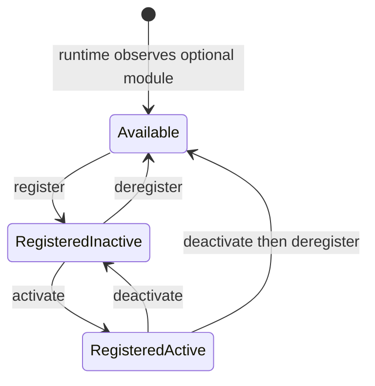

# Functional module registry

The functional module registry is the Platform/BackOffice contract that tells
Axis which high-level Nodics capabilities are known, registered, active, and
safe to show to business users. It is intentionally focused on functional
modules such as `nodics.core`, `nodics.platform`, `nodics.wcms`, and
`nodics.cron`, not every small technical module inside those groups.

For a beginner, the registry is like the application control panel. It does
not download code and it does not hot-load a server process. It records the
project decision that a live capability is allowed to participate in the
project. Runtime servers still need to start with the right module graph.

## Why the registry exists

Without a registry, Axis would have to guess from menus, routes, package names,
or server responses which modules are safe for a project. That creates messy
behavior: a link may appear before the backend is ready, an operator may repeat
the same setup after every restart, or a customer may see technical modules
that only developers understand.

The registry separates two different facts:

- runtime observation: a server is currently running and has reported a
  capability;
- project registration: the project has durably accepted that capability.

Restarting a server renews its runtime observation. It should not ask the
operator to register the same module again.

## Lifecycle states

Optional functional modules move through a small lifecycle. The current Axis
module registry page follows this model.

| State | Beginner meaning | Axis action |
| --- | --- | --- |
| Available | A live server has reported the module, but the project has not accepted it. | Show Register. |
| Registered inactive | The project accepted the module but has not enabled it for use. | Show Activate or Deregister. |
| Registered active | The module is accepted and enabled. | Show Deactivate. |
| Deregistered | The project removed its durable acceptance while the runtime may still observe it. | Move back to Available. |

Core, Platform, and WCMS are mandatory for the local Axis journey. They should
not be treated like optional modules that a business user can deregister from
the same screen. Cron is optional, so it can be observed, registered,
activated, deactivated, and deregistered.

## Business value

For business users, the registry reduces confusion. Axis can show “Platform,”
“WCMS,” or “Cron” as understandable capabilities instead of exposing dozens of
technical internals such as validators, routers, cache providers, import
processors, or individual schema modules.

For a partner, this also protects adoption cost. A project can start with the
mandatory capabilities, then add optional capabilities when there is a business
reason. The decision is recorded in the database, so the project does not need
manual reconfiguration after every restart.

## Developer model

Developers should not confuse registry state with code availability. Package
dependencies and repository checkout decide which source is available.
Environment/server `extends` configuration decides which modules load in a
runtime. The registry records project authorization for a functional module
that the runtime has already observed.

That means a module can be visible as available only after a server starts and
reports it. If the Cron server is not running, Platform cannot honestly present
Cron as a live optional capability. If Cron is running but deregistered, Axis
should show it under available modules with the Register action.

## DevOps and operator model

Operators should monitor both sides of the contract. A registered module that
has no live runtime observation may indicate a stopped server, network issue,
or broken health path. A live runtime observation for an unregistered optional
module means the server is up, but the project has not accepted the capability.

In production, audit events should capture who registered, activated,
deactivated, or deregistered a module. Those actions affect what Axis exposes
and what business users can operate, so they should be treated as governed
administrative changes.

## What the registry must not do

The registry must not become a package manager. It should not clone
repositories, rewrite server `extends`, or silently enable server categories.
It also must not expose every technical module as a business toggle. Technical
module loading remains a framework/runtime concern; functional module lifecycle
is the BackOffice-facing control.

## Verification checklist

- Start Platform, WCMS, and Cron from a fresh database.
- Confirm Core, Platform, and WCMS are registered and active by default.
- Confirm Cron appears as available when its runtime is live.
- Register Cron and verify it moves to registered inactive or active according
  to the operation response.
- Activate, deactivate, and deregister Cron without refreshing the browser.
- Confirm deregistered Cron returns to available while the Cron server remains
  observed.
- Restart servers and confirm durable registration state is preserved.

## Common mistakes

- Treating `nodics.kickoff` as a functional module just because it starts
  servers.
- Renaming Platform to a customer name when a customer extension only
  customizes Platform behavior.
- Showing technical modules as first-class registry cards for business users.
- Assuming deregistration stops a process. It changes project state; process
  lifecycle is still an operator/runtime concern.
