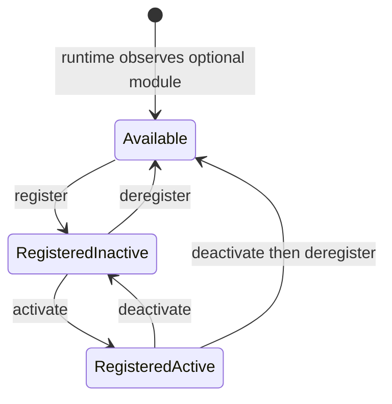
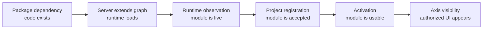

# Functional module registry

The functional module registry is the Platform/BackOffice contract that tells
Axis which high-level Nodics capabilities are known, registered, active, and
safe to show to business users. It is intentionally focused on functional
modules such as `nodics.core`, `nodics.platform`, `nodics.wcms`, and
`nodics.cron`, not every small technical module inside those groups.

For a beginner, the registry is like the application control panel. It does
not download code and it does not hot-load a server process. It records the
project decision that a live capability is allowed to participate in the
project. Runtime servers still need to start with the right module graph.

## Why the registry exists

Without a registry, Axis would have to guess from menus, routes, package names,
or server responses which modules are safe for a project. That creates messy
behavior: a link may appear before the backend is ready, an operator may repeat
the same setup after every restart, or a customer may see technical modules
that only developers understand.

The registry separates two different facts:

- runtime observation: a server is currently running and has reported a
  capability;
- project registration: the project has durably accepted that capability.

Restarting a server renews its runtime observation. It should not ask the
operator to register the same module again.

## Lifecycle states

Optional functional modules move through a small lifecycle. The current Axis
module registry page follows this model.

| State | Beginner meaning | Axis action |
| --- | --- | --- |
| Available | A live server has reported the module, but the project has not accepted it. | Show Register. |
| Registered inactive | The project accepted the module but has not enabled it for use. | Show Activate or Deregister. |
| Registered active | The module is accepted and enabled. | Show Deactivate. |
| Deregistered | The project removed its durable acceptance while the runtime may still observe it. | Move back to Available. |

Core, Platform, and WCMS are mandatory for the local Axis journey. They should
not be treated like optional modules that a business user can deregister from
the same screen. Cron is optional, so it can be observed, registered,
activated, deactivated, and deregistered.

## Mandatory versus optional modules

The registry should stay business-readable. A business user should not need to
understand every technical module that helped Core or WCMS start.

| Module type | Example | User lifecycle |
| --- | --- | --- |
| Mandatory foundation | Core, Platform, WCMS | Installed and active by runtime contract; not deregisterable from Axis. |
| Optional functional capability | Cron | Register, activate, deactivate, deregister. |
| Technical module | `cronjob`, `media`, `profile` internals | Not shown as separate business registry cards unless exposed by an owning functional module. |
| Customer extension | future customer Platform extension | Customizes the standard identity; does not create a new displayed Platform name by default. |

Mandatory does not mean “hardcoded in Axis.” It means the current reference
BackOffice experience depends on those capabilities. Axis still discovers the
effective state from backend contracts, but it should not offer destructive
business actions that would remove the foundation required for login, registry
visibility, and WCMS-backed presentation.

## Business value

For business users, the registry reduces confusion. Axis can show “Platform,”
“WCMS,” or “Cron” as understandable capabilities instead of exposing dozens of
technical internals such as validators, routers, cache providers, import
processors, or individual schema modules.

For a partner, this also protects adoption cost. A project can start with the
mandatory capabilities, then add optional capabilities when there is a business
reason. The decision is recorded in the database, so the project does not need
manual reconfiguration after every restart.

## Business example: deciding to enable Cron

A small customer may start with login, content, media, and documentation only.
After a few weeks, the business asks for nightly cleanup of temporary media and
scheduled export retries. Cron becomes useful. The project team starts a Cron
runtime, Axis sees `nodics.cron` as available, and an authorized administrator
registers and activates it.

The business decision is visible and reversible:

1. Before registration, Cron is observed but not accepted by the project.
2. After registration, the project remembers that Cron is part of its accepted
   capability set.
3. After activation, Cron-owned operations can become available according to
   permissions and data import state.
4. Deactivation pauses the capability without forgetting the registration.
5. Deregistration removes project intent while the runtime may still be
   technically live.

That lifecycle is safer than silently enabling features because a server
happened to start.

## Developer model

Developers should not confuse registry state with code availability. Package
dependencies and repository checkout decide which source is available.
Environment/server `extends` configuration decides which modules load in a
runtime. The registry records project authorization for a functional module
that the runtime has already observed.

That means a module can be visible as available only after a server starts and
reports it. If the Cron server is not running, Platform cannot honestly present
Cron as a live optional capability. If Cron is running but deregistered, Axis
should show it under available modules with the Register action.

Each step answers a different question. Code existing on disk does not mean a
server loaded it. A server loading it does not mean the project accepted it. A
project accepting it does not mean a user has permission to operate it.

## API and UI contract expectations

The registry API must give Axis enough information to render without guessing:

- functional module code and display name;
- mandatory or optional classification;
- observed runtime servers;
- current registration state;
- current activation state;
- active technical modules for explanation, not as primary business toggles;
- available actions for the current user and state;
- last observation and catalogue revision;
- safe status or error messages.

Axis should update its local state immediately after register, activate,
deactivate, or deregister operations. A browser refresh must not be required
to reveal the next valid action. If an operation fails, Axis should retain the
previous known state and show the backend error.

## DevOps and operator model

Operators should monitor both sides of the contract. A registered module that
has no live runtime observation may indicate a stopped server, network issue,
or broken health path. A live runtime observation for an unregistered optional
module means the server is up, but the project has not accepted the capability.

In production, audit events should capture who registered, activated,
deactivated, or deregistered a module. Those actions affect what Axis exposes
and what business users can operate, so they should be treated as governed
administrative changes.

## What the registry must not do

The registry must not become a package manager. It should not clone
repositories, rewrite server `extends`, or silently enable server categories.
It also must not expose every technical module as a business toggle. Technical
module loading remains a framework/runtime concern; functional module lifecycle
is the BackOffice-facing control.

## Security and audit expectations

Functional-module lifecycle operations change what employees can see and use,
so they are administrative actions. A production-ready registry should record:

- who performed the operation;
- enterprise and tenant context;
- previous state and next state;
- runtime evidence used during the decision;
- timestamp and correlation identity;
- safe failure reason when an operation is rejected.

Axis should display the resulting state, but the backend must remain the audit
authority. Browser state alone is not evidence that a module was registered,
activated, deactivated, or deregistered.

## Verification checklist

- Start Platform, WCMS, and Cron from a fresh database.
- Confirm Core, Platform, and WCMS are registered and active by default.
- Confirm Cron appears as available when its runtime is live.
- Register Cron and verify it moves to registered inactive or active according
  to the operation response.
- Activate, deactivate, and deregister Cron without refreshing the browser.
- Confirm deregistered Cron returns to available while the Cron server remains
  observed.
- Restart servers and confirm durable registration state is preserved.

## Acceptance scenarios

| Scenario | Expected result |
| --- | --- |
| Fresh database with Platform and WCMS only | Core, Platform, and WCMS are active; Cron is not shown as live. |
| Cron server starts | Cron appears as available optional module. |
| User registers Cron | Cron moves out of available list and shows the next valid state without page refresh. |
| User activates Cron | Cron shows active and exposes active-state actions without page refresh. |
| User deactivates Cron | Cron remains registered but inactive. |
| User deregisters Cron | Cron returns to available if the runtime is still observed. |
| Servers restart | Mandatory state and registered optional state persist from database. |
| Cron server stops | Registered state remains, but runtime observation should show unavailable or stale according to the API contract. |

## Common mistakes

- Treating `nodics.kickoff` as a functional module just because it starts
  servers.
- Renaming Platform to a customer name when a customer extension only
  customizes Platform behavior.
- Showing technical modules as first-class registry cards for business users.
- Assuming deregistration stops a process. It changes project state; process
  lifecycle is still an operator/runtime concern.
