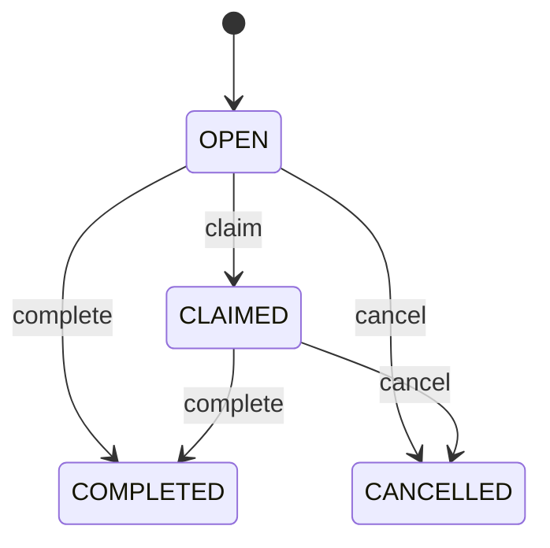

# Build Your First Human Task Flow

Human tasks are the bridge between automation and people. A task tells an
operator, reviewer, merchandiser, support agent, or approver what needs human
attention.

## Example business scenario

A content editor changes a page. The change should not go live until someone
reviews it. The process creates a task called `Review content`. The reviewer can
claim it, assign it, complete it, or cancel it.

## Task fields you should understand

| Field | Why it matters |
| --- | --- |
| `code` | Stable task identifier for audit and support. |
| `instanceCode` | Links the task to the running process instance. |
| `nodeCode` | Shows which workflow step produced the task. |
| `assignee` | Person, queue, or group expected to work on it. |
| `status` | Current state such as `OPEN`, `CLAIMED`, or `COMPLETED`. |
| `dueAt` | Optional SLA date for operations. |

## How Axis should present task work

Axis should show tasks as business work, not as raw database rows. A good task
screen answers:

1. What process created this task?
2. What business object is affected?
3. Who owns it now?
4. What action can I take safely?
5. What happened before this task?

The detail timeline answers the fifth question by reading Process audit events.

## Developer customization

Customer modules can customize assignment without editing standard Process
source. For example:

- route enterprise onboarding approvals to an enterprise admin queue;
- route product publishing approvals to merchandising;
- route logistics exceptions to warehouse operations;
- route refund approval tasks to finance.

The customization should live in the customer or domain module, not in Axis.
Axis renders authorized actions; Process owns task lifecycle.

## End-to-end task example

Consider a high-value refund that requires finance approval. The Order module
owns refund eligibility and the Payment module owns provider execution. Process
creates the approval task with bounded business references, candidate group,
due date, and expected outcome choices. It does not copy the full Order or
payment credentials into task data.

An authorized finance user opens Axis, claims the task, reviews backend-owned
context, and chooses approve or reject. The claim request includes the current
task version so two users cannot both become the assignee. Completion includes
the expected task state, chosen outcome, correlation identifier, and a bounded
comment. Process records the transition and invokes the next registered domain
adapter; Axis does not calculate the next node.

| Test path | Expected result | Evidence |
| --- | --- | --- |
| Authorized claim | Task becomes assigned once. | Assignee, version, timestamp, and audit event |
| Competing claim | Stale request is rejected. | Stable conflict code and unchanged assignee |
| Unauthorized completion | No state or domain side effect changes. | Permission denial and security audit |
| Valid approval | Process advances to the approved path. | Completion event and next-node correlation |
| Expired task | Policy-driven escalation or rejection occurs. | Due-date evaluation and escalation evidence |
| Runtime restart | Open task remains available in the same state. | Durable task and process instance projection |

Operators should monitor open-task age, overdue volume, claim conflicts,
completion latency, failed continuations, and escalation backlog. Alerts must
identify the tenant and stable task or process reference without exposing
sensitive task payloads. A business administrator may change assignment policy
through a governed definition or customer configuration, but cannot bypass
permissions or rewrite completed history.

## Common mistakes

- Letting the browser assign, complete, or reopen tasks without backend validation and expected-state checks.
- Omitting tenant, permission, correlation, expiry, escalation, or audit requirements.

## Verification

Create a task, test authorized claim and completion, reject an unauthorized actor and stale update, then confirm assignment history, process continuation, and operator-visible audit evidence.
This is the minimum beginner verification before adding assignment customization.
