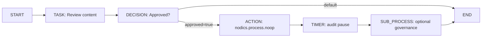
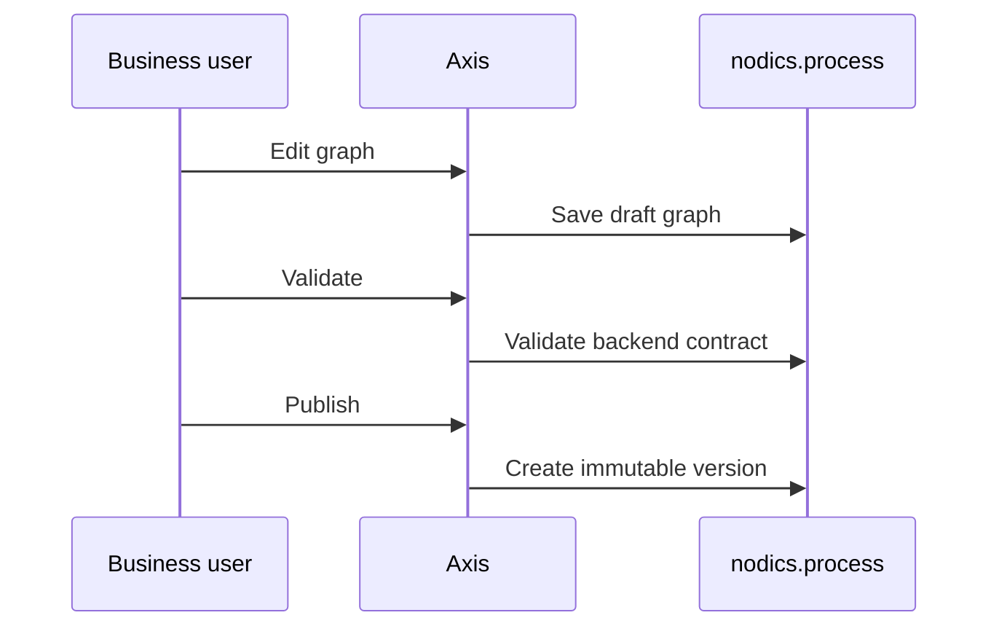

# Build Your First Workflow

This guide is for someone opening Nodics for the first time. The goal is not to
teach every automation feature at once. The goal is to help you create one small
workflow, understand why each step exists, and know where to look when something
does not validate.

## What you are building

You will build a simple content approval process:



The workflow is intentionally small, but it introduces the same building blocks
used by larger commerce, telco, logistics, onboarding, support, and publishing
processes.

## Step 1: create a draft definition

In Axis, open Business Process & Automation, then open Workflows or Designer.
Create a beginner-safe process draft. Give it a stable code such as
`contentApproval`.

Stable code matters because integrations, audit events, tests, and customer
extensions refer to codes. Display names can change; codes should not change
casually.

## Step 2: understand the nodes

| Node type | Beginner meaning | Runtime owner |
| --- | --- | --- |
| `START` | Where the process begins. | Process |
| `TASK` | Human work, such as review, approval, or correction. | Process |
| `DECISION` | Chooses the next path using declared decision data. | Process |
| `ACTION` | Calls an explicitly allowed domain adapter. | Process orchestrates; domain module owns business logic. |
| `TIMER` | Represents a wait, schedule boundary, or future SLA point. | Process records intent; Cron can schedule real execution. |
| `SUB_PROCESS` | References another governed workflow definition. | Process |
| `END` | Marks the instance complete. | Process |

Axis edits these nodes visually, but the backend validator decides whether the
graph is valid.

## Step 3: connect the nodes

Every transition must have:

- a stable transition code;
- a source node;
- a target node;
- no transition from `END`;
- no transition into `START`.

For a `DECISION` node, every outgoing path should either declare a condition or
be marked as the default path. Example:

```json
{
  "code": "decision_to_notify",
  "source": "approvalDecision",
  "target": "notify",
  "condition": { "field": "approved", "equals": true }
}
```

## Step 4: save, validate, publish

Save stores the draft graph. Validate asks nodics.process to inspect the graph.
Publish creates an immutable version that can run. A running instance should
always point to a published version, not a mutable draft.



## Common beginner mistakes

- Creating two `START` nodes.
- Forgetting an `END` node.
- Connecting a transition to a deleted node.
- Adding an `ACTION` node without a registered adapter.
- Putting JavaScript, URLs, or file paths inside action metadata.
- Expecting Axis to execute the process locally.

When validation fails, fix the graph and validate again. Do not bypass the
backend validator.

## Common mistakes

- Publishing disconnected graphs, bypassing validation, or embedding executable implementation details in nodes.
- Assuming Axis owns persistence or that every business action belongs in Process.

## Verification

Validate and publish the definition through Process APIs, start an instance, complete each supported node path, reject malformed graphs, and confirm lifecycle and audit projections after restart.
A developer and production operator should verify the same published definition and recovery evidence.
