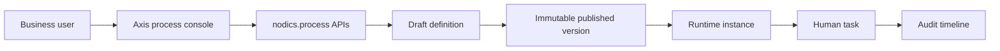
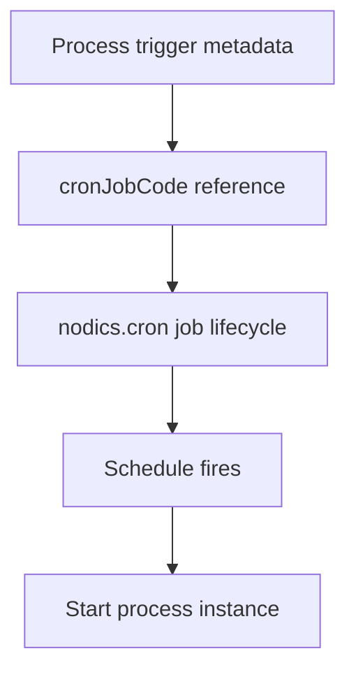

# Business Process and Automation Overview

`nodics.process` is the standard Nodics functional module group for business
processes, workflows, task orchestration, runtime instances, audit evidence,
and future automation design. It exists because most enterprise applications do
not run as one simple button click. A content approval, onboarding request,
order exception, document review, refund approval, or partner activation often
needs multiple steps, people, systems, deadlines, decisions, retries, and audit
records.

For a business user, Process answers: "What work is moving, who needs to act,
what is delayed, and what evidence do we have?" For a developer, Process
answers: "How do I model orchestration without hardcoding the flow into one
domain service?" For an operator, Process answers: "Which instances are
running, which tasks are stuck, which triggers are related to schedules, and
what happened when something failed?"

## Beginner mental model

Imagine a simple content approval:

1. A page is submitted.
2. A reviewer checks it.
3. The reviewer approves or rejects it.
4. The system records who acted and when.
5. The page can continue to publication or return for changes.

Without a process engine, each application might write that flow in its own
service. That makes every flow difficult to inspect, customize, test, and
operate. `nodics.process` gives Nodics one governed place to model the flow,
publish versions, start runtime instances, create human tasks, and record audit
events.

Axis is the console. It is not the engine. The backend owns every state change.

## Where Process fits in Nodics

`nodics.process` is a module group like `nodics.platform`, `nodics.wcms`, and
`nodics.cron`. Runtime implementation lives under `modules/workflow`, and that
capability is split into three technical modules:

| Layer | Module | Responsibility |
| --- | --- | --- |
| Schema | `flowSchema` | Process definitions, versions, instances, tasks, triggers, audit events, statuses, and errors. |
| Core behavior | `flowCore` | Graph validation, definition lifecycle, runtime lifecycle, task movement, audit writing, and future execution providers. |
| API | `flowApi` | Secured routes, controllers, facades, help metadata, permission contracts, and BackOffice-facing API projection. |

This structure keeps the module customizable. A customer overlay can override a
single assignment method, add a validation rule, or change SLA policy without
copying the whole Process module.

## Business value

Process reduces cost and risk in three practical ways:

- Business teams can see work as a lifecycle instead of searching logs or
  asking developers which status field matters.
- Developers can create reusable orchestration without mixing workflow logic
  into commerce, content, profile, media, or customer-specific modules.
- Operators can monitor running instances, tasks, scheduled relationships, and
  audit events using one consistent model.

This is especially important for partners who want one server topology for
business process and automation. A `processServer` can compose
`nodics.process`, `nodics.cron`, and `nodics.core`, while each module still
keeps its own ownership boundary.

## Relationship with Cron

Process may reference scheduled triggers, but Cron owns job scheduling.

The important rule: Process owns orchestration state; Cron owns scheduler state.
Sharing a runtime server does not mean mixing responsibilities.

## Relationship with domain modules

Process does not own commerce refunds, CMS publishing, profile onboarding,
media storage, or logistics shipment rules. Those domain modules own their
business actions. Process may orchestrate the steps and wait for tasks, but the
domain module must still validate and execute its own operation.

Example:

| Need | Owner |
| --- | --- |
| Decide whether a refund is allowed | Commerce module |
| Ask a manager to approve the refund | Process task |
| Schedule a nightly reconciliation flow | Cron job plus Process trigger metadata |
| Show the task to an employee | Axis process console |
| Persist instance and audit history | Process backend |

## What exists in the current MVP

The current Process foundation supports:

- draft process definition creation;
- backend graph validation;
- immutable publish versioning;
- prepare-next-draft behavior;
- start published process instance;
- create first human task for a TASK node;
- claim, assign, complete, and cancel tasks;
- cancel running or waiting instances;
- instance detail with tasks and audit timeline;
- scheduled trigger metadata list;
- Axis console projection for definitions, instances, tasks, triggers, and
  timeline evidence.

The current runtime intentionally keeps execution small: START -> TASK -> END
is supported as the first reliable path. Complex gateways, domain action
execution, compensation, retries, timers, and BPMN import/export can be added
later as governed extensions after the foundation is proven.

## Extension direction

Future modules or customer projects should extend Process through:

- graph validation policy;
- task assignment policy;
- SLA and escalation policy;
- domain action execution providers;
- trigger providers;
- audit redaction policy;
- Axis renderer components that call backend-owned Process APIs.

Do not put process runtime rules into Axis. The browser can edit and display a
graph, but backend validation and execution remain authoritative.

## Common mistakes

- Treating Process as the owner of domain commands or Cron scheduler state.
- Building a second workflow registry, state machine, or execution path in Axis or a customer project.

## Verification

Run Process contracts and fresh-bootstrap acceptance, confirm one backend definition and runtime authority, verify permission denial and invalid graphs, and observe successful, failed, retried, and recovered instances.
