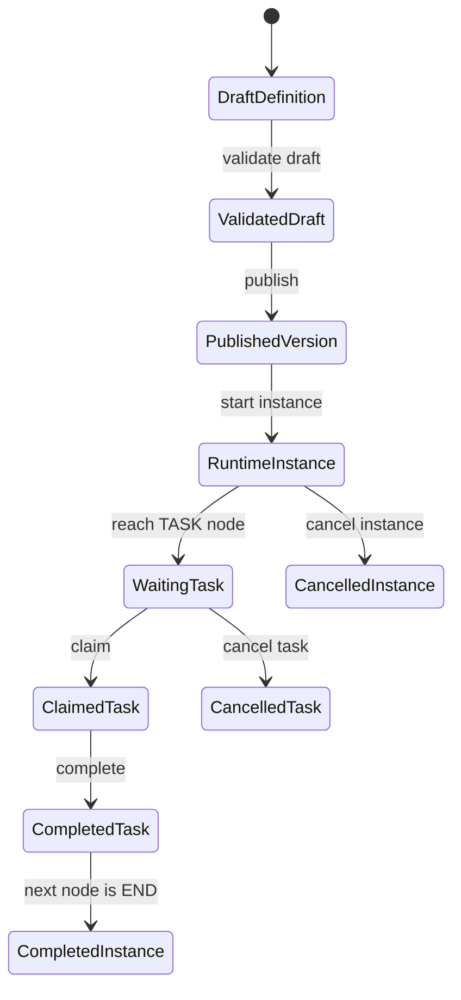
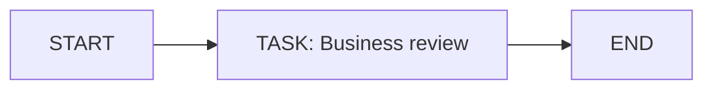

# Runtime Instance and Task Lifecycle

This page explains the lifecycle that turns a designed process into operational
work. It is written for a beginner, so it starts with the simple path before
explaining where developers and operators customize behavior.

## Lifecycle summary



Every arrow is a backend operation. Axis buttons call these APIs, but Axis does
not update the database directly and does not invent the next state.

## Definition lifecycle

A process starts as a draft. Drafts can be edited because business users and
developers often need multiple rounds of naming, description, category, graph
layout, and validation. A draft cannot become operational until the backend
graph validator accepts it.

The first supported graph shape is intentionally small:



This proves the foundation before advanced behavior is added. The backend
checks stable node codes, supported node types, one START node, at least one END
node, valid transitions, duplicate node codes, and unsafe executable action
references.

When a draft is published, the backend creates an immutable
`processDefinitionVersion`. Later draft edits must not mutate version 1. This
is critical for audit: if a process instance ran yesterday, operators must know
exactly which published graph version it used.

## Starting an instance

Starting a process requires a published definition. The request can specify a
definition code and optional version. If no version is supplied, the backend
uses the current published version from the definition aggregate.

Example request:

```http
POST /nodics/process/v0/instances
Authorization: Bearer <access-token>
x-enterprise-code: default
content-type: application/json

{
  "definitionCode": "contentApproval",
  "context": {
    "businessKey": "page-123"
  }
}
```

The backend creates:

- one `processInstance`;
- a `process.instance.started` audit event;
- the first `processTask` when the graph reaches a TASK node;
- a `process.task.created` audit event.

## Task lifecycle

Human tasks are operational work items. They can be open, claimed, completed,
cancelled, or escalated.

Runtime mutation routes use dedicated Process permissions. This keeps
definition governance, instance control, human-task operations, and trigger
management separate even when the reference admin can exercise all of them.
Customer projects can assign these permissions to narrower user groups later.

| Action | API | Permission | Allowed from | Result |
| --- | --- | --- | --- | --- |
| Start instance | `POST /instances` | `process.instance.start` | Published version | Instance starts and first task may be created. |
| Claim | `POST /tasks/:taskCode/claim` | `process.task.claim` | `OPEN` | Task becomes `CLAIMED` and assignee is recorded. |
| Assign | `POST /tasks/:taskCode/assign` | `process.task.assign` | `OPEN`, `CLAIMED`, `ESCALATED` | Assignee changes while task remains actionable. |
| Complete | `POST /tasks/:taskCode/complete` | `process.task.complete` | `OPEN`, `CLAIMED`, `ESCALATED` | Task becomes `COMPLETED`; instance moves to next node. |
| Cancel task | `POST /tasks/:taskCode/cancel` | `process.task.cancel` | `OPEN`, `CLAIMED`, `ESCALATED` | Task becomes `CANCELLED` without cancelling the whole instance. |
| Cancel instance | `POST /instances/:instanceCode/cancel` | `process.instance.cancel` | `CREATED`, `RUNNING`, `WAITING` | Instance becomes `CANCELLED`; open tasks are cancelled. |

Completing a task advances through the published graph. ACTION, DECISION,
TIMER, and SUB_PROCESS nodes are backend-executed. If an ACTION fails, Process
marks the instance `FAILED` and opens a recovery incident; operators then use
the governed retry or compensation APIs described in the incident recovery
guide.

## Instance detail and audit

Operators need evidence, not just status. The detail API returns the instance,
its tasks, and its audit timeline.

```http
GET /nodics/process/v0/instances/contentApproval-001/detail
```

The response gives Axis enough information to show:

- current instance status;
- definition and version;
- current node;
- all related tasks;
- timeline events such as instance started, task created, task claimed, task
  completed, and instance completed.

Audit data must stay bounded and redacted. It should explain what happened
without storing secrets or large raw payloads.

## Scheduled triggers

Scheduled automation is represented as Process trigger metadata. A trigger may
reference a Cron job code, but actual scheduling, firing, retries, and job
lifecycle stay in `nodics.cron`.

This split helps a business user see automation relationships from the Process
console while preserving module ownership:

| Concern | Owner |
| --- | --- |
| Trigger relationship to a process | `nodics.process` |
| Cron expression, job enablement, scheduler runtime | `nodics.cron` |
| Starting an instance when schedule fires | Process API called by authorized runtime integration |
| Showing relationship in Axis | `nodics.axis` frontend projection |

The trigger metadata lifecycle uses `process.trigger.manage` for create,
update, activation, pause, and archive operations. Archiving is preferred over
delete so operators can still explain why a scheduled automation relationship
used to exist.

## QA checklist

The runtime foundation is healthy when:

1. A draft can be created and validated.
2. A valid draft can publish version 1.
3. Version 1 remains immutable after preparing version 2 draft.
4. A published definition can start a runtime instance.
5. The first TASK node creates an OPEN task.
6. Claiming the task records assignee and audit evidence.
7. Completing the task advances the instance to END and COMPLETED.
8. Instance detail returns tasks and audit timeline.
9. Invalid task transitions fail with stable Process errors.
10. Axis refreshes after each operation without calculating runtime state locally.

## Customization examples

A customer project can customize without editing the standard Process source:

- override task assignment policy to assign by enterprise, site, queue, or role;
- add SLA due-date calculation using project-level properties;
- add graph validation rules for domain action references;
- add a provider that executes ACTION nodes through a domain module facade;
- add escalation rules that create events or Cron-backed reminders;
- enrich Axis cards using backend-owned API data.

The key principle stays the same: Process owns orchestration state, domain
modules own business actions, Cron owns scheduling, and Axis renders authorized
contracts.

## Common mistakes

- Updating instances or tasks without expected-state concurrency checks.
- Mutating published definitions, deleting audit history, or allowing domain actions to bypass Process lifecycle rules.

## Verification

Exercise draft, validation, publication, instance start, task completion, failure, retry, compensation, and terminal-state rejection. Restart the runtime and confirm durable state and audit continuity.
The production operator must verify alerts, ownership, and restart recovery for each non-terminal state.
