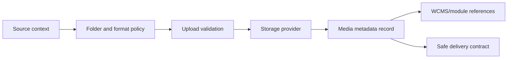
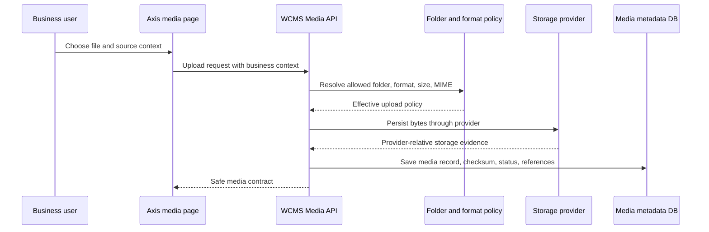

# Media management

Media is the Nodics capability for governed files and assets. It lives inside
`nodics.wcms` because content experiences need images, documents, imports,
exports, and downloadable files, but the binary lifecycle must remain a backend
contract rather than a browser convention.

## Problem it solves

Without a media module, each application starts inventing its own file paths,
folder rules, validation, and download behavior. That quickly becomes risky:
frontends may leak storage locations, imports may accept unsafe files, and
business modules may duplicate asset records. Media creates one governed place
for upload policy, metadata, storage-provider resolution, source context, and
delivery safety.

## Core concepts

- Media record: metadata for a governed file or external asset.
- Folder policy: which purpose, path prefix, file types, size limits, access
  mode, and retention rules apply.
- Format policy: original, preview, responsive, import, export, document, or
  custom format vocabulary.
- Storage provider: the backend implementation that stores bytes locally, on
  NAS, S3, Azure Blob, GCP Storage, CDN-backed storage, or a custom provider.
- Source context: a safe backend projection that tells Axis which upload and
  selection choices are valid for data imports, content media, product media,
  utility media, and generated exports.

## Frontend boundary

Axis may display upload controls, folder choices, media records, and selection
dialogs. It must not decide absolute paths, bucket names, storage keys,
credentials, signed URLs, retention behavior, or provider details. Axis sends
the intended source context and allowed business target; Media resolves the
effective upload policy and storage behavior.

This is especially important for partners. A customer can remap storage from
local development folders to cloud storage without changing Axis renderers or
business modules.

## Upload and delivery lifecycle

The typical lifecycle is:

1. A user or module selects a source context, such as `contentMedia` or
   `dataImports`.
2. Media resolves the effective folder and format policy from layered Nodics
   configuration.
3. The upload validates extension, MIME type, size, access mode, and target
   schema expectations.
4. The provider writes bytes and returns safe provider-relative metadata.
5. Media persists the record, checksum, lifecycle state, and reference data.
6. Other modules reference the media record instead of storing file paths.
7. Delivery routes enforce authorization and expose only safe access details.

The frontend never receives private storage roots or credentials. It receives a
safe media contract: code, name, type, lifecycle state, preview or delivery
information allowed by policy, and metadata that the user is permitted to see.

## Source contexts

Media source context tells the backend why a file is being used. That matters
because a CSV import file, a CMS hero image, a PDF document, and a generated
export should not share the same policy.

| Source context | Typical file examples | Different policy needs |
| --- | --- | --- |
| `dataImports` | CSV, JSON, XLSX | Strict schema target, validation, short retention, no public delivery. |
| `contentMedia` | Images, icons, documents | Editorial lifecycle, preview, reuse by components and pages. |
| `documentationMedia` | Diagrams, screenshots, how-to images | Versioned with documentation and safe for authenticated delivery. |
| `exports` | Generated CSV, PDF, report files | Expiry, audit evidence, download authorization. |
| `utility` | Temporary or operational files | Narrow access, cleanup, and operational logging. |

When a new module needs files, add a source context and policy instead of
creating another upload API. That keeps scanning, retention, audit, and storage
provider behavior consistent.

## Media ownership across modules

Media is a shared governed capability, but shared does not mean ownerless.
Other modules reference media records; they do not invent storage authority.

| Consumer | What it may do | What it must not do |
| --- | --- | --- |
| WCMS pages/components | Reference media records for images, documents, or downloads. | Store private paths or credentials in component data. |
| Documentation | Reference screenshots, diagrams, and help images as governed media. | Copy images into every frontend or leave broken Markdown as visible text. |
| Imports and exports | Upload import files or expose generated export files through source context. | Bypass validation or retention policy. |
| Product or commerce modules | Associate media records with product or business entities. | Own the binary lifecycle unless explicitly implemented as a media provider. |
| Axis | Render upload/select/manage screens from backend contracts. | Decide storage paths, buckets, signed URLs, virus scan rules, or retention. |

The goal is simple: a business module can say “this record uses this media,”
but Media decides how the file is governed.

## Business journey: adding a website banner

Imagine a business user needs a new homepage banner image.

1. Axis opens the Media page and asks the backend for valid source contexts.
2. The user chooses a content-media context and selects an image.
3. Media validates type, size, folder policy, and access mode.
4. The storage provider saves bytes and returns safe storage evidence.
5. Media creates or updates the media record.
6. A WCMS component references the media record.
7. The page renders through WCMS/Axis or a customer site renderer.

At no point should the business user or frontend type a filesystem path,
bucket name, or private URL. That information belongs to the backend provider
contract.

## Developer journey: adding a new media use case

When a new module needs files, the developer should add a source context or
policy before creating new upload code. A good implementation explains:

- which module needs the media;
- whether files are user-uploaded, generated, imported, or externally
  referenced;
- allowed extensions and MIME types;
- maximum size and retention;
- public, authenticated, private, or temporary delivery mode;
- audit and cleanup requirements;
- whether previews, thumbnails, or transformations are required;
- which tests prove rejected files and unauthorized access fail safely.

If the use case needs a different storage backend, implement or configure a
provider behind Media rather than exposing storage rules to each consumer.

## Beginner customization example

Imagine a partner wants to allow PNG and JPG images for website banners, but
not PDF files. They should not change Axis upload code. The correct path is:

1. Add or override a media folder policy in a later project module.
2. Set allowed MIME types and maximum size.
3. Keep the same Media upload API.
4. Let Axis rediscover allowed source contexts from backend metadata.
5. Verify upload, preview, delivery, unauthorized access, and cleanup.

This gives the business the custom behavior it wants without creating a forked
frontend or a hidden storage convention.

## Business value

Media lets business teams reuse assets across CMS, documentation, imports,
exports, product experiences, and future websites without losing governance.
It also keeps operating cost flexible: local storage can support a developer
machine, while production can move to cloud or CDN-backed storage under the
same module contract.

## DevOps considerations

Production storage should be explicit. Define provider roots, backup,
retention, size limits, virus scanning or approval workflows where required,
download authorization, cache headers, and lifecycle cleanup. Never rely on a
repository folder as production storage. Development defaults may write under
server temp paths, but those paths are disposable and environment-specific.

## Failure and recovery examples

| Failure | Safe behavior |
| --- | --- |
| File exceeds policy | Reject before storage and show a business-safe reason. |
| MIME type is not allowed | Reject using backend policy, not frontend-only validation. |
| Storage provider is unavailable | Keep metadata unchanged and return a bounded failure. |
| Bytes missing for an existing record | Show unavailable media state and preserve audit evidence. |
| Unauthorized download | Fail closed without leaking storage path or provider details. |
| Checksum mismatch | Block delivery or mark the record for operator review. |

These failures should feel understandable in Axis, but the decision belongs to
Media and its provider contracts.

## Operational acceptance checklist

| Area | Acceptance evidence |
| --- | --- |
| Upload policy | Allowed and rejected MIME types, extensions, and sizes behave as configured. |
| Storage provider | Provider returns safe relative evidence and does not leak private roots. |
| Metadata | Media record includes code, filename, format, size, checksum, lifecycle state, source context, and references. |
| Authorization | Unauthorized upload, view, update, and download attempts fail closed. |
| Retention | Temporary and generated files have cleanup policy and audit evidence. |
| Delivery | Public or authenticated delivery matches the media access mode. |
| Reuse | WCMS/documentation/business modules reference media by record, not storage path. |
| Recovery | Missing bytes, stale records, provider failure, and checksum mismatch have safe error behavior. |

Media failures often look like frontend problems because users see them in
Axis, but most root causes are backend policy, provider, or metadata issues.
Start investigation at the media record and source context.

## Customization model

Customer projects may add or override media folder and format policy through
later module configuration. If behavior needs more than configuration, replace
the media storage policy or provider service in a later active module while
preserving the same safe API contract. Do not fork Axis to change storage
rules.

## Common mistakes

- Letting Axis build storage keys, local paths, bucket names, or download URLs.
- Treating a media upload as successful before backend validation, checksum,
  metadata persistence, and lifecycle state are recorded.
- Reusing one folder policy for imports, exports, CMS images, product images,
  private documents, and generated artifacts.
- Exposing absolute paths, provider credentials, signed URL secrets, or
  storage internals in browser-visible responses.
- Deleting media because one screen no longer references it without checking
  backend media-reference usage.
- Creating media records without an owning source context, format policy, and
  delivery rule.

## Verification

Verify Media through policy, metadata, storage, delivery, and usage. Upload
allowed and rejected file types, confirm backend policy owns the result, check
that media records contain checksum and lifecycle evidence, and make sure Axis
shows only safe metadata. Download or preview must go through the Media
delivery contract using a media code, never a raw filesystem or provider path.

For content and documentation scenarios, verify that pages and components
reference media records or governed embedded images rather than copying assets
into the frontend. For production scenarios, add provider failure, missing
bytes, unauthorized download, oversized file, checksum mismatch, retention,
backup, and restore checks. Media is acceptable only when both the happy path
and the unsafe shortcut are proven.
