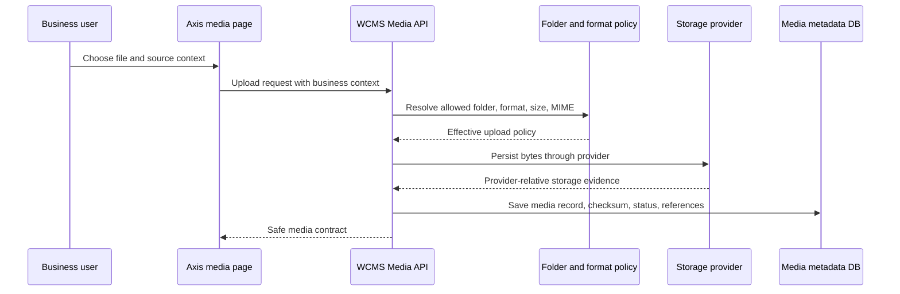

# Media management

Media is the Nodics capability for governed files and assets. It lives inside
`nodics.wcms` because content experiences need images, documents, imports,
exports, and downloadable files, but the binary lifecycle must remain a backend
contract rather than a browser convention.

## Problem it solves

Without a media module, each application starts inventing its own file paths,
folder rules, validation, and download behavior. That quickly becomes risky:
frontends may leak storage locations, imports may accept unsafe files, and
business modules may duplicate asset records. Media creates one governed place
for upload policy, metadata, storage-provider resolution, source context, and
delivery safety.

## Core concepts

- Media record: metadata for a governed file or external asset.
- Folder policy: which purpose, path prefix, file types, size limits, access
  mode, and retention rules apply.
- Format policy: original, preview, responsive, import, export, document, or
  custom format vocabulary.
- Storage provider: the backend implementation that stores bytes locally, on
  NAS, S3, Azure Blob, GCP Storage, CDN-backed storage, or a custom provider.
- Source context: a safe backend projection that tells Axis which upload and
  selection choices are valid for data imports, content media, product media,
  utility media, and generated exports.

## Frontend boundary

Axis may display upload controls, folder choices, media records, and selection
dialogs. It must not decide absolute paths, bucket names, storage keys,
credentials, signed URLs, retention behavior, or provider details. Axis sends
the intended source context and allowed business target; Media resolves the
effective upload policy and storage behavior.

This is especially important for partners. A customer can remap storage from
local development folders to cloud storage without changing Axis renderers or
business modules.

## Upload and delivery lifecycle

The typical lifecycle is:

1. A user or module selects a source context, such as `contentMedia` or
   `dataImports`.
2. Media resolves the effective folder and format policy from layered Nodics
   configuration.
3. The upload validates extension, MIME type, size, access mode, and target
   schema expectations.
4. The provider writes bytes and returns safe provider-relative metadata.
5. Media persists the record, checksum, lifecycle state, and reference data.
6. Other modules reference the media record instead of storing file paths.
7. Delivery routes enforce authorization and expose only safe access details.

The frontend never receives private storage roots or credentials. It receives a
safe media contract: code, name, type, lifecycle state, preview or delivery
information allowed by policy, and metadata that the user is permitted to see.

## Source contexts

Media source context tells the backend why a file is being used. That matters
because a CSV import file, a CMS hero image, a PDF document, and a generated
export should not share the same policy.

| Source context | Typical file examples | Different policy needs |
| --- | --- | --- |
| `dataImports` | CSV, JSON, XLSX | Strict schema target, validation, short retention, no public delivery. |
| `contentMedia` | Images, icons, documents | Editorial lifecycle, preview, reuse by components and pages. |
| `documentationMedia` | Diagrams, screenshots, how-to images | Versioned with documentation and safe for authenticated delivery. |
| `exports` | Generated CSV, PDF, report files | Expiry, audit evidence, download authorization. |
| `utility` | Temporary or operational files | Narrow access, cleanup, and operational logging. |

When a new module needs files, add a source context and policy instead of
creating another upload API. That keeps scanning, retention, audit, and storage
provider behavior consistent.

## Beginner customization example

Imagine a partner wants to allow PNG and JPG images for website banners, but
not PDF files. They should not change Axis upload code. The correct path is:

1. Add or override a media folder policy in a later project module.
2. Set allowed MIME types and maximum size.
3. Keep the same Media upload API.
4. Let Axis rediscover allowed source contexts from backend metadata.
5. Verify upload, preview, delivery, unauthorized access, and cleanup.

This gives the business the custom behavior it wants without creating a forked
frontend or a hidden storage convention.

## Business value

Media lets business teams reuse assets across CMS, documentation, imports,
exports, product experiences, and future websites without losing governance.
It also keeps operating cost flexible: local storage can support a developer
machine, while production can move to cloud or CDN-backed storage under the
same module contract.

## DevOps considerations

Production storage should be explicit. Define provider roots, backup,
retention, size limits, virus scanning or approval workflows where required,
download authorization, cache headers, and lifecycle cleanup. Never rely on a
repository folder as production storage. Development defaults may write under
server temp paths, but those paths are disposable and environment-specific.

## Customization model

Customer projects may add or override media folder and format policy through
later module configuration. If behavior needs more than configuration, replace
the media storage policy or provider service in a later active module while
preserving the same safe API contract. Do not fork Axis to change storage
rules.
