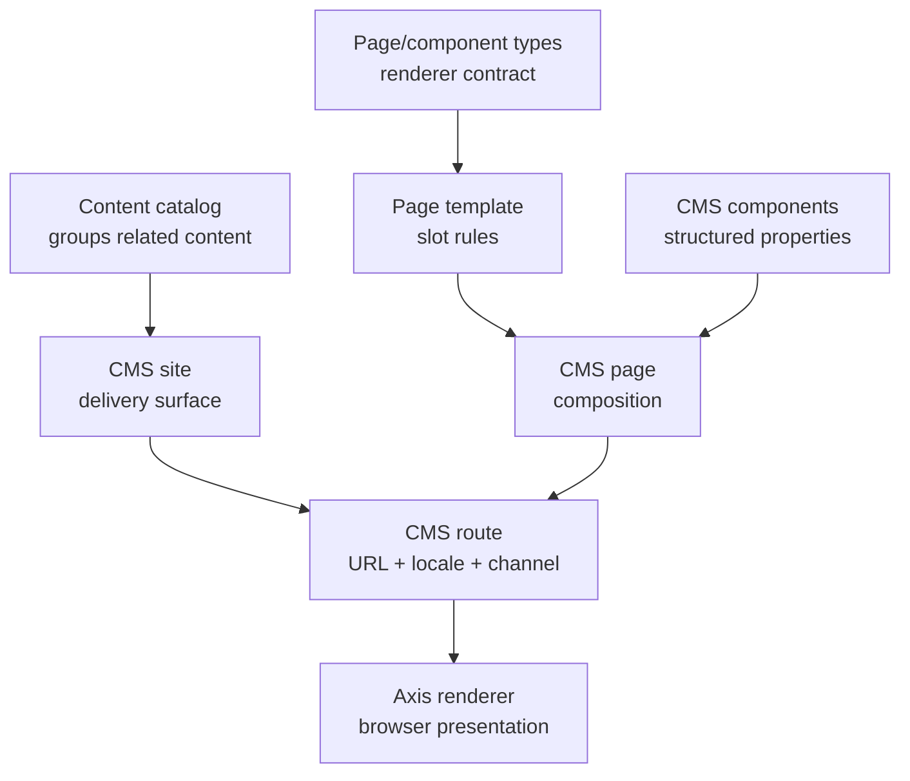
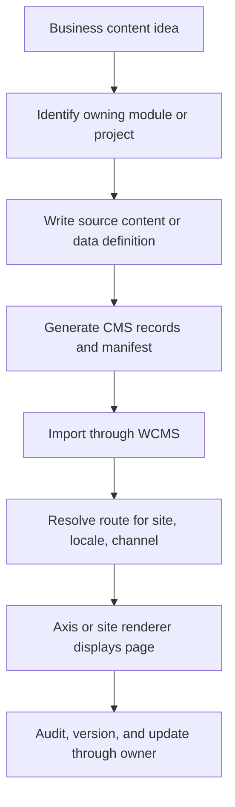

# WCMS content management

WCMS is the Nodics functional module for governed web content. It owns the
backend records that describe sites, content catalogs, page types, templates,
slots, pages, components, navigation, routes, restrictions, publication, and
delivery. A frontend such as Nodics Axis renders the resolved contract, but the
backend decides which content exists and when it is active.

## Problem it solves

Most enterprise applications eventually need content that changes faster than
code releases. Login pages, documentation, dashboards, banners, help text,
navigation, and site experiences should be governed without asking developers
to rebuild the frontend every time copy or composition changes. WCMS gives
Nodics a backend-owned content model that can be imported, versioned, searched,
published, and delivered safely.

## Core ownership rule

If a CMS record is imported into a database, it belongs to a backend module or
backend project. `nodics.axis` may provide renderers, but it must not own
database-importable site, page, component, catalog, or route data. Framework
documentation belongs in `nodics.docs`, Axis product documentation belongs in
`nodics.platform/modules/axis`, and customer project documentation belongs in
the customer project.

This rule keeps runtime ownership clear. It also allows a partner to replace
or extend a frontend without losing the governed content source.

## What WCMS manages

- Sites: named delivery surfaces such as Axis documentation or a storefront.
- Content catalogs: governed containers that group pages and components.
- Page and component types: contracts that describe what kind of record is
  being rendered.
- Templates and slots: layout-level rules for where components can appear.
- Pages and components: authored content and structured properties.
- Routes: URL, locale, channel, site, and page mappings.
- Navigation nodes: menu structures and discovery metadata.
- Restrictions: access and delivery constraints around content.
- Publication state: the difference between authored content and content that
  is safe to deliver.

## How a page becomes visible

A page cannot exist meaningfully without the surrounding records. A route needs
a site. A site needs a catalog. A page needs a type and usually a template. A
template needs slots. Components need type codes and renderer mappings. This is
why a data pack with pages but no content catalog is incomplete. It might look
like “some records imported,” but the content model is not healthy.

## Beginner example: documentation content

Nodics documentation is a good first example because it is visible in Axis and
still follows the backend ownership rule.

1. `nodics.docs` owns framework documentation markdown.
2. Its generator converts markdown into CMS records: catalog, site, page type,
   component type, renderer mappings, template, components, pages, and routes.
3. WCMS imports the generated core data pack.
4. Axis opens `/docs`, requests the route from WCMS, and renders the returned
   page contract.
5. If the markdown changes, the content pack version and checksum change, then
   the environment imports the new governed release.

Axis does not read markdown files from `nodics.docs`. Axis reads the backend
delivery contract. That distinction is the heart of the modularisation work.

## Required record chain

| Record | Beginner explanation | Common failure if missing |
| --- | --- | --- |
| Catalog | The container that says this content belongs together. | Sites or pages look orphaned and governance becomes unclear. |
| Site | The named delivery surface, such as Axis docs or a customer website. | Routes cannot resolve a delivery target. |
| Type code | The contract that tells Axis what kind of page or component this is. | Axis cannot choose the correct renderer safely. |
| Renderer mapping | The allowed browser renderer for a type. | Axis refuses or falls back because the backend did not authorize a renderer. |
| Template and slots | The layout contract for where components are allowed. | Components may exist but not render in a predictable layout. |
| Component | The structured content or properties to render. | Page loads but has no meaningful body. |
| Page | The composition of components. | Route can resolve but there is no page to display. |
| Route | The URL, locale, channel, and delivery state. | Direct navigation shows recovery or not-found behavior. |

## Developer model

Developers should treat WCMS data like code-owned configuration until the
business explicitly moves a capability into operator-managed authoring. A
module ships source documentation or content definitions, generates importable
records, and exposes the pack through the governed import system. The generated
records are then loaded into WCMS. Runtime delivery reads the database records,
not the frontend repository.

When a project needs custom content, place the source and generated pack in the
owning project, such as `nodics.kickoff`. Do not modify framework packs to add
customer-specific pages.

## Business model

WCMS reduces release friction. Business users can work with governed content
surfaces while developers preserve reusable module boundaries. A partner can
run many customer-facing websites, internal applications, and documentation
experiences through the same content foundation while still keeping project
ownership clean.

## Business journey: from content idea to visible page

A business user usually does not think in terms of catalogs, routes, renderer
mappings, and templates. They think: “I need a page that explains this
capability, uses the right brand, appears in the right navigation, and can be
changed safely later.” WCMS turns that business need into governed records.

This is why WCMS is a framework capability instead of a frontend folder. The
page must be visible to users, but the authority for what the page means, who
owns it, how it is versioned, and how it is imported belongs to the backend
module or project.

## Example: three documentation sites

The reference Axis documentation navigation may show Framework, Swaggers,
Nodics Axis, and a customer project guide. That visible navigation is a user
experience decision. The backend data ownership is separate:

| Visible documentation area | Backend owner | Content purpose |
| --- | --- | --- |
| Framework | `nodics.docs` | Reusable Nodics framework concepts, quick start, architecture, customization, operations, module guides. |
| Swaggers | BackOffice/API discovery | Runtime API reference grouped by registered backend capability. |
| Nodics Axis | `nodics.platform/modules/axis` | Axis product behavior, renderer contracts, shell behavior, schema workbench, documentation rendering. |
| Customer project | customer project | Project setup, local demo behavior, project data, custom modules, customer-specific examples. |

No documentation area should store importable CMS data in `nodics.axis`.
Axis may render all of these areas, but it does not own the content records.

## Developer journey: adding a module-owned page

When a developer adds documentation or content for a functional module, the
safe process is:

1. Confirm the backend owner of the subject.
2. Add or update source content under that owner.
3. Regenerate generated CMS data and manifests with the owner-provided script.
4. Run content-pack validation.
5. Start WCMS and import through Axis or an approved backend import API.
6. Open the route in Axis or the target site.
7. Verify navigation, page body, renderer mapping, authorization, and route
   recovery behavior.

Hand-editing generated CMS records may seem faster, but it breaks release
integrity. If generated output is wrong, fix the source or generator.

## DevOps model

WCMS should be deployed as a runtime server when content delivery or content
management is required. Axis depends on Platform for identity and on WCMS for
governed presentation content. Local Kickoff normally starts Platform, WCMS,
Cron where needed, and Axis as the frontend renderer.

Production deployments should define backup, migration, publication, cache,
search, media storage, and import history policies. Content packs should have
semantic releases, checksums, and repeatable import behavior so an environment
can be rebuilt from source-controlled module data.

## Operations checklist

| Check | Expected evidence |
| --- | --- |
| WCMS process | Server starts and exposes content/import APIs on the configured port. |
| Content catalogs | Every site has an owning catalog; pages are not orphaned. |
| Routes | Each visible URL resolves to a page for site, locale, and channel. |
| Renderer mappings | Axis receives only renderer types the backend has authorized. |
| Import history | Content-pack install records include version, checksum, status, and outcome. |
| Media | Components reference media records, not private storage paths. |
| Recovery | Missing route, missing renderer, unauthorized access, and stale content fail safely. |
| Backup | Database, media storage, and generated release evidence can be restored together. |

WCMS incidents should be investigated by record chain. Start with the route,
then page, template, components, renderer mapping, site, catalog, and import
history. That is usually faster than searching the frontend first.

## What not to do

- Do not put WCMS import data in `nodics.axis`.
- Do not create a second content registry in the frontend.
- Do not hardcode page availability in Axis when WCMS can deliver it.
- Do not let a route imply ownership; route ownership comes from the backend
  module or project that owns the pack.
- Do not let generated records drift from their source catalogue.
- Do not create pages or components without catalogs and sites.
- Do not treat documentation content as special static frontend content just
  because Axis renders it.
