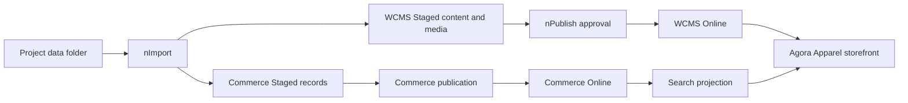
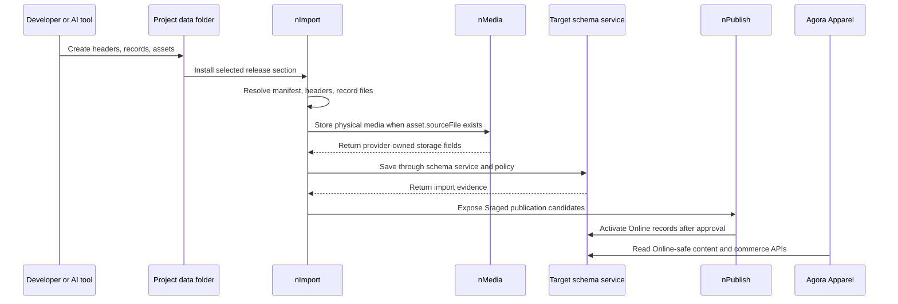

# Agora Apparel Product Data Authoring

Agora Apparel product data authoring explains how a customer project creates
commerce and content data from the project `data/` folder, how that data is
imported into Nodics, and how the published storefront sees it. The same
principles apply to Electronics, Telco, Nexus, and future customer projects;
this page uses Apparel because it has concrete product, price, inventory,
content, media, and search data in the current Kickoff project.

## Business result

A merchandiser or implementation partner should be able to add a product,
price it, make it available, attach storefront media, and publish it without
turning Agora into the data authority. Agora presents the shopping journey.
Commerce owns product, price, inventory, checkout, and order contracts. WCMS
and Media own content and media lifecycle. Search owns discovery projections.
Axis gives business users the governed setup and operation journey.



## Beginner mental model

Beginners can think of a product as a small bundle, not a single database row.
The product record gives the identity, localization gives customer-facing
words, variants give sellable SKUs, price rows give commercial value,
inventory gives availability, media gives images, and publication makes the
approved version visible to customers. Business users see that bundle as a
merchandising journey in Axis. Developers maintain the bundle through module
release data or backend APIs. Operators prove that the imported and published
bundle is safe for Online use.

## Source map

The current Agora Apparel sample baseline is owned by the Kickoff customer
project:

| Area | Source location |
| --- | --- |
| Commerce header | `nodics.kickoff/modules/agora.apparel/data/sample-v001/commerce/headers/agoraApparelCatalogHeader.js` |
| Commerce records | `nodics.kickoff/modules/agora.apparel/data/sample-v001/commerce/records/` |
| Search header and rules | `nodics.kickoff/modules/agora.apparel/data/sample-v001/commerce/headers/commerceSearch/` and `records/commerceSearch/` |
| Content header | `nodics.kickoff/modules/agora.apparel/data/sample-v001/content/headers/agoraApparelContentHeader.js` |
| Content records | `nodics.kickoff/modules/agora.apparel/data/sample-v001/content/records/` |
| Physical media files | `nodics.kickoff/modules/agora.apparel/data/sample-v001/content/assets/agora-cms-media/files/` |
| Media asset manifest | `nodics.kickoff/modules/agora.apparel/data/sample-v001/content/assets/agora-cms-media/assetManifest.js` |
| Generated release manifest | `nodics.kickoff/modules/agora.apparel/data/manifest.json` |
| Storefront app | `nodics.exp/nodics.agora.apparel/` |

The framework owners behind these files are:

| Capability | Owning module |
| --- | --- |
| Product, category, variants, localization | `nodics.commerce/modules/baseCommerce/modules/product` |
| Pricing | `nodics.commerce/modules/baseCommerce/modules/pricing` |
| Inventory and warehouses | `nodics.commerce/modules/baseCommerce/modules/inventory` |
| Commerce search rules | `nodics.commerce/modules/baseCommerce/modules/commerceSearch/modules/commerceSearchCore` |
| CMS sites, pages, slots, components, routes | `nodics.wcms/modules/cms` |
| Media objects and physical artifacts | `nodics.wcms/modules/media` |
| Import execution | `nodics.foundation/modules/nData/nImport/import` |

## Step-by-step authoring

1. Choose the data release. Before the first production release, keep adding
   to `sample-v001`. After production, create the next immutable folder such
   as `sample-v002`.
2. Add the product base record in
   `commerce/records/agoraApparelProductData.js`.
3. Add localized product text in
   `commerce/records/agoraApparelProductLocalizationData.js`.
4. Add sellable variants in
   `commerce/records/agoraApparelProductVariantData.js`, then localized
   variant details in
   `commerce/records/agoraApparelProductVariantLocalizationData.js`.
5. Add price rows in `commerce/records/agoraApparelPriceRowData.js`.
6. Add stock balances in
   `commerce/records/agoraApparelInventoryBalanceData.js`.
7. Add product image files under
   `content/assets/agora-cms-media/files/`.
8. Add media asset entries in
   `content/assets/agora-cms-media/assetManifest.js`.
9. Add or update media references and CMS component media relations under
   `content/records/`.
10. Run the manifest generator and validation commands before importing.
11. Import the data into the correct Staged runtimes.
12. Publish through the governed publication flow before validating Agora in a
   browser.

## Header contract

The commerce header routes records to the owning module and schema. The
top-level key is the target module. `schemaName` is the target schema inside
that module. `dataFilePrefix` is the record file prefix. `query` is the
idempotent lookup key.

```js
const entry = (schemaName, dataFilePrefix) => ({
  options: { enabled: true, schemaName, operation: 'saveAll', dataFilePrefix },
  query: { code: '$code', tenant: '$tenant' }
});

module.exports = {
  product: {
    products: entry('product', 'agoraApparelProductData'),
    localizations: entry('productLocalization', 'agoraApparelProductLocalizationData'),
    variants: entry('productVariant', 'agoraApparelProductVariantData')
  },
  pricing: {
    rows: entry('priceRow', 'agoraApparelPriceRowData')
  },
  inventory: {
    balances: entry('inventoryBalance', 'agoraApparelInventoryBalanceData')
  }
};
```

Do not duplicate module, schema, operation, or query in a `release.js` file.
The release folder says which release is being imported; the header says where
each data file goes.

## Record contract

Records are JavaScript object maps. New records should prefer meaningful keys
so a customer project, developer, or AI tool can extend one record without
depending on array order.

```js
module.exports = {
  agoraApparelLinenDress: {
    code: 'agoraApparelLinenDress',
    tenant: 'default',
    name: 'Linen Wrap Dress',
    status: 'ACTIVE',
    catalogVersion: 'agoraApparelStaged',
    revision: 1,
    active: true
  }
};
```

Current baseline files may still contain `record0` and `record1` entries. Those
are valid for import, but new data should use stable business keys. Do not put
runtime logic, random values, filesystem reads, service calls, generated Online
URLs, secrets, or environment-specific decisions inside record files.

## Product dependency map

A storefront product is not one row. The minimum useful commerce bundle is:

| Data file | Purpose | Typical key |
| --- | --- | --- |
| `agoraApparelProductData.js` | Product identity and lifecycle. | `code`, `tenant`, `catalogVersion`, `status`, `revision` |
| `agoraApparelProductLocalizationData.js` | Display name, description, slug, SEO, attributes, media text. | `productCode`, `locale` |
| `agoraApparelProductVariantData.js` | Sellable SKU or variant identity. | `code`, `productCode`, `sku`, `attributes`, `status` |
| `agoraApparelProductVariantLocalizationData.js` | Localized variant presentation. | `variantCode`, `productCode`, `locale` |
| `agoraApparelPriceRowData.js` | Price book amount and currency. | `priceBookCode`, `productCode`, `unitAmount`, `currency` |
| `agoraApparelInventoryBalanceData.js` | Sellable availability by warehouse/SKU. | `warehouseCode`, `sku`, `onHand`, `reserved`, `available` |
| `agoraApparelCommerceSearchRuleData.js` | Discovery ranking, pin, boost, or merchandising behavior. | `storeCode`, `locale`, `scopeType`, `priority` |

If any required relation is missing, the backend should fail import,
publication, search projection, or storefront readiness with a user-safe
message. The UI should not hide missing product data by inventing defaults.

## Media contract

Media has one extra physical-file step. The data file defines the media object
and the asset manifest points to the source file. During import, `nImport`
resolves the relative file path, verifies checksums when supplied, asks
`nMedia` to store the physical bytes in the Staged media location, removes the
authoring-only asset marker, and only then persists the `media` schema record.

```js
productAsset(
  'agora-owned-product-linen-wrap-dress-primary',
  'agora-owned-product-linen-wrap-dress-primary.jpg',
  'Linen Wrap Dress primary image',
  'agoraLinenWrapDress'
)
```

The media data contract must remain declarative:

| Allowed in data | Owned by importer or runtime |
| --- | --- |
| `code`, `name`, `folderCode`, `formatCode`, `businessPurpose`, `ownerType`, `ownerReference`, `asset.sourceFile` | `providerCode`, `storageKey`, `storedFileName`, `relativePath`, `fullPath`, `url`, `accessUrl` |

When media is published, `nPublish` and `nMedia` copy referenced Online-safe
payloads from Staged to Online, create placement evidence, replicate to the DR
location when configured, and update Online media coordinates. Online clients
must never reuse Staged physical paths.

## Import execution flow



## Customization model

Use the project layer first. A customer implementation may add data files,
extend schemas, add validators, override services through later active modules,
add search projection fields, or change renderer mapping. It should not fork
standard Commerce, WCMS, or Media source for customer-only product data.

| Need | Safe customization |
| --- | --- |
| Add a product field | Extend the project schema and localization/search projection contracts, then update Axis renderer and tests. |
| Add a price rule | Extend Pricing policy or provider service; keep price rows as data and calculated decisions as service output. |
| Change stock rules | Extend Inventory-owned services; keep balances and warehouses owned by Inventory. |
| Add product media | Add physical assets, media asset entries, media records or references, and component/product relations. |
| Change storefront display | Update Agora renderer/client mapping after backend data and API contracts expose the field. |
| Add business authoring | Register BackOffice capability metadata and permission-backed operations; Axis renders them from backend metadata. |

## Configuration behavior

Data files declare records; configuration declares runtime policy. Keep that
line clear. Release folder names such as `sample-v001` decide the import
release identity. Header files decide the target module, schema, operation, and
lookup query. Generated `data/manifest.json` decides checksums, section
lifecycle, destination role, environment scope, and publication policy. Backend
module properties decide provider behavior such as media storage, search index,
publication limits, tenant policy, and enabled capabilities.

| Configuration area | Where it belongs | What it controls |
| --- | --- | --- |
| Release identity | `data/sample-v001/` | Which baseline is installed or upgraded. |
| Import routing | `headers/*.js` | Target module, schema, operation, query, tenants, and data file prefix. |
| Generated manifest | `data/manifest.json` | File checksums, release sections, lifecycle, destination role, and publication policy. |
| Runtime policy | Backend module or environment properties | Storage provider, search index, publication limits, and server-specific behavior. |
| Frontend display | Agora app configuration or renderer mapping | Presentation only after backend APIs expose safe data. |

Changing configuration can affect import order, storage placement, publication,
or storefront rendering. It should be tested with fresh-schema import and
browser validation, not only by reading the file diff.

## Verification

Run focused checks before starting a fresh schema import:

```bash
npm --prefix nodics.kickoff run domains:manifests
npm --prefix nodics.kickoff run test:multi-domain
npm --prefix nodics.kickoff run test:agora-commerce
npm --prefix nodics.kickoff run acceptance:agora-commerce-data
npm --prefix nodics.kickoff run acceptance:agora-commerce-publication
```

After local servers are running and data is imported, prove the user journey:

```bash
npm --prefix nodics.kickoff run qualification:agora-commerce:live
```

Then open Axis to verify setup, import, publication, and error states, and open
Agora Apparel to verify Online product listing, product detail, images, price,
availability, cart, and checkout behavior.

## Reference comparison

Nodics owns its own data contract, but the shape is intentionally familiar to
enterprise commerce and CMS teams. SAP Commerce documents import as a
platform-level data-loading capability. Shopify documents product CSV import
with required fields, variants, price, inventory, and image preparation.
Salesforce B2C Commerce documents import/export as a repeatable administration
operation. Contentful documents CLI-based content import/export and migration
scripts for reproducible content model and entry changes.

Use those references as comparison material only. Nodics authority remains the
module header, record file, generated manifest, schema policy, import service,
publication service, and acceptance evidence in the current repository.

- [SAP Commerce importing data](https://help.sap.com/docs/SAP_COMMERCE/d0224eca81e249cb821f2cdf45a82ace/c4f121fb358e46069fc01acf8c5c254b.html)
- [Shopify product CSV import/export](https://help.shopify.com/en/manual/products/import-export/using-csv)
- [Salesforce B2C Commerce import and export](https://help.salesforce.com/s/articleView?id=cc.b2c_import_and_export.htm&type=5)
- [Contentful import and export with CLI](https://www.contentful.com/developers/docs/tutorials/cli/import-and-export/)
- [Contentful migration scripts](https://www.contentful.com/developers/docs/tutorials/cli/scripting-migrations/)

## Common mistakes

- Adding a product only in the frontend.
- Adding media file paths directly to product records instead of media records
  and media references.
- Publishing Online by direct database write instead of Staged-to-Online
  governance.
- Updating a production `v001` release after it has been accepted instead of
  creating `v002`.
- Using array-style JSON when the data needs project overlays or single-record
  extension.
- Letting sample data call services or compute runtime decisions.

## Completion checklist

A product data change is ready when the header points to the correct module and
schema, records use stable identities, related records exist, physical assets
exist and are declared, generated manifest checksums are current, import is
idempotent, publication creates Online-safe records and media, search projection
contains the product, Axis shows useful status, Agora renders the public
journey, and tests record the proof.
